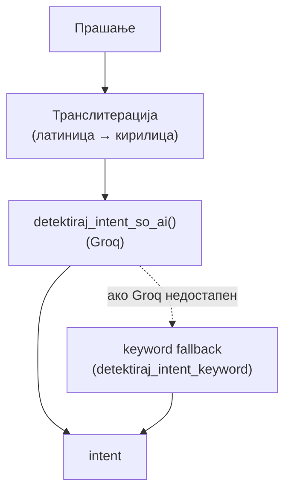
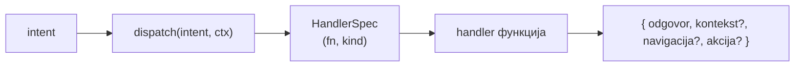
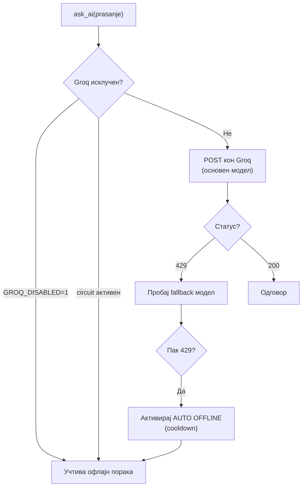

# Kernel

`backend/ai/_kernel/` е **инфраструктурата** на AI асистентот — делот што не е врзан за конкретна улога, туку го опслужува целиот систем: детекција на намера, рутирање до handlers, комуникација со Groq, транслитерација и помошни алатки.

> Kernel-от е „моторот". Функциите по улоги (`pacient/`, `lekar/`, `direktor/`, `opsto/`) се „возилата" што тој ги стартува.

> Поврзано: [Преглед](overview.md) · [Улоги](roles/pacient.md) · [API: AI Agent](../api/ai-chat.md)

***

## 1. Делови на kernel-от 

| Фајл                                                    | Улога                                                  |
| ------------------------------------------------------- | ------------------------------------------------------ |
| `intent_detector.py` / `ai_intent_detector.py`          | Детекција на намера (keyword + AI)                     |
| `handlers.py`                                           | Регистар намера → handler + `dispatch()`               |
| `groq_client.py`                                        | Groq API клиент + автоматски офлајн режим              |
| `transliteracija.py`                                    | Кирилица ↔ латиница                                    |
| `oddel_resolver.py`                                     | Резолвер на оддел (од листа, без слободен fuzzy match) |
| `lekar_lookup.py`                                       | Пребарување лекар по име/специјалност                  |
| `prompts.py` / `prompt_loader.py` / `prompt_helpers.py` | Системски промптови и правила                          |
| `ai_json.py`                                            | Безбедно парсирање на JSON што AI го враќа             |
| `odgovor_formatter.py`                                  | Форматирање на финалниот одговор                       |
| `auth.py`                                               | Проверка на улога/пристап                              |
| `db_helpers.py`                                         | Помошни функции за база                                |
| `agent_guidelines.py`                                   | Водич за тоа како работи агентот                       |

***

## 2. Детекција на намера (intent) 

Целта е да се одреди **што сака корисникот** и да се мапира на една од дефинираните намери (`zakazi_termin`, `lekari_oddel`, `objavi_vest`…).

* Прво сите прашања се **транслитерираат** во кирилица за конзистентност.
* Главната детекција е **AI-базирана** (`detektiraj_intent_so_ai`).
* Постои и **keyword детектор** (листи клучни зборови) — задржан како референца/fallback и за тестови.
* Редоследот на проверки е важен — поспецифичните намери се проверуваат прво (на пр. „објави вест" пред „оцени").

***

## 3. Рутирање — handlers и dispatch 

Сето рутирање е на **едно место** — `handlers.py`. Endpoint-от `/ai-chat/ask` само детектира намера и повикува `dispatch()`.

* Секоја намера има **`HandlerSpec`** — кој ја содржи функцијата, дали користи сирово прашање (`use_raw_question`) и типот на резултат (`kind`: `str`, `dict`, `dict_nav`, `dict_full`, `none`).
* `dispatch()` ги проследува точните аргументи на handler-от според намерата (на пр. контекст, податоци за пациент или лекар).
* Ако нема handler за намерата, се пробуваат општиот асистент и „лекари по оддел", а на крај — слободен одговор од Groq (`ask_ai`).

**Контекст (`AiContext`):** прашањето, нормализираното прашање, и податоците за `pacient` / `lekar` / `kontekst` — сето што handler-от може да му затреба.

***

## 4. Groq клиент и circuit breaker 

`groq_client.py` ја опслужува комуникацијата со **Groq API** (`ask_ai()`), со заштита од прекумерно користење.

| Поставка                    | Стандардно                | Опис                          |
| --------------------------- | ------------------------- | ----------------------------- |
| `GROQ_MODEL`                | `llama-3.3-70b-versatile` | Основен модел                 |
| `GROQ_MODEL_FALLBACK`       | `llama-3.1-8b-instant`    | Побрз fallback при `429`      |
| `GROQ_DISABLED`             | (off)                     | Целосно без Groq (испит/demo) |
| `GROQ_AUTO_OFFLINE`         | `1`                       | Автоматски офлајн по `429`    |
| `GROQ_OFFLINE_COOLDOWN_SEC` | `600`                     | Колку секунди трае паузата    |

* **Circuit breaker:** по `429` (rate limit), нема нови повици кон Groq до истек на cooldown — системот работи само со правила + база.
* Грешките се обработуваат грациозно: timeout, `401` (невалиден клуч), мрежни грешки — секогаш враќаат учтива порака наместо да паднат.

***

## 5. Транслитерација 

`transliteracija.py` овозможува корисникот да пишува на **кирилица, латиница или мешано** — системот секогаш го претвора во кирилица пред обработка. Така „zakazi termin", „закажи термин" и „zakaži termin" се третираат исто.

***

## 6. Резолвери и helpers 

* **`oddel_resolver.py`** — клучен за точност: одделот **не** се извлекува слободно од AI, туку се избира од **листа од база** (спречува погрешен fuzzy match).
* **`lekar_lookup.py`** — наоѓа лекар по име или специјалност.
* **`ai_json.py`** — безбедно парсира JSON што AI го враќа (кога треба структуриран излез).
* **`odgovor_formatter.py`** — го форматира финалниот текст за прикажување во чатот.
* **`db_helpers.py`** / **`auth.py`** — пристап до база и проверка на улога/дозволи.

> Промптовите и правилата за Groq се чуваат во посебен фајл (`backend/data/agent_prompts.txt`), организиран во секции — лесно се менуваат без да се допира кодот.

***

Следно: [Улоги: Пациент](roles/pacient.md) · [Лекар](roles/lekar.md) · [Директор](roles/direktor.md) · [Општо](roles/opsto.md)
