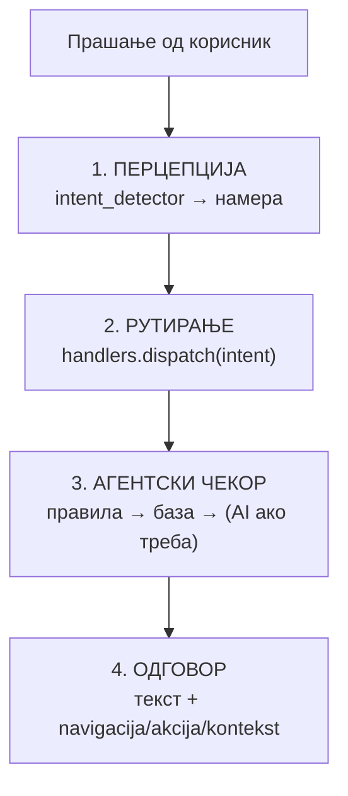
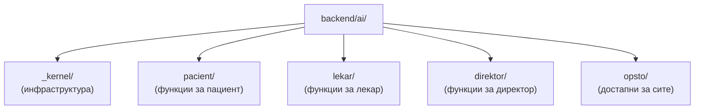

# AI асистент — преглед

AI асистентот на ЈЗУ Клиничка Болница Штип е агентски систем кој разбира прашања напишани на природен јазик — кирилица или латиница — и врз основа на нив извршува конкретни дејства: закажување термини, барање слободни термини, преглед на лекари, објавување вести и слично. Наместо фиксни копчиња и форми, корисникот пишува со свои зборови, а системот го интерпретира намерата и го повикува соодветниот дел од апликацијата.
Кодот е сместен во `backend/ai/`, а комуникацијата со асистентот оди преку `HTTP endpoint-от /ai-chat`.

>Важно е да се разграничи улогата на AI-то во овој систем: тоа не измислува одговори и не претпоставува податоци. AI-то ја разбира намерата на корисникот — „сакам термин кај кардиолог утре" — и ја претвора во структуриран повик кон детерминистички handler. Вистинските податоци (лекари, слободни термини, дежурства) секогаш доаѓаат директно од MySQL базата. AI-то е само слој за интерпретација, не извор на информации.

## Содржина

* [1. Што е и што не е](#1-sto)
* [2. Патека на едно прашање](#2-pateka)
* [3. Агентски модел](#3-agentski)
* [4. Структура на кодот](#4-struktura)
* [5. Улоги](#5-ulogi)
* [6. Groq и офлајн режим](#6-groq)
* [7. Пробај го асистентот](#7-probaj)

> Поврзано: [Kernel](kernel.md) · [Улоги: Пациент](roles/pacient/README.md) · [Лекар](roles/lekar/README.md) · [Директор](roles/direktor/README.md) · [Општо](roles/opsto/README.md) · [API: AI Agent](../api/ai-chat.md)

***

## 1. Можности и граници <a id="1-sto"></a>

| Што прави | Ограничувања |
|-------------|----------------|
| Разбира намера напишана на природен јазик (кирилица или латиница) | Не измислува лекари, термини или податоци — ги чита исклучиво од базатаа |
| Извршува конкретни дејства како што се закажи и откажи термин, оцени преглед, објави вест | При избор на оддел не нагодува слободно — избира само од постоечката листа |
| Ги прилагодува дозволите според улогата на корисникот (пациент, лекар, директор) | Не е генерички chatbot — одговара само на прашања поврзани со порталот |
| Чува историја на разговорот за најавени корисници | За гости историјата не се зачувува по затворање на сесијата |
| Функционира и при недостапност на Groq — се враќа на резервна логика | - | 
***

## 2. Патека на едно прашање <a id="2-pateka"></a>

Поставеното прашање од страна на коррисникот поминува низ четири чекори (опишани во `ai/_kernel/agent_guidelines.py`):



1. **Перцепција**  системот го анализира внесот на корисникот и одредува намера (intent), на пр. `zakazi_termin` или `lekari_oddel`.
2. **Рутирање**  функцијата `dispatch(intent, ctx)` го избира соодветниот handler — една функција по намера, без преклопување.
3. **Агентски чекор** — handler-от прво применува правила и алијаси (детерминистички), потоа ги чита потребните податоци од базата, и само ако е неопходно го повикува AI — на пример, за да избере вредност од затворена листа кога корисникот напишал нешто неодредено.
4. **Одговор**  форматиран текст кон корисникот, дополнет со navigacija (отвори страница), akcija (изврши дејство) или kontekst (зачувај состојба за следниот чекор во флоуто) — во зависност од тоа што handler-от вратил
***

## 3. Агентски модел <a id="3-agentski"></a>

Моделот е: **намера → handler (функција) → правила/база → понекогаш AI од листа**.

Изворите на одговор се означуваат за debug (`agent_guidelines.py`):

| Извор | Опис |
|-------|------|
| `rules` | Детерминиран резултат од правила (regex, lookup) |
| `alias` | Најден преку алијас (на пр. „ОРЛ" → „Оториноларингологија") |
| `ai_closed_list` | AI избрал **од затворена листа**, не слободно генерирање |
| `exact_db` | Точно совпаѓање во базата (без fuzzy match) |

> Најчести грешки што овој модел ги спречува: погрешен fuzzy match на оддел (на пр. „Хирургија" vs „Неврохирургија") и неусогласеност меѓу имиња во базата и имиња на сајтот.

***

## 4. Структура на кодот <a id="4-struktura"></a>



| Папка | Улога |
|-------|-------|
| `_kernel/` | Groq клиент, детектор на намера, рутер `(dispatch)`, системски промптови и help функции |
| `pacient/` | Handlers за пациентски дејства која дозволува закажување и откажување термини, оценка на реализира прегелд, аплицирање на оглас за работа |
| `lekar/` | Handlers за лекарски дејства која овозможува преглед на распоред, преглед на картон на пациент, поставуванје на дијагноза и терапија |
| `direktor/` | Handlers за директорски дејства, кој ai агентот може да го користи за поставување на огласи за работа, вести, управување со дежурства |
| `opsto/` | Handlers достапни за сите улоги. Се даваат информации за лекари, услуги, навигација низ порталот |

`ai/__init__.py` ги re-експортира сите модули, па постојниот код може да пишува `from ai import zakazi_termin` без да знае во која подпапка е модулот.

***

## 5. Улоги <a id="5-ulogi"></a>

Достапните функции зависат од тоа кој е најавен:

| Улога | Достапни функции | Детали |
|-------|----------|--------|
| **Гостин / Пациент** | ТЗакажување и откажување термини, оцени, информации, аплицирање за работа | [roles/pacient/README.md](roles/pacient/README.md) |
| **Лекар** | Преглед на распоред, читање картон на пациент, историја на прегледи, додавање терапија, статистика | [roles/lekar/README.md](roles/lekar/README.md) |
| **Директор** |Управување со огласи и вести, дежурства, преглед на апликанти | [roles/direktor/README.md](roles/direktor/README.md) |
| **Сите** | Информации за лекари по оддел, услуги, работно време, навигација низ порталот | [roles/opsto/README.md](roles/opsto/README.md) |

***

## 6. Groq и офлајн режим <a id="6-groq"></a>

AI-то користи **Groq API** (модели од фамилијата Llama) само за делот „разбирање на јазик". Системот е отпорен ако Groq е недостапен:

* `GROQ_DISABLED=1` — целосно без Groq (за испит/demo).
* `GROQ_AUTO_OFFLINE=1` (стандардно) — по грешка `429` (исцрпени токени / rate limit), AI-то автоматски паузира повици кон Groq за одреден период (**circuit breaker**) и работи само со локални правила + MySQL.
* При `429` прво се пробува побрз fallback модел, па дури потоа се активира офлајн режимот.

> Затоа дури и без интернет/токени, основните функции (листа лекари, термини од база, навигација) продолжуваат да работат. Детали: [Kernel](kernel.md).

***

## 7. Пробај го асистентот <a id="7-probaj"></a>

Целиот AI асистент е достапен преку **еден endpoint** — `POST /ai-chat/ask`. Пополни го полето `prasanje` и кликни **„Test it"** за вистински одговор од живиот сервер.

> Пример тело:
>
> ```json
> { "prasanje": "Кои лекари се на кардиологија?", "pacient": null, "lekar": null, "kontekst": null, "session_id": null }
> ```


[OpenAPI KlinickaBolnicaAPI](https://klinicka-bolnica-stip2026.onrender.com/openapi.json)


> За детали за сите AI endpoints (сесии, историја): [API: AI Agent](../api/ai-chat.md).

***

Следно: [Kernel](kernel.md) · [API: AI Agent](../api/ai-chat.md)
