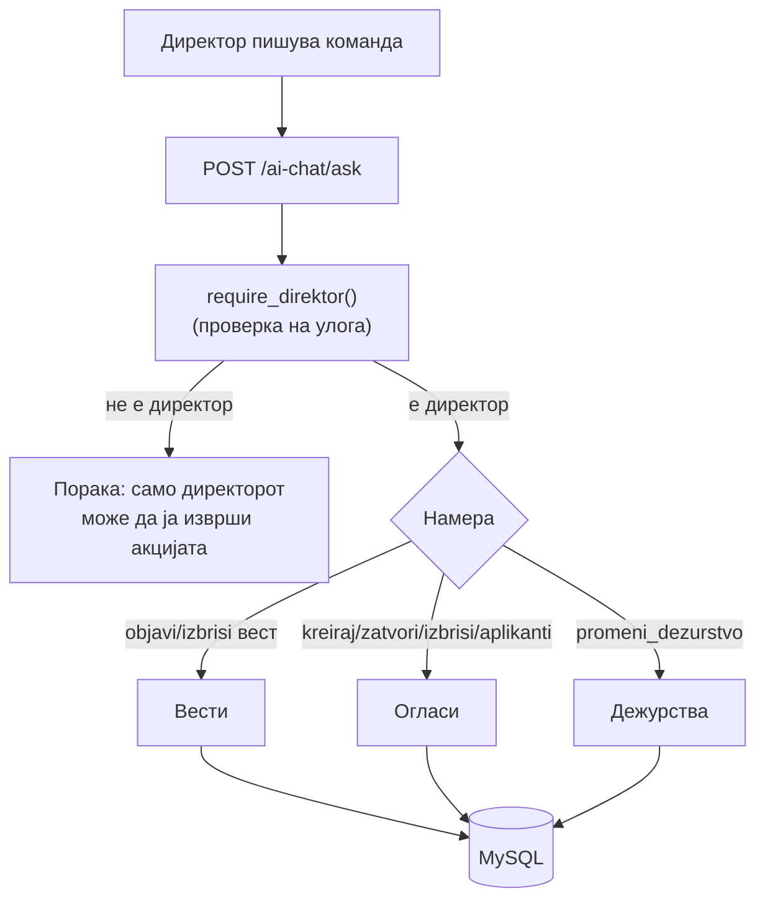

# Улога: Директор

Директорот може да го користи AI асистентот за управување со порталот без да отвора административен панел — доволно е да напише команда на природен јазик. Функциите се сместени во backend/ai/direktor/ и покриваат три области: вести (објавување, уредување, бришење), огласи за работа и дежурства на лекари.
На пример, наместо рачно да пополнува форма, директорот може да напише „Објави вест: Болницата ќе биде затворена на 1 јануари" и асистентот го подготвува записот и го зачувува во базата. Системот потоа го враќа линк до новата вест за потврда.
Пристапот до овие функции е ограничен — системот ја проверува улогата при секое барање и ги одбива командите ако корисникот не е најавен директор. Во рутерот, директорските намери се проверуваат прво, пред пациентските и лекарските, за да се избегне погрешно рутирање кај команди со слична формулација.

> Бидејќи овие дејства менуваат јавни/административни податоци (вести на сајтот, огласи, дежурства), пристапот е ограничен. Детекцијата на овие намери е приоритетна (проверена прва) за да не се помеша со слични пациент/лекар команди.

## Содржина

* [1. Што може директорот](#1-pregled)
* [2. Авторизација (`require_direktor`)](#2-avtorizacija)
* [3. Како да тестираш](#3-test)
* [4. Подстраници по област](#4-podstranici)

> Поврзано: [Преглед на AI](../overview.md) · [Kernel](../kernel.md) ·
> [API: Кариера](../../api/kariera.md) · [API: Новости](../../api/novosti.md) · [API: Администрација](../../api/admin.md)

***

## 1. Што може директорот <a id="1-pregled"></a>

Функциите се сместени во `backend/ai/direktor/` и се групирани во **три области**. Секоја област има своја детална страница (види [секција 4](#4-podstranici)).

| Област | Намери (intents) | Што прави | Страница |
|--------|------------------|-----------|----------|
| **Вести** | `objavi_vest`, `izbrisi_vest_oglas` | Објавување вест од YouTube линк; бришење вест | [Вести](direktor/vesti.md) |
| **Огласи** | `kreiraj_oglas`, `zatvori_oglas`, `izbrisi_vest_oglas`, `aplikanti_oglas` | Креирање, затворање и бришење огласи; листа апликанти | [Огласи за работа](direktor/oglasi.md) |
| **Дежурства** | `promeni_dezurstvo` | Додавање и менување дежурства на лекари | [Дежурства](direktor/dezurstva.md) |



> **Приоритет на детекција:** директорските намери се проверуваат **прво**, пред пациентските и лекарските, за да не се помешаат команди со слична формулација (на пр. „избриши" кај директор vs „откажи" кај пациент).

***

## 2. Авторизација (`require_direktor`) <a id="2-avtorizacija"></a>

Секој директорски handler **започнува со иста проверка**. Ако корисникот не е најавениот директор, дејството се одбива веднаш — пред да се допре базата.

```python
# backend/ai/_kernel/auth.py
def require_direktor(lekar: dict | None, *, poraka: str | None = None) -> str | None:
    # 1. мора воопшто да е најавен лекар
    if not lekar or not lekar.get("doctor_ID"):
        return "За оваа акција треба да сте најавени како лекар (директор)..."
    # 2. мора да е директорот на болницата
    from routers.admin import check_admin_access
    if not check_admin_access(int(lekar["doctor_ID"])):
        return "...достапно само за директорот на болницата..."
    return None  # None = дозволено
```

Така **секој** handler го користи истиот образец:

```python
def odgovori_za_kreiranje_oglas(prasanje: str, lekar: dict | None) -> str:
    if err := require_direktor(lekar):   # ако не е директор
        return err                        # врати порака за грешка и СТОП
    ...                                   # инаку продолжи со дејството
```

> `check_admin_access(doctor_id)` проверува по **име** во базата (директорот е д-р **Владко Захариев**). Затоа во барањето мора да се проследи `doctor_ID` на профилот на директорот. Детали: [Автентикација → Директор](../../api/authentication.md#6-direktor).

***

## 3. Како да тестираш <a id="3-test"></a>

Сите директорски функции се повикуваат преку **еден** endpoint — `POST /ai-chat/ask`. Тоа што ја одредува намерата е текстот во `prasanje`, а `lekar` го носи идентитетот на директорот.

```json
{
  "prasanje": "Кои аплицирале за последниот оглас?",
  "lekar": { "doctor_ID": 1, "name": "Владко", "surname": "Захариев" },
  "kontekst": null
}
```

* `prasanje` — командата на природен јазик
* `lekar.doctor_ID` — **мора** да е ID на профилот на директорот (инаку `require_direktor` враќа одбивање)
* `kontekst` — се враќа од претходниот одговор за повеќечекорни флоуи (на пр. дежурства)

> Секоја подстраница има свој **„Пробај"** блок со конкретни примери и реален излез, што може да се испрати директно кон живиот сервер преку копчето **„Test it"**.

***

## 4. Подстраници по област <a id="4-podstranici"></a>

За да не е сè натрупано на едно место, секоја област е документирана посебно — со код, реални примери и излез:

* [**Вести**](direktor/vesti.md) — објавување вест од YouTube линк (`objavi_vest`) и бришење вест
* [**Огласи за работа**](direktor/oglasi.md) — креирање (`kreiraj_oglas`), затворање (`zatvori_oglas`), бришење и листа апликанти (`aplikanti_oglas`)
* [**Дежурства**](direktor/dezurstva.md) — додавање и менување дежурства (`promeni_dezurstvo`)

***

Следно: [Вести](direktor/vesti.md) · [Огласи](direktor/oglasi.md) · [Дежурства](direktor/dezurstva.md) ·
[Општо](opsto.md) · [Пациент](pacient.md) · [Лекар](lekar.md)
