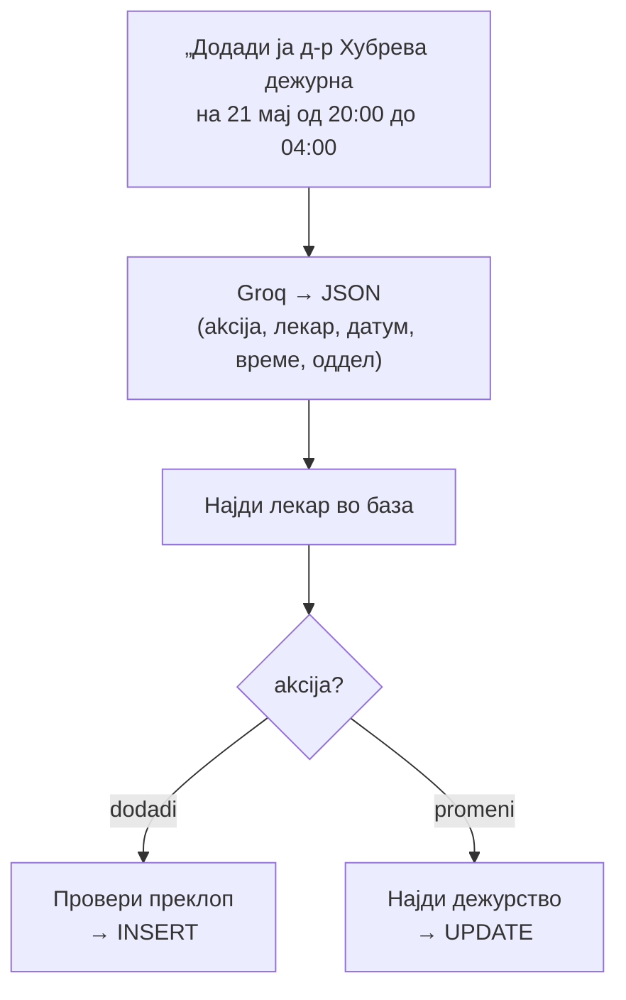

# Директор: Дежурства

За директорот, ова значи дека распоредот на дежурства не мора да се менува рачно низ административен панел со форми и копчиња. Доволно е да напише реченица како „Стави го д-р Петров на дежурство во сабота од 8 до 20" — асистентот го разбира барањето, го пронаоѓа лекарот по ime и го запишува дежурството со точните датум и часови.
Технички, ова е покриено со функцијата `promeni_dezurstvo`, која работи и за нов запис и за измена на постоечки. Пред да го зачува дежурството, handler-от проверува за временско преклопување со други дежурства на истиот лекар на истиот датум — истата трослојна логика што се користи и во административниот panel (vreme_od/vreme_do опсези кои не смеат да се вкрстуваат). Ако постои конфликт, асистентот враќа порака за грешка наместо да ја прифати промената, и бара ново време од директорот.

>Важно е разграничувањето на пристапот: самата промена на распоред е достапна исклучиво за најавен директор — функцијата проверува улога пред извршување. Прегледот на тековни дежурства, односно кој лекар е моментално дежурен, е сосема различна функција — pregled_dezurstvo — достапна за секој корисник, вклучувајќи гости, бидејќи е информација која секој треба да може слободно да ja провери.

> Поврзано: [Директор (преглед)](../direktor.md) · [Вести](vesti.md) · [Огласи](oglasi.md) ·
> [API: Администрација](../../../api/admin.md) · [API: Лекари](../../../api/lekari.md)

## Содржина

* [1. Преглед](#1-pregled)
* [2. Како работи (`promeni_dezurstvo`)](#2-kako)
* [3. Додавање дежурство](#3-dodadi)
* [4. Менување дежурство](#4-promeni)
* [5. Контекст (повеќечекорен дијалог)](#5-kontekst)
* [6. Пробај](#6-probaj)

***

## 1. Преглед <a id="1-pregled"></a>

| Намера | Фајл | Дејство |
|--------|------|---------|
| `promeni_dezurstvo` | `promeni_dezurstvo.py` |` INSERT INTO Dezurstva` (се прави нов запис) или `UPDATE Dezurstva` (постоечкиот запис), врз `Dezurstva` |
| (контекст) | `dezurstvo_kontekst.py` | Памти лекар/дежурство меѓу пораки за продолжување на дијалогот |

Една намера, две SQL операции — нема одделни intent вредности за create и update. 
Routing логиката е во handler-от, не во intent-детекцијата: пред `INSERT`, се проверува дали веќе постои запис за истиот `doctor_ID + datum` (или истиот `dezurstvo_ID` доколку  е веќе во контекст). Ако постои, се извршува `UPDATE` со истата трослојна провера на временско преклопување како во `REST endpoint-от PUT /admin/dezurstva/{id}`, но доколку не постои, се извршува `INSERT` со `default vreme_od/vreme_do (08:00–20:00)` ако часовите не се наведени. Контекстот (dezurstvo_kontekst.py) се чува по сесија за да дозволи follow-up порака како „смени му го времето на 9-17" да се однесува на истиот запис без повторно да се наведе лекар и датум.

***

## 2. Како работи (`promeni_dezurstvo`) <a id="2-kako"></a>



Groq враќа структуриран JSON, но доколку некој податок недостасува, се користат **резервни regex** функции за датум и време директно од текстот (на пр. `_datum_od_tekst`, `_vreme_od_tekst`). Акцијата се одредува со комбинација од AI резултатот и клучни зборови:

```python
# backend/ai/direktor/promeni_dezurstvo.py
def _baranje_e_dodadi(prasanje: str, ai_akcija: str | None) -> bool:
    if (ai_akcija or "").lower() == "dodadi":
        return True
    p = transliterijaj(prasanje).lower()
    return any(w in p for w in (
        "додади", "dodadi", "внеси", "закажи дежурство", "ново дежурство", "нека биде дежур",
    ))
```

***

## 3. Додавање дежурство <a id="3-dodadi"></a>

Пред `INSERT`, се проверува дали лекарот **веќе има дежурство** во истиот временски интервал (преклоп). Ако времето не е наведено, се користат: `08:00`–`20:00`.

```python
# backend/ai/direktor/promeni_dezurstvo.py
def _dodadi_dezurstvo(found, datum, vreme_od, vreme_do, oddel_hint) -> str:
    oddel = _najdi_oddel_po_ime(oddel_hint or "", found.get("specialty") or "")
    if _ima_preklop(found["doctor_ID"], datum, vreme_od, vreme_do):
        return (f"Д-р {found['name']} {found['surname']} веќе има дежурство на "
                f"{format_datum(datum)} во тој временски период.")
    conn = get_connection()
    cur = conn.cursor()
    cur.execute(
        "INSERT INTO Dezurstva (doctor_ID, datum, oddel, vreme_od, vreme_do, napomena)"
        " VALUES (%s, %s, %s, %s, %s, NULL)",
        (found["doctor_ID"], datum, oddel, vreme_od, vreme_do),
    )
    conn.commit()
    return (f"Дежурството е додадено.\n\nЛекар: д-р {found['name']} {found['surname']}\n"
            f"Оддел: {oddel}\nДатум: {format_datum(datum)}\nВреме: {vreme_od}–{vreme_do}")
```

### Реален излез

```text
Дежурството е додадено.

Лекар: д-р Марија Хубрева
Оддел: Оториноларингологија
Датум: 21.05.2026
Време: 20:00–04:00
```

> Ноќните смени се дозволени — `vreme_do` може да биде помало од `vreme_od` (на пр. 20:00–04:00).

***

## 4. Менување дежурство <a id="4-promeni"></a>

При промена, handler-от го наоѓа дежурството (по ID од контекст, по датум, или најблиското идно) и гради **динамичен `UPDATE`** само за полињата што се менуваат:

```python
# backend/ai/direktor/promeni_dezurstvo.py (избор)
sets: list[str] = []
params: list = []
if _as_date(nov_datum) != _as_date(dez["datum"]):
    sets.append("datum = %s");    params.append(nov_datum)
if vreme_od and _valid_time(vreme_od):
    sets.append("vreme_od = %s"); params.append(vreme_od)
if vreme_do and _valid_time(vreme_do):
    sets.append("vreme_do = %s"); params.append(vreme_do)

params.append(dez["dezurstvo_ID"])
cur.execute(f"UPDATE Dezurstva SET {', '.join(sets)} WHERE dezurstvo_ID = %s", params)
conn.commit()
```

### Реален излез

```text
Дежурството е променето.

Лекар: д-р Марија Хубрева
Оддел: Оториноларингологија
Датум: 21.05.2026
Време: 20:00–03:00
```

> При успешна промена/додавање, одговорот носи `"akcija": "osvezi_admin_dezurstva"` — сигнал за frontend-от да ја освежи табелата со дежурства.

***

## 5. Контекст (повеќечекорен дијалог) <a id="5-kontekst"></a>

Дежурствата често одат во **повеќе чекори**. Контекстот (од `dezurstvo_kontekst.py`) памти за кој лекар и кое дежурство станува збор, па следната порака може да биде кратка:

```text
Директор: Кога е дежурна д-р Хубрева?
Асистент: (прикажува дежурство) -> враќа контекст  со лекар + дежурство
Директор: Промени да е до 03:00
Асистент: Дежурството е променето. … Време: 20:00–03:00
```

Без контекст, асистентот не би знаел на кој лекар/дежурство се однесува „до 03:00". Затоа frontend-от го враќа `kontekst` од претходниот одговор во следното барање.

***

## 6. Пробај <a id="6-probaj"></a>

**Додади дежурство** преку `POST /ai-chat/ask`:

```json
{
  "prasanje": "Додади ја д-р Марија Хубрева дежурна на 21 мај од 20:00 до 04:00",
  "lekar": { "doctor_ID": 1, "name": "Владко", "surname": "Захариев" },
  "kontekst": null
}
```

**Промени дежурство** (со контекст од претходен чекор):

```json
{
  "prasanje": "Промени да е до 03:00",
  "lekar": { "doctor_ID": 1, "name": "Владко", "surname": "Захариев" },
  "kontekst": { "dezurstvo_kontekst": { "dezurstvo_id": 7, "datum": "2026-05-21", "vreme_od": "20:00" } }
}
```

> `lekar.doctor_ID` мора да е ID на профилот на директорот (д-р Владко Захариев), инаку `require_direktor` го одбива барањето.

> **Тестирај го овде →** [POST `/ai-chat/ask`](../../../api/ai-chat.md#3-ask)

***

Следно: [Вести](vesti.md) · [Огласи](oglasi.md) · [Директор (преглед)](../direktor.md)
