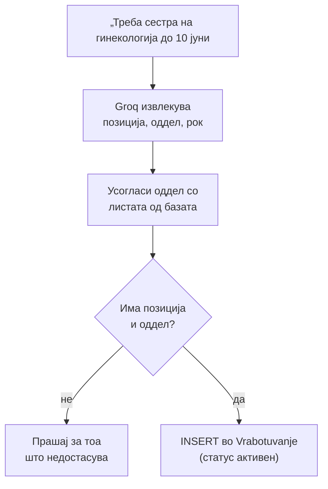

# Директор: Огласи за работа

Огласите за работни места имаат целосен животен циклус достапен преку асистентот, без потреба директорот да отвора форма во административниот панел. `kreiraj_oglas` составува нов оглас директно од неструктуриран текст — директорот опишува позиција, услови и краен датум во една реченица, а handler-от го структурира записот пред да го зачува. Огласот потоа може да се затвори со `zatvori_oglas` (статусот се менува во `истечен`, записот останува во базата) или трајно да се избрише со `izbrisi_vest_oglas`, кој работи и за вести и за огласи. За преглед на пријавени кандидати, `aplikanti_oglas` го враќа списокот веднаш во разговор, без оддел чекор низ панела. Сите четири дејства работат врз табелата `Vrabotuvanje`.

> Поврзано: [Директор (преглед)](../direktor.md) · [Вести](vesti.md) · [Дежурства](dezurstva.md) ·
> [API: Кариера](../../../api/kariera.md) · [API: Администрација](../../../api/admin.md)

## Содржина

* [1. Преглед](#1-pregled)
* [2. Креирање оглас (`kreiraj_oglas`)](#2-kreiraj)
* [3. Затворање оглас (`zatvori_oglas`)](#3-zatvori)
* [4. Бришење оглас (`izbrisi_vest_oglas`)](#4-izbrisi)
* [5. Апликанти (`aplikanti_oglas`)](#5-aplikanti)
* [6. Пробај](#6-probaj)

***

## 1. Преглед <a id="1-pregled"></a>

| Намера | Фајл | Дејство во базата |
|--------|------|-------------------|
| `kreiraj_oglas` | `kreiraj_oglas.py` | `INSERT` нов оглас (статус `активен`) |
| `zatvori_oglas` | `zatvori_oglas.py` | `UPDATE` статус → `истечен` (записот останува) |
| `izbrisi_vest_oglas` | `izbrisi_vest_oglas.py` | `DELETE` (трајно бришење) |
| `aplikanti_oglas` | `aplikanti_oglas.py` | `SELECT` листа на пријавени кандидати |

> **Затвори vs избриши:** затворениот оглас исчезнува од јавната листа, но **останува во базата** заедно со апликантите (корисно кога рокот истекол). Бришењето е трајно.

***

## 2. Креирање оглас (`kreiraj_oglas`) <a id="2-kreiraj"></a>

Директорот пишува **неструктурирано** (на пр. залепен текст од Facebook/Word или разговорна реченица), а Groq извлекува `pozicija`, `oddel` и `rok`. Оддел-от се усогласува со постоечките оддели во базата.



Ако рокот недостасува или е во минатото, автоматски се поставува **30 дена** од денес:

```python
# backend/ai/direktor/kreiraj_oglas.py
if rok is None:                       # нема наведен рок
    rok = denes + timedelta(days=30)
if rok < denes:                       # внесен минат датум
    rok = denes + timedelta(days=30)

cur.execute(
    "INSERT INTO Vrabotuvanje (pozicija, oddel, datum_na_objava, datum_na_prijavuvanje, status_oglas)"
    " VALUES (%s, %s, %s, %s, 'активен')",
    (pozicija, oddel, denes, rok),
)
conn.commit()
```

### Реален излез

```text
Огласот е креиран!

Позиција: Медицинска сестра
Оддел: Гинекологија
Рок за пријава: 10.06.2026

Проверете го на делот Кариера на сајтот.
```

Ако AI разбрал само делумно (на пр. позиција но не и валиден оддел), асистентот бара дополнување наместо да зачува нецелосен оглас.

***

## 3. Затворање оглас (`zatvori_oglas`) <a id="3-zatvori"></a>

Затворањето го менува статусот во `истечен` — по ID, по позиција, или **сите** огласи одеднаш.

```python
# backend/ai/direktor/zatvori_oglas.py
def _zatvori_po_id(target_id: int) -> str:
    conn = get_connection()
    cur = conn.cursor(dictionary=True)
    cur.execute(
        "SELECT id_oglas, pozicija, oddel, status_oglas FROM Vrabotuvanje WHERE id_oglas = %s",
        (target_id,),
    )
    oglas = cur.fetchone()
    if not oglas:
        return f"Не најдов оглас со ID {target_id}."
    # ... ако веќе е истечен, врати порака ...
    cur2 = conn.cursor()
    cur2.execute("UPDATE Vrabotuvanje SET status_oglas='истечен' WHERE id_oglas = %s", (target_id,))
    conn.commit()
    return (f"Огласот е затворен (статус: истечен).\n\n"
            f"ID: {oglas['id_oglas']}\nПозиција: {oglas['pozicija']}\nОддел: {oglas['oddel']}")
```

> **Двосмисленост по позиција:** ако има повеќе активни огласи за иста позиција, асистентот ги листа и бара прецизирање по ID — не погодува.

### Реален излез

```text
Огласот е затворен (статус: истечен).

ID: 5
Позиција: Кардиолог
Оддел: Кардиологија
```

За „затвори ги сите огласи": `Затворени се 3 огласи (статус: истечен).`

***

## 4. Бришење оглас (`izbrisi_vest_oglas`) <a id="4-izbrisi"></a>

Истата намера покрива и вест и оглас (за вест види [Вести](vesti.md#3-izbrisi)). За оглас, се брише по ID или „најновиот":

```python
# backend/ai/direktor/izbrisi_vest_oglas.py
def _izbrisi_oglas(target_id: int | None) -> str:
    with db_cursor() as (conn, cur):
        if target_id:
            cur.execute("SELECT id_oglas, pozicija, oddel FROM Vrabotuvanje WHERE id_oglas = %s", (target_id,))
        else:
            cur.execute("SELECT id_oglas, pozicija, oddel FROM Vrabotuvanje"
                        " ORDER BY datum_na_objava DESC, id_oglas DESC LIMIT 1")
        oglas = fetch_one(cur)
        if not oglas:
            return f"Не најдов оглас со ID {target_id}." if target_id else "Немате огласи во базата."
        oglas_id = int(oglas["id_oglas"])
        cur.execute("DELETE FROM Vrabotuvanje WHERE id_oglas = %s", (oglas_id,))
        conn.commit()
    return (f"Огласот е избришан.\n\nID: {oglas_id}\n"
            f"Позиција: {oglas.get('pozicija') or ''}\nОддел: {oglas.get('oddel') or ''}")
```

### Реален излез

```text
Огласот е избришан.

ID: 5
Позиција: Кардиолог
Оддел: Кардиологија
```

***

## 5. Апликанти (`aplikanti_oglas`) <a id="5-aplikanti"></a>

Враќа листа на пријавени кандидати — име, позиција, контакт и датум на пријава — директно во разговорот. Може да се филтрира по **ID на оглас** или по **позиција**.

```python
# backend/ai/direktor/aplikanti_oglas.py (избор)
if id_oglas:
    sql += " AND id_oglas = %s"
    params.append(id_oglas)
elif pozicija:
    sql += " AND LOWER(TRIM(pozicija)) LIKE %s"
    params.append(f"%{pozicija.strip().lower()}%")
sql += " ORDER BY datum_prijava DESC"
```

### Реален излез

```text
Апликанти (2) (оглас #5, „кардиолог"):

• Марко Петров – Кардиолог | оглас #5
   Email: marko@example.com | Тел: 070123456 | Лиценца: 12345
   Пријавен: 14.06.2026 10:20

• Ана Илиева – Кардиолог | оглас #5
   Email: ana@example.com | Тел: 071987654 | Лиценца: 67890
   Пријавен: 13.06.2026 16:45
```

Доколку нема пријавен лекари за огласот кој е објавен се пречати: `Нема апликанти за оглас со ID 5.`

***

## 6. Пробај <a id="6-probaj"></a>

**Креирај оглас** преку `POST /ai-chat/ask`:

```json
{
  "prasanje": "Треба медицинска сестра на гинекологија, пријави се до 10 јуни",
  "lekar": { "doctor_ID": 1, "name": "Владко", "surname": "Захариев" },
  "kontekst": null
}
```

**Прегледај апликанти**:

```json
{
  "prasanje": "Кои аплицирале за огласот за кардиолог?",
  "lekar": { "doctor_ID": 1, "name": "Владко", "surname": "Захариев" },
  "kontekst": null
}
```

> `lekar.doctor_ID` мора да е ID на профилот на директорот (д-р Владко Захариев), инаку `require_direktor` го одбива барањето.

> **Тестирај го овде →** [POST `/ai-chat/ask`](../../../api/ai-chat.md#3-ask)

***

Следно: [Дежурства](dezurstva.md) · [Вести](vesti.md) · [Директор (преглед)](../direktor.md)
