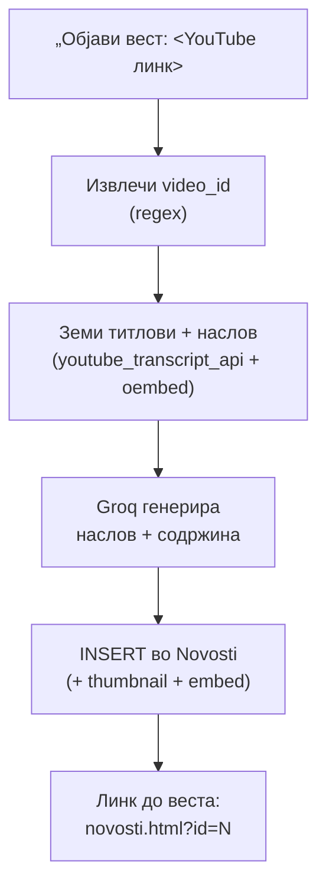

# Директор: Вести

Директорот може да објави и да избрише вест на порталот преку AI асистентот. Најистакната функција е **објавување вест директно од YouTube линк** — асистентот го зема насловот и титлите од видеото, со помош на Groq составува вест (наслов + содржина), и ја зачувува со вграден видео плеер и thumbnail.

> Поврзано: [Директор (преглед)](../direktor.md) · [Огласи](oglasi.md) · [Дежурства](dezurstva.md) ·
> [API: Новости](../../../api/novosti.md) · [Frontend: novosti.html](../../../../frontend/stranici/novosti-html.md)

## Содржина

* [1. Преглед](#1-pregled)
* [2. Објавување вест (`objavi_vest`)](#2-objavi)
* [3. Бришење вест (`izbrisi_vest_oglas`)](#3-izbrisi)
* [4. Пробај](#4-probaj)

***

## 1. Преглед <a id="1-pregled"></a>

| Намера | Фајл | Што прави |
|--------|------|-----------|
| `objavi_vest` | `objavi_vest.py` | Од YouTube линк → AI генерира наслов и содржина → `INSERT` во `Novosti` |
| `izbrisi_vest_oglas` | `izbrisi_vest_oglas.py` | Брише вест по наслов, по ID, или „најновата" (од контекст) |

***

## 2. Објавување вест (`objavi_vest`) <a id="2-objavi"></a>

Оваа намера се проверува **прва** меѓу директорските, бидејќи има препознатлив YouTube URL. Користи **сирово прашање** за да не се изгуби линкот при нормализација.



### Клучни чекори во кодот

Прво се извлекува `video_id` од линкот (поддржува `youtu.be`, `watch?v=`, `embed/`, `shorts/`):

```python
# backend/ai/direktor/objavi_vest.py
def _video_id(text: str) -> str | None:
    m = re.search(r"youtu\.be/([a-zA-Z0-9_-]{11})", text)
    if m:
        return m.group(1)
    m = re.search(r"youtube\.com/(?:watch\?v=|embed/|shorts/)([a-zA-Z0-9_-]{11})", text)
    if m:
        return m.group(1)
    return None
```

Потоа Groq составува вест од титлите, и записот се зачувува заедно со автоматски генериран **thumbnail** и **embed** (без колачиња):

```python
# backend/ai/direktor/objavi_vest.py
thumbnail = f"https://img.youtube.com/vi/{vid}/hqdefault.jpg"
embed = f"https://www.youtube-nocookie.com/embed/{vid}"

conn = get_connection()
cur = conn.cursor()
cur.execute(
    "INSERT INTO Novosti (naslov, sodrzina, slika_path, video_url, author_doctor_id)"
    " VALUES (%s, %s, %s, %s, %s)",
    (vest["naslov"], vest["sodrzina"], thumbnail, embed, lekar["doctor_ID"]),
)
conn.commit()
new_id = cur.lastrowid
```

### Реален излез

При успех, handler-от враќа објект со порака и **контекст** (за да може веднаш потоа да се избрише „последната вест"):

```json
{
  "odgovor": "Веста е објавена!\n\nМожете да ја погледнете во делот за [[Новости|novosti.html?id=42]] на сајтот!",
  "kontekst": {
    "last_vest_id": 42,
    "last_vest_naslov": "Нова кардиолошка амбуланта во КБ Штип",
    "last_action": "objavi_vest"
  }
}
```

Можни пораки наместо објава:

| Ситуација | Порака |
|-----------|--------|
| Нема YouTube линк | „Испрати ми YouTube линк. Пример: …" |
| Видеото нема ни титлови ни наслов | „Видеото нема титлови ниту наслов. Пробај друго видео." |
| Не е директор | Порака од `require_direktor` (само директорот) |
| Groq недостапен | `GROQ_OFFLINE_MSG` (офлајн режим) |

> Резултатот е веднаш видлив на [страницата за новости](../../../../frontend/stranici/novosti-html.md), со вграден видео плеер.

***

## 3. Бришење вест (`izbrisi_vest_oglas`) <a id="3-izbrisi"></a>

Истата намера покрива бришење на **вест или оглас** (за оглас види [Огласи](oglasi.md#4-izbrisi)). За вест, handler-от поддржува три начини на идентификација, со јасен приоритет:

1. **по наслов** — ако во прашањето се препознае реален наслов од базата (има приоритет, за да не се избрише погрешна вест од стар контекст);
2. **по контекст** — „избриши ја најновата вест" користи `last_vest_id` од претходниот одговор;
3. **по ID** — „избриши вест 3".

```python
# backend/ai/direktor/izbrisi_vest_oglas.py
def _izbrisi_vest(target_id: int | None) -> str:
    with db_cursor() as (conn, cur):
        if target_id:
            cur.execute("SELECT id, naslov FROM Novosti WHERE id = %s", (target_id,))
        else:
            cur.execute(
                "SELECT id, naslov FROM Novosti ORDER BY created_at DESC, id DESC LIMIT 1"
            )
        vest = fetch_one(cur)
        if not vest:
            return f"Не најдов вест со ID {target_id}." if target_id else "Немате вести во базата."
        vest_id = int(vest["id"])
        naslov = str(vest.get("naslov") or "")
        cur.execute("DELETE FROM Novosti WHERE id = %s", (vest_id,))
        conn.commit()
    return f"Вест е избришана.\n\nID: {vest_id}\nНаслов: {naslov}"
```

### Реален излез

```text
Вест е избришана.

ID: 42
Наслов: Нова кардиолошка амбуланта во КБ Штип
```

***

## 4. Пробај <a id="4-probaj"></a>

**Објави вест од YouTube линк** преку `POST /ai-chat/ask`:

```json
{
  "prasanje": "Објави вест: https://www.youtube.com/watch?v=XXXXXXXXXXX",
  "lekar": { "doctor_ID": 1, "name": "Владко", "surname": "Захариев" },
  "kontekst": null
}
```

**Избриши ја најновата вест** (користи контекст од претходниот одговор):

```json
{
  "prasanje": "Избриши ја најновата вест",
  "lekar": { "doctor_ID": 1, "name": "Владко", "surname": "Захариев" },
  "kontekst": { "last_vest_id": 42, "last_action": "objavi_vest" }
}
```

> `lekar.doctor_ID` мора да е ID на профилот на директорот (д-р Владко Захариев), инаку `require_direktor` го одбива барањето.


[OpenAPI KlinickaBolnicaAPI](https://klinicka-bolnica-stip2026.onrender.com/openapi.json)


***

Следно: [Огласи за работа](oglasi.md) · [Дежурства](dezurstva.md) · [Директор (преглед)](../direktor.md)
