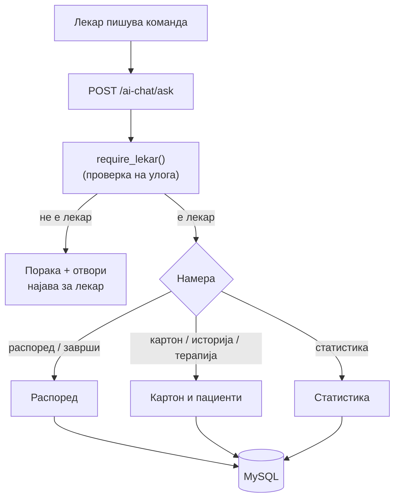

# Улога: Лекар

За лекарите, AI асистентот служи како брз пристап до нивниот работен панел, без да кликаат низ различни менија. Преку разговор можат да го проверат распоредот, да го прочитаат или ажурираат картонот на пациент, да запишат терапија и да ја видат сопствената статистика за прегледи. Целиот лекарски дел е имплементиран во backend/ai/lekar/, а doctor_ID се верифицира при секое барање — функциите се недостапни за пациенти и гости.

> Овие функции читаат и менуваат **медицински податоци**, па затоа бараат најавен лекар. Детекцијата кои од нив се однесуваат на лекар е во `lekar_intent.py`.

## Содржина

* [1. Што може лекарот](#1-pregled)
* [2. Авторизација (`require_lekar`)](#2-avtorizacija)
* [3. Како да тестираш](#3-test)
* [4. Подстраници по област](#4-podstranici)

> Поврзано: [Преглед на AI](../overview.md) · [Kernel](../kernel.md) · [API: Лекари](../../api/lekari.md)

***

## 1. Што може лекарот <a id="1-pregled"></a>

Функциите се сместени во `backend/ai/lekar/` и се групирани во **три области**. Секоја област има своја детална страница (види [секција 4](#4-podstranici)).

| Област | Намери (intents) | Што прави | Страница |
|--------|------------------|-----------|----------|
| **Распоред и прегледи** | `moj_raspored`, `zavrshi_pregled`, `otvori_lekar_panel` | Преглед на распоред; завршување преглед (со дијагноза/терапија); отворање панел | [Распоред](raspored.md) |
| **Картон и пациенти** | `karton_pacient`, `istorija_pacient`, `zapishi_terapija` | Медицински картон; историја кај тековниот лекар; запис на терапија | [Картон и пациенти](pacienti.md) |
| **Статистика** | `moja_statistika` | Лични бројки: прегледи, просечна оцена, топ пациенти | [Статистика](statistika.md) |



> **Сопственост на податоци:** секоја функција работи **само** со податоци на најавениот лекар — `doctor_ID` од сесијата секогаш влегува во SQL условот, па лекарот не може да види туѓи пациенти или термини.

***

## 2. Авторизација (`require_lekar`) <a id="2-avtorizacija"></a>

Секој лекарски handler **започнува со иста проверка**. За разлика од директорот, тука е доволно да е најавен **било кој** лекар (со валиден `doctor_ID`).

```python
# backend/ai/_kernel/auth.py
def require_lekar(lekar: dict | None, *, poraka: str | None = None) -> str | None:
    if lekar and lekar.get("doctor_ID"):
        return None                       # дозволено
    return poraka or "Мораш прво да се најавиш како лекар."
```

Образец во секој handler:

```python
def odgovori_za_karton(prasanje: str, lekar: dict | None) -> str:
    if err := require_lekar(lekar):   # ако не е најавен лекар
        return err                     # врати порака и СТОП
    doctor_id = lekar["doctor_ID"]     # се користи во секој SQL услов
    ...
```

> Дел од функциите (на пр. распоред) дополнително враќаат `"akcija": "otvori_lekar_login"` за гости — сигнал frontend-от да ја отвори формата за најава на лекар.

***

## 3. Како да тестираш <a id="3-test"></a>

Сите лекарски функции одат преку **еден** endpoint — `POST /ai-chat/ask`. Текстот во `prasanje` ја одредува намерата, а `lekar` го носи идентитетот.

```json
{
  "prasanje": "Кој е мојот распоред за утре?",
  "lekar": { "doctor_ID": 28, "name": "Александар", "surname": "Серафимов" },
  "kontekst": null
}
```

* `prasanje` — командата на природен јазик
* `lekar.doctor_ID` — **мора** да е валиден ID на лекар (инаку `require_lekar` враќа одбивање)
* `kontekst` — се враќа од претходниот одговор (на пр. `last_raspored_termin_ids` за брзо завршување преглед)

> Секоја подстраница има свој **„Пробај"** блок со конкретни примери и реален излез, што може да се испрати директно кон живиот сервер преку копчето **„Test it"**.

***

## 4. Подстраници по област <a id="4-podstranici"></a>

За да не е сè натрупано на едно место, секоја област е документирана посебно — со код, реални примери и излез:

* [**Распоред и прегледи**](raspored.md) — `moj_raspored`, `zavrshi_pregled`, `otvori_lekar_panel`
* [**Картон и пациенти**](pacienti.md) — `karton_pacient`, `istorija_pacient`, `zapishi_terapija`
* [**Статистика**](statistika.md) — `moja_statistika`

***

Следно: [Распоред](raspored.md) · [Картон и пациенти](pacienti.md) · [Статистика](statistika.md) ·
[Директор](../direktor/README.md) · [Општо](../opsto/README.md) · [Пациент](../pacient/README.md)
