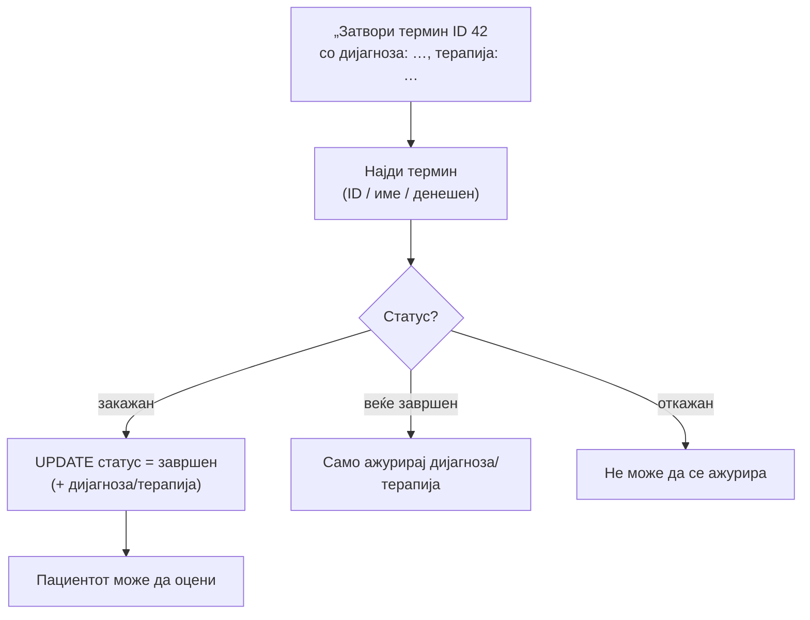

# Лекар: Распоред и прегледи

Лекарот може да го провери својот распоред на прегледи, да заврши преглед (со опционална дијагноза и терапија), и да го отвори соодветниот таб од лекарскиот панел — сè преку разговор. Сите функции работат само со термините на најавениот лекар (`doctor_ID` од сесијата).

> Поврзано: [Лекар (преглед)](../lekar.md) · [Картон и пациенти](pacienti.md) · [Статистика](statistika.md) ·
> [API: Лекари](../../../api/lekari.md) · [API: Термини](../../../api/termini.md)

## Содржина

* [1. Преглед](#1-pregled)
* [2. Мој распоред (`moj_raspored`)](#2-raspored)
* [3. Завршување преглед (`zavrshi_pregled`)](#3-zavrshi)
* [4. Отворање панел (`otvori_lekar_panel`)](#4-panel)
* [5. Пробај](#5-probaj)

***

## 1. Преглед <a id="1-pregled"></a>

| Намера | Фајл | Дејство |
|--------|------|---------|
| `moj_raspored` | `moj_raspored.py` | `SELECT` термини за период/датум (без откажани) |
| `zavrshi_pregled` | `zavrshi_pregled.py` | `UPDATE` статус → `завршен` (+ дијагноза/терапија) |
| `otvori_lekar_panel` | `lekar_panel_nav.py` | Навигација до таб во лекарскиот панел |

***

## 2. Мој распоред (`moj_raspored`) <a id="2-raspored"></a>

Groq извлекува период (`denes`, `utre`, `nedela`, `mesec`, `site`), конкретен датум или број на резултати. Термините се читаат за најавениот лекар, се **групираат по датум**, и се исклучуваат откажаните.

```python
# backend/ai/lekar/moj_raspored.py (избор)
sql = (
    "SELECT termin_ID, ime_pacient, email_pacient, telefon_pacient,"
    "       datum_pregled, vreme_pregled, status_pregled, napomena"
    " FROM Termin_pregled"
    " WHERE doctor_ID = %s"
    "   AND COALESCE(NULLIF(TRIM(status_pregled), ''), 'закажан')"
    " NOT IN ('откажан', 'отказан')"
)
```

Одговорот враќа и `kontekst` со `last_raspored_termin_ids` — за да следната порака како „затвори го прегледот" знае на кој термин се однесува (види [завршување](#3-zavrshi)).

### Реален излез

```text
Прегледи за утре (2 вкупно):

━━ среда, 17.06.2026 ━━
• 09:30 — Daniel Eftimov (ID 1)
• 11:30 — Marija Petrova (ID 8)

За завршување со дијагноза и терапија, на пр.:
„Затвори го прегледот со Дијагноза: …, и терапија: …"

Листата е прикажана на табот «Преглед на пациенти».
```

> Одговорот доаѓа како структуриран објект (`dict`) што воедно го отвора лекарскиот панел (`akcija: otvori_lekar_panel`) и го фокусира табот со пациенти.

***

## 3. Завршување преглед (`zavrshi_pregled`) <a id="3-zavrshi"></a>

Лекарот завршува преглед по **ID**, по **име на пациент**, или **сите** за денес. Може истовремено да внесе дијагноза и терапија. Завршувањето овозможува пациентот потоа да го **оцени** прегледот.



```python
# backend/ai/lekar/zavrshi_pregled.py (избор)
def _zavrshi(termin_id: int, dijagnoza: str | None, terapija: str | None) -> None:
    sets = ["status_pregled = 'завршен'"]
    params: list = []
    if dijagnoza and not _prazna_dx_tx(dijagnoza):
        sets.append("dijagnoza = %s");  params.append(dijagnoza)
    if terapija and not _prazna_dx_tx(terapija):
        sets.append("terapija = %s");   params.append(terapija)
    params.append(termin_id)
    cur.execute(f"UPDATE Termin_pregled SET {', '.join(sets)} WHERE termin_ID = %s", params)
    conn.commit()
```

### Реален излез

```text
Прегледот е означен како завршен.

ID: 42
Пациент: Петар Иванов
Кога: 17.06.2026 09:30
Дијагноза: Мигрена
Терапија: Аналгетик 2x дневно
```

Други можни одговори:

| Ситуација | Одговор |
|-----------|---------|
| Конкретен ID без дијагноза/терапија | Бара да се внесат (не дозволува празно/`/`) |
| Повеќе термини со исто име | Листа со ID + бара прецизирање |
| „Заврши ги сите денешни" | „Завршени N прегледи. …" (масовно) |
| Веќе завршен | Само ажурирање на дијагноза/терапија |

***

## 4. Отворање панел (`otvori_lekar_panel`) <a id="4-panel"></a>

Чисто **навигациска** команда — го отвора соодветниот таб од лекарскиот dashboard без листа во чатот. Табот се одредува од клучни зборови:

| Клучни зборови | Таб |
|----------------|-----|
| „дежур…" | `dezurstva` (Распоред на дежурства) |
| „апарат", „мрт", „кт", „рентген", „узи" | `aparati` (Закажи термин на апарат) |
| „поставк…", „лозинк…", „профил" | `postavki` (Поставки) |
| (по дифолт) | `pacienti` (Преглед на пациенти) |

Одговорот носи `navigacija` + `akcija: otvori_lekar_panel`, што frontend-от ги обработува преку `kbsOtvoriLekarPanel`:

```text
Го отворам табот «Преглед на пациенти» на вашиот панел.
```

***

## 5. Пробај <a id="5-probaj"></a>

**Мој распоред** преку `POST /ai-chat/ask`:

```json
{
  "prasanje": "Кој е мојот распоред за утре?",
  "lekar": { "doctor_ID": 28, "name": "Александар", "surname": "Серафимов" },
  "kontekst": null
}
```

**Заврши преглед со дијагноза и терапија**:

```json
{
  "prasanje": "Затвори термин ID 42 со дијагноза: Мигрена и терапија: Аналгетик 2x дневно",
  "lekar": { "doctor_ID": 28, "name": "Александар", "surname": "Серафимов" },
  "kontekst": null
}
```

> `lekar.doctor_ID` мора да е валиден ID на лекар (терминот мора да му припаѓа), инаку `require_lekar` го одбива барањето или терминот нема да се најде.


[OpenAPI KlinickaBolnicaAPI](https://klinicka-bolnica-stip2026.onrender.com/openapi.json)


***

Следно: [Картон и пациенти](pacienti.md) · [Статистика](statistika.md) · [Лекар (преглед)](../lekar.md)
