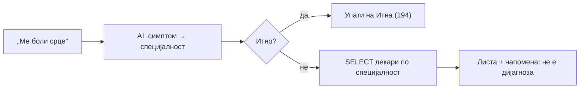

# Лекари и услуги

Овие функции им помагаат на сите корисници (и гости) да најдат лекар или услуга — по оддел, по име, по симптом или по преференца. Сите податоци доаѓаат од база; асистентот никогаш не измислува лекари.

> Поврзано: [Општо (преглед)](../opsto.md) · [Информации](informacii.md) · [Навигација](navigacija.md) · [API: Лекари](../../../api/lekari.md) · [API: Услуги](../../../api/uslugi.md)

***

## 1. Преглед <a href="#id-1-pregled" id="id-1-pregled"></a>

| Намера             | Фајл                  | Дејство                                                    |
| ------------------ | --------------------- | ---------------------------------------------------------- |
| `lekari_oddel`     | `lekari_oddel.py`     | `SELECT` лекари по специјалност + навигација до `#lekari`  |
| `info_lekar`       | `info_lekar.py`       | Детали за конкретен лекар (специјалност, email, дежурство) |
| `preporaka_lekar`  | `preporaka_lekar.py`  | AI мапира симптом → специјалност → листа лекари            |
| `preference_lekar` | `preference_lekar.py` | Филтрирање по пол/јазик/искуство                           |
| `uslugi`           | `uslugi.py`           | Оддели + апарати + дополнителни услуги                     |

> Изборот на оддел не е слободен fuzzy match — се користи [`oddel_resolver`](../../kernel.md) што го потврдува точниот оддел **од листа во база**, за да не се вратат погрешни лекари.

***

## 2. Лекари по оддел (`lekari_oddel`) <a href="#id-2-oddel" id="id-2-oddel"></a>

Враќа листа лекари за даден оддел/специјалност. Препознава многу варијанти („Кои лекари се на кардиологија?", „На урологија", „одделот за неврологија"), а за „сите лекари во болницата" враќа само навигација до секцијата.

```python
# backend/ai/opsto/lekari_oddel.py (избор)
with db_cursor() as (_, cur):
    cur.execute(
        "SELECT doctor_ID, name, surname, specialty, email FROM Doctors "
        "WHERE LOWER(TRIM(specialty)) = LOWER(TRIM(%s)) ORDER BY surname, name",
        (oddel,))
```

### Реален излез

```
На одделот за „Кардиологија" работат (3 лекари):

- Д-р Марко Петров
- Д-р Ана Стоилова
- Д-р Игор Николов

Лекарите (д-р Марко Петров, д-р Ана Стоилова, д-р Игор Николов) работат на одделот за „Кардиологија".
За повеќе информации за конкретен лекар прашајте — Ви стојам на располагање.
```

> Одговорот враќа и `navigacija` (скрол до `#lekari` со филтер по специјалност) и `kontekst` (`last_oddel`, `last_oddel_doctor_ids`) — па следно прашање „кој од нив е слободен утре?" знае за кои лекари станува збор.

***

## 3. Инфо за лекар (`info_lekar`) <a href="#id-3-info" id="id-3-info"></a>

Детали за конкретен лекар: специјалност, email и статус на дежурство (сега / следно). Groq го препознава лекарот од листата во база, со можност за лекар „од контекст" (претходна порака).

### Реален излез

```
д-р Марко Петров (Кардиологија)

Email: marko.petrov@kbstip.mk
Дежурен: Не
Датум: 18.06.2026
Почеток на дежурство: 08:00

Доколку сакате преглед, најавете се со кориснички профил на сајтот.
За слободни термини напишете: „Кога е слободен д-р Петров?"
```

> Кога нема таков лекар, асистентот не молчи — проверува дали прашањето всушност е за прегледи, за вест или за лекар „од контекст", и дава соодветно упатство наместо празен одговор.

***

## 4. Препорака по симптом (`preporaka_lekar`) <a href="#id-4-preporaka" id="id-4-preporaka"></a>

Пациентот опишува симптом, Groq предлага **специјалност** (не дијагноза), па се листаат лекари од таа специјалност.



### Реален излез

```
Препорака: Кардиологија

Лекари достапни во оваа специјалност:
- Д-р Марко Петров
- Д-р Ана Стоилова

За да видите слободни термини напишете: „Кога е слободен д-р [презиме]?"
Напомена: Ова е препорака, не дијагноза. За сериозни симптоми посетете лекар.
```

> Безбедносни патеки: ако AI процени **итно** → директно упатство кон Итна помош (тел. 194); ако предложи **општа пракса** → насочување кон дом на здравје (клиничката болница нема општи лекари).

***

## 5. Преференци (`preference_lekar`) <a href="#id-5-preference" id="id-5-preference"></a>

Филтрира лекари по преференци. Полот се проценува хеуристички (базата нема колона за пол — женски/машки приближно по име); за јазик се насочува кон рецепција.

### Реален излез

```
Лекари на одделот „Кардиологија" што одговараат на барањето:

• Д-р Ана Стоилова — Кардиологија
• Д-р Марија Петрова — Кардиологија

За закажување: рецепција (032/ 605-001) или формата за термин на сајтот.
```

> Ако фали оддел → „За кој оддел барате лекар?"; ако се бара јазик → насочување кон рецепција; follow-up како „а женски таму?" го користи одделот од контекст.

***

## 6. Услуги (`uslugi`) <a href="#id-6-uslugi" id="id-6-uslugi"></a>

Комбиниран список од три извори: **оддели** (`Oddeli`), **апарати** (`Aparati WHERE aktiven = 1`) и **дополнителни услуги** (од `bolnica_info.json`).

```python
# backend/ai/opsto/uslugi.py (избор)
cur.execute("SELECT ime_na_oddel FROM Oddeli ORDER BY ime_na_oddel")
cur.execute("SELECT ime, opis FROM Aparati WHERE aktiven = 1 ORDER BY ime")
```

### Реален излез

```
Услуги во Клиничка Болница Штип:

Специјалистички прегледи:
- Кардиологија
- Неврологија
- Урологија

Дијагностички испитувања:
- Магнетна резонанца (МРТ)
- Компјутерска томографија (КТ)

Дополнителни услуги:
- Лабораториски анализи

За закажување напиши: „Сакам преглед кај д-р [презиме] [датум] [време]"
```

***

## 7. Пробај <a href="#id-7-probaj" id="id-7-probaj"></a>

**Лекари по оддел** преку `POST /ai-chat/ask`:

```json
{ "prasanje": "Кои лекари се на кардиологија?", "pacient": null, "lekar": null, "kontekst": null }
```

**Инфо за лекар**:

```json
{ "prasanje": "Кажи ми за д-р Петров", "pacient": null, "lekar": null, "kontekst": null }
```

**Препорака по симптом**:

```json
{ "prasanje": "Ме боли срце, кој лекар да го посетам?", "pacient": null, "lekar": null, "kontekst": null }
```

> Сите функции работат и за **гости** — `pacient` и `lekar` може да бидат `null`.

> **Тестирај го овде →** [POST `/ai-chat/ask`](../../../api/ai-chat.md#3-ask)

***

Следно: [Информации](informacii.md) · [Навигација](navigacija.md) · [Општо (преглед)](../opsto.md)
