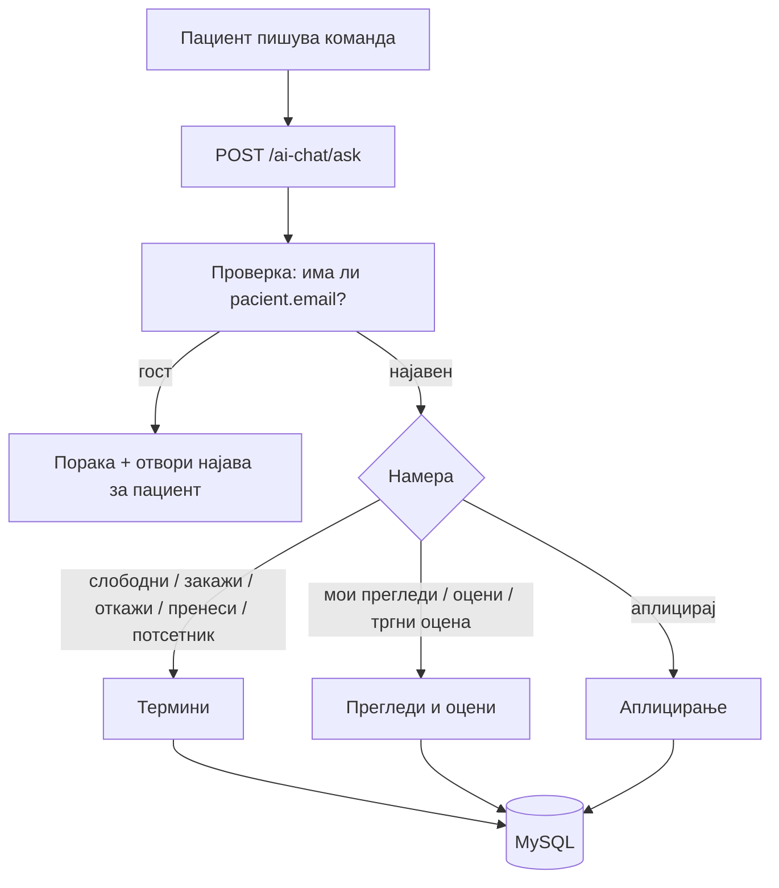

# Улога: Пациент

Функциите за **пациент** живеат во `backend/ai/pacient/`. Достапни се за најавени пациенти (некои и за гости), и овозможуваат управување со термини, оцени и аплицирање за работа — сè преку природен јазик.

> Овие дејства менуваат **лични податоци** (термини, оцени, апликации), па бараат **најавен пациент** (`pacient.email` / `pacient_ID`). За гости, асистентот дава информации, но не може да закажува во нивно име.

## Содржина

* [1. Што може пациентот](#1-pregled)
* [2. Авторизација (најавен пациент)](#2-avtorizacija)
* [3. Како да тестираш](#3-test)
* [4. Подстраници по област](#4-podstranici)

> Поврзано: [Преглед на AI](../overview.md) · [Kernel](../kernel.md) · [API: Термини](../../api/termini.md) · [API: Кариера](../../api/kariera.md)

***

## 1. Што може пациентот <a id="1-pregled"></a>

Функциите се сместени во `backend/ai/pacient/` и се групирани во **три области**. Секоја област има своја детална страница (види [секција 4](#4-podstranici)).

| Област | Намери (intents) | Што прави | Страница |
|--------|------------------|-----------|----------|
| **Термини и потсетници** | `slobodni_termini`, `zakazi_termin`, `otkazi_termin`, `prenesi_termin`, `postavi_potsetnik` | Проверка на слободни часови; закажување (повеќестепено); откажување; пренесување; потсетник | [Термини](termini.md) |
| **Прегледи и оцени** | `moi_pregledi`, `oceni_pregled`, `trgni_ocena` | Историја и идни прегледи; оцена за завршен преглед; бришење оцена | [Прегледи и оцени](oceni.md) |
| **Аплицирање за работа** | `apliciraj_za_rabota` | AI аплицира за оглас во име на пациентот | [Аплицирање](aplikacija.md) |



> **Сопственост на податоци:** секоја функција работи **само** со податоците на најавениот пациент — `email`-от од сесијата секогаш влегува во SQL условот (`WHERE LOWER(TRIM(email_pacient)) = LOWER(TRIM(%s))`), па пациентот не може да види или менува туѓи термини.

***

## 2. Авторизација (најавен пациент) <a id="2-avtorizacija"></a>

За разлика од лекарските и директорските функции (кои имаат `require_lekar` / `require_direktor`), пациентските handler-и проверуваат дали постои `pacient` со `email` на самиот почеток:

```python
# образец во секој пациентски handler
def odgovori_za_otkazuvanje(prasanje, pacient, kontekst=None):
    if not pacient or not pacient.get("email"):
        return ("За да откажеш термин, прво најави се како пациент. "
                "Кликни „Најави се!“ горе десно.")
    ...
    # email-от влегува во секој SQL услов
```

> Некои функции за читање (на пр. слободни термини) работат и за гости — но секое **дејство што менува податоци** (закажување, откажување, оцена, апликација) бара најава.

***

## 3. Како да тестираш <a id="3-test"></a>

Сите пациентски функции одат преку **еден** endpoint — `POST /ai-chat/ask`. Текстот во `prasanje` ја одредува намерата, а `pacient` го носи идентитетот.

```json
{
  "prasanje": "Кои термини се слободни кај д-р Петров оваа недела?",
  "pacient": { "pacient_ID": 1, "email": "daniel@example.com", "ime": "Даниел", "prezime": "Ефтимов" },
  "kontekst": null
}
```

* `prasanje` — командата на природен јазик
* `pacient.email` — **мора** да е поставен за дејства што менуваат податоци
* `kontekst` — се враќа од претходниот одговор (на пр. за повеќестепено закажување или брзо бришење апликација)

> Секоја подстраница има свој **„Пробај"** блок со конкретни примери и реален излез, што може да се испрати директно кон живиот сервер преку копчето **„Test it"**.

***

## 4. Подстраници по област <a id="4-podstranici"></a>

За да не е сè натрупано на едно место, секоја област е документирана посебно — со код, реални примери и излез:

* [**Термини и потсетници**](termini.md) — `slobodni_termini`, `zakazi_termin`, `otkazi_termin`, `prenesi_termin`, `postavi_potsetnik`
* [**Прегледи и оцени**](oceni.md) — `moi_pregledi`, `oceni_pregled`, `trgni_ocena`
* [**Аплицирање за работа**](aplikacija.md) — `apliciraj_za_rabota`

***

Следно: [Термини](termini.md) · [Прегледи и оцени](oceni.md) · [Аплицирање](aplikacija.md) ·
[Лекар](../lekar/README.md) · [Директор](../direktor/README.md) · [Општо](../opsto/README.md)
