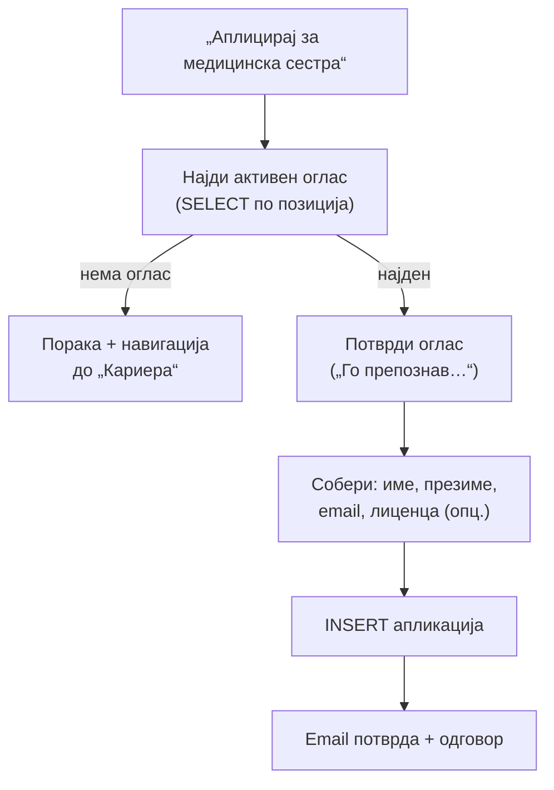

# Пациент: Аплицирање за работа

`apliciraj_za_rabota` е најкомплексниот пациентски флоу — AI агентот **аплицира за оглас во име на корисникот**. Наоѓа активен оглас, потврдува, собира потребни податоци (име, презиме, email, опционална лиценца) и поднесува апликација во база со email потврда.

> Поврзано: [Пациент (преглед)](../pacient.md) · [Термини и потсетници](termini.md) · [Прегледи и оцени](oceni.md) ·
> [API: Кариера](../../../api/kariera.md)

## Содржина

* [1. Преглед](#1-pregled)
* [2. Флоу на аплицирање](#2-flow)
* [3. Препознавање оглас и собирање податоци](#3-podatoci)
* [4. Поднесување и потврда](#4-podnesi)
* [5. Проверка и бришење апликација](#5-status)
* [6. Пробај](#6-probaj)

***

## 1. Преглед <a id="1-pregled"></a>

| Намера | Фајл | Дејство во база |
|--------|------|-----------------|
| `apliciraj_za_rabota` | `apliciraj_za_rabota.py` | `SELECT` оглас → `INSERT` апликација; `DELETE` при откажување |

Три под-сценарија во истиот фајл:

* **Нова апликација** — „Сакам да аплицирам за медицинска сестра"
* **Проверка статус** — „Дали имам поднесено апликација?"
* **Бришење** — „Избриши ја апликацијата"

***

## 2. Флоу на аплицирање <a id="2-flow"></a>



> Флоуто е **повеќестепено** — секој чекор го зачувува потребното во `kontekst`, па следната порака (на пр. бројот на лиценца) се надоврзува без повторување.

***

## 3. Препознавање оглас и собирање податоци <a id="3-podatoci"></a>

Асистентот најпрво го наоѓа активниот оглас по позиција/специјалност. Ако корисникот залепи цел текст од оглас, Groq ја извлекува позицијата. Лиценцата се извлекува посебно (само цифри, со можност за прескокнување).

```text
Го препознав огласот за работа: Медицинска сестра.

За да аплицирам во твое име, ми треба бројот на лиценца (само цифри).
Ако немаш или сакаш да прескокнеш, напиши „немам" / „прескокни".
```

> Ако нема активен оглас за бараната позиција: „Во моментот нема активен оглас за „…". Подолу се сите отворени позиции…" + навигација до делот **Кариера**.

***

## 4. Поднесување и потврда <a id="4-podnesi"></a>

По собраните податоци се прави `INSERT`, се праќа email потврда (не е фатално ако падне) и се враќа контекст за брзо бришење.

### Реален излез

```text
Готово! Апликацијата е успешно испратена.

Позиција: Медицинска сестра
Кандидат: Даниел Ефтимов
Email: daniel@example.com
Лиценца: 12345

Потврда е испратена на твојата e-пошта.
Тимот за човечки ресурси ќе те контактира. Среќно!

За откажување: „Избриши ја апликацијата".
```

> Одговорот враќа `kontekst` со `applicant_email` и `last_aplikacija_id` — за да командата „Избриши ја апликацијата" веднаш знае што да избрише.

***

## 5. Проверка и бришење апликација <a id="5-status"></a>

* **Проверка** (`prasanje_e_proverka_aplikacija_rabota`) — „Дали имам поднесено апликација?" враќа статус, **не** започнува нов флоу. Внимателно ги разликува „дали можам да аплицирам" (нов флоу) од „дали имам аплицирано" (проверка).
* **Бришење** (`prasanje_e_izbrisi_aplikacija_rabota`) — бара и збор за апликација и команда за бришење.

### Реален излез (бришење)

```text
Апликацијата е избришана.

Можеш повторно да аплицираш кога сакаш — само кажи за која позиција.
```

***

## 6. Пробај <a id="6-probaj"></a>

**Започни апликација** преку `POST /ai-chat/ask`:

```json
{
  "prasanje": "Сакам да аплицирам за медицинска сестра",
  "pacient": { "pacient_ID": 1, "email": "daniel@example.com", "ime": "Даниел", "prezime": "Ефтимов" },
  "kontekst": null
}
```

**Достави лиценца** (втор чекор, со контекст од претходниот одговор):

```json
{
  "prasanje": "Бројот ми е 12345",
  "pacient": { "pacient_ID": 1, "email": "daniel@example.com", "ime": "Даниел", "prezime": "Ефтимов" },
  "kontekst": { "aplikacija_pending": { "id_oglas": 7, "pozicija": "Медицинска сестра" } }
}
```

**Избриши апликација**:

```json
{
  "prasanje": "Избриши ја апликацијата",
  "pacient": { "pacient_ID": 1, "email": "daniel@example.com" },
  "kontekst": { "applicant_email": "daniel@example.com", "last_aplikacija_id": 42 }
}
```

> За аплицирање во име на корисникот, `pacient` мора да носи `email` (и идеално `ime`/`prezime`) — асистентот ги користи за пополнување на апликацијата.

> **Тестирај го овде →** [POST `/ai-chat/ask`](../../../api/ai-chat.md#3-ask)

***

Следно: [Термини и потсетници](termini.md) · [Прегледи и оцени](oceni.md) · [Пациент (преглед)](../pacient.md)
