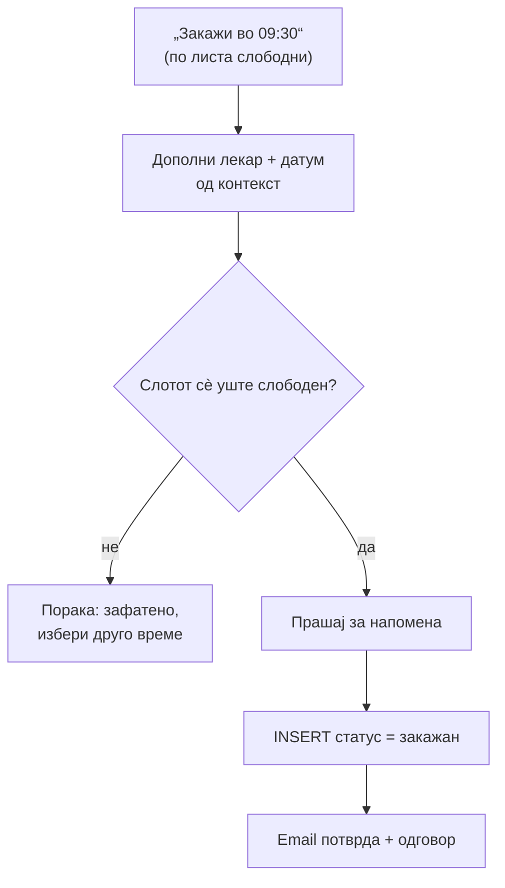

# Пациент: Термини и потсетници

Управувањето со термини е јадрото на пациентскиот асистент: проверка на слободни часови, повеќестепено закажување, откажување, пренесување и поставување потсетник. Сите дејства што менуваат термин бараат **најавен пациент** (`email`), а работат само со неговите термини.

> Поврзано: [Пациент (преглед)](../pacient.md) · [Прегледи и оцени](oceni.md) · [Аплицирање](aplikacija.md) ·
> [API: Термини](../../../api/termini.md)

## Содржина

* [1. Преглед](#1-pregled)
* [2. Слободни термини (`slobodni_termini`)](#2-slobodni)
* [3. Закажување (`zakazi_termin`)](#3-zakazi)
* [4. Откажување (`otkazi_termin`)](#4-otkazi)
* [5. Пренесување (`prenesi_termin`)](#5-prenesi)
* [6. Потсетник (`postavi_potsetnik`)](#6-potsetnik)
* [7. Пробај](#7-probaj)

***

## 1. Преглед <a id="1-pregled"></a>

| Намера | Фајл | Дејство во база |
|--------|------|-----------------|
| `slobodni_termini` | `slobodni_termini.py` | `SELECT` зафатени слотови → пресметка на слободни (читање) |
| `zakazi_termin` | `zakazi_termin.py` | `INSERT` нов термин со статус `закажан` |
| `otkazi_termin` | `otkazi_termin.py` | `UPDATE` статус → `откажан` (soft delete) |
| `prenesi_termin` | `prenesi_termin.py` | `UPDATE` `datum_pregled` / `vreme_pregled` |
| `postavi_potsetnik` | `postavi_potsetnik.py` | `INSERT` во `Potsetnici` |

> Работно време: **понеделник–петок, 08:00–15:30**, по слотови од 30 минути. Викендите и минатите часови автоматски се исфрлаат.

***

## 2. Слободни термини (`slobodni_termini`) <a id="2-slobodni"></a>

Најкомплексната функција за читање. Не чита „слободни" од база — туку ги генерира сите 30-минутни слотови за работен ден, ги одзема **зафатените** (од база) и го прикажува остатокот, групиран по период од денот.

```python
# backend/ai/pacient/slobodni_termini.py (избор)
RABOTNO_VREME_OD = time(8, 0)     # клиниката отвора во 08:00
RABOTNO_VREME_DO = time(16, 0)    # клиниката затвора во 16:00
TRAENJE_TERMIN_MINUTI = 30        # секој термин трае 30 мин

cur.execute(
    "SELECT DATE(datum_pregled) AS dp, "
    "TIME_FORMAT(TIME(vreme_pregled), '%H:%i') AS vp FROM Termin_pregled "
    "WHERE doctor_ID = %s AND DATE(datum_pregled) BETWEEN %s AND %s "
    "AND status_pregled NOT IN ('откажан', 'отказан')",
    (doctor_id, od_datum, do_datum))
```

Препознавањето на лекар, датум и час е **локално (regex)** прво, па дури потоа преку Groq AI ако regex-от не успее. Поддржува варијанти како „следниот вторник", „за во среда", „утре", „на 20.05", ISO датум, имиња на месеци итн.

### Реален излез

```text
д-р Марко Петров (Кардиологија)

За понеделник (16.06.2026), кај д-р Марко Петров (Кардиологија) има слободни термини во текот на целото претпладне:

Ран наутро: 08:00 | 08:30 | 09:00
Околу пладне: 11:00 | 11:30

Кажете ми кој од овие термини најмногу ви одговара (на пример: „Закажи во 09:30").
За друг работен ден — наведете нова дата.
```

> Одговорот враќа `kontekst` со `zakazi_od_slobodni` (лекар + датум) и `last_doctor_id`, па следната порака „Закажи во 09:30" знае кој лекар и кој датум се однесува — без повторно да го пишуваш.

Може и без конкретен лекар — „**Кој** е слободен на 20.05 во 12:00?" — тогаш се листаат сите лекари (или оние од зачуван оддел) што се слободни во тој термин.

***

## 3. Закажување (`zakazi_termin`) <a id="3-zakazi"></a>

Закажувањето е **повеќестепен флоу**. Асистентот собира лекар + датум + час, прашува за опционална напомена, и дури потоа внесува во база. Контекстот од претходната порака овозможува „памтење" каде застанал разговорот.



```python
# backend/ai/pacient/zakazi_termin.py (избор) — проверка пред INSERT
cur.execute(
    "SELECT termin_ID FROM Termin_pregled "
    "WHERE doctor_ID = %s AND datum_pregled = %s "
    "  AND TIME(vreme_pregled) = %s AND status_pregled = 'закажан'",
    (doctor_id, datum_str, vreme_str))
```

### Реален излез

```text
Терминот е успешно закажан.

Пациент: Даниел Ефтимов
Лекар: Д-р Марко Петров
Специјалност: Кардиологија
Датум: Понеделник, 16.06.2026
Време: 09:30

Потврда е испратена на твојата е-пошта (ако е поставен SMTP).
```

> Ако часот во меѓувреме бил зафатен — „Тој термин е веќе зафатен. Избери друго време." Викенд/минат датум/час надвор од работно време исто така се одбиваат со јасна порака.

***

## 4. Откажување (`otkazi_termin`) <a id="4-otkazi"></a>

Откажувањето е **soft delete** — статусот се менува на `откажан`, записот останува (за историја и статистика). Groq извлекува лекар + датум + час; ако нешто фали, се дополнува од контекст.

```python
# backend/ai/pacient/otkazi_termin.py (избор)
cur.execute(
    "UPDATE Termin_pregled SET status_pregled = 'откажан' WHERE termin_ID = %s",
    (termin_id,))
```

### Реален излез

```text
Терминот е откажан!

Лекар: Д-р Марко Петров
Специјалност: Кардиологија
Датум: Понеделник, 16.06.2026
Време: 09:30

Потврда е испратена на вашата е-пошта (ако е поставен SMTP на серверот).

Можеш да закажеш нов термин со „Сакам преглед кај [презиме] [датум] [време]".
```

Други можни одговори:

| Ситуација | Одговор |
|-----------|---------|
| Нема активен термин | „Не најдов активен термин со статус „закажан"…" (со прикажано што е барано) |
| Повеќе термини | Листа со термини + бара прецизирање по лекар/датум |
| Точно еден | Откажување + email потврда |

***

## 5. Пренесување (`prenesi_termin`) <a id="5-prenesi"></a>

Преместување на постоечки термин на **нов слободен** датум/час. Прво се валидира новиот термин (работен ден, работно време, слободен слот), па дури потоа `UPDATE`.

```python
# backend/ai/pacient/prenesi_termin.py (избор)
cur.execute("""
    UPDATE Termin_pregled
    SET datum_pregled = %s, vreme_pregled = %s
    WHERE termin_ID = %s
""", (nov_datum, novo_vreme, termin_id))
```

### Реален излез

```text
Терминот е пренесен!

Лекар: Д-р Марко Петров
Нов датум: Петок, 20.06.2026
Ново време: 11:00
```

> Валидации пред пренесување: „Не може да префрлиш термин во минатото", „Не се закажуваат прегледи во сабота/недела", „Работно време е 08:00 - 15:30", „Тој нов термин е веќе зафатен. Избери друго време."

***

## 6. Потсетник (`postavi_potsetnik`) <a id="6-potsetnik"></a>

Поставува потсетник за иден термин — Groq извлекува колку **пред** терминот (offset во минути, по дифолт 60). Записот оди во табелата `Potsetnici`.

```python
# backend/ai/pacient/postavi_potsetnik.py (избор)
cur.execute("""
    INSERT INTO Potsetnici (termin_ID, pacient_email, vreme_za_potsetuvanje, poraka)
    VALUES (%s, %s, %s, %s)
""", (termin_id, pacient_email, vreme_potsetuvanje, poraka))
```

### Реален излез

```text
Потсетникот е поставен!

Термин: Понеделник, 16.06.2026 во 09:30
Лекар: Д-р Марко Петров
Кога: 1 час пред терминот
Точно време на потсетник: 16.06.2026 08:30
```

> Ако пресметаното време на потсетник е во минатото (терминот е премногу близу) → „Не можам да поставам потсетник во минатото… Избери помал интервал."

***

## 7. Пробај <a id="7-probaj"></a>

**Слободни термини** преку `POST /ai-chat/ask`:

```json
{
  "prasanje": "Кои термини се слободни кај д-р Петров оваа недела?",
  "pacient": { "pacient_ID": 1, "email": "daniel@example.com" },
  "kontekst": null
}
```

**Закажување по листа слободни** (со контекст од претходниот одговор):

```json
{
  "prasanje": "Закажи во 09:30",
  "pacient": { "pacient_ID": 1, "email": "daniel@example.com", "ime": "Даниел", "prezime": "Ефтимов" },
  "kontekst": { "zakazi_od_slobodni": { "doctor_id": 12, "datum": "2026-06-16" }, "last_doctor_id": 12 }
}
```

**Откажување / пренесување / потсетник**:

```json
{
  "prasanje": "Откажи го прегледот на 16.06.2026 во 09:30 кај Петров",
  "pacient": { "pacient_ID": 1, "email": "daniel@example.com" },
  "kontekst": null
}
```

> `pacient.email` мора да е поставен за дејства што менуваат податоци (закажување, откажување, пренесување, потсетник) — инаку асистентот бара најава.


[OpenAPI KlinickaBolnicaAPI](https://klinicka-bolnica-stip2026.onrender.com/openapi.json)


***

Следно: [Прегледи и оцени](oceni.md) · [Аплицирање](aplikacija.md) · [Пациент (преглед)](../pacient.md)
