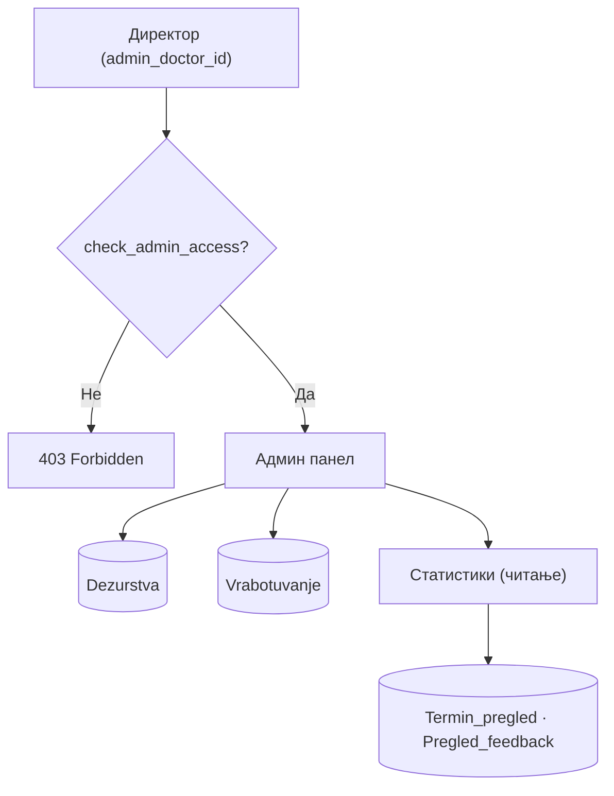
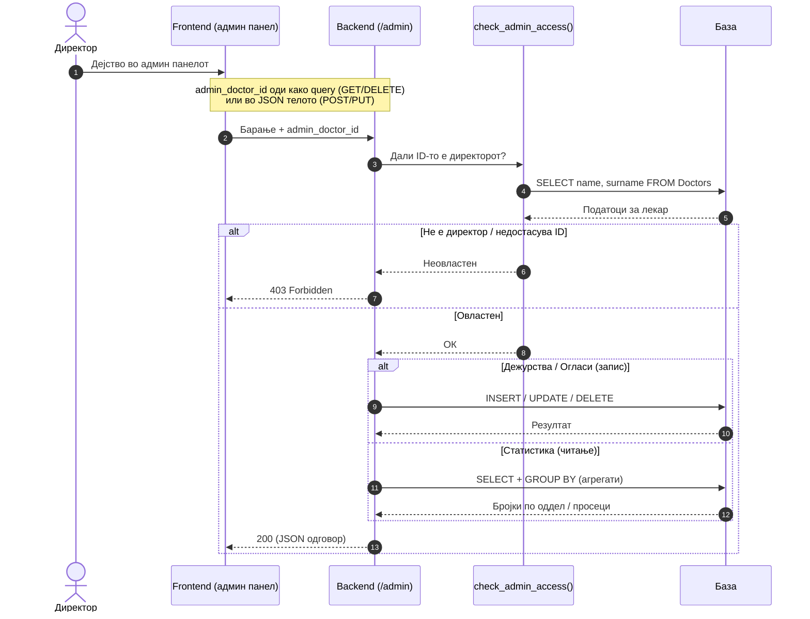

# Администрација

Административниот модул е дефиниран во `backend/routers/admin.py` и достапен под префиксот `/admin`. Претставува централна точка за управување со установата од страна на директорот — единствениот корисник со пристап до овие функции. Модулот опфаќа три клучни домени: управување со **распоредот на дежурства**, целосен CRUD над **огласите за работа** и пристап до **статистики** наменети за раководството.
Секој endpoint во овој модул минува низ верификација на `admin_doctor_id` преку `check_admin_access()` пред да се изврши каква било операција — неовластени барања се одбиваат веднаш со `403 Forbidden`.

> **Интерактивно тестирање:** секој endpoint е придружен со вграден **OpenAPI блок** и копче **„Test it"**, погонувано од Scalar. Пополни ги потребните параметри или тело на барањето и испрати го директно кон живиот сервер (`klinicka-bolnica-stip2026.onrender.com`) — без да ја напушташ документацијата.

## Содржина

* [1. Преглед](admin.md#1-pregled)
* [2. Авторизација — само директор](admin.md#2-avtorizacija)
* [3. Дежурства](admin.md#3-dezurstva)
  * [GET `/admin/dezurstva`](admin.md#31-get-dezurstva)
  * [POST `/admin/dezurstva`](admin.md#32-post-dezurstva)
  * [PUT `/admin/dezurstva/{id}`](admin.md#33-put-dezurstva)
  * [DELETE `/admin/dezurstva/{id}`](admin.md#34-delete-dezurstva)
* [4. Огласи за работа](admin.md#4-oglasi)
  * [GET `/admin/oglasi`](admin.md#41-get-oglasi)
  * [POST `/admin/oglasi`](admin.md#42-post-oglasi)
  * [PUT `/admin/oglasi/{id}`](admin.md#43-put-oglasi)
  * [DELETE `/admin/oglasi/{id}`](admin.md#44-delete-oglasi)
* [5. Статистики](admin.md#5-statistika)
  * [GET `/admin/statistika/optovaruvanje-oddeli`](admin.md#51-optovaruvanje)
  * [GET `/admin/statistika/prosek-ocena-lekari`](admin.md#52-prosek)
* [6. Поврзани табели](admin.md#6-tabele)

> Поврзани: [Конвенции](conventions.md) · [Лекари](lekari.md) · [Кариера](kariera.md) · [Новости](novosti.md) · [База на податоци](../the_database.md)

***

## 1. Преглед <a href="#id-1-pregled" id="id-1-pregled"></a>



| Група        | Метод/Патека                                  | Намена                                |
| ------------ | --------------------------------------------- | ------------------------------------- |
| Дежурства    | `GET /admin/dezurstva`                         | Листа дежурства (со филтри)            |
| Дежурства    | `POST /admin/dezurstva`                         | Ново дежурство                        |
| Дежурства    | `PUT /admin/dezurstva/{id}`                     | Ажурирање дежурство                   |
| Дежурства    | `DELETE /admin/dezurstva/{id}`                  | Бришење дежурство                     |
| Огласи       | `GET /admin/oglasi`                             | Листа на сите огласи                  |
| Огласи       | `POST /admin/oglasi`                            | Нов оглас                             |
| Огласи       | `PUT /admin/oglasi/{id}`                        | Ажурирање оглас                       |
| Огласи       | `DELETE /admin/oglasi/{id}`                     | Бришење оглас                         |
| Статистика   | `GET /admin/statistika/optovaruvanje-oddeli`    | Завршени термини по специјалност      |
| Статистика   | `GET /admin/statistika/prosek-ocena-lekari`     | Просечна оцена по лекар               |

### Тек на податоци — секое барање минува низ проверка на пристап

Дијаграмот го прикажува текот на едно типично админ барање: пред која било операција (дежурство, оглас или статистика), backend-от прво проверува дали `admin_doctor_id` припаѓа на директорот. Само тогаш барањето стигнува до базата.



***

## 2. Авторизација — само директор <a href="#id-2-avtorizacija" id="id-2-avtorizacija"></a>

Секој endpoint во овој модул е заштитен со функцијата `check_admin_access(admin_doctor_id)`, која верификува дали проследениот идентификатор припаѓа на директорот на болницата. Проверката не се базира само на ID — backend-от го валидира и името на лекарот (на пр. „Владко Захариев"), со вградена толеранција за неколку транслитерациски варијации. Само ако двете проверки поминат успешно, барањето продолжува кон извршување.
Начинот на кој се проследува `admin_doctor_id` зависи од типот на барањето:

- кај **GET** и **DELETE** — како **query параметар** (`?admin_doctor_id=...`);
- кај **POST** и **PUT** — како поле во **JSON телото**.

Доколку `admin_doctor_id` недостасува, е невалиден или не припаѓа на директорот, backend-от враќа **`403 Forbidden`** без да изврши каква било операција врз базата.

> Сите барања со тело користат `Content-Type: application/json`. Одговорите се стандарден JSON; грешките се враќаат во формат `{"detail": "порака"}` со соодветен HTTP статус.

**Имплементација (FastAPI) — заштита:**

```python
def check_admin_access(doctor_id: int) -> bool:
    db_cursor.execute("SELECT name, surname FROM Doctors WHERE doctor_ID = %s", (doctor_id,))
    doctor_name = f"{doctor['name']} {doctor['surname']}".strip()
    return doctor_name in ["Владко Захариев", "Влатко Захариев", ...]  # варијации на името
```

- Секој admin endpoint прво повикува `check_admin_access(admin_doctor_id)` — без тоа → `403 Forbidden`.

***

## 3. Дежурства <a href="#id-3-dezurstva" id="id-3-dezurstva"></a>
Овој дел од административниот модул управува со распоредот на дежурства на лекарите, зачувани во табелата `Dezurstva`. Директорот преку овие endpoints може да ги прегледа, внесе, ажурира или отстрани дежурства — со поддршка за прецизно филтрирање по лекар, датум или оддел.

Od корисничка перспектива, дежурствата се прикажуваат на профилот на секој лекар — пациентите можат да видат кога нивниот лекар е на дежурство и да го земат тоа предвид при закажување. Доколку за одреден лекар нема рачно внесени дежурства, системот автоматски активира fallback механизам кој динамички го пресметува распоредот врз основа на специјалноста.

### GET `/admin/dezurstva`

Извршува `SELECT` врз табелата `Dezurstva`, сортиран по датум и час (`DESC`). Поддржува комбинација од опционални филтри кои се применуваат динамички во SQL барањето — само проследените параметри влијаат на резултатот, додека непроследените се игнорираат.

**Query параметри:**

- `admin_doctor_id` *(задолжителен)* — за верификација на пристап преку `check_admin_access()`
- `doctor_id` *(опционален)* — ги филтрира само дежурствата на конкретен лекар
- `datum` *(опционален)* — филтрира по конкретен датум во формат `YYYY-MM-DD`
- `oddel` *(опционален)* — филтрира по naziv на оддел

**Успешен одговор (200):**

```json
[
  {
    "dezurstvo_ID": 3,
    "doctor_ID": 2,
    "doctor_name": "Ана Стојановска",
    "doctor_specialty": "Кардиологија",
    "datum": "2026-06-20",
    "oddel": "Кардиологија",
    "vreme_od": "08:00:00",
    "vreme_do": "20:00:00",
    "napomena": null
  }
]
```

**Можни грешки:** `403` (нема пристап) · `500` грешка настаната на серверска страна.

**Каде се користи:** frontend — `script.js` (админ панел, листа дежурства).

**Имплементација (FastAPI):**

```python
@router.get("/dezurstva")
def get_all_dezurstva(admin_doctor_id: int, doctor_id=None, datum=None, oddel=None):
    if not check_admin_access(admin_doctor_id): raise HTTPException(403, ...)
    query = "SELECT d.*, doc.name, doc.surname FROM Dezurstva d JOIN Doctors doc ... WHERE 1=1"
    # динамички AND филтри за doctor_id, datum, oddel
    return result
```


[OpenAPI KlinickaBolnicaAPI](https://klinicka-bolnica-stip2026.onrender.com/openapi.json)


### POST `/admin/dezurstva` <a href="#id-32-post-dezurstva" id="id-32-post-dezurstva"></a>

**Креирање ново дежурство.** Проверува дали лекарот постои и дали нема преклопување со постоечко дежурство.

**Тело (JSON):**

```json
{
  "admin_doctor_id": 2,
  "doctor_ID": 2,
  "datum": "2026-06-20",
  "oddel": "Кардиологија",
  "vreme_od": "08:00",
  "vreme_do": "20:00",
  "napomena": "Ноќно дежурство"
}
```

* `doctor_ID`, `datum`, `oddel` — задолжителни
* `datum` — формат `YYYY-MM-DD`; `vreme_od`/`vreme_do` — формат `HH:MM` (default `08:00`–`20:00`)

**Успешен одговор (200):**

```json
{ "message": "Дежурството е успешно креирано", "dezurstvo_ID": 5 }
```

**Можни грешки:** `400` (недостасуваат полиња, преклопување, лош формат) · `403` · `404` (лекар не постои) · `500`

**Каде се користи:** frontend — `script.js` (форма ново дежурство).

**Имплементација (FastAPI):** `check_admin_access` → проверка лекар постои → проверка преклопување → `INSERT INTO Dezurstva` → `commit`.


[OpenAPI KlinickaBolnicaAPI](https://klinicka-bolnica-stip2026.onrender.com/openapi.json)


### PUT `/admin/dezurstva/{dezurstvo_id}` <a href="#id-33-put-dezurstva" id="id-33-put-dezurstva"></a>

**Ажурирање постоечко дежурство.** Истите полиња како кај создавање (во JSON телото, со `admin_doctor_id`). Проверува за преклопување со други дежурства (освен тековното).

**Path параметар:** `dezurstvo_id` (цел број)

**Успешен одговор (200):** `{ "message": "Дежурството е успешно ажурирано" }`

**Можни грешки:** `400` · `403` · `404` (дежурство не постои) · `500`

**Каде се користи:** frontend — `script.js` (уредување дежурство).

**Имплементација (FastAPI):** `PUT /dezurstva/{dezurstvo_id}` — `UPDATE Dezurstva SET ... WHERE dezurstvo_ID = %s` (со проверка за преклопување).


[OpenAPI KlinickaBolnicaAPI](https://klinicka-bolnica-stip2026.onrender.com/openapi.json)


### DELETE `/admin/dezurstva/{dezurstvo_id}` <a href="#id-34-delete-dezurstva" id="id-34-delete-dezurstva"></a>

**Бришење дежурство.**

**Path параметар:** `dezurstvo_id` · **Query:** `admin_doctor_id` (задолжителен)

```
DELETE /admin/dezurstva/5?admin_doctor_id=2
```

**Успешен одговор (200):** `{ "message": "Дежурството е успешно избришано" }`

**Можни грешки:** `403` · `404` · `500`

**Каде се користи:** frontend — `script.js` (бришење дежурство).

**Имплементација (FastAPI):** `DELETE` + `admin_doctor_id` како query → `DELETE FROM Dezurstva WHERE dezurstvo_ID = %s`.


[OpenAPI KlinickaBolnicaAPI](https://klinicka-bolnica-stip2026.onrender.com/openapi.json)


***

## 4. Огласи за работа <a href="#id-4-oglasi" id="id-4-oglasi"></a>

Целосен CRUD над табелата `Vrabotuvanje` (за разлика од јавните во [Кариера](kariera.md), овие бараат админ пристап).

### GET `/admin/oglasi` <a href="#id-41-get-oglasi" id="id-41-get-oglasi"></a>

**Листа на сите огласи** (вклучувајќи завршени), подредени по датум на објава.

**Query:** `admin_doctor_id` (задолжителен)

**Успешен одговор (200):**

```json
[
  {
    "id_oglas": 7,
    "pozicija": "Специјалист кардиолог",
    "oddel": "Кардиологија",
    "datum_na_objava": "2026-06-01",
    "datum_na_prijavuvanje": "2026-06-30",
    "status_oglas": "активен"
  }
]
```

**Можни грешки:** `403` · `500`

**Каде се користи:** frontend — `script.js` (админ листа огласи).

**Имплементација (FastAPI):** `SELECT * FROM Vrabotuvanje ORDER BY datum_na_objava DESC` (по `check_admin_access`).


[OpenAPI KlinickaBolnicaAPI](https://klinicka-bolnica-stip2026.onrender.com/openapi.json)


### POST `/admin/oglasi` <a href="#id-42-post-oglasi" id="id-42-post-oglasi"></a>

**Креирање нов оглас.**

**Тело (JSON):**

```json
{
  "admin_doctor_id": 2,
  "pozicija": "Специјалист кардиолог",
  "oddel": "Кардиологија",
  "datum_na_objava": "2026-06-01",
  "datum_na_prijavuvanje": "2026-06-30",
  "status_oglas": "активен"
}
```

* `pozicija`, `oddel` — задолжителни · датуми во `YYYY-MM-DD` · `status_oglas` опционален

**Успешен одговор (200):** `{ "message": "Огласот е успешно креиран", "id_oglas": 7 }`

**Можни грешки:** `400` · `403` · `500`

**Каде се користи:** frontend — `script.js` (форма нов оглас).

**Имплементација (FastAPI):** `INSERT INTO Vrabotuvanje (pozicija, oddel, ...) VALUES (...)` — иста табела како [Кариера](kariera.md#4-oglas), но со admin проверка.


[OpenAPI KlinickaBolnicaAPI](https://klinicka-bolnica-stip2026.onrender.com/openapi.json)


### PUT `/admin/oglasi/{oglas_id}` <a href="#id-43-put-oglasi" id="id-43-put-oglasi"></a>

**Ажурирање постоечки оглас.** Истите полиња како кај создавање (во JSON, со `admin_doctor_id`).

**Path параметар:** `oglas_id`

**Успешен одговор (200):** `{ "message": "Огласот е успешно ажуриран" }`

**Можни грешки:** `400` · `403` · `404` (оглас не постои) · `500`

**Каде се користи:** frontend — `script.js` (уредување оглас).

**Имплементација (FastAPI):** `UPDATE Vrabotuvanje SET ... WHERE id_oglas = %s`.


[OpenAPI KlinickaBolnicaAPI](https://klinicka-bolnica-stip2026.onrender.com/openapi.json)


### DELETE `/admin/oglasi/{oglas_id}` <a href="#id-44-delete-oglasi" id="id-44-delete-oglasi"></a>

**Бришење оглас.**

**Path параметар:** `oglas_id` · **Query:** `admin_doctor_id`

**Успешен одговор (200):** `{ "message": "Огласот е успешно избришан" }`

**Можни грешки:** `403` · `404` · `500`

**Каде се користи:** frontend — `script.js` (бришење оглас).

**Имплементација (FastAPI):** `DELETE FROM Vrabotuvanje WHERE id_oglas = %s`.


[OpenAPI KlinickaBolnicaAPI](https://klinicka-bolnica-stip2026.onrender.com/openapi.json)


***

## 5. Статистики <a href="#id-5-statistika" id="id-5-statistika"></a>

Аналитика за раководството (само читање).

### GET `/admin/statistika/optovaruvanje-oddeli` <a href="#id-51-optovaruvanje" id="id-51-optovaruvanje"></a>

**Оптовареност по оддел** — број на **завршени** термини (`status_pregled = 'завршен'`) групирани по специјалност на лекарот.

**Query:** `admin_doctor_id` (задолжителен) · `datum_od` · `datum_do` (опционален опсег)

**Успешен одговор (200):**

```json
{
  "razdeli": [
    { "specijalnost": "Кардиологија", "broj_zavrseni": 42 },
    { "specijalnost": "Хирургија", "broj_zavrseni": 31 }
  ],
  "vkupno_zavrseni": 73,
  "datum_od": null,
  "datum_do": null
}
```

**Можни грешки:** `403` · `500`

**Каде се користи:** frontend — `script.js` (админ статистика, оптоварување по оддел).

**Имплементација (FastAPI):**

```python
@router.get("/statistika/optovaruvanje-oddeli")
def statistika_optovaruvanje(admin_doctor_id: int, datum_od=None, datum_do=None):
    # SELECT specijalnost, COUNT(*) FROM Termin_pregled JOIN Doctors
    # WHERE status_pregled = 'завршен' GROUP BY specialty
    return {"razdeli": [...], "vkupno_zavrseni": N}
```


[OpenAPI KlinickaBolnicaAPI](https://klinicka-bolnica-stip2026.onrender.com/openapi.json)


### GET `/admin/statistika/prosek-ocena-lekari` <a href="#id-52-prosek" id="id-52-prosek"></a>

**Просечна оцена по лекар** — `AVG(ocena)` и број на гласови, од `Pregled_feedback` → `Termin_pregled` → `Doctors`.

* Без `doctor_id` → сите лекари со **барем една** оцена, подредени по просек опаѓачки.
* Со `doctor_id` → еден избран лекар (дури и со 0 оцени).

**Query:** `admin_doctor_id` (задолжителен) · `doctor_id` · `datum_od` · `datum_do` (опционални)

**Успешен одговор (200):**

```json
{
  "lekari": [
    {
      "doctor_ID": 2,
      "ime": "Ана",
      "prezime": "Стојановска",
      "specijalnost": "Кардиологија",
      "prosek_ocena": 4.75,
      "broj_oceni": 12
    }
  ],
  "datum_od": null,
  "datum_do": null
}
```

**Можни грешки:** `403` · `404` (ако е зададен непостоечки `doctor_id`) · `500`

**Каде се користи:** frontend — `script.js` (админ статистика, просек оцени).

**Имплементација (FastAPI):**

```python
@router.get("/statistika/prosek-ocena-lekari")
def statistika_prosek_ocena(admin_doctor_id: int, doctor_id=None, ...):
    # AVG(pf.ocena), COUNT(*) од Pregled_feedback → Termin_pregled → Doctors
    return {"lekari": [{"prosek_ocena": 4.75, "broj_oceni": 12, ...}]}
```


[OpenAPI KlinickaBolnicaAPI](https://klinicka-bolnica-stip2026.onrender.com/openapi.json)


***

## 6. Поврзани табели <a href="#id-6-tabele" id="id-6-tabele"></a>

| Табела             | Улога во `/admin`                                       |
| ------------------ | ------------------------------------------------------ |
| `Dezurstva`        | Распоред на дежурства на лекарите                       |
| `Doctors`          | Проверка на пристап + податоци за лекар/специјалност    |
| `Vrabotuvanje`     | Огласи за работа (CRUD)                                 |
| `Termin_pregled`   | Извор за статистика (завршени термини)                  |
| `Pregled_feedback` | Извор за статистика (оцени по лекар)                    |

Детали за колони и врски: [База на податоци](../the_database.md).

***

Следно: [AI чат](ai-chat.md) · [Конвенции](conventions.md)
