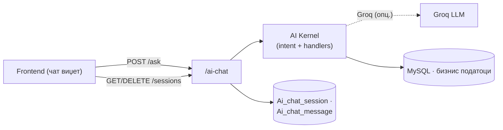
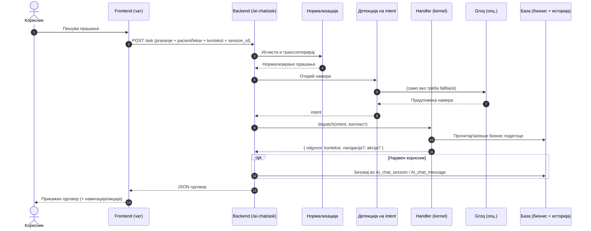

# AI Agent

Модулот за **AI асистент** е дефиниран во `backend/routers/ai_chat.py` и достапен под префиксот `/ai-chat`. Овој router функционира како оркестратор меѓу frontend-от и AI јадрото (`ai/_kernel/`) — го прима влезот од корисникот, го нормализира, ја детектира намерата (intent), го пренасочува барањето до соодветниот handler и го враќа форматираниот одговор назад до frontend-от.
Разговорите за најавени корисници (пациент или лекар) се трајно зачувуваат во табелите `Ai_chat_session` и `Ai_chat_message`, со што се овозможува продолжување на претходна сесија и одржување на контекст меѓу различни посети на порталот.

> **Интерактивно тестирање:** секој endpoint е придружен со вграден **OpenAPI блок** и копче **„Test it"**, погонувано од Scalar. Пополни ги потребните параметри или тело на барањето и испрати го директно кон живиот сервер (`klinicka-bolnica-stip2026.onrender.com`) — без да ја напушташ документацијата.

> Овој документ ги опишува **HTTP endpoints**. За тоа како функционира самата AI логика (намери, улоги, Groq, handlers) види [AI асистент — преглед](../ai-assistant/overview.md) и [Kernel](../ai-assistant/kernel.md).

## Содржина

* [1. Преглед](ai-chat.md#1-pregled)
* [2. Како работи `/ask`](ai-chat.md#2-kako)
* [3. POST `/ai-chat/ask`](ai-chat.md#3-ask)
* [4. GET `/ai-chat/sessions`](ai-chat.md#4-sessions)
* [5. GET `/ai-chat/sessions/{id}/messages`](ai-chat.md#5-messages)
* [6. DELETE `/ai-chat/sessions/{id}`](ai-chat.md#6-delete)
* [7. POST `/ai-chat/sessions/import-guest`](ai-chat.md#7-import)
* [8. Поврзани табели](ai-chat.md#8-tabele)

> Поврзани: [Конвенции](conventions.md) · [AI асистент](../ai-assistant/overview.md) · [Kernel](../ai-assistant/kernel.md) · [Преглед на backend](../pregled.md)

***

## 1. Преглед <a href="#id-1-pregled" id="id-1-pregled"></a>



| Метод | Патека | Намена | Пристап |
|-------|--------|--------|---------|
| `POST` | `/ai-chat/ask` | Поставување прашање и добивање одговор | Сите (гостин или најавен) |
| `GET` | `/ai-chat/sessions` | Листа на претходни разговори | Најавен |
| `GET` | `/ai-chat/sessions/{id}/messages` | Пораки од една сесија | Најавен (сопственик) |
| `DELETE` | `/ai-chat/sessions/{id}` | Бришење на разговор | Најавен (сопственик) |
| `POST` | `/ai-chat/sessions/import-guest` | Префрлање гостински разговор по најава | Најавен |

Сите барања и одговори се **JSON**. Историјата се чува **само** ако во барањето има најавен пациент (`pacient_ID`) или лекар (`doctor_ID`); гостинските разговори живеат само на frontend-от додека корисникот не се најави.

***

## 2. Како работи `/ask` <a href="#id-2-kako" id="id-2-kako"></a>

Главниот endpoint поминува низ четири последователни чекори пред да генерира одговор:
1. **Нормализација** — влезот се процесира преку `normaliziraj_prasanje()`: се тримува, се конвертира во мали букви и се транслитерира меѓу кирилица и латиница. Ова гарантира конзистентна детекција на намерата без оглед на тоа дали корисникот пишува на кирилица, латиница или комбинација од двете.
2. **Детекција на намера (intent)** — се извршува во два слоја. Прво се применува детекција базирана на клучни зборови и тековниот контекст на разговорот (на пр. ако претходната порака иницирала флоу за закажување, системот знае дека следната порака е дел од истиот флоу). Доколку намерата не може да се утврди со доволна сигурност, се повикува Groq API како fallback за инференција на природен јазик.
3. **Dispatch** — детектираната намера се мапира на конкретен handler во `ai/_kernel/handlers.py`. Секој handler е одговорен за точно еден тип на намера — на пр. `slobodni_termini`, `zakazi_termin`, `info_lekar`, `apliciraj_za_rabota`, `general`. Диспечерот го избира точниот handler и му го проследува контекстот.
4. **Зачувување** — за најавен корисник, целата размена (прашање, одговор и тековен контекст) се запишува во базата преку `Ai_chat_session` и `Ai_chat_message`, со што следната порака може да го продолжи разговорот точно од каде застанал.



> Полето **`kontekst`** е клучно: frontend-от го враќа во следното барање за да се продолжи мултиделниот флоу (на пр. избор на лекар → датум → потврда). Полињата **`navigacija`** и **`akcija`** му кажуваат на frontend-от да отвори страница или да изврши дејство (на пр. отвори форма за најава).

***

## 3. POST `/ai-chat/ask` <a href="#id-3-ask" id="id-3-ask"></a>

**Главен endpoint** — поставување прашање до асистентот. Работи и за гостин и за најавен корисник; ако се проследат податоци за пациент/лекар, одговорите се персонализираат и разговорот се зачувува.

**Тело (JSON):**

```json
{
  "prasanje": "Кои лекари се на кардиологија?",
  "pacient": {
    "pacient_ID": 5,
    "ime": "Иван",
    "prezime": "Ивановски",
    "email": "ivan@example.com"
  },
  "lekar": null,
  "kontekst": null,
  "session_id": null
}
```

* `prasanje` — задолжително (макс. 4000 знаци)
* `pacient` / `lekar` — опционални; ако се дадени со валиден ID, овозможуваат персонализација и историја
* `kontekst` — опционален; враќа го објектот добиен од претходниот одговор за продолжување на флоу
* `session_id` — опционален; ако недостасува за најавен корисник, се креира нова сесија

**Успешен одговор (200):**

```json
{
  "odgovor": "На одделот за кардиологија се: д-р Ана Стојановска, д-р Марко Петров…",
  "kontekst": { "last_oddel": "Кардиологија" },
  "session_id": 12,
  "navigacija": null,
  "akcija": null
}
```

* `odgovor` — текст на одговорот
* `kontekst` — нов контекст за следната порака (или `null`)
* `session_id` — ID на сесијата (за најавени), инаку `null`
* `navigacija` / `akcija` — присутни само кога асистентот бара frontend дејство

> Endpoint-от секогаш враќа `200` — дури и при празно прашање или внатрешна грешка враќа учтива порака во `odgovor` (без HTTP грешка), за да не се прекине разговорот.

**Каде се користи:** frontend — `script.js` (чат виџет, `AI_CHAT_BASE + "/ask"`).

**Имплементација (FastAPI):**

```python
@router.post("/ask")
def ask(data: PitanjeModel):   # Pydantic модел — не Request
    pitanje_norm = normaliziraj_prasanje(pitanje)
    intent = _resolve_intent(pitanje_norm, kontekst, pacient, lekar)   # keywords + Groq fallback
    rez = dispatch(intent, AiContext(...))   # ai/_kernel/handlers.py
    if history_enabled: save_exchange(session_id, ...)   # Ai_chat_session / Ai_chat_message
    return {"odgovor": rez["odgovor"], "kontekst": rez["kontekst"], "session_id": ..., ...}
```

- Единствениот endpoint што директно повикува AI kernel; handlers читаат/пишуваат во MySQL (термини, лекари, огласи…).


[OpenAPI KlinickaBolnicaAPI](https://klinicka-bolnica-stip2026.onrender.com/openapi.json)


***

## 4. GET `/ai-chat/sessions` <a href="#id-4-sessions" id="id-4-sessions"></a>

Враќа **листа на претходни разговори** за најавен корисник, подредени по последна активност.

**Query параметри:** `pacient_id` **или** `doctor_id` (потребен е барем еден)

**Успешен одговор (200):**

```json
{
  "sessions": [
    {
      "session_id": 12,
      "naslov": "Кардиологија — лекари",
      "created_at": "2026-06-14 19:30:00",
      "updated_at": "2026-06-14 19:42:00"
    }
  ]
}
```

**Можни грешки:** `400` (нема `pacient_id` ниту `doctor_id`)

**Каде се користи:** frontend — `script.js` (листа претходни разговори во чат виџетот).

**Имплементација (FastAPI):** `SELECT ... FROM Ai_chat_session WHERE pacient_id/doctor_id = ? ORDER BY updated_at DESC` (`ai_chat_store.py`).


[OpenAPI KlinickaBolnicaAPI](https://klinicka-bolnica-stip2026.onrender.com/openapi.json)


***

## 5. GET `/ai-chat/sessions/{session_id}/messages` <a href="#id-5-messages" id="id-5-messages"></a>

Враќа **сите пораки** од една сесија, заедно со зачуваниот контекст (за продолжување на флоу).

**Path параметар:** `session_id` · **Query:** `pacient_id` или `doctor_id` (сопственик)

**Успешен одговор (200):**

```json
{
  "session_id": 12,
  "kontekst": { "last_oddel": "Кардиологија" },
  "messages": [
    { "uloga": "user", "sodrzina": "Кои лекари се на кардиологија?", "navigacija": null, "akcija": null, "created_at": "2026-06-14 19:30:00" },
    { "uloga": "assistant", "sodrzina": "На одделот за кардиологија се…", "navigacija": null, "akcija": null, "created_at": "2026-06-14 19:30:01" }
  ]
}
```

**Можни грешки:** `400` (нема ID) · `404` (разговорот не е пронајден или не е твој)

**Каде се користи:** frontend — `script.js` (вчитување претходен разговор).

**Имплементација (FastAPI):** `get_session_messages(session_id, pacient_id=..., doctor_id=...)` — враќа пораки + зачуван `kontekst`.


[OpenAPI KlinickaBolnicaAPI](https://klinicka-bolnica-stip2026.onrender.com/openapi.json)


***

## 6. DELETE `/ai-chat/sessions/{session_id}` <a href="#id-6-delete" id="id-6-delete"></a>

**Бришење на зачуван разговор.** Само сопственикот (по `pacient_id` / `doctor_id`) може да го избрише.

**Path параметар:** `session_id` · **Query:** `pacient_id` или `doctor_id`

**Успешен одговор (200):** `{ "ok": true, "session_id": 12 }`

**Можни грешки:** `400` (нема ID) · `404` (не е пронајден или не е твој)

**Каде се користи:** frontend — `script.js` (бришење разговор од историја).

**Имплементација (FastAPI):** `DELETE FROM Ai_chat_message` + `DELETE FROM Ai_chat_session` (само ако сопственикот совпаѓа).


[OpenAPI KlinickaBolnicaAPI](https://klinicka-bolnica-stip2026.onrender.com/openapi.json)


***

## 7. POST `/ai-chat/sessions/import-guest` <a href="#id-7-import" id="id-7-import"></a>

**Префрлање на гостински разговор.** Кога корисник разговарал како гостин, па потоа се најавил, frontend-от ги испраќа собраните пораки за да се зачуваат во нова сесија поврзана со неговиот налог.

**Тело (JSON):**

```json
{
  "pacient": { "pacient_ID": 5, "email": "ivan@example.com" },
  "lekar": null,
  "messages": [
    { "uloga": "user", "sodrzina": "Здраво" },
    { "uloga": "assistant", "sodrzina": "Здраво! Како можам да помогнам?" }
  ],
  "kontekst": null
}
```

**Успешен одговор (200):**

```json
{ "session_id": 13, "kontekst": null, "imported": 2 }
```

**Можни грешки:** `400` (нема најавен пациент/лекар) · `500` (неуспешно зачувување)

**Каде се користи:** frontend — `script.js` (по најава, гостинските пораки се префрлаат во нова сесија).

**Имплементација (FastAPI):** `create_session()` + loop `INSERT INTO Ai_chat_message` за секоја порака од `messages` array.


[OpenAPI KlinickaBolnicaAPI](https://klinicka-bolnica-stip2026.onrender.com/openapi.json)


***

## 8. Поврзани табели <a href="#id-8-tabele" id="id-8-tabele"></a>

| Табела             | Улога                                                       |
| ------------------ | ----------------------------------------------------------- |
| `Ai_chat_session`  | Сесии (разговори) со наслов и временски ознаки               |
| `Ai_chat_message`  | Поединечни пораки (улога, содржина, навигација, акција)      |
| Бизнис табели      | Се читаат/запишуваат од handlers според намерата (термини, лекари, огласи…) |

Логиката за чување е во `ai_chat_store.py`; самите handlers се во `ai/_kernel/`. За детали: [AI асистент](../ai-assistant/overview.md) · [Kernel](../ai-assistant/kernel.md).

***

Следно: [Конвенции](conventions.md) · [AI асистент](../ai-assistant/overview.md)
