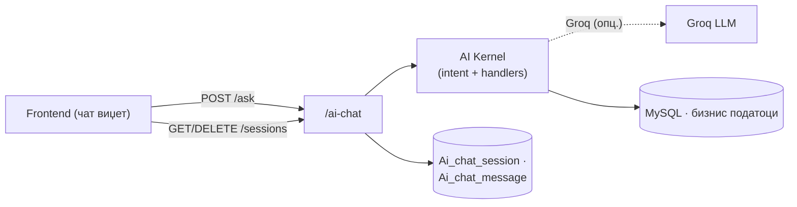
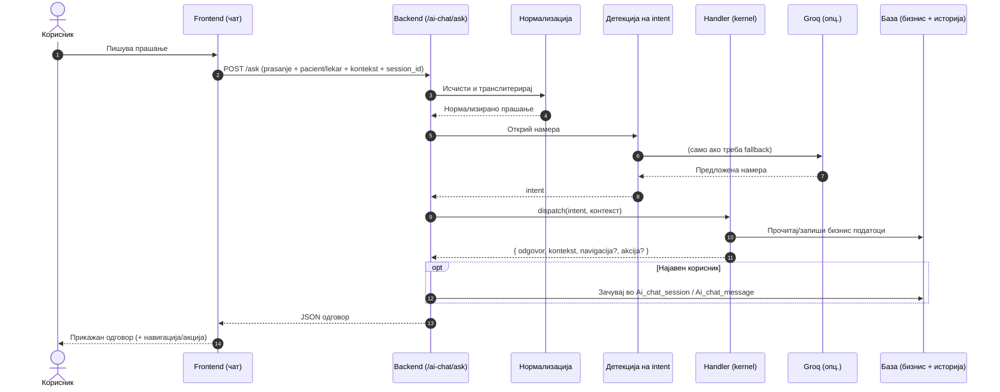

# AI Agent

AI асистентот на порталот не е одделна услуга, туку router во самата апликација — `backend/routers/ai_chat.py`, монтиран под префиксот `/ai-chat`. Тој функционира како оркестратор меѓу frontend-от и AI јадрото во`ai/_kernel/`. Прима влезот од корисникот, го нормализира, детектира намера (intent) од текстот, го пренасочува барањето до соодветен handler, и враќа веќе форматиран одговор назад кон frontend-от. За најавени корисници — пациент или лекар — разговорот не исчезнува штом се затвори прелистувачот. Се чува трајно во две табели, `Ai_chat_session` и `Ai_chat_message`, така што корисникот може да продолжи претходна сесија и да ја одржи истата контекстуална нишка дури и при следна посета на порталот.

> **Интерактивно тестирање:** секој endpoint е придружен со вграден **OpenAPI блок** и копче **„Test it"**, погонувано од Scalar. Пополни ги потребните параметри или тело на барањето и испрати го директно кон живиот сервер (`klinicka-bolnica-stip2026.onrender.com`) — без да ја напушташ документацијата.

> Овој документ ги опишува **HTTP endpoints**. За тоа како функционира самата AI логика (намери, улоги, Groq, handlers) види [AI асистент — преглед](../ai-assistant/overview.md) и [Kernel](../ai-assistant/kernel.md).

> Поврзани: [Конвенции](conventions.md) · [AI асистент](../ai-assistant/overview.md) · [Kernel](../ai-assistant/kernel.md) · [Преглед на backend](../pregled.md)

***

## 1. Преглед <a href="#id-1-pregled" id="id-1-pregled"></a>



| Метод    | Патека                            | Намена                                 | Пристап                   |
| -------- | --------------------------------- | -------------------------------------- | ------------------------- |
| `POST`   | `/ai-chat/ask`                    | Поставување прашање и добивање одговор | Сите (гостин или најавен) |
| `GET`    | `/ai-chat/sessions`               | Листа на претходни разговори           | Најавен                   |
| `GET`    | `/ai-chat/sessions/{id}/messages` | Пораки од една сесија                  | Најавен (сопственик)      |
| `DELETE` | `/ai-chat/sessions/{id}`          | Бришење на разговор                    | Најавен (сопственик)      |
| `POST`   | `/ai-chat/sessions/import-guest`  | Префрлање гостински разговор по најава | Најавен                   |

Сите барања и одговори се **JSON**. Историјата се чува **само** ако во барањето има најавен пациент (`pacient_ID`) или лекар (`doctor_ID`); гостинските разговори живеат само на frontend-от додека корисникот не се најави.

***

## 2. Како работи `/ask` <a href="#id-2-kako" id="id-2-kako"></a>

Главниот endpoint поминува низ четири последователни чекори пред да генерира одговор:

1. **Нормализација** — влезот се процесира преку `normaliziraj_prasanje()`: се тримува, се конвертира во мали букви и се транслитерира меѓу кирилица и латиница. Ова гарантира конзистентна детекција на намерата без оглед на тоа дали корисникот пишува на кирилица, латиница или комбинација од двете.
2. **Детекција на намера (intent)** — се извршува во два слоја. Прво се применува детекција базирана на клучни зборови и тековниот контекст на разговорот (на пр. ако претходната порака иницирала флоу за закажување, системот знае дека следната порака е дел од истиот флоу). Доколку намерата не може да се утврди со доволна сигурност, се повикува Groq API како fallback за инференција на природен јазик.
3. **Dispatch** — детектираната намера се мапира на конкретен handler во `ai/_kernel/handlers.py`. Секој handler е одговорен за точно еден тип на намера — на пр. `slobodni_termini`, `zakazi_termin`, `info_lekar`, `apliciraj_za_rabota`, `general`. Диспечерот го избира точниот handler и му го проследува контекстот.
4. **Зачувување** — за најавен корисник, целата размена (прашање, одговор и тековен контекст) се запишува во базата преку `Ai_chat_session` и `Ai_chat_message`, со што следната порака може да го продолжи разговорот точно од каде застанал.



> Полето **`kontekst`** е клучно: frontend-от го враќа во следното барање за да се продолжи мултиделниот флоу (на пр. избор на лекар → датум → потврда). Полињата **`navigacija`** и **`akcija`** му кажуваат на frontend-от да отвори страница или да изврши дејство (на пр. отвори форма за најава).

***

## 3. POST `/ai-chat/ask` <a href="#id-3-ask" id="id-3-ask"></a>

Сѐ што претходно беше документирано за модулот — оркестрацијата, детекцијата на намера, трајното чување на сесии — реално се случува зад овој единствен endpoint. `POST /ai-chat/ask` е главната, практично единствена влезна точка низ која корисникот поставува прашање до асистентот. Работи еднакво и за гостин, и за најавен пациент или лекар. Разликата е во персонализацијата — штом се проследат валидни податоци за пациент или лекар, одговорите земаат предвид кој точно прашува, а разговорот дополнително се зачувува за подоцна.

**Тело (JSON):**

```json
{
  "prasanje": "Кои лекари се на кардиологија?",
  "pacient": {
    "pacient_ID": 5,
    "ime": "Иван",
    "prezime": "Ивановски",
    "email": "ivan@example.com"
  },
  "lekar": null,
  "kontekst": null,
  "session_id": null
}
```

Телото на барањето носи неколку полиња со различна улога.

1. **prasanje е единственото задолжително поле**, ограничено на `4000 знаци`. **pacient и lekar се опционални** — кога се проследени со валиден ID, овозможуваат персонализација и пристап до историјата на корисникот. **kontekst** е исто опционален и претставува механизам за продолжување на разговор: клиентот го испраќа точно истиот објект добиен во претходниот одговор, без сам да мора да памти состојба на разговорот. session\_id, конечно, е опционален за гостин, но за најавен корисник, ако недостасува, backend-от сам креира нова сесија.

**Успешен одговор (200):**

```json
{
  "odgovor": "На одделот за кардиологија се: д-р Ана Стојановска, д-р Марко Петров…",
  "kontekst": { "last_oddel": "Кардиологија" },
  "session_id": 12,
  "navigacija": null,
  "akcija": null
}
```

Одговорот го носи генерираниот текст во odgovor, нов kontekst подготвен за следната порака во разговорот (или null, ако нема потреба од продолжување), и session\_id — истиот идентификатор испратен назад, така клиентот да знае со која сесија продолжува. Полињата navigacija и akcija се присутни само кога асистентот реално сака frontend-от да изврши конкретно дејство — на пример, да го пренасочи корисникот кон друга страница — и во повеќето одговори остануваат null.

> Endpoint-от секогаш враќа 200 — дури и при празно прашање или внатрешна грешка, одговорот содржи учтива порака во odgovor, без HTTP грешка. Целта е чисто UX: чат интерфејс не треба да прекине разговор или да прикаже технички error toast само затоа што едно барање не успеало.

**Каде се користи:** На frontend страна, чат виџетот во script.js го повикува овој endpoint на секоја испратена порака, преку константата AI\_CHAT\_BASE + "/ask". Бидејќи одговорот секогаш стигнува со статус 200, виџетот не мора посебно да обработува грешки на ниво на HTTP — целата логика за приказ се сведува на читање на полето odgovor и, опционално, реагирање на navigacija или akcija.

**Имплементација (FastAPI):**

```python
@router.post("/ask")
def ask(data: PitanjeModel):   # Pydantic модел — не Request
    pitanje_norm = normaliziraj_prasanje(pitanje)
    intent = _resolve_intent(pitanje_norm, kontekst, pacient, lekar)   # keywords + Groq fallback
    rez = dispatch(intent, AiContext(...))   # ai/_kernel/handlers.py
    if history_enabled: save_exchange(session_id, ...)   # Ai_chat_session / Ai_chat_message
    return {"odgovor": rez["odgovor"], "kontekst": rez["kontekst"], "session_id": ..., ...}
```

* Овој endpoint е единствениот во целата апликација што директно повикува AI јадрото — секој handler внатре во dispatch() чита и пишува директно во MySQL (термини, лекари, огласи, и друго), во зависност од детектираната намера. Самата детекција на намера комбинира два пристапи: брзо совпаѓање по клучни зборови, со fallback кон Groq, надворешен LLM провајдер, кога едноставниот keyword-пристап не е доволен за да се разбере прашањето.


[OpenAPI KlinickaBolnicaAPI](https://klinicka-bolnica-stip2026.onrender.com/openapi.json)


***

## 4. GET `/ai-chat/sessions` <a href="#id-4-sessions" id="id-4-sessions"></a>

Откако разговор веќе еднаш е зачуван во `Ai_chat_session`, овој endpoint е начинот на кој корисникот подоцна може да се врати кон него. Враќа листа на претходни разговори за најавен корисник — пациент или лекар — подредени по последна активност, не по датум на креирање, токму за да најскоро користената сесија секогаш биде на врвот. Сопственството на сесиите се проверува преку query параметри, не преку тело на барањето, бидејќи ова е GET. Потребен е барем еден од `pacient_id` или `doctor_id` — двата истовремено не се очекуваат, бидејќи една сесија логично припаѓа на еден тип корисник. Доколку ниту еден не е проследен, backend-от нема начин да знае чии разговори да врати, па барањето се одбива со `400`.

**Query параметри:** `pacient_id` **или** `doctor_id` (потребен е барем еден)

**Успешен одговор (200):**

```json
{
  "sessions": [
    {
      "session_id": 12,
      "naslov": "Кардиологија — лекари",
      "created_at": "2026-06-14 19:30:00",
      "updated_at": "2026-06-14 19:42:00"
    }
  ]
}
```

**Можни грешки:**

* `400` (нема `pacient_id` ниту `doctor_id`)

**Каде се користи:** Без оваа листа, секој разговор во чат виџетот би морал секогаш да започнува од почеток — корисникот нема друг начин да дознае кои `session_id` вредности воопшто постојат за него. Затоа `script.js` го повикува овој endpoint штом корисникот отвора преглед на претходни разговори, наместо да започне нов. Откако избере конкретна сесија од листата, нејзиниот `session_id` патува заедно со следното прашање кон `POST /ai-chat/ask`, и разговорот продолжува токму од таму каде застанал.

**Имплементација (FastAPI):**

```python
@router.get("/sessions")
def get_chat_sessions(pacient_id: int | None = Query(None), doctor_id: int | None = Query(None)):
    if not pacient_id and not doctor_id:
        raise HTTPException(400, "Потребен е pacient_id или doctor_id.")
    rows = list_sessions(pacient_id=pacient_id, doctor_id=doctor_id)   # ai_chat_store.py
    return {"sessions": [{"session_id": ..., "naslov": ..., "created_at": ..., "updated_at": ...} for r in rows]}
```

* Самото читање е делегирано на `list_sessions()` во `ai_chat_store.py` — router-от само проверува дека постои барем еден сопственички идентификатор и форматира резултат, без сам да гради SQL барање.


[OpenAPI KlinickaBolnicaAPI](https://klinicka-bolnica-stip2026.onrender.com/openapi.json)


***

## 5. GET `/ai-chat/sessions/{session_id}/messages` <a href="#id-5-messages" id="id-5-messages"></a>

`GET /ai-chat/sessions` враќа само **метаподатоци за секоја сесија** — наслов, датуми, идентификатор — без самата содржина на разговорот. Откако корисникот избере конкретна сесија од таа листа, овој endpoint е чекорот што всушност ја враќа целата историја: секоја порака во таа сесија, и онаа испратена од корисникот, и онаа добиена од асистентот, заедно со зачуваниот kontekst, точно онаков каков бил при последната размена.

Сопственоста се проверува на истиот начин како кај `GET /ai-chat/sessions` — преку `pacient_id` или `doctor_id` во query, не во телото на барањето. Доколку ниту еден не е проследен, барањето се одбива со `400`, уште пред да се пристапи до базата. Доколку сесијата со дадениот `session_id` не постои, или постои но припаѓа на друг корисник, резултатот е истиот: `404`. Двата случаи намерно не се разликуваат — да се потврди дека одреден `session_id` воопшто постои некому што не е негов сопственик, само по себе би било информација која не треба да се открие.

**Path параметар:** `session_id` · **Query:** `pacient_id` или `doctor_id` (сопственик)

**Успешен одговор (200):**

```json
{
  "session_id": 12,
  "kontekst": { "last_oddel": "Кардиологија" },
  "messages": [
    { "uloga": "user", "sodrzina": "Кои лекари се на кардиологија?", "navigacija": null, "akcija": null, "created_at": "2026-06-14 19:30:00" },
    { "uloga": "assistant", "sodrzina": "На одделот за кардиологија се…", "navigacija": null, "akcija": null, "created_at": "2026-06-14 19:30:01" }
  ]
}
```

**Можни грешки:**

* `400` (нема pacient\_id ниту doctor\_id)
* `404` (сесијата не е пронајдена или не припаѓа на проследениот сопственик)

**Каде се користи:** Чекор по `GET /ai-chat/sessions` — штом корисникот кликне на конкретен разговор од листата, `script.js` го повикува овој endpoint за да ги добие сите пораки и да ги исцрта во чат прозорецот, истo како да разговорот никогаш не бил прекинат. Полето kontekst од одговорот го заменува секое локално чувано состојание на frontend-от и се испраќа заедно со следното прашање кон `POST /ai-chat/ask`, за да продолжувањето биде идентично на живо воден разговор.

**Имплементација (FastAPI):**

```python
@router.get("/sessions/{session_id}/messages")
def get_chat_messages(session_id: int, pacient_id=Query(None), doctor_id=Query(None)):
    if not pacient_id and not doctor_id: raise HTTPException(400, ...)
    data = get_session_messages(session_id, pacient_id=pacient_id, doctor_id=doctor_id)
    if not data: raise HTTPException(404, "Разговорот не е пронајден.")
    return {"session_id": ..., "kontekst": data["kontekst"], "messages": [...]}
```

* `get_session_messages()` го врши и проверката на сопственост, и пребарувањето, во едно: враќа празен резултат и кога сесијата не постои, и кога постои но `pacient_id/doctor_id` не се совпаѓаат со зачуваниот сопственик — а router-от секогаш тоа го преведува во истиот 404, без да открие која од двете причини всушност важи. Полињата на секоја порака (uloga, sodrzina, navigacija, akcija) одговараат на структурата на одговорот од `POST /ai-chat/ask`, со таа разлика што таму асистентовиот текст стои под odgovor, а тука, веднаш по зачувувањето, под sodrzina — истата содржина, само преименувана за да се вклопи во еднообразен формат на порака, без оглед дали потекнува од корисник или од асистент.


[OpenAPI KlinickaBolnicaAPI](https://klinicka-bolnica-stip2026.onrender.com/openapi.json)


***

## 6. DELETE `/ai-chat/sessions/{session_id}` <a href="#id-6-delete" id="id-6-delete"></a>

Со ова се затвора кругот на животниот циклус на една сесија: создавање (имплицитно, преку `POST /ai-chat/ask`), преглед на листата (`GET /ai-chat/sessions`), читање на целата содржина (`GET /ai-chat/sessions/{session_id}/messages`), и конечно, отстранување.

`DELETE /ai-chat/sessions/{session_id}` трајно ja брише сесијата заедно со сите нејзини пораки — нема механизам за враќање или „корпа" со избришани разговори.

Проверката на сопственост е истоветна со претходните две точки: потребен е `pacient_id` или `doctor_id` во query, а `delete_session()` брише само ако тој идентификатор се совпаѓа со сопственикот на сесијата. Доколку сесијата не постои, или постои но не припаѓа на проследениот корисник, функцијата враќа False во двата случаи, а router-от тоа го преведува во истиот `404` — без да открие која од двете причини точно се однесува.

**Path параметар:** `session_id` · **Query:** `pacient_id` или `doctor_id`

**Успешен одговор (200):** `{ "ok": true, "session_id": 12 }`

**Можни грешки:**

* 400 (нема pacient\_id ниту doctor\_id)
* 404 (сесијата не е пронајдена или не припаѓа на проследениот сопственик)

**Каде се користи:** Во прегледот на претходни разговори во `script.js`, секоја ставка од листата носи копче за бришење, кликот директно повикува овој endpoint, а по успешен одговор ставката се отстранува од интерфејсот без повторно вчитување на целата листа. Вреди да се напомене: самиот DELETE е идемпотентен по краен резултат — сесијата останува избришана колку пати и да се повтори барањето — но одговорот не е идентичен при повторување. Првото барање враќа 200, секое следно за истиот session\_id враќа 404, бидејќи редот веќе не постои во базата.

**Имплементација (FastAPI):**

```python
@router.delete("/sessions/{session_id}")
def delete_chat_session(session_id: int, pacient_id=Query(None), doctor_id=Query(None)):
    if not pacient_id and not doctor_id: raise HTTPException(400, ...)
    if not delete_session(session_id, pacient_id=pacient_id, doctor_id=doctor_id):
        raise HTTPException(404, "Разговорот не е пронајден.")
    return {"ok": True, "session_id": session_id}
```

* `delete_session()` враќа едноставна bool вредност, со проверката на сопственост вградена во самото `DELETE SQL` барање (по `session_id` И сопственик одеднаш), наместо прво да се прочита редот, па одделно да се потврди сопственикот. Router-от само го преведува резултатот во соодветен HTTP статус, без сам да гради условна логика.


[OpenAPI KlinickaBolnicaAPI](https://klinicka-bolnica-stip2026.onrender.com/openapi.json)


***

## 7. POST `/ai-chat/sessions/import-guest` <a href="#id-7-import" id="id-7-import"></a>

На почетокот на овој модул беше истакнато: разговор се чува трајно само за најавен корисник, додека гостин нема таква привилегија — за него постои само `kontekst` што патува напред-назад со секој одговор. Но што се случува кога гостин веќе разменил неколку пораки, а потоа во истата сесија се најави? Без овој endpoint, целата дотогашна размена би пропаднала, бидејќи backend-от дотогаш немал причина да ја зачува. `POST /ai-chat/sessions/import-guest` го решава токму тоа: ги прима пораките собрани додека корисникот сѐ уште бил гостин и ги пресели во нова, трајна сесија, врзана за неговиот, веќе познат, налог. За разлика од претходните три точки, каде сопственоста се потврдувала преку едноставни `pacient_id/doctor_id` query параметри, тука телото на барањето носи целосен `pacient` или `lekar објект`. Helper-от `_owner_ids()` од нив ги извлекува соодветните идентификатори. Доколку ниту еден не е проследен, барањето се одбива со `400`, бидејќи нема кому да се припише новата сесија. Пред запис, секоја порака со празна sodrzina (по .strip()) се отфрла — гостинскиот разговор честопати содржи и непотполни или ненаменски испратени пораки, кои не треба да завршат во трајната историја. **Тело (JSON):**

```json
{
  "pacient": { "pacient_ID": 5, "email": "ivan@example.com" },
  "lekar": null,
  "messages": [
    { "uloga": "user", "sodrzina": "Здраво" },
    { "uloga": "assistant", "sodrzina": "Здраво! Како можам да помогнам?" }
  ],
  "kontekst": null
}
```

> Забелешка: пораките во ова тело носат само uloga и sodrzina — за разлика од записите враќани преку `GET /ai-chat/sessions/{session_id}/messages`, нема created\_at за секоја поединечна порака. Гостинската размена никогаш не била тајмстампирана, па при увоз сите пораки добиваат блиски, секвенцијални временски ознаки во моментот на самиот увоз, не во моментот на оригиналното испраќање.

**Успешен одговор (200):**

```json
{ "session_id": 13, "kontekst": null, "imported": 2 }
```

> Бројот во imported го одразува конечниот број зачувани пораки, по отфрлањето на празните — frontend-от може да го спореди со должината на испратената листа за да потврди дека ништо неочекувано не недостасува.

**Можни грешки:**

* `400` (нема најавен пациент/лекар)
* `500` (неуспешно зачувување)

**Каде се користи:** Сценариото е следно: корисник отвора чат виџет без да е најавен, разменува неколку пораки, а потоа, во истата посета, се најавува преку пациентскиот или лекарскиот портал. z `script.js`, кој до тој момент целата размена ја чувал само во меморија на страницата (заедно со последниот kontekst), на тој момент го повикува овој endpoint еднаш, проследувајќи ја сега познатата идентичност. Добиениот `session_id` од тука натаму се користи во секој следен повик кон `POST /ai-chat/ask` — разговорот продолжува трајно зачуван, а корисникот не мора да го повтори ништо од тоа што веќе го кажал како гостин.

**Имплементација (FastAPI):**

```python
@router.post("/sessions/import-guest")
def import_guest_chat(data: GuestImportModel):
    pacient_id, doctor_id = _owner_ids(...)
    if not pacient_id and not doctor_id: raise HTTPException(400, "Потребен е најавен пациент или лекар.")
    msgs = [{"uloga": ..., "sodrzina": ...} for m in data.messages if m.sodrzina.strip()]
    sid = import_guest_session(pacient_id=pacient_id, doctor_id=doctor_id, messages=msgs, kontekst=...)
    if not sid: raise HTTPException(500, "Не успеав да ја зачувам сесијата.")
    return {"session_id": sid, "kontekst": data.kontekst, "imported": len(msgs)}
```

* За разлика од `check_admin_access()`, кој во останатиот дел на API-то проверува дали постоечки сопственик има право на пристап, `_owner_ids()` тука нема што да проверува — сесијата сѐ уште не постои, само се одредува на кој идентитет ја припиша штом се создаде. Самото создавање и запишувањето на сите пораки се случуваат во еден повик кон `import_guest_session()`, наместо прво да се отвори празна сесија, па одделно да се додаваат пораките една по една.


[OpenAPI KlinickaBolnicaAPI](https://klinicka-bolnica-stip2026.onrender.com/openapi.json)


***

## 8. Поврзани табели <a href="#id-8-tabele" id="id-8-tabele"></a>

| Табела            | Улога                                                                       |
| ----------------- | --------------------------------------------------------------------------- |
| `Ai_chat_session` | Сесии (разговори) со наслов и временски ознаки                              |
| `Ai_chat_message` | Поединечни пораки (улога, содржина, навигација, акција)                     |
| Бизнис табели     | Се читаат/запишуваат од handlers според намерата (термини, лекари, огласи…) |

Логиката за чување е во `ai_chat_store.py`; самите handlers се во `ai/_kernel/`. За детали: [AI асистент](../ai-assistant/overview.md) · [Kernel](../ai-assistant/kernel.md).

***

Следно: [Конвенции](conventions.md) · [AI асистент](../ai-assistant/overview.md)
