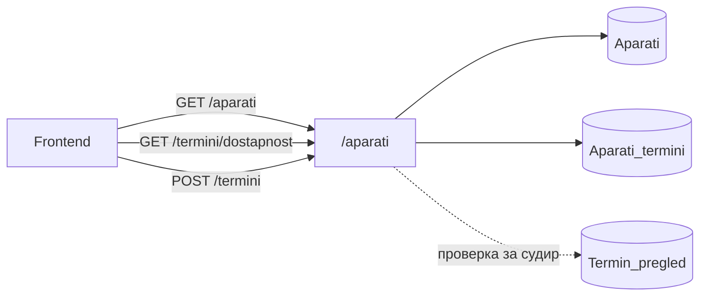
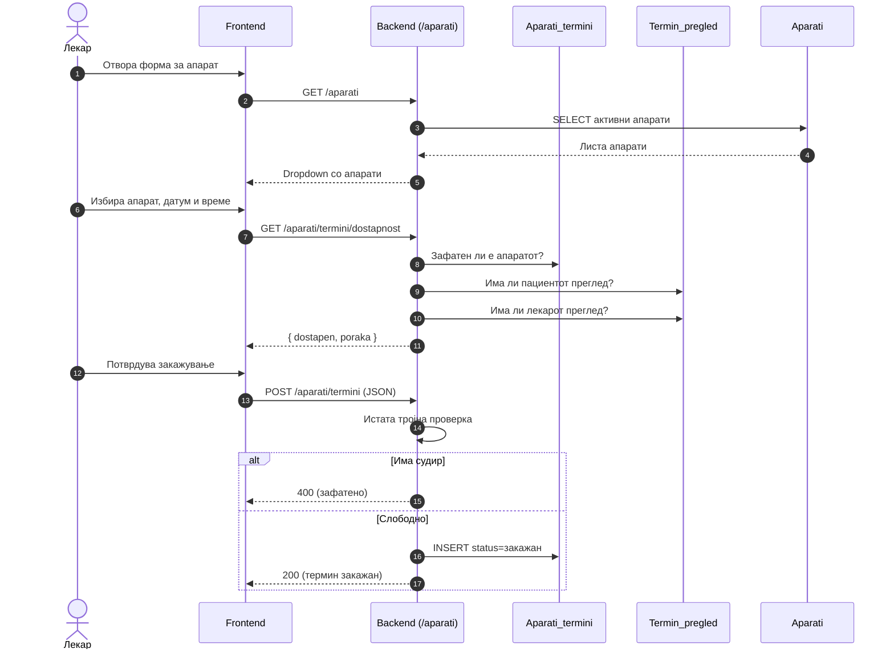

# Апарати

Модулот за **медицински апарати** е дефиниран во `backend/routers/aparati.py` и достапен под префиксот `/aparati`. Покрива три клучни операции: листање на активни апарати, проверка на достапност за конкретен термин и закажување на апарат од страна на лекар.
Централниот механизам на овој модул е **тројната проверка на конфликти** која се извршува пред секое закажување. Backend-от паралелно ги проверува и трите засегнати страни:

- дали **апаратот** е слободен во бараниот термин (`Aparati_termini`);
- дали **пациентот** нема друг закажан преглед или апаратски термин во тоа време (`Termin_pregled`);
- дали **лекарот** нема преклопување со друг преглед или апаратски термин (`Termin_pregled` + `Aparati_termini`).

Само ако и трите проверки поминат без конфликт, терминот се зачувува — со што се гарантира целосна синхронизација меѓу календарот за прегледи и календарот за апарати.

> **Интерактивно тестирање:** секој endpoint е придружен со вграден **OpenAPI блок** и копче **„Test it"**, погонувано од Scalar. Пополни ги потребните параметри или тело на барањето и испрати го директно кон живиот сервер (`klinicka-bolnica-stip2026.onrender.com`) — без да ја напушташ документацијата.

## Содржина

* [1. Преглед](aparati.md#1-pregled)
* [2. Тројна синхронизација](aparati.md#2-sinhronizacija)
* [3. GET `/aparati`](aparati.md#3-lista)
* [4. GET `/aparati/termini/dostapnost`](aparati.md#4-dostapnost)
* [5. POST `/aparati/termini`](aparati.md#5-zakazi)
* [6. Поврзани табели](aparati.md#6-tabele)

> Поврзани: [Конвенции](conventions.md) · [Термини](termini.md) · [Лекари](lekari.md) · [База на податоци](../the_database.md) · [Преглед на backend](../pregled.md)

***

## 1. Преглед <a href="#id-1-pregled" id="id-1-pregled"></a>



| Метод | Патека | Намена |
|-------|--------|--------|
| `GET` | `/aparati` | Листа на сите активни апарати кој болницата ги има на располагање |
| `GET` | `/aparati/termini/dostapnost` | Проверка дали апаратот е слободен за избран датум/време |
| `POST` | `/aparati/termini` | Закажување термин на апарат |

### Тек на податоци — од избор до закажан апарат

Дијаграмот го прикажува целиот тек: листање апарати, проверка на достапност во живо додека корисникот избира, и финално закажување со тројната проверка на судири.



Сите барања што менуваат податоци се **JSON**. Грешките се враќаат како `{"detail": "порака"}` со соодветен статус.

***

## 2. Тројна синхронизација <a href="#id-2-sinhronizacija" id="id-2-sinhronizacija"></a>

Пред секое закажување, backend-от извршува **три независни проверки** за бараниот датум и час — секоја насочена кон различна засегната страна:

1. **Апарат** — `SELECT` врз `Aparati_termini` со `WHERE aparat = ? AND datum_vreme = ? AND status != 'откажан'`. Ако постои запис, апаратот е зафатен.
2. **Пациент** — `SELECT` врз `Termin_pregled` со `WHERE pacient = ? AND datum_vreme = ? AND status = 'закажан'`. Ако постои запис, пациентот има преклопување.
3. **Лекар** — `SELECT` врз `Termin_pregled` со `WHERE lekar_id = ? AND datum_vreme = ? AND status = 'закажан'`. Ако постои запис, лекарот е зафатен.

Проверките се извршуваат секвенцијално — при прв пронајден конфликт, закажувањето се одбива со `400` и порака која прецизно укажува на тоа кој ресурс е зафатен. Ова гарантира дека еден лекар, пациент или апарат **не може да биде резервиран на две места во исто време**.

***

## 3. GET `/aparati` <a href="#id-3-lista" id="id-3-lista"></a>

Извршува `SELECT` врз табелата `Aparati` со `WHERE aktiven = TRUE`, сортиран по ime на апаратот. Враќа само активни апарати — деактивираните се скриени од frontend-от и не можат да се закажат.
Endpoint-от е имплементиран со вградена робусност: доколку табелата `Aparati` сè уште не постои во базата или се јави SQL грешка при извршувањето, наместо `500` се враќа празна листа `[]`. Ова овозможува системот да функционира нормално во рана фаза на деплојмент, пред апаратите да бидат внесени во базата, без да предизвика грешки на frontend-от.

**Параметри:** нема.

**Успешен одговор (200):**

```json
[
  { "aparat_id": 1, "ime": "Магнетна резонанца (MRI)", "opis": "1.5T MRI скенер", "kod": "mri" },
  { "aparat_id": 2, "ime": "Компјутерска томографија (CT)", "opis": "64-слоен CT", "kod": "kt" }
]
```

**Можни грешки:** нема, при грешка враќа `[]` 

**Каде се користи:** frontend — `script.js` (dropdown апарати во лекарскиот панел).

**Имплементација (FastAPI):**

```python
@router.get("")
def get_aparati():
    db_cursor.execute("""
        SELECT aparat_id, ime, opis, kod FROM Aparati
        WHERE aktiven = TRUE ORDER BY ime
    """)
    return db_cursor.fetchall()
    # except: return []   # ако табелата не постои — празна листа наместо 500
```

- При SQL грешка (на пр. табелата уште не постои) endpoint-от враќа `[]` — frontend не паѓа при ран deploy.


[OpenAPI KlinickaBolnicaAPI](https://klinicka-bolnica-stip2026.onrender.com/openapi.json)


***

## 4. GET `/aparati/termini/dostapnost` <a href="#id-4-dostapnost" id="id-4-dostapnost"></a>

Извршува проверка на достапност за конкретен апарат, датум и час — без да создава запис во базата. Наменет за повикување во живо додека корисникот ги пополнува полињата на формата, со цел да добие моментална повратна информација пред да го поднесе барањето за закажување.
Endpoint-от поддржува прогресивна проверка: со минимален сет на параметри (`aparat`, `datum`, `vreme`) се проверува само достапноста на апаратот. Со додавање на `lekar_id` и/или `pacient_ime` + `pacient_prezime`, проверката автоматски се проширува и ги вклучува конфликтите за лекарот и пациентот — истата тројна логика како при закажување, но без запис.

**Query параметри:**

- `aparat` *(задолжителен)* — код на апаратот (на пр. `mri`, `kt`)
- `datum` *(задолжителен)* — формат `YYYY-MM-DD`
- `vreme` *(задолжителен)* — формат `HH:MM`
- `lekar_id` *(опционален)* — ако е проследен, се проверува и достапноста на лекарот
- `pacient_ime`, `pacient_prezime` *(опционални)* — ако се проследени, се проверува и достапноста на пациентот

```
GET /aparati/termini/dostapnost?aparat=mri&datum=2026-06-20&vreme=10:00&lekar_id=2
```

**Успешен одговор (200):**

```json
{ "dostapen": true, "poraka": "Апаратот е достапен" }
```
Доколку има судир, `dostapen` е `false`, а `poraka` ги набројува причините (на пр. „Апаратот е зафатен…; Лекарот има закажан преглед…").

**Можни грешки:** `400` (недостасуваат параметри или лош формат) · `500` грешка на серверска страна.

**Каде се користи:** frontend — `script.js` (live проверка додека лекарот пополнува форма).

**Имплементација (FastAPI):**

```python
@router.get("/termini/dostapnost")
def check_aparat_dostapnost(aparat: str, datum: str, vreme: str,
                            lekar_id: int | None = None, pacient_ime: str | None = None, ...):
    # 1) Aparati_termini — дали апаратот е зафатен
    # 2) Termin_pregled — дали пациентот има преглед (ако се дадени ime/prezime)
    # 3) Termin_pregled — дали лекарот има преглед (ако е даден lekar_id)
    return {"dostapen": count == 0 and ..., "poraka": "; ".join(poraki) or "Апаратот е достапен"}
```

- Истата тројна логика како при `POST /termini`, но **без INSERT** — само проверка за UI feedback.


[OpenAPI KlinickaBolnicaAPI](https://klinicka-bolnica-stip2026.onrender.com/openapi.json)


***

## 5. POST `/aparati/termini` <a href="#id-5-zakazi" id="id-5-zakazi"></a>

**Закажување термин на апарат.** Лекарот закажува користење на апарат за пациент, со опис за причината. Пред зачувување, backend-от ја повторува [тројната проверка](aparati.md#2-sinhronizacija) и потврдува дека лекарот постои.

**Тело (JSON):**

```json
{
  "lekar_id": 2,
  "lekar_ime": "Ана Стојановска",
  "pacient_ime": "Иван",
  "pacient_prezime": "Ивановски",
  "aparat": "mri",
  "aparat_ime": "Магнетна резонанца (MRI)",
  "datum_vreme": "2026-06-20T10:00",
  "opis": "Сомнеж за повреда на колено"
}
```

* Задолжителни: `lekar_id`, `pacient_ime`, `pacient_prezime`, `aparat`, `datum_vreme`, `opis`
* `datum_vreme` — ISO формат `YYYY-MM-DDTHH:MM`
* `aparat` — код на апаратот (краток, на пр. `mri`); `aparat_ime` е опционален приказен назив

**Успешен одговор (200):**

```json
{ "message": "Терминот за апарат е успешно закажан!", "termin_id": 12 }
```

**Можни грешки:** `400` (недостасуваат полиња, лош формат, или судир со апарат/пациент/лекар) · `404` (лекар не постои) · `500`

**Каде се користи:** frontend — `script.js` (форма за закажување апарат од лекарски панел).

**Имплементација (FastAPI):**

```python
@router.post("/termini")
async def create_aparat_termin(request: Request):
    data = await request.json()
    dt = datetime.strptime(datum_vreme, "%Y-%m-%dT%H:%M")
    # тројна проверка: Aparati_termini + Termin_pregled (пациент) + Termin_pregled (лекар)
    if conflict: raise HTTPException(400, "Апаратот/пациентот/лекарот е зафатен...")
    db_cursor.execute("INSERT INTO Aparati_termini (...) VALUES (%s, ...)", (...))
    conn.commit()
    return {"message": "Терминот за апарат е успешно закажан!", "termin_id": db_cursor.lastrowid}
```

- `datum_vreme` во ISO формат `YYYY-MM-DDTHH:MM`; записот оди во `Aparati_termini` (паралелен календар на `Termin_pregled`).


[OpenAPI KlinickaBolnicaAPI](https://klinicka-bolnica-stip2026.onrender.com/openapi.json)


***

## 6. Поврзани табели <a href="#id-6-tabele" id="id-6-tabele"></a>

| Табела            | Улога                                                       |
| ----------------- | ----------------------------------------------------------- |
| `Aparati`         | Каталог на апарати (`ime`, `opis`, `kod`, `aktiven`)        |
| `Aparati_termini` | Закажани термини за апарати (паралелен календар)            |
| `Termin_pregled`  | Прегледи — се проверува за судир со лекар/пациент           |
| `Doctors`         | Потврда дека лекарот постои при закажување                  |

> Календарите за **прегледи и апарати се синхронизирани** — закажан апарат блокира соодветен слот и обратно. Види и [Термини](termini.md#2-pravila).

Детали за колони и врски: [База на податоци](../the_database.md).

***

Следно: [AI чат](ai-chat.md) · [Конвенции](conventions.md)
