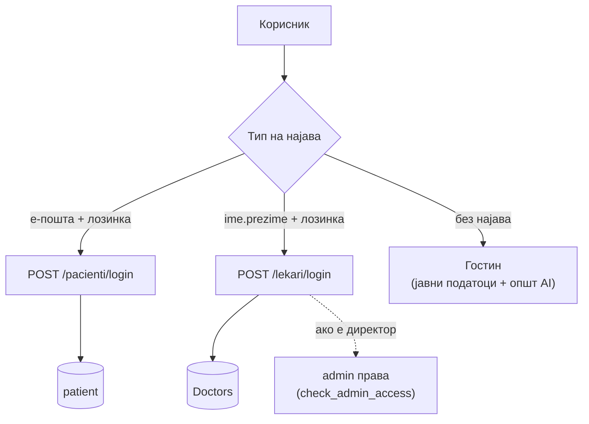
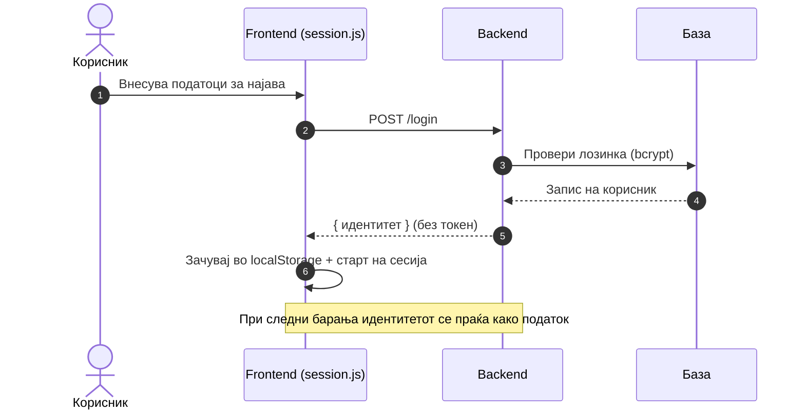
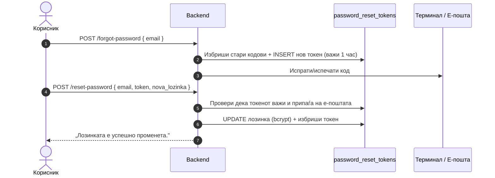

# Автентикација

Автентикацијата во системот е поделена по **улоги** — пациент, лекар и директор (администрација) — секоја со свој начин на најава и свои правила. Оваа страница ги собира сите автентикациски механизми на едно место: како се најавува секоја улога, како се чуваат и проверуваат лозинките, како функционира заборавена лозинка, како се одржуваат сесиите и каде се проверуваат правата на пристап.

> Поединечните endpoints (со примери за барања/одговори и интерактивно тестирање) се документирани во [Лекари](lekari.md) и [Пациенти](pacienti.md). Оваа страница го објаснува **поширокиот модел** што ги поврзува.

> Поврзани: [Конвенции](conventions.md) · [Лекари](lekari.md) · [Пациенти](pacienti.md) · [Администрација](admin.md) · [Преглед на системот → Безбедност](../../overview_na_sisitemot/overview.md)

***

## 1. Преглед <a href="#id-1-pregled" id="id-1-pregled"></a>

Системот разликува **три најавени улоги** и една ненајавена:

| Улога        | Како се најавува                          | Креирана од                   |
| ------------ | ----------------------------------------- | ----------------------------- |
| **Пациент**  | е-пошта + лозинка                         | Самостојна регистрација       |
| **Лекар**    | корисничко име (`ime.prezime`) + лозинка  | Администрација / регистрација |
| **Директор** | како лекар; правата се проверуваат по име | Постоечки запис во `Doctors`  |
| **Гостин**   | без најава                                | —                             |



***

## 2. Модел на автентикација <a href="#id-2-model" id="id-2-model"></a>

Системот користи **едноставен модел без серверски сесии или JWT токени**. Backend-от не чува состојба за најавени корисници — наместо тоа:

1. При најава, backend-от ги проверува податоците и враќа **објект со идентитетот** на корисникот (на пр. `pacient_ID`, `doctor_ID`, име, е-пошта).
2. Frontend-от го чува тој објект во **`localStorage`** и го раководи траењето на најавата преку `session.js`.
3. За дејства што бараат идентитет или права, frontend-от го **проследува идентификаторот** во барањето (на пр. `admin_doctor_id`, `pacient_id`), а backend-от го проверува по потреба.



> Ова е намерно едноставен пристап соодветен за обемот на проектот. Последиците за безбедност се опишани во [секција 10](authentication.md#10-bezbednost).

***

## 3. Улоги и пристап <a href="#id-3-ulogi" id="id-3-ulogi"></a>

| Улога        | Може да пристапи до                                                                    |
| ------------ | -------------------------------------------------------------------------------------- |
| **Гостин**   | Јавни податоци: лекари, оддели, услуги, новости, општ AI асистент                      |
| **Пациент**  | Свое досие, закажување/откажување/пренос на термини, оценување, AI (пациент)           |
| **Лекар**    | Свој распоред, картони и историја на пациенти, дијагноза/терапија, апарати, AI (лекар) |
| **Директор** | Сè како лекар + администрација: новости, огласи, дежурства, статистики                 |

> **Контрола по улога:** пациент нема пристап до лекарски функции и обратно. Административниот таб е видлив **само** за директорот. Сопственоста на податоци (на пр. оцена на преглед) се проверува на backend — пациент може да менува само **свои** записи.

***

## 4. Пациент <a href="#id-4-pacient" id="id-4-pacient"></a>

Пациентот се **регистрира самостојно** и се најавува со **е-пошта и лозинка**.

| Метод  | Патека                      | Намена                      |
| ------ | --------------------------- | --------------------------- |
| `POST` | `/pacienti/register`        | Нова регистрација           |
| `POST` | `/pacienti/login`           | Најава со е-пошта + лозинка |
| `POST` | `/pacienti/forgot-password` | Барање код за ресет         |
| `POST` | `/pacienti/reset-password`  | Нова лозинка со код         |

При најава, е-поштата се нормализира (`strip().lower()`) и се бара во табелата `patient`. Лозинката се проверува против хешираната вредност. При погрешни податоци се враќа `401` со порака: _„Внесена е невалидна електронска пошта или лозинка."_

**Правила за регистрација (валидација во кодот):**

| Поле         | Правило                                             |
| ------------ | --------------------------------------------------- |
| Име, презиме | Задолжителни                                        |
| Е-пошта      | Мора да содржи `@` и валиден домен; **единствена**  |
| Лозинка      | Минимум **8 карактери**; се чува хеширана           |
| Телефон      | Опционален; се чисти на цифри и `+`, макс. 20 знаци |
| ЕМБГ         | Точно **13 цифри**; **единствен**                   |

> Деталите за секој endpoint (тела, одговори, кодови на грешки) се во [Пациенти](pacienti.md).

***

## 5. Лекар <a href="#id-5-lekar" id="id-5-lekar"></a>

Лекарот **не се најавува со е-пошта**, туку со **корисничко име во формат `ime.prezime`** на латиница, пресметано од кириличните име и презиме во базата преку `transliterate_mk_to_lat()`.

```
„Ана Стојановска"  →  корисничко име:  ana.stojanovska
```

Бидејќи различни луѓе пишуваат различно, најавата прифаќа и **толерантни варијации** на корисничкото име (на пр. `sh`↔`s`, `zh`↔`z`, `ch`↔`c`, и мали разлики во презимето). Така лекар запишан како `ushinov` може да се најави и како `usinov`.

| Метод   | Патека                    | Намена                                                  |
| ------- | ------------------------- | ------------------------------------------------------- |
| `POST`  | `/lekari/login`           | Најава — враќа профил, термини и `must_change_password` |
| `PATCH` | `/lekari/promeni-lozinka` | Смена на лозинка за најавен лекар                       |
| `POST`  | `/lekari/forgot-password` | Иницирање ресет (код на е-пошта)                        |
| `POST`  | `/lekari/reset-password`  | Нова лозинка со код                                     |

### Привремена лозинка и задолжителна промена

Сите нови лекари добиваат иста **привремена лозинка** (`Test123..`). При најава, backend-от проверува дали тековната лозинка е сè уште привремената и го враќа полето:

```json
{ "must_change_password": true }
```

Ако е `true`, frontend-от го принудува лекарот да ја смени лозинката пред да продолжи. По успешна промена, во базата `must_change_password` се поставува на `0`.

### Правила за нова лозинка на лекар

За разлика од пациентите, лекарите имаат построги правила (`_validna_lozinka_lekar`):

* минимум **8 карактери**;
* барем една **голема буква**;
* барем еден **број**;
* барем еден **интерпункциски знак**;
* **не смее** да биде привремената лозинка `Test123..`.

> Деталите за секој endpoint се во [Лекари](lekari.md).

***

## 6. Директор / Администрација <a href="#id-6-direktor" id="id-6-direktor"></a>

Не постои посебна најава за директор — тој се најавува **како лекар**. Административните права се проверуваат со функцијата `check_admin_access(doctor_id)` во `admin.py`, која враќа `True` само ако лекарот со даденото ID е директорот на болницата (по име).

```python
# backend/routers/admin.py
def check_admin_access(doctor_id: int) -> bool:
    # чита name + surname од Doctors и проверува дали е директорот
    # (точно име + толерантни варијации поради транслитерација)
    ...
```

Секое административно барање **мора да го проследи** идентификаторот на директорот:

* во **JSON телото** како `admin_doctor_id` (за `POST` / `PATCH`);
* како **query параметар** `admin_doctor_id` (за `GET` / `DELETE`).

Ако недостасува или не припаѓа на директорот, се враќа `403` (Forbidden).

> Така administraciskite endpoints (дежурства, огласи, статистики) се заштитени иако нема серверски сесии. Деталите се во [Администрација](admin.md).

***

## 7. Лозинки (bcrypt) <a href="#id-7-lozinki" id="id-7-lozinki"></a>

Лозинките **никогаш** не се чуваат како чист текст. Хеширањето и проверката се во `password_utils.py`:

```python
# backend/password_utils.py
def hash_password(plain: str) -> str:
    return bcrypt.hashpw(plain.encode("utf-8"), bcrypt.gensalt()).decode("utf-8")

def verify_password(plain: str, stored) -> bool:
    # bcrypt хеш започнува со $2b$ / $2a$ и е долг ~60 знаци
    if stored.startswith("$2") and len(stored) > 50:
        return bcrypt.checkpw(plain.encode("utf-8"), stored.encode("utf-8"))
    # legacy: SHA-256 (за стари записи)
    ...
```

Клучни точки:

* **bcrypt** е намерно **бавен** — го отежнува погодувањето на лозинки со сила (brute-force), бидејќи секоја проверка троши време.
* **Соль (salt)** се генерира автоматски со `gensalt()` — два исти текста даваат различни хешеви.
* **Legacy поддршка** — при верификација се поддржува и стар SHA-256 хеш, за стари записи. Новите лозинки секогаш се bcrypt.
* Дополнителна дијагностика може да се вклучи со `DEBUG_PASSWORD=1` во околината.

***

## 8. Заборавена лозинка <a href="#id-8-zaboravena" id="id-8-zaboravena"></a>

И пациентите и лекарите можат да ја вратат лозинката преку **верификациски код (токен)**:



Детали:

* Кодот се чува во табелата **`password_reset_tokens`** со поле `user_type` (`pacient` / `lekar`) и **`expires_at`** — важи **1 час**.
* Пред да се генерира нов код, старите кодови за таа е-пошта се **бришат**.
* При ресет, се проверува дека токенот **не е истечен** и дека **припаѓа** на внесената е-пошта; во спротивно `400` („Неважечки или истечен код").
* По успешен ресет, кодот се **брише** и (за лекар) `must_change_password` се поставува на `0`.
* **Локално:** ако SMTP не е конфигуриран, кодот се **печати во терминалот** на серверот наместо да се испрати по е-пошта.

> Од безбедносни причини, `forgot-password` враќа иста порака без оглед дали е-поштата постои — за да не открива кои адреси се регистрирани.

***

## 9. Сесии и истек <a href="#id-9-sesii" id="id-9-sesii"></a>

Бидејќи нема серверски сесии, траењето на најавата го раководи **`frontend/session.js`**:

| Правило            | Вредност                                           |
| ------------------ | -------------------------------------------------- |
| Неактивност        | **5 минути** → автоматска одјава                   |
| Апсолутен максимум | **8 часа** од најава                               |
| Предупредување     | **30 секунди** пред истек (toast „Остани најавен") |

При одјава (рачна или автоматска), идентитетот се брише од `localStorage` и корисникот се враќа во ненајавена состојба.

> Детали за frontend сесиите: [Архитектура → Сесии и безбедност](../../overview_na_sisitemot/architecture.md#9-sesii-i-bezbednost).

***

## 10. Безбедносни забелешки <a href="#id-10-bezbednost" id="id-10-bezbednost"></a>

Моделот е намерно едноставен и соодветен за обемот на проектот. Важно е да се знаат неговите граници:

**Што е заштитено:**

* лозинките се **хеширани со bcrypt** (никогаш чист текст);
* SQL е заштитен од injection преку **`%s` параметри** (види [Конвенции → Безбедност](conventions.md#7-bezbednost));
* строга **валидација на влез** (е-пошта, ЕМБГ, датум);
* **контрола по улога** и проверка на сопственост на податоци на backend;
* сесиите имаат **временски истек**.

**Граници (свесни компромиси):**

* нема серверски токени — идентитетот се проследува од клиентот, па backend-от му **верува** на проследениот ID за дел од дејствата;
* `CORS` е отворен (`allow_origins=["*"]`) — погодно за развој, би се ограничило во построга продукција;
* админ-проверката е **по име** на директорот, не по посебна улога во базата.

> Овие компромиси се прифатливи за демонстративен/универзитетски систем. За продукција со чувствителни медицински податоци, следен чекор би бил воведување на **серверски токени (на пр. JWT)** и улоги во базата.

***

Следно: [Лекари](lekari.md) · [Пациенти](pacienti.md) · [Конвенции](conventions.md)
