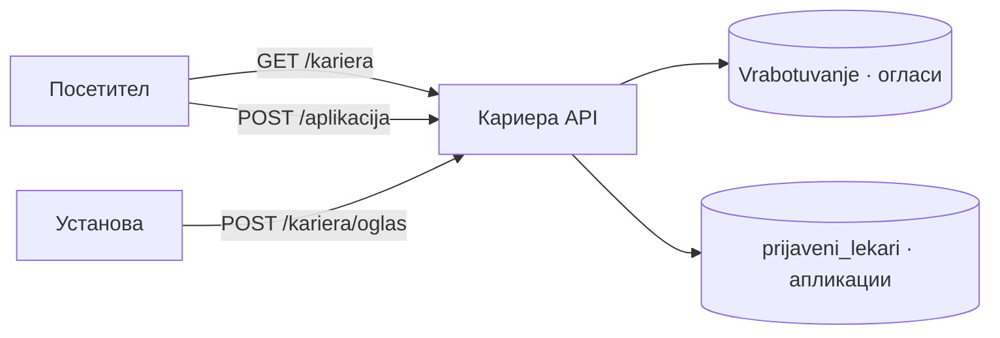
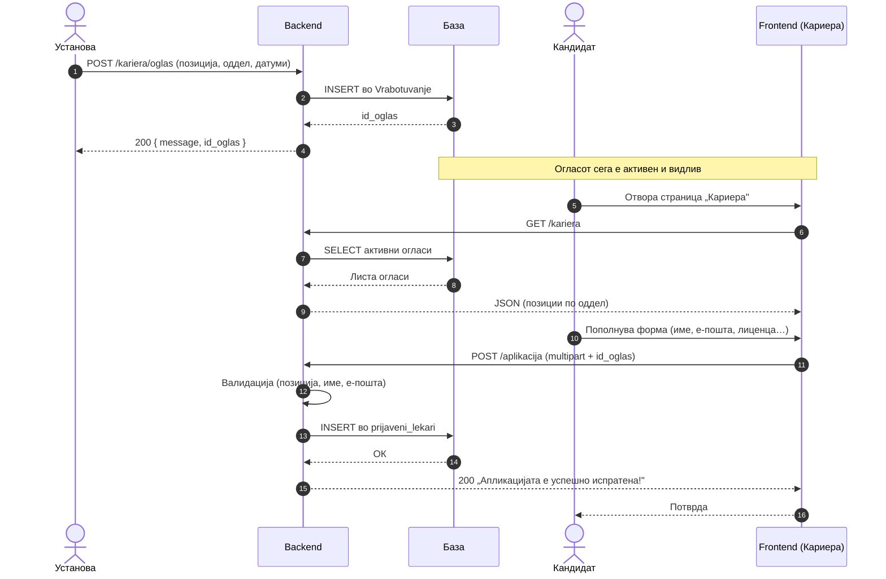

# Кариера

Огласите за работа имаат две страни, и кога зборуваме за „процесот на вработување" во целина, тие се распределени низ два различни модули. Самото создавање, уредување и бришење на оглас — административното управување со содржината — веќе е документирано во административниот дел на API-то, под `/admin/oglasi`. `backend/routers/kariera.py`, документиран овде, покрива другата половина: јавниот, читачки приказ на активните огласи на страницата „Кариера", и прифаќањето апликации од кандидати кои сакаат да аплицираат за конкретна позиција. Двата модула делат истата табела `Vrabotuvanje`, но со целосно различни нивоа на пристап — административниот дел бара `admin_doctor_id` и проверка преку `check_admin_access()`, додека `kariera.py` е целосно отворен за секој посетител, без потреба од најава. Функционалноста е директно поврзана со страницата „Кариера" на порталот: посетителите ги разгледуваат само активните огласи — затворените позиции, означени преку `status_oglas`, не се прикажуваат јавно — и поднесуваат апликација директно за позицијата која ги интересира.

> **Интерактивно тестирање:** секој endpoint е придружен со вграден **OpenAPI блок** и копче **„Test it"**, погонувано од Scalar. Пополни ги потребните параметри или тело на барањето и испрати го директно кон живиот сервер (`klinicka-bolnica-stip2026.onrender.com`) — без да ја напушташ документацијата.

> Поврзани: [Конвенции](conventions.md) · [Услуги](uslugi.md) · [Администрација](admin.md) · [База на податоци](../the_database.md) · [Преглед на backend](../pregled.md)

***

## 1. Преглед <a href="#id-1-pregled" id="id-1-pregled"></a>



> **Важно за патеките:** `GET /kariera` и `POST /kariera/oglas` се под префиксот `/kariera`. Меѓутоа, **`POST /aplikacija`** е намерно дефиниран **без** тој префикс (посебен `app_router`), бидејќи го отсликува URL-от што го користи формата за пријавување на frontend-от.

| Метод  | Патека           | Намена                       | Тело               |
| ------ | ---------------- | ---------------------------- | ------------------ |
| `GET`  | `/kariera`       | Листа на активни огласи      | —                  |
| `POST` | `/aplikacija`    | Пријава на кандидат на оглас | `multipart/form`   |
| `POST` | `/kariera/oglas` | Креирање нов оглас за работа | `application/json` |

### Процес на аплицирање — од оглас до пријава

Дијаграмот го прикажува целиот тек: од објавување на оглас, преку прегледување од кандидат, до зачувување на пријавата:



***

## 2. GET `/kariera` <a href="#id-2-oglasi" id="id-2-oglasi"></a>

Списокот на слободни позиции што го гледа секој посетител на страницата „Кариера" доаѓа директно од овој endpoint:`SELECT` врз `Vrabotuvanje`, филтриран со `WHERE status_oglas != 'завршен'` и подреден по `datum_prijava DESC`, така што најновите огласи се на врвот. Endpoint-от е јавен и не бара никаква автентикација — токму спротивно на административната верзија на истата табела, која враќа сите огласи, без оглед на статус.

Самата логика за форматирање на одговорот не живее во `kariera.py`, туку е издвоена во `v`rabotuvanje\_helpers.py — router-от\` само повикува готова helper функција и враќа резултатот директно како JSON, без дополнителна обработка на самото место.

**Успешен одговор (200):**

```json
[
  {
    "id_oglas": 7,
    "pozicija": "Специјалист кардиолог",
    "oddel": "Кардиологија",
    "datum_na_objava": "2026-06-01",
    "datum_na_prijavuvanje": "2026-06-30",
    "status_oglas": "активен"
  }
]
```

**Можни грешки:**

* `500` настаната грешка на серверска страна

**Каде се користи:** На frontend страна, страницата „Кариера" во `script.js` го повикува овој endpoint при отворање, а листата на огласи се прикажува онака како што пристигнува — веќе филтрирана и подредена, без дополнителна обработка на клиентска страна.

**Имплементација (FastAPI):**

```python
@router.get("")
def get_kariera():
    rows = fetch_aktivni_oglasi_rows(db_cursor)   # vrabotuvanje_helpers.py
    return [row_to_oglas_public(r) for r in rows]  # status != 'завршен'
```

* Поделбата на одговорност овде е чиста: router-от одлучува кој endpoint постои и под кој метод, додека helper-от во `vrabotuvanje_helpers.py` знае точно како изгледа јавниот приказ на оглас — истиот helper останува искористлив и од други делови на кодот на кои им треба истиот облик на податок.


[OpenAPI KlinickaBolnicaAPI](https://klinicka-bolnica-stip2026.onrender.com/openapi.json)


***

## 3. POST `/aplikacija` <a href="#id-3-aplikacija" id="id-3-aplikacija"></a>

Овој endpoint го завршува `work-flow` започнат во претходната точка: откако кандидатот веќе ги разгледал активните огласи преку `GET /kariera`, тука поднесува конкретна апликација. Backend-от ги валидира проследените полиња и потоа изврши параметризиран `INSERT` во табелата `prijaveni_lekari`, со логичка врска кон конкретниот оглас преку колоната `id_oglas`, која се однесува на примарниот клуч во `Vrabotuvanje`. Параметризацијата на самиот INSERT (placeholder-и %s, не string interpolation) е стандардна заштита против SQL injection, веќе видена низ останатите модули на API-то.

Endpoint-от прима `multipart/form-data` наместо `application/json — MIME-тип` кој, за разлика од JSON, поддржува binary segmenti во рамки на исто HTTP тело, разграничени со boundary стринг во `Content-Type` header-от. Вреди да се напомене дека моменталните полиња во барањето (табелата подолу) се исклучиво текстуални и целобројни — нема дефинирано file поле во актуелната верзија на endpoint-от, иако описот на функционалноста спомнува можност за прикачување CV или придружни документи. Со други зборови, `multipart/form-data` тука засега не носи бинарна содржина, туку остава отворен простор за лесно проширување во иднина, без потреба од промена на самиот формат на барањето. Endpoint-от е јавно достапен без автентикација, со цел процесот на пријавување да биде максимално едноставен за секој заинтересиран кандидат.

> Забелешка: патеката **е `/aplikacija` (без `/kariera`префикс)**.

**Полиња (form-data):**

| Поле               | Тип  | Задолжително | Опис                                          |
| ------------------ | ---- | ------------ | --------------------------------------------- |
| `pozicija`         | text | да           | Позиција за која се аплицира                  |
| `id_oglas`         | int  | не           | ID на огласот (се поврзува со `Vrabotuvanje`) |
| `ime`              | text | да           | Име на кандидатот                             |
| `prezime`          | text | да           | Презиме на кандидатот                         |
| `email`            | text | да           | Е-пошта за контакт                            |
| `telefon`          | int  | не           | Телефонски број                               |
| `broj_med_licenca` | int  | не           | Број на медицинска лиценца                    |

**Успешен одговор (200):**

```json
{ "message": "Апликацијата е успешно испратена!" }
```

**Можни грешки:**

* `400` (нема позиција / име-презиме / е-пошта, или неважечки `id_oglas`)
* `500` грешка настаната на серверска страна.

**Каде се користи:** На frontend страна, формата за аплицирање на страницата „Кариера" во `script.js` гради FormData објект и го испраќа преку fetch со method: `"POST" кон /aplikacija` , без рачно поставен `Content-Type header`, бидејќи прелистувачот автоматски генерира соодветен multipart boundary штом телото на барањето е FormData инстанца.

**Имплементација (FastAPI):**

```python
app_router = APIRouter(tags=["kariera"])   # посебен router — патеката е /aplikacija, не /kariera/aplikacija

@app_router.post("/aplikacija")
async def create_aplikacija(request: Request):
    form_data = await request.form()   # multipart/form-data
    db_cursor.execute("""
        INSERT INTO prijaveni_lekari (id_oglas, pozicija, ime_lekar, prezime_lekar, ...)
        VALUES (%s, %s, %s, %s, ...)
    """, (...))
    conn.commit()
    return {"message": "Апликацијата е успешно испратена!"}
```

* `app_router` е посебна инстанца на APIRouter, регистрирана во `main.py` преку `app.include_router(app_router)` без prefix параметар. За разлика од повеќето други модули, монтирани под заедничка патека (на пр. /admin, /aparati), овој router ja задржува точно патеката дефинирана во декоратора — `/aplikacija`, без дополнителен префикс. Тоа е причината зошто финалниот URL е `/aplikacija`, а не `/kariera/aplikacija`, иако логички спаѓа во истиот домен функционалност. Валидацијата, дополнително, е рачна, не преку Pydantic модел: request.form() враќа суров MultiDict, а секое задолжително поле се проверува експлицитно во кодот пред да дојде до INSERT-от.


[OpenAPI KlinickaBolnicaAPI](https://klinicka-bolnica-stip2026.onrender.com/openapi.json)


***

## 4. POST `/kariera/oglas` <a href="#id-4-oglas" id="id-4-oglas"></a>

Покрај читањето на активни огласи и примањето апликации, `kariera.py` содржи и трета патека. `POST /kariera/oglas` внесува нов ред во табелата `Vrabotuvanje`. Се чуваат сите потребни информации: позиција, оддел, датум на објава, рок за пријавување и почетен статус. INSERT-от е параметризиран — се користат placeholder-и %s, не string interpolation директно во SQL стринг. Тоа е стандардна заштита против SQL injection, конзистентна со останатите write-операции низ API-то. Телото на барањето е application/json, не multipart/form-data како кај апликациите на кандидати. Огласот содржи само текстуална содржина, без потреба од прикачување датотеки.

Овој endpoint живее во истиот модул како јавните `GET /kariera` и `POST /aplikacija`. Сепак, тој не е јавен. Пред секое запишување, backend-от го верификува `admin_doctor_id` преку `check_admin_access()` — истата функција користена низ останатиот административен дел на API-то. Доколку проверката не помине, барањето се одбива со `403 Forbidden`. Не се прави никаква промена врз базата. Како и секој POST, барањето не е идемпотентно. Повторно испраќање на истото тело создава нов, дуплиран ред. Нема механизам за детекција на веќе постоечки идентичен оглас, ниту idempotency key од клиентот.

Технички, овој endpoint и `POST /admin/oglasi` дуплираат речиси идентична логика. Истата проверка на `admin_doctor_id`, истата валидација, истиот INSERT во Vrabotuvanje — но низ два различни router модули. Логиката не е консолидирана во една заедничка функција. Оригиналниот текст ја опишува оваа патека како „поедноставна јавна/алтернативна" верзија, но тоа не е прецизно. `check_admin_access()` важи и тука, идентично како кај /admin/oglasi. Затоа не може да се смета за јавен endpoint. Поточно е да се каже дека `/kariera/oglas` е алтернативен пат до истата операција, веројатно постар. Можеби е оставен за компатибилност со порана верзија на админ панелот. /admin/oglasi е новата, централизирана локација за истата функционалност.

**Тело (JSON):**

```json
{
  "pozicija": "Специјалист кардиолог",
  "oddel": "Кардиологија",
  "datum_na_objava": "2026-06-01",
  "datum_na_prijavuvanje": "2026-06-30",
  "status_oglas": "активен"
}
```

**Валидација:** Валидацијата се изврши рачно во кодот, не преку `Pydantic модел` — `request.json()` враќа обичен dict, без декларирана шема, па FastAPI не може автоматски да генерира `422 Unprocessable Entity` при недостасувачко поле; наместо тоа, секое задолжително поле (pozicija, oddel) се проверува експлицитно пред INSERT-от, а грешката се сигнализира рачно со 400. Датумите (`datum_na_objava`, `datum_na_prijavuvanje`) се прифаќаат во формат `YYYY-MM-DD` или `YYYY-MM-DD HH:MM:SS`, а `status_oglas` е опционален, со три прифатени вредности — NULL, активен или завршен.

**Успешен одговор (200):**

```json
{ "message": "Огласот е успешно креиран!", "id_oglas": 7 }
```

**Можни грешки:**

* `400` (нема позиција/оддел, неважечки формат на датум)
* `500` грешка настаната на серверска страна.

**Каде се користи:** На frontend страна, формата за креирање нов оглас во админ панелот (`script.js`) го повикува овој endpoint при поднесување — функционално истиот резултат како повик кон `/admin/oglasi`, само преку друга патека.

**Имплементација (FastAPI):**

```python
@router.post("/oglas")
async def create_oglas(request: Request):
    data = await request.json()
    # парсирање датуми: "YYYY-MM-DD" или "YYYY-MM-DD HH:MM:SS"
    db_cursor.execute("""
        INSERT INTO Vrabotuvanje (pozicija, oddel, datum_na_objava, datum_na_prijavuvanje, status_oglas)
        VALUES (%s, %s, %s, %s, %s)
    """, (...))
    conn.commit()
    return {"message": "Огласот е успешно креиран!", "id_oglas": db_cursor.lastrowid}
```

* Декораторот `@router.post("/oglas")` сугерира дека овој router е инициализиран со APIRouter(prefix="/kariera", tags=\["kariera"]) — за разлика од app\_router кај /aplikacija, регистриран без prefix, овде FastAPI автоматски го составува финалниот пат `/kariera/oglas` спојувајќи го prefix-от со патеката од декоратора, без потреба истата да се пишува целосно на секое место во кодот. За целосен преглед на CRUD операциите врз огласи преку административниот namespace, вклучувајќи уредување и бришење, види Администрација — /admin/oglasi.


[OpenAPI KlinickaBolnicaAPI](https://klinicka-bolnica-stip2026.onrender.com/openapi.json)


***

## 5. Поврзани табели <a href="#id-5-tabele" id="id-5-tabele"></a>

| Табела             | Улога во „Кариера"                                      |
| ------------------ | ------------------------------------------------------- |
| `Vrabotuvanje`     | Огласи за работа (позиција, оддел, датуми, статус)      |
| `prijaveni_lekari` | Пријавени кандидати (име, е-пошта, лиценца, `id_oglas`) |

Поврзувањето е преку `id_oglas`: една пријава во `prijaveni_lekari` укажува на оглас во `Vrabotuvanje`.

Детали за колони и врски: [База на податоци](../the_database.md).

***

Следно: [Услуги](uslugi.md) · [Администрација](admin.md)
