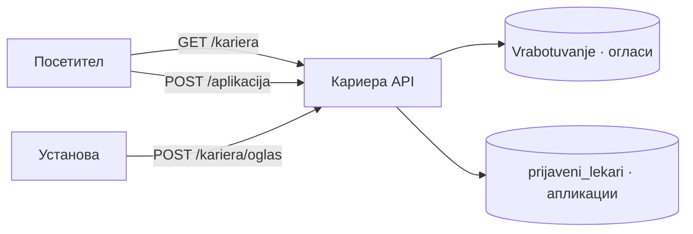
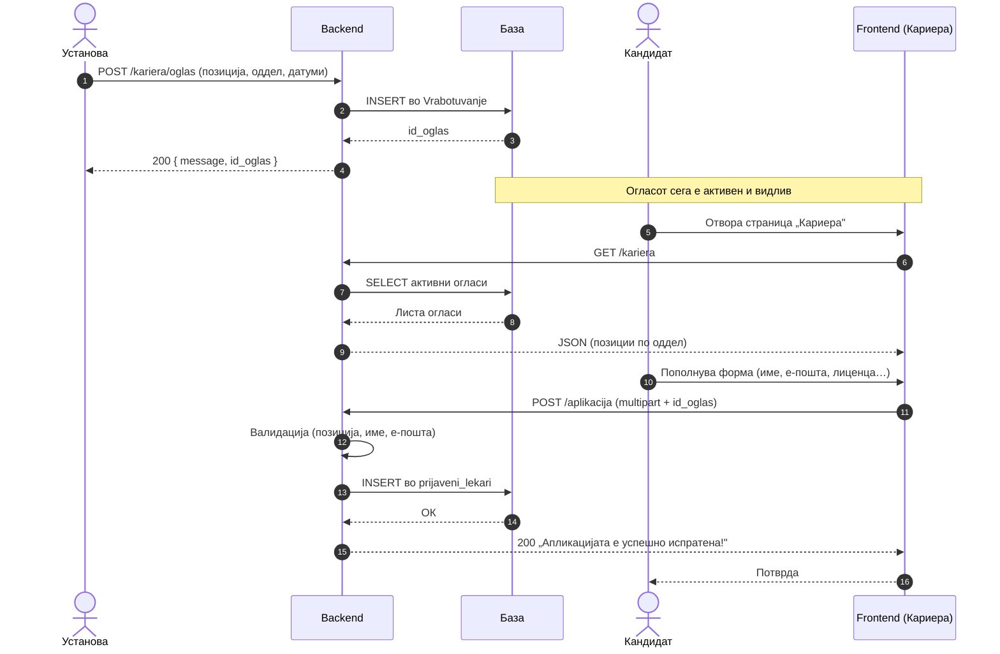

# Кариера

Модулот за **вработување** е дефиниран во `backend/routers/kariera.py` и ги покрива двете страни на процесот на вработување: управување со огласи за работа од страна на установата и поднесување апликации од страна на кандидатите. Функционалноста е директно поврзана со страницата „Кариера" на порталот, каде посетителите можат да ги разгледаат активните огласи и да аплицираат за позиции кои ги интересираат.

> **Интерактивно тестирање:** секој endpoint е придружен со вграден **OpenAPI блок** и копче **„Test it"**, погонувано од Scalar. Пополни ги потребните параметри или тело на барањето и испрати го директно кон живиот сервер (`klinicka-bolnica-stip2026.onrender.com`) — без да ја напушташ документацијата.

## Содржина

* [1. Преглед](kariera.md#1-pregled)
  * [Процес на аплицирање](kariera.md#proces-na-apliciranje)
* [2. GET `/kariera`](kariera.md#2-oglasi)
* [3. POST `/aplikacija`](kariera.md#3-aplikacija)
* [4. POST `/kariera/oglas`](kariera.md#4-oglas)
* [5. Поврзани табели](kariera.md#5-tabele)

> Поврзани: [Конвенции](conventions.md) · [Услуги](uslugi.md) · [Администрација](admin.md) · [База на податоци](../the_database.md) · [Преглед на backend](../pregled.md)

***

## 1. Преглед <a href="#id-1-pregled" id="id-1-pregled"></a>



> **Важно за патеките:** `GET /kariera` и `POST /kariera/oglas` се под префиксот `/kariera`. Меѓутоа, **`POST /aplikacija`** е намерно дефиниран **без** тој префикс (посебен `app_router`), бидејќи го отсликува URL-от што го користи формата за пријавување на frontend-от.

| Метод  | Патека           | Намена                          | Тело              |
| ------ | ---------------- | ------------------------------- | ----------------- |
| `GET`  | `/kariera`       | Листа на активни огласи         | —                 |
| `POST` | `/aplikacija`    | Пријава на кандидат на оглас     | `multipart/form`  |
| `POST` | `/kariera/oglas` | Креирање нов оглас за работа     | `application/json`|

### Процес на аплицирање — од оглас до пријава

Дијаграмот го прикажува целиот тек: од објавување на оглас, преку прегледување од кандидат, до зачувување на пријавата:



***

## 2. GET `/kariera` <a href="#id-2-oglasi" id="id-2-oglasi"></a>

Извршува `SELECT` врз табелата `Vrabotuvanje` со `WHERE status_oglas != 'завршен'`, сортиран по `datum_prijava DESC`. Јавен endpoint кој не бара автентикација. Помошната логика за форматирање на одговорот е издвоена во `vrabotuvanje_helpers.py`.
Од корисничка перспектива, овој endpoint ја има контролата на делот „Кариера" — секој посетител на порталот може да ги разгледа актуелните слободни позиции без да се најавува, а само огласите кои сè уште примаат апликации се прикажани во листата.

**Успешен одговор (200):**

```json
[
  {
    "id_oglas": 7,
    "pozicija": "Специјалист кардиолог",
    "oddel": "Кардиологија",
    "datum_na_objava": "2026-06-01",
    "datum_na_prijavuvanje": "2026-06-30",
    "status_oglas": "активен"
  }
]
```

**Можни грешки:** `500` настаната грешка на серверска страна 

**Каде се користи:** frontend — `script.js` (страница „Кариера").

**Имплементација (FastAPI):**

```python
@router.get("")
def get_kariera():
    rows = fetch_aktivni_oglasi_rows(db_cursor)   # vrabotuvanje_helpers.py
    return [row_to_oglas_public(r) for r in rows]  # status != 'завршен'
```

- Логиката за форматирање е издвоена во `vrabotuvanje_helpers.py` — router-от само повикува helper и враќа JSON.


[OpenAPI KlinickaBolnicaAPI](https://klinicka-bolnica-stip2026.onrender.com/openapi.json)


***

## 3. POST `/aplikacija` <a href="#id-3-aplikacija" id="id-3-aplikacija"></a>

Го обработува барањето за пријавување на кандидат на конкретен оглас. Откако ќе ги валидира проследените податоци, backend-от внесува нов ред во табелата `prijaveni_lekari`, поврзан со соодветниот оглас преку неговиот `oglas_id`.
Endpoint-от прима `multipart/form-data` наместо стандарден JSON — овој формат е неопходен бидејќи апликацијата може да содржи и бинарна содржина, како CV или придружни документи, заедно со текстуалните податоци на кандидатот. Јавно достапен без автентикација, со цел процесот на пријавување да биде што поедноставен за секој заинтересиран кандидат.

> Забелешка: патеката е **`/aplikacija`** (без `/kariera` префикс).

**Полиња (form-data):**

| Поле               | Тип  | Задолжително | Опис                                          |
| ------------------ | ---- | ------------ | --------------------------------------------- |
| `pozicija`         | text | да           | Позиција за која се аплицира                  |
| `id_oglas`         | int  | не           | ID на огласот (се поврзува со `Vrabotuvanje`) |
| `ime`              | text | да           | Име на кандидатот                             |
| `prezime`          | text | да           | Презиме на кандидатот                         |
| `email`            | text | да           | Е-пошта за контакт                            |
| `telefon`          | int  | не           | Телефонски број                               |
| `broj_med_licenca` | int  | не           | Број на медицинска лиценца                     |

**Успешен одговор (200):**

```json
{ "message": "Апликацијата е успешно испратена!" }
```

**Можни грешки:** `400` (нема позиција / име-презиме / е-пошта, или неважечки `id_oglas`) · `500` грешка настаната на серверска страна.

**Каде се користи:** frontend — `script.js` (форма за аплицирање на страница „Кариера").

**Имплементација (FastAPI):**

```python
app_router = APIRouter(tags=["kariera"])   # посебен router — патеката е /aplikacija, не /kariera/aplikacija

@app_router.post("/aplikacija")
async def create_aplikacija(request: Request):
    form_data = await request.form()   # multipart/form-data
    db_cursor.execute("""
        INSERT INTO prijaveni_lekari (id_oglas, pozicija, ime_lekar, prezime_lekar, ...)
        VALUES (%s, %s, %s, %s, ...)
    """, (...))
    conn.commit()
    return {"message": "Апликацијата е успешно испратена!"}
```

- `app_router` е регистриран одделно во `main.py` — затоа URL-от е `/aplikacija`, не `/kariera/aplikacija`.


[OpenAPI KlinickaBolnicaAPI](https://klinicka-bolnica-stip2026.onrender.com/openapi.json)


***

## 4. POST `/kariera/oglas` <a href="#id-4-oglas" id="id-4-oglas"></a>

Креира **нов запис во табелата `Vrabotuvanje`** со сите потребни информации за огласот — наслов на позицијата, опис, услови, рок за пријавување и почетен статус. За разлика од endpoint-от за пријавување кандидати кој користи `multipart/form-data`, овој прима стандарден `application/json` бидејќи огласот содржи исклучиво текстуална содржина без потреба од прикачување датотеки.
Endpoint-от е резервиран исклучиво за административна употреба — пред секое запишување во базата, backend-от го верификува проследениот `admin_doctor_id` преку `check_admin_access()`. Доколку верификацијата не помине, барањето се одбива со `403 Forbidden` без да се изврши каква било промена.

**Тело (JSON):**

```json
{
  "pozicija": "Специјалист кардиолог",
  "oddel": "Кардиологија",
  "datum_na_objava": "2026-06-01",
  "datum_na_prijavuvanje": "2026-06-30",
  "status_oglas": "активен"
}
```

**Валидација:**
* `pozicija` и `oddel` — задолжителни
* датумите се прифаќаат во формат `YYYY-MM-DD` или `YYYY-MM-DD HH:MM:SS`
* `status_oglas` — опционален (`NULL`, `активен`, `завршен`)

**Успешен одговор (200):**

```json
{ "message": "Огласот е успешно креиран!", "id_oglas": 7 }
```

**Можни грешки:** `400` (нема позиција/оддел, неважечки формат на датум) · `500` грешка настаната на серверска страна.

**Каде се користи:** frontend — `script.js` (админ панел, креирање оглас).

**Имплементација (FastAPI):**

```python
@router.post("/oglas")
async def create_oglas(request: Request):
    data = await request.json()
    # парсирање датуми: "YYYY-MM-DD" или "YYYY-MM-DD HH:MM:SS"
    db_cursor.execute("""
        INSERT INTO Vrabotuvanje (pozicija, oddel, datum_na_objava, datum_na_prijavuvanje, status_oglas)
        VALUES (%s, %s, %s, %s, %s)
    """, (...))
    conn.commit()
    return {"message": "Огласот е успешно креиран!", "id_oglas": db_cursor.lastrowid}
```

- За админ CRUD со `check_admin_access` види [Администрација — `/admin/oglasi`](admin.md#4-oglasi); овој endpoint е поедноставна јавна/alternativна патека.


[OpenAPI KlinickaBolnicaAPI](https://klinicka-bolnica-stip2026.onrender.com/openapi.json)


***

## 5. Поврзани табели <a href="#id-5-tabele" id="id-5-tabele"></a>

| Табела             | Улога во „Кариера"                                       |
| ------------------ | -------------------------------------------------------- |
| `Vrabotuvanje`     | Огласи за работа (позиција, оддел, датуми, статус)        |
| `prijaveni_lekari` | Пријавени кандидати (име, е-пошта, лиценца, `id_oglas`)   |

Поврзувањето е преку `id_oglas`: една пријава во `prijaveni_lekari` укажува на оглас во `Vrabotuvanje`.

Детали за колони и врски: [База на податоци](../the_database.md).

***

Следно: [Услуги](uslugi.md) · [Администрација](admin.md)
