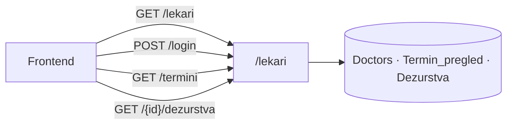
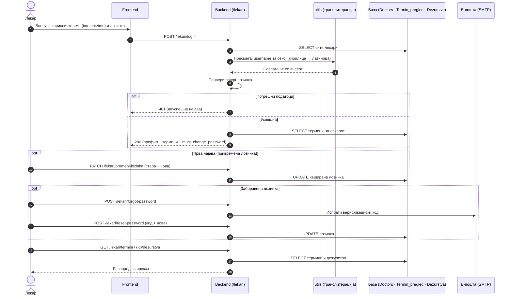

# API — Лекари

Сите endpoints поврзани со **лекарите** се дефинирани во `backend/routers/lekari.py` и достапни под префиксот `/lekari`. Овој модул ги покрива сите операции во работниот циклус на лекарот — од листање и автентикација, преку управување со лозинки, до пристап до термини и распоред на дежурства.

> **Интерактивно тестирање:** секој endpoint е придружен со вграден **OpenAPI блок** и копче **„Test it"**, погонувано од Scalar. Пополни ги потребните параметри или тело на барањето и испрати го директно кон живиот сервер (`klinicka-bolnica-stip2026.onrender.com`) — без да ја напушташ документацијата.

## Содржина

* [1. Преглед](#1-pregled)
* [2. Корисничко име (име.презиме)](#2-username)
* [3. GET `/lekari`](#3-lista)
* [4. POST `/lekari/login`](#4-login)
* [5. POST `/lekari/register`](#5-register)
* [6. PATCH `/lekari/promeni-lozinka`](#6-lozinka)
* [7. POST `/lekari/forgot-password`](#7-forgot)
* [8. POST `/lekari/reset-password`](#8-reset)
* [9. GET `/lekari/termini`](#9-termini)
* [10. GET `/lekari/{doctor_id}/dezurstva`](#10-dezurstva)

> Поврзани: [Конвенции](conventions.md) · [Автентикација](authentication.md) ·
> [Пациенти](pacienti.md) · [Термини](termini.md) ·
> [База — Doctors](../the_database.md#tab-doctors)

---

## 1. Преглед на endpoints  <a id="1-pregled"></a>

Модулот користи  **осум endpoints**, логично групирани во три области: пристап до лекарски профили, автентикација и управување со лозинки, и пристап до работни податоци (термини и дежурства).



| Метод | Патека | Намена |
|-------|--------|--------|
| `GET` | `/lekari` | Враќа листа на сите лекари, со опционален филтер по специјалност |
| `POST` | `/lekari/login` | Автентикација на лекар — враќа профил и термини во еден одговор |
| `POST` | `/lekari/register` | Регистрација и поставување на профил за нов лекар |
| `PATCH` | `/lekari/promeni-lozinka` | Смена на лозинка за веќе најавен лекар |
| `POST` | `/lekari/forgot-password` | Иницирање на ресет — испраќа верификациски код на е-пошта |
| `POST` | `/lekari/reset-password` | Поставување нова лозинка со верификациски код |
| `GET` | `/lekari/termini` | Термини на лекар пронајден по е-пошта |
| `GET` | `/lekari/{doctor_id}/dezurstva` | Распоред на дежурства за конкретен лекар |

### Тек на податоци — најава и пристап до распоред

Дијаграмот го прикажува целиот тек: пресметка на корисничкото име од име и презиме, проверка на лозинка, задолжителна промена при прва најава, и пристап до термини и дежурства.



---

## 2. Корисничко име (име.презиме) <a id="2-username"></a>

Наместо да се чува посебно корисничко име во базата, системот го **пресметува автоматски** од постоечките податоци. Името и презимето на лекарот се транслитерираат на латиница и се спојуваат со точка:

```
Ана Стојановска -> ana.stojanovska
```

При секоја најава, backend-от ги зема сите лекари од базата, го пресметува корисничкото име за секој и го споредува со она што го внел корисникот. За да се справи со варијации во начинот на пишување, имплементирано е и **флексибилно совпаѓање** кое ги покрива најчестите разлики во транслитерацијата (на пр. `sh`=`s`, `zh`=`z`, `ch`=`c`) и мали типографски грешки во презимето. Целата логика е сместена во `routers/utils.py`, во функцијата `transliterate_mk_to_lat`.

> Привремената лозинка за сите примерни лекари во системот е `Test123..`. При прва најава со неа, полето `must_change_password` се враќа како `true` , со што frontend-от го насочува лекарот кон екранот за **задолжителна промена на лозинка** пред да продолжи со работа.

---

## 3. GET `/lekari` <a id="3-lista"></a>

Овој endpoint служи како **почетна точка за секој корисник** кој сака да пронајде лекар — без автентикација, јавно достапен. По стандард враќа **листа на сите лекари во системот**, а доколку се проследи параметарот **specijalnost, резултатите автоматски се стеснуваат само на лекарите од таа специјалност**. Ова го користи frontend-от за приказ на лекари по оддел, при пребарување или при изборот на лекар за закажување термин.

**Query параметри:**
- `specijalnost` (опц.) — точно име на специјалност (на пр. `Кардиологија`)

**Успешен одговор (200):**

```json
[
  { "doctor_ID": 28, "name": "Александар", "surname": "Серафимов", "specijalnost": "Кардиологија", "email": "aleksandarserafimov@KBstip.com" }
]
```

Лекарите без специјалност се враќаат со празно `specijalnost` (frontend прикажува „Н/П").

 
[OpenAPI KlinickaBolnicaAPI](https://klinicka-bolnica-stip2026.onrender.com/openapi.json) 

---

## 4. POST `/lekari/login` <a id="4-login"></a>

**Најава на лекар** со корисничко име (`име.презиме`) и лозинка. Покрај податоците за лекарот, веднаш ги враќа и неговите **термини** (за да не треба втор повик).

**Тело (JSON):**

```json
{
  "username": "ana.stojanovska",
  "password": "Test123.."
}
```

**Успешен одговор (200):**

```json
{
  "doctor": {
    "doctor_ID": 2,
    "name": "Ана",
    "surname": "Стојановска",
    "email": "ana.stojanovska@kbstip.mk",
    "specijalnost": "Кардиологија"
  },
  "termini": [
    {
      "termin_ID": 5,
      "ime_pacient": "Иван Ивановски",
      "datum_pregled": "2026-06-20",
      "vreme_pregled": "10:00",
      "email_pacient": "ivan@example.com",
      "telefon_pacient": "070123456",
      "dijagnoza": "",
      "terapija": "",
      "status_pregled": "закажан"
    }
  ],
  "must_change_password": true
}
```
- **`must_change_password`** — полето се враќа како `true` кога лекарот при најава сè уште ја користи системски доделената привремена лозинка `Test123..`. Во тој случај, frontend-от е должен да го блокира понатамошниот пристап и да го пренасочи лекарот кон екранот за промена на лозинка. По успешната промена може да продолжи со работа.
- Термини — листата е сортирана по приоритет: прво се прикажуваат термините со статус `закажан`, а потоа по датум и час. Откажаните термини се исклучени од одговорот бидејќи не се релевантни за тековниот работен ден на лекарот.

**Можни грешки:** `400` (едно или повеќе задолжителни полиња се празни) · `401` (невалидно корисничко ime или лозинка) · `403` (лекарот постои во базата, но нема поставено лозинка — потребна е прва регистрација) · `500` (внатрешна грешка на серверот)


[OpenAPI KlinickaBolnicaAPI](https://klinicka-bolnica-stip2026.onrender.com/openapi.json)


---

## 5. POST `/lekari/register` <a id="5-register"></a>

Endpoint кој служи за **иницијална регистрација на лекар** — поставување на личен профил и избор на лозинка. Важно е да се напомене дека лекарот мора однапред да биде внесен во базата од страна на администрацијата, а со  регистрацијата само се активира неговиот профил и му се овозможува пристап до системот.

**Тело (JSON):**

```json
{
  "name": "Тест",
  "prezime": "Лекар",
  "specialty": "Кардиологија",
  "email": "test.lekar@kbstip.mk",
  "password": "Nova123.."
}
```

**Правила за лозинка** (`_validna_lozinka_lekar`):
- минимум **8** карактери
- барем една **голема буква**
- барем еден **број**
- барем еден **интерпункциски знак**
- **не смее** да биде привремената `Test123..`

**Можни грешки**: `400` (едно или повеќе полиња не ги исполнуваат барањата, лозинката не ги задоволува правилата за сложеност, или внесената е-пошта веќе е зафатена од друг профил) · `500` (внатрешна грешка на серверот)


[OpenAPI KlinickaBolnicaAPI](https://klinicka-bolnica-stip2026.onrender.com/openapi.json)


---

## 6. PATCH `/lekari/promeni-lozinka` <a id="6-lozinka"></a>

Овозможува на веќе најавен лекар да ја **промени својата лозинка**. За да се потврди идентитетот и да се спречи неовластена промена, endpoint-от бара внесување на **тековната лозинка** пред да ја примени новата, се бара и кога лекарот е тековно најавен на системот.

**Тело (JSON):**

```json
{
  "doctor_id": 2,
  "trenutna_lozinka": "Test123..",
  "nova_lozinka": "Nova123.."
}
```

Новата лозинка мора да ги исполнува истите правила за сложеност дефинирани при регистрација. По успешна промена, полето `must_change_passwordz автоматски се ресетира на **0** — со што системот го потврдува дека лекарот повеќе не користи привремена лозинка и може да продолжи со нормална работа.

**Можни грешки:** `400` (недостасува `doctor_id` или новата лозинка не ги исполнува правилата за сложеност) · `401` (внесената тековна лозинка е погрешна — промената е одбиена) · `403` (лекарот сè уште нема поставено лозинка — потребна е прва регистрација) · `404` (лекарот не постои во базата) · `500` (внатрешна грешка на серверот)


[OpenAPI KlinickaBolnicaAPI](https://klinicka-bolnica-stip2026.onrender.com/openapi.json)


---

## 7. POST `/lekari/forgot-password` <a id="7-forgot"></a>

Иницира процес на ресетирање на лозинка за лекар кој ја заборавил својата. Системот генерира **единствен верификациски код**, **валиден 1 час**, го зачувува во табелата password_reset_tokens со user_type = 'lekar' и го испраќа на е-поштата на лекарот. Доколку SMTP не е конфигуриран, кодот се печати директно во терминалот или логовите на серверо

**Тело (JSON):**

```json
{ "email": "ana.stojanovska@kbstip.mk" }
```

Без разлика дали внесената е-пошта постои во системот или не, одговорот е секогаш иста неутрална порака. Ова е намерна безбедносна одлука — со која се спречува можноста некој да „тестира" дали одредена е-пошта е регистрирана во системот.
**Можни грешки:** `400` (внесената е-пошта не е во валиден формат) · `500` (внатрешна грешка на серверот)

[OpenAPI KlinickaBolnicaAPI](https://klinicka-bolnica-stip2026.onrender.com/openapi.json)


---

## 8. POST `/lekari/reset-password` <a id="8-reset"></a>

Овозможува поставување на **нова лозинка со помош на претходно добиениот верификациски код — без потреба од најава**. Овој endpoint е вториот и последен чекор во процесот на ресет, откако лекарот го добил кодот преку е-пошта или лог.

**Тело (JSON):**

```json
{
  "email": "ana.stojanovska@kbstip.mk",
  "token": "код_од_терминал_или_лог",
  "nova_lozinka": "Nova123.."
}
```

Новата лозинка мора да ги исполнува истите правила за сложеност дефинирани при регистрација. По успешен ресет, верификацискиот код се брише од базата за да не може повторно да се искористи, а `must_change_password` се поставува на 0.

**Можни грешки**: `400` (верификацискиот код е невалиден, истечен или новата лозинка не ги исполнува правилата за сложеност) · `404` (лекарот не постои во базата) · `500` (внатрешна грешка на серверот)

[OpenAPI KlinickaBolnicaAPI](https://klinicka-bolnica-stip2026.onrender.com/openapi.json)


---

## 9. GET `/lekari/termini` <a id="9-termini"></a>

Враќа профилни податоци за лекар заедно со неговата **листа на термини**, при што лекарот се идентификува по **е-пошта**. Откажаните термини не се вклучени во одговорот — се враќаат само активните и завршените прегледи, кои се релевантни за работата на лекарот.

**Query параметри:**
- `email` (задолжителен)

**Успешен одговор (200):**

```json
{
  "doctor": {
    "doctor_ID": 2,
    "name": "Ана",
    "surname": "Стојановска",
    "email": "ana.stojanovska@kbstip.mk",
    "specijalnost": "Кардиологија"
  },
  "termini": [ "..." ]
}
```

**Можни грешки:** `400` (параметарот `email` не е проследен во барањето) · `404` (во базата не постои лекар регистриран со таа е-пошта) · `500` (внатрешна грешка на серверот)


[OpenAPI KlinickaBolnicaAPI](https://klinicka-bolnica-stip2026.onrender.com/openapi.json)


---

## 10. GET `/lekari/{doctor_id}/dezurstva` <a id="10-dezurstva"></a>

Овој endpoint го решава еден практичен проблем — не секој лекар има рачно внесен распоред во базата. Затоа системот работи на два нивоа: прво проверува дали постојат дежурства за тој лекар во табелата `Dezurstva`, ако постојат, ги враќа директно. Ако не постојат, се активира **fallback механизам** кој автоматски го пресметува распоредот врз основа на името и специјалноста на лекарот. На тој начин, одговорот секогаш содржи податоци — без разлика на тоа дали дежурствата се рачно внесени или не.

**Path параметри:**
- `doctor_id` (задолжителен)

**Успешен одговор (200):**

```json
[
  {
    "datum": "2026-06-20",
    "den": "20",
    "oddel": "Кардиологија",
    "vreme_od": "08:00",
    "vreme_do": "20:00",
    "napomena": null
  }
]
```

**Можни грешки:** `404` (лекар со дадениот `doctor_id` не постои во базата) · `500` (внатрешна грешка на серверот)


[OpenAPI KlinickaBolnicaAPI](https://klinicka-bolnica-stip2026.onrender.com/openapi.json)


---

Следно: [Термини](termini.md) · [Автентикација](authentication.md) ·
[Пациенти](pacienti.md)
