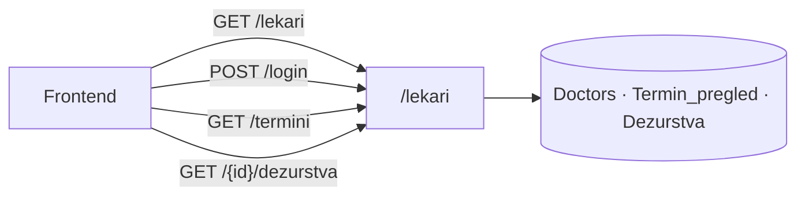
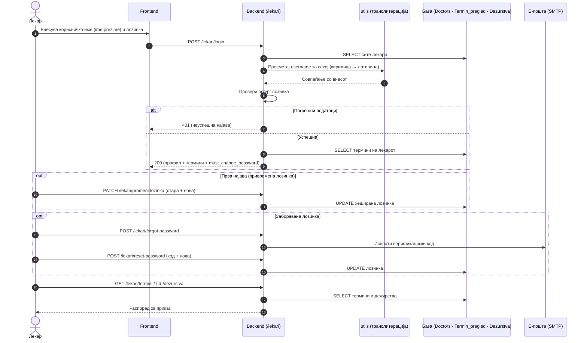

# API — Лекари

Модулот `backend/routers/lekari.py` е стандарден FastAPI APIRouter, монтиран со префикс `/lekari`, и групира endpoints што покриваат целиот работен циклус на лекар во системот: листање лекари по специјалност или оддел, автентикација (login), управување со лозинка, и пристап до сопствените термини и распоред на дежурства. Секој endpoint што враќа или менува лично-специфични податоци го прима `doctor_ID` како идентификатор и го верификува пред извршување — иста ownership-провера каква што се користи и во административниот модул, само применета на ниво на конкретен лекар наместо на директор. Одговорите се стандарден JSON, а грешките носат соодветен HTTP статус код (`401/403` за неавторизиран пристап, `404` за непостоечки запис, `500` за серверска грешка).

За читателот на документацијата, тоа значи дека секој endpoint подолу прецизно покажува кои податоци бара, кои враќа, и кои грешки можат да се очекуваат — без потреба да се чита самиот изворен код за да се разбере однесувањето.

> **Интерактивно тестирање:** секој endpoint е придружен со вграден **OpenAPI блок** и копче **„Test it"**, погонувано од Scalar. Пополни ги потребните параметри или тело на барањето и испрати го директно кон живиот сервер (`klinicka-bolnica-stip2026.onrender.com`) — без да ја напушташ документацијата.

## Содржина

* [1. Преглед](#1-pregled)
* [2. Корисничко име (име.презиме)](#2-username)
* [3. GET `/lekari`](#3-lista)
* [4. POST `/lekari/login`](#4-login)
* [5. POST `/lekari/register`](#5-register)
* [6. PATCH `/lekari/promeni-lozinka`](#6-lozinka)
* [7. POST `/lekari/forgot-password`](#7-forgot)
* [8. POST `/lekari/reset-password`](#8-reset)
* [9. GET `/lekari/termini`](#9-termini)
* [10. GET `/lekari/{doctor_id}/dezurstva`](#10-dezurstva)

> Поврзани: [Конвенции](conventions.md) · [Автентикација](authentication.md) ·
> [Пациенти](pacienti.md) · [Термини](termini.md) ·
> [База — Doctors](../the_database.md#tab-doctors)

---

## 1. Преглед на endpoints  <a id="1-pregled"></a>

Модулот има вкупно **осум endpoints**, групирани во три логички области според тоа со какви податоци работат: пристап до лекарски профили (листање и пребарување), автентикација и управување со лозинки (login, регистрација, ресетирање), и пристап до сопствени работни податоци (термини и распоред на дежурства). Групирањето не е случајно — секоја област одговара на посебен дел од Doctors/Termin_pregled/Dezurstva шемата во базата, и на различно ниво на потребна автентикација: листата на лекари е јавно достапна, додека термините и дежурствата бараат веќе идентификуван лекар.



| Метод | Патека | Намена |
|-------|--------|--------|
| `GET` | `/lekari` | Враќа листа на сите лекари, со опционален филтер по специјалност |
| `POST` | `/lekari/login` | Автентикација на лекар — враќа профил и термини во еден одговор |
| `POST` | `/lekari/register` | Регистрација и поставување на профил за нов лекар |
| `PATCH` | `/lekari/promeni-lozinka` | Смена на лозинка за веќе најавен лекар |
| `POST` | `/lekari/forgot-password` | Иницирање на ресет — испраќа верификациски код на е-пошта |
| `POST` | `/lekari/reset-password` | Поставување нова лозинка со верификациски код |
| `GET` | `/lekari/termini` | Термини на лекар пронајден по е-пошта |
| `GET` | `/lekari/{doctor_id}/dezurstva` | Распоред на дежурства за конкретен лекар |

Сите осум endpoints споделуваат заеднички router prefix, но не и заедничко ниво на пристап. GET /lekari нема никакво ограничување и служи за јавен преглед на лекарскиот кадар, додека секој endpoint обележан со конкретен doctor_id или е-пошта бара претходно успешна автентикација и враќа исклучиво податоци сопствени на тој лекар — истата ownership-логика применета и кај административниот модул, само на ниво на лекар наместо директор.

### Тек на податоци — најава и пристап до распоред

Дијаграмот го прикажува целиот тек: пресметка на корисничкото име од име и презиме, проверка на лозинка, задолжителна промена при прва најава, и пристап до термини и дежурства.



---

## 2. Корисничко име (име.презиме) <a id="2-username"></a>

Наместо да се чува посебно корисничко име во базата, системот го **пресметува автоматски** од постоечките податоци. Името и презимето на лекарот се транслитерираат на латиница и се спојуваат со точка:

```
Ана Стојановска -> ana.stojanovska
```

При секоја најава, backend-от ги зема сите лекари од базата, го пресметува корисничкото име за секој и го споредува со она што го внел корисникот. За да се справи со варијации во начинот на пишување, имплементирано е и **флексибилно совпаѓање** кое ги покрива најчестите разлики во транслитерацијата (на пр. `sh`=`s`, `zh`=`z`, `ch`=`c`) и мали типографски грешки во презимето. Целата логика е сместена во `routers/utils.py`, во функцијата `transliterate_mk_to_lat`.

> Привремената лозинка за сите примерни лекари во системот е `Test123..`. При прва најава со неа, полето `must_change_password` се враќа како `true` , со што frontend-от го насочува лекарот кон екранот за **задолжителна промена на лозинка** пред да продолжи со работа.

---

## 3. GET `/lekari` <a id="3-lista"></a>

Ова е **почетната точка** за секого кој сака да дојде до список на лекари — endpoint-от не бара автентикација и е јавно достапен. Без проследени параметри, враќа целосна листа на сите лекари во системот, но доколку се проследи `specijalnost`, резултатот се стеснува само на лекарите од таа специјалност преку точно совпаѓање со колоната `specialty` во `Doctors`. Не постои pagination — целата листа се враќа во еден одговор, бидејќи бројот на лекари во болницата практично не го оправдува дополнителното усложнување..

**Query параметри:**
- `specijalnost` (опционален парамерат) — се внесува точното име на специјалноста (на пр. `Кардиологија`)

**Успешен одговор (200):**

```json
[
  { "doctor_ID": 28, "name": "Александар", "surname": "Серафимов", "specijalnost": "Кардиологија", "email": "aleksandarserafimov@KBstip.com" }
]
```
Доколку лекарот нема внесена специјалност во базата, полето `specijalnost` во JSON одговорот доаѓа како `null` или празен стринг, зависно од тоа како MySQL driver-от ja сериjализира NULL вредноста. Frontend-от тоа го третира експлицитно — наместо да рендерира празно поле, го мапира во плейсхолдер текст „Н/П", за резултатот секогаш да остане читлив за корисникот.

Можни грешки: `500` (исклучок настанат на серверска страна, типично при прекин на конекцијата кон базата). Endpoint-от нема `403` ниту `404` патека, бидејќи е јавно достапен без auth middleware и секогаш враќа валидна листа — дури и кога нема записи за дадена специјалност, одговорот е празна низа ([]), не грешка.

**Каде се користи**: На frontend страна, response-от го консумира script.js, кој ja рендерира листата на три различни места — главната листа лекари, филтерот по оддел на oddel-details.html, и изборникот при закажување термин. Секое од овие места го повикува endpoint-от независно и без caching на клиентска страна, така што секое отворање на страницата презема свежа листа директно од базата.
**Имплементација (FastAPI):**

```python
@router.get("")
def get_lekari(specijalnost: Optional[str] = None):
    if specijalnost and specijalnost.strip():
        posrednik.execute("SELECT ... FROM Doctors WHERE specialty = %s ORDER BY name", (specijalnost.strip(),))
    else:
        posrednik.execute("SELECT ... FROM Doctors ORDER BY name, surname")
    return posrednik.fetchall()
```
- `specijalnost.strip()` го отстранува евентуалниот whitespace пред споредбата со базата — заштита од вообичаена грешка кога вредноста доаѓа директно од query string на URL-от.

 
[OpenAPI KlinickaBolnicaAPI](https://klinicka-bolnica-stip2026.onrender.com/openapi.json) 

---

## 4. POST `/lekari/login` <a id="4-login"></a>

Овој endpoint ja автентицира **најавата на лекар** преку комбинација од генерирано корисничко име (**име.презиме**, латинизирано) и лозинка испратена во телото на барањето. За разлика од типичен login endpoint кој враќа само токен или профил, овој веднаш во истиот одговор враќа и целосниот профил на лекарот и листата термини за тековниот период — намерно, за да frontend-от не мора да прави втор HTTP повик веднаш по успешна најава.

**Тело (JSON):**

```json
{
  "username": "ana.stojanovska",
  "password": "Test123.." // predefinirana lozinka koja site lekari ja imaat, no mora da ja promenat
}
```

**Успешен одговор (200):**

```json
{
  "doctor": {
    "doctor_ID": 2,
    "name": "Ана",
    "surname": "Стојановска",
    "email": "ana.stojanovska@kbstip.mk",
    "specijalnost": "Кардиологија"
  },
  "termini": [
    {
      "termin_ID": 5,
      "ime_pacient": "Иван Ивановски",
      "datum_pregled": "2026-06-20",
      "vreme_pregled": "10:00",
      "email_pacient": "ivan@example.com",
      "telefon_pacient": "070123456",
      "dijagnoza": "",
      "terapija": "",
      "status_pregled": "закажан"
    }
  ],
  "must_change_password": true
}
```
- **must_change_password** се враќа како true кога лекарот сè уште ja користи системски доделената привремена лозинка (Test123..). Во тој случај frontend-от е должен да го блокира понатамошниот пристап до апликацијата и да го пренасочи лекарот директно кон екранот за промена на лозинка. По успешна промена лекарот добива пристап до останатите функции.
- Листата `termini` доаѓа веќе филтрирана и сортирана на серверска страна — термините со статус закажан се прикажуваат прво, по нив следат останатите по датум и час, додека откажаните термини целосно се исклучени од одговорот, бидејќи не се релевантни за тековниот работен ден на лекарот.

**Можни грешки**: 
- `400` (едно или повеќе задолжителни полиња се празни)  
- `401` (невалидно корисничко име или лозинка) 
- `403` (лекарот постои во базата, но нема поставено лозинка — потребна е прва регистрација) 
- `500` (внатрешна грешка на серверот)

**Каде се користи** : На frontend страна, response-от го консумира формата за најава во `script.js`, која при успех го чува целиот doctor објект во клиентската сесија како currentLekar и веднаш ги рендерира преземените термини, без посебно барање до `/lekari/termini`.

**Имплементација (FastAPI):**
```python
@router.post("/login", openapi_extra={...})
async def login_lekar(request: Request):
    username = (data.get("username") or "").strip().lower()
    posrednik.execute("SELECT doctor_ID, name, surname, email, specialty, password FROM Doctors")
    for doc in all_doctors:
        doc_username = f"{transliterate_mk_to_lat(name)}.{transliterate_mk_to_lat(surname)}"
        if doc_username == username or flexible_match(...):   # sh/s, zh/z, мали грешки
            doctor = doc; break
    if not verify_password(password, doctor["password"]): raise HTTPException(401, ...)
    posrednik.execute("SELECT ... FROM Termin_pregled WHERE doctor_ID = %s AND status != 'откажан'", ...)
    must_change = verify_password(DEFAULT_LOZINKA_LEKARI, stored_hash)   # Test123..
    return {"doctor": {...}, "termini": [...], "must_change_password": must_change}
```

**Корисничкото име** не постои како посебна колона во базата — се пресметува `on-the-fly` со `transliterate_mk_to_lat()` од `routers/utils.py`, која ги мапира кирилични букви во латинични еквиваленти (вклучувајќи варијации како ш=sh/s, ж=zh/z) преку `flexible_match()`, за најавата да работи и кога корисникот внел малку поразлична транслитерација од очекуваната. 
Откако лекарот е пронајден, лозинката се верифицира со хеш-споредба `(verify_password)`, а истата функција повторно се повикува за да се утврди дали тековно зачуваниот хеш одговара токму на стандардната привремена лозинка — оттаму доаѓа вредноста на `must_change_password`.


[OpenAPI KlinickaBolnicaAPI](https://klinicka-bolnica-stip2026.onrender.com/openapi.json)


---

## 5. POST `/lekari/register` <a id="5-register"></a>

Според REST конвенциите, POST обично значи создавање нов запис — овде не е така. Лекарот веќе мора да постои во табелата `Doctors`, внесен однапред од администрацијата преку `admin` панелот. Регистрацијата не создава ништо ново, туку активира постоечки профил со е-пошта, специјалност и хеширана лозинка. На ниво на база, ова физички е `UPDATE` , не `INSERT` — детал лесен за занемарување ако се чита само HTTP методот, но клучен за разбирање на вистинското однесување на endp
**Тело (JSON):**

```json
{
  "name": "Тест",
  "prezime": "Лекар",
  "specialty": "Кардиологија",
  "email": "test.lekar@kbstip.mk",
  "password": "Nova123.."
}
```

**Правила за лозинка** (`_validna_lozinka_lekar`):
- минимум **8** карактери
- барем една **голема буква**
- барем еден **број**
- барем еден **интерпункциски знак**
- **не смее** да биде привремената `Test123..`

Сите правила се проверуваат на серверска страна, пред каква било промена во базата — frontend-от може дополнително да ги провери истите услови за подобро корисничко искуство, но валидацијата на сервер е таа што всушност одлучува.

**Можни грешки**: 
- `400` (едно или повеќе полиња не ги исполнуваат барањата, лозинката не ги задоволува правилата за сложеност, или внесената е-пошта веќе е зафатена од друг профил)- `500` (внатрешна грешка на серверот)


**Каде се користи:** На frontend страна, формата „Регистрирај се" за лекар во `script.js` го испраќа барањето и чека на response. Доколку одговорот е успешен (200), скриптата веднаш го пренасочува лекарот кон екранот за најава, но доколку серверот врати грешка, истата порака (на пр. зафатена е-пошта или слаба лозинка) се прикажува директно во формата, без презагрузување на страницата.

**Имплементација (FastAPI):**

```python
@router.post("/register", openapi_extra={...})
async def register_lekar(request: Request):
    ok, msg = _validna_lozinka_lekar(password)   # ≥8, голема, број, интерпункција; не Test123..
    if not ok: raise HTTPException(400, msg)
    db_cursor.execute("UPDATE Doctors SET password=%s, email=%s, specialty=%s WHERE name=%s AND surname=%s", ...)
    conn.commit()
```

- Лозинката никогаш не се чува во плаин текст — пред `UPDATE` се хешира со истата функција чиј резултат подоцна го проверува `verify_password()` при најава. Пронаоѓањето на записот во `Doctors` се прави по име и презиме, не по `doctor_ID`, бидејќи во овој момент лекарот сè уште нема активна сесија ниту знае сопствен идентификатор.


[OpenAPI KlinickaBolnicaAPI](https://klinicka-bolnica-stip2026.onrender.com/openapi.json)


---

## 6. PATCH `/lekari/promeni-lozinka` <a id="6-lozinka"></a>

Овој endpoint служи исклучиво за промена на лозинка кај веќе најавен лекар. `PATCH` означава делумна измена на постоечки ресурс (само полето за лозинка), наспроти `PUT`, кој би значел замена на целиот профил. Активната сесија сама по себе не е доволна за да се прифати промена: endpoint-от бара дополнително да се потврди тековната лозинка, токму за да се спречи злоупотреба ако некој друг физички добие пристап до уред со веќе отворена сесија — без таа проверка, секој со пристап до отворениот browser би можел да ja преземе целата сметка со едноставна смена на лозинка.

**Тело (JSON):**

```json
{
  "doctor_id": 2,
  "trenutna_lozinka": "Test123..",
  "nova_lozinka": "Nova123.."
}
```
Новата лозинка минува низ истата валидациона функција `(_validna_lozinka_lekar)` што се користи и при регистрација — истите правила за сложеност важат на двете места, без дуплирана логика. Од сите ефекти на ова барање, најважен е токму преминот на `must_change_password` од `1` во `0`во базата: тоа е единствениот сигнал по кој backend-от препознава дали лекарот сè уште седи на привремена лозинка и треба повторно да биде пренасочен кон оваа форма при наредна најава, или веќе слободно може да пристапи до останатите функции на системот.

**Можни грешки**: 
- `400` (недостасува doctor_id или новата лозинка не ги исполнува правилата за сложеност)
- `401` (внесената тековна лозинка е погрешна — промената е одбиена)
- `403` (лекарот сè уште нема поставено лозинка — потребна е прва регистрација)
- `404` (лекарот не постои во базата)
- `500` (внатрешна грешка на серверотот)

**Каде се користи:** На frontend страна, `script.js` ja прикажува оваа форма задолжително веднаш по прва најава со привремената лозинка Test123.., и не дозволува понатамошно користење на апликацијата додека промената не заврши успешно.

**Имплементација (FastAPI):**

```python
@router.patch("/promeni-lozinka", openapi_extra={...})
async def promeni_lozinka_lekar(request: Request):
    if not verify_password(trenutna, stored_hash): raise HTTPException(401, ...)
    ok, msg = _validna_lozinka_lekar(nova_lozinka)
    db_cursor.execute("UPDATE Doctors SET password = %s, must_change_password = 0 WHERE doctor_ID = %s", ...)
    conn.commit()
```

- Редоследот на проверки е значаен: прво се верификува тековната лозинка преку хеш-споредба, потоа се проверува сложеноста на новата — само ако и двете поминат, се извршува UPDATE кој едновремено ja менува лозинката и го гаси must_change_password.


[OpenAPI KlinickaBolnicaAPI](https://klinicka-bolnica-stip2026.onrender.com/openapi.json)


---

## 7. POST `/lekari/forgot-password` <a id="7-forgot"></a>

Endpoint-от го иницира процесот на ресетирање лозинка за лекар кој ja заборавил својата. По проследена е-пошта, системот генерира единствен верификациски код со важност од 1 час, го зачувува во табелата `password_reset_tokens` со `user_type = 'lekar'`, и го испраќа на таа е-пошта. Доколку SMTP не е конфигуриран во моменталната околина, кодот наместо да се испрати по мејл се печати директно во терминалот или логовите на серверот — корисно за локален развој, без потреба од реален mail провајдер.

**Тело (JSON):**

```json
{ "email": "ana.stojanovska@kbstip.mk" }
```
Без разлика дали внесената е-пошта постои во системот или не, одговорот е секогаш истата неутрална порака. Ова е намерна безбедносна одлука позната како заштита од user enumeration — доколку одговорот се разликуваше во зависност од постоењето на е-поштата, некој би можел систематски да испроба голем број адреси и да утврди кои се регистрирани лекари во системот, само набљудувајќи ja разликата во одговорот.

**Можни грешки:** 
- `400` (внесената е-пошта не е во валиден формат)
- `500` (внатрешна грешка на серверот)

**Каде се користи:** На frontend страна, формата „Заборавена лозинка" за лекар во `script.js` го испраќа барањето и потоа го води корисникот кон следниот чекор — внесување на примениот код заедно со новата лозинка.

**Имплементација (FastAPI):**

```python
@router.post("/forgot-password", openapi_extra={...})
async def forgot_password_lekar(request: Request):
    email = (data.get("email") or "").strip().lower()
    posrednik.execute("SELECT doctor_ID FROM Doctors WHERE LOWER(email) = %s", (email,))
    if not doctor:
        return {"message": "Ако постои лекар со оваа е-пошта..."}   # неутрална порака
    posrednik.execute("DELETE FROM password_reset_tokens WHERE email = %s AND user_type = 'lekar'", (email,))
    token = secrets.token_urlsafe(12)   # валиден 1 час
    posrednik.execute("INSERT INTO password_reset_tokens (email, token, user_type, expires_at) VALUES (%s, %s, 'lekar', %s)", ...)
    print(f"Код: {token}")   # SMTP / терминал
    conn.commit()
```
- `DELETE` пред `INSERT` обезбедува дека во секој момент важи најмногу еден активен код по е-пошта — ако лекарот побара нов код пред да го искористи претходниот, стариот автоматски се поништува, наместо двата да останат истовремено валидни. Самиот код се генерира со `secrets.token_urlsafe()`, криптографски сигурен генератор на случајни вредности, за разлика од модулот random, кој не е соодветен за безбедносни токени. Истата логика, со истиот формат на токен, се применува и кај /`pacienti/forgot-password` — разликата е единствено вредноста на user_type.


[OpenAPI KlinickaBolnicaAPI](https://klinicka-bolnica-stip2026.onrender.com/openapi.json)


---

## 8. POST `/lekari/reset-password` <a id="8-reset"></a>

Ова е вториот и последен чекор во процесот на ресетирање лозинка, откако лекарот веќе го добил верификацискиот код преку е-пошта или, во развојна околина, директно од логовите на серверот. За разлика од стандардна најава, овој endpoint не бара активна сесија — токенот сам по себе го докажува идентитетот на лекарот за времетраењето на важностa.

**Тело (JSON):**

```json
{
  "email": "ana.stojanovska@kbstip.mk",
  "token": "код_од_терминал_или_лог",
  "nova_lozinka": "Nova123.."
}
```
Новата лозинка минува низ истата валидациона функција `(_validna_lozinka_lekar)` како при регистрација и промена на лозинка. 
Токенот се проверува на две нивоа: 
1. Дали воопшто постои и сè уште не е истечен (expires_at > UTC_TIMESTAMP()), 
2. Дали се однесува точно на проследената е-пошта — двата услова мора да поминат заедно, инаку барањето се одбива. 
По успешен ресет, токенот веднаш се брише од базата, со што се обезбедува дека е валиден само за еднократна употреба, а `must_change_password` се поставува на 0, исто како и при редовна промена на лозинка.

**Можни грешки**: 
- `400` (верификацискиот код е невалиден, истечен или новата лозинка не ги исполнува правилата за сложеност)
- `404` (лекарот не постои во базата)
- `500` (внатрешна грешка на серверот)

**Каде се користи:** На frontend страна, формата за нова лозинка со код во `script.js` го собира токенот и новата лозинка во едно барање, а по успешен одговор лекарот се пренасочува директно кон екранот за најава.

**Имплементација (FastAPI):**

```python
@router.post("/reset-password", openapi_extra={...})
async def reset_password_lekar(request: Request):
    ok, msg = _validna_lozinka_lekar(nova)   # ≥8, голема, број, интерпункција; не Test123..
    if not ok: raise HTTPException(400, msg)
    posrednik.execute("""
        SELECT id FROM password_reset_tokens
        WHERE token = %s AND user_type = 'lekar' AND expires_at > UTC_TIMESTAMP()
    """, (token,))
    if not row or row["email"].lower() != email: raise HTTPException(400, "Неважечки или истечен код")
    posrednik.execute("UPDATE Doctors SET password = %s, must_change_password = 0 WHERE doctor_ID = %s", ...)
    posrednik.execute("DELETE FROM password_reset_tokens WHERE token = %s", (token,))
    conn.commit()
```
- Проверката на истекувањето се прави на серверска страна со `UTC_TIMESTAMP()`, не со клиентски временски печат — така истекувањето на кодот не зависи од тоа како е поставен часовникот на уредот на лекарот. Логиката е речиси идентична со `/pacienti/reset-password`; единствените разлики се валидациона функција специфична за лекари и враќањето на `must_change_password` во `0`.


[OpenAPI KlinickaBolnicaAPI](https://klinicka-bolnica-stip2026.onrender.com/openapi.json)


---

## 9. GET `/lekari/termini` <a id="9-termini"></a>

Endpoint-от враќа комбиниран payload — профил на лекар плус листа термини — при што како lookup клуч за пронаоѓање на записот служи е-поштата, а не примарниот идентификатор `doctor_ID`. Филтрирањето на термините се извршува на ниво на SQL барање, не на клиентска страна: во WHERE клаузата се исфрла статусот откажан, така што во одговорот стигнуваат само активните и завршените прегледи — единствените релевантни за тековната работа на лекарот.

**Query параметри:**
- `email` (задолжителен)

**Успешен одговор (200):**

```json
{
  "doctor": {
    "doctor_ID": 2,
    "name": "Ана",
    "surname": "Стојановска",
    "email": "ana.stojanovska@kbstip.mk",
    "specijalnost": "Кардиологија"
  },
  "termini": [ "..." ]
}
```
Структурата на одговорот е намерно идентична со онаа кај `/lekari/login` — истиот frontend код што го рендерира `termini` по најава, го рендерира и по овој повик, без посебна логика за парсирањ

**Можни грешки:** 
- `400` (параметарот `email` не е проследен во барањето)
- `404` (во базата не постои лекар регистриран со таа е-пошта)
- `500` (внатрешна грешка на серверот)

**Каде се користи:** На frontend страна, лекарскиот панел во `script.js` го повикува овој endpoint секогаш кога треба да се освежи листата термини — на пример по означување на преглед како завршен — без да е потребно лекарот повторно да внесува лозинка или да се прави целосна нова најава.

**Имплементација (FastAPI):**

```python
@router.get("/termini")
def get_lekar_termini(email: str):
    db_cursor.execute("SELECT doctor_ID, ... FROM Doctors WHERE LOWER(email) = %s", (email.lower(),))
    db_cursor.execute("SELECT ... FROM Termin_pregled WHERE doctor_ID = %s AND status != 'откажан'", ...)
    return {"doctor": {...}, "termini": [...]}
```
- Барањето по е-пошта го прави овој endpoint технички достапен за секого кој ja знае е-поштата на лекар, без потврда на лозинка — прифатливо во овој случај бидејќи одговорот не открива чувствителни лични податоци надвор од распоредот на термини, но е важна разлика во однос на endpoint-ите што бараат `doctor_ID` плус претходна автентикација.


[OpenAPI KlinickaBolnicaAPI](https://klinicka-bolnica-stip2026.onrender.com/openapi.json)


---

## 10. GET `/lekari/{doctor_id}/dezurstva` <a id="10-dezurstva"></a>

Endpoint-от решава конкретен практичен проблем: не секој лекар во базата има рачно внесено дежурство. Затоа логиката работи на два нивоа, со fallback наместо празен одговор. Прво се проверува дали постојат записи за тој `doctor_ID` во табелата Dezurstva — ако постојат, се враќаат директно, без дополнителна обработка. Ако не постојат, се активира `presmetaj_raspored_dezurstva()`, функција која детерминистички генерира распоред врз основа на специјалноста на лекарот, наместо системот да остане без одговор. Резултатот е конзистентен принцип: одговорот секогаш содржи употребливи податоци, без разлика дали распоредот е рачно внесен од администрацијата или пресметан on-the-fly.

**Path параметри:**
- `doctor_id` (задолжителен)

**Успешен одговор (200):**

```json
[
  {
    "datum": "2026-06-20",
    "den": "20",
    "oddel": "Кардиологија",
    "vreme_od": "08:00",
    "vreme_do": "20:00",
    "napomena": null
  }
]
```

**Можни грешки:** 
- `404` (лекар со дадениот `doctor_id` не постои во базата)
- `500` (внатрешна грешка на серверот)

**Каде се користи:** На frontend страна, профилот на лекар во`script.js` го повикува овој endpoint за да прикаже распоред дежурства. Бидејќи структурата на одговорот е идентична без разлика на изворот на податоците — реален запис од Dezurstva или генериран fallback — клиентскиот код користи иста рендер-функција за двата случаи, без условна логика што прво би требало да утврди од каде потекнуваат податоците.

**Имплементација (FastAPI):**

```python
@router.get("/{doctor_id}/dezurstva")
def get_dezurstva_lekar(doctor_id: int):
    db_cursor.execute("SELECT ... FROM Dezurstva WHERE doctor_ID = %s", (doctor_id,))
    if rows: return formatted_rows
    # fallback: presmetaj_raspored_dezurstva(name, specialty) — синтетички распоред
    return fallback_schedule
```
- Овој модел на однесување — прво потрага во базата, потоа generated fallback — значи дека резултатот од Dezurstva секогаш има приоритет: автоматски пресметаниот распоред се користи исклучиво кога нема ниту еден рачно внесен запис, не како замена за нив.


[OpenAPI KlinickaBolnicaAPI](https://klinicka-bolnica-stip2026.onrender.com/openapi.json)


---

Следно: [Термини](termini.md) · [Автентикација](authentication.md) ·
[Пациенти](pacienti.md)
