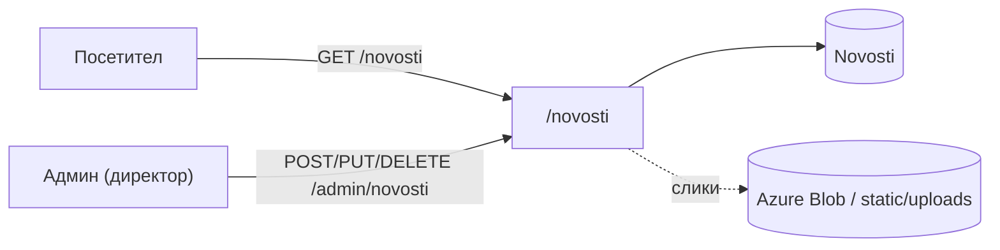
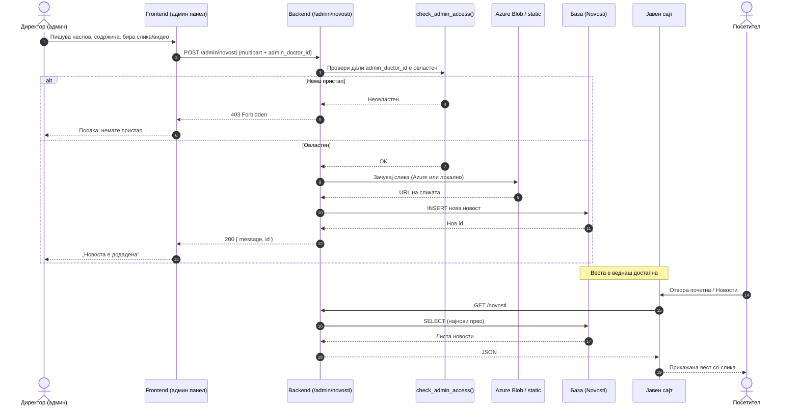

# Новости

Сите endpoints поврзани со **новостите** се дефинирани во `backend/routers/novosti.py` и достапни под префиксот `/novosti`. Модулот е организиран во два слоја на пристап: **јавен**, кој им е достапен на сите посетители на порталот без автентикација, и **административен**, резервиран исклучиво за директорот на установата. Преку јавниот слој новостите се прикажуваат на почетната страница и во делот „Новости" преку административниот, директорот ги создава, ажурира и брише објавите.
Читањето на новости не бара најава, секој посетител на порталот може слободно да ги разгледа објавите. Сите операции кои ја менуваат содржината, меѓутоа, се строго ограничени: само директорот, препознаен по своето корисничко име во системот, има право да создава нови записи, да ги уредува постоечките или да ги отстранува.

> **Интерактивно тестирање:** секој endpoint е придружен со вграден **OpenAPI блок** и копче **„Test it"**, погонувано од Scalar. Пополни ги потребните параметри или тело на барањето и испрати го директно кон живиот сервер (`klinicka-bolnica-stip2026.onrender.com`) — без да ја напушташ документацијата.

## Содржина

* [1. Преглед](novosti.md#1-pregled)
  * [Процес на објавување](novosti.md#proces-na-objavuvanje)
* [2. Пристап и авторизација](novosti.md#2-pristap)
* [3. GET `/novosti`](novosti.md#3-list)
* [4. GET `/novosti/{novost_id}`](novosti.md#4-edna)
* [5. POST `/admin/novosti`](novosti.md#5-kreiraj)
* [6. PUT `/admin/novosti/{novost_id}`](novosti.md#6-azuriraj)
* [7. DELETE `/admin/novosti/{novost_id}`](novosti.md#7-brisi)
* [8. Поврзани табели](novosti.md#8-tabele)

> Поврзани: [Конвенции](conventions.md) · [Администрација](admin.md) · [База — Novosti](../the_database.md) · [Преглед на backend](../pregled.md)

***

## 1. Преглед <a href="#id-1-pregled" id="id-1-pregled"></a>



Јавните endpoints не бараат никаква форма на автентикација и враќаат стандарден **JSON** одговор. Административните endpoints, од друга страна, користат **`multipart/form-data`** — формат кој овозможува прикачување на слики заедно со текстуалната содржина — и бараат валиден `admin_doctor_id` за потврда на идентитетот. Сите грешки се враќаат во формат `{"detail": "порака"}` со соодветен HTTP статус.

| Метод | Патека | Намена | Пристап |
|-------|--------|--------|---------|
| `GET` | `/novosti` | Враќа листа на сите објавени новости | Јавен |
| `GET` | `/novosti/{novost_id}` | Враќа детали за конкретна новост по `id` | Јавен |
| `POST` | `/admin/novosti` | Создава нова новост со опционална слика | Админ |
| `PUT` | `/admin/novosti/{novost_id}` | Ажурира содржина или слика на постоечка новост | Админ |
| `DELETE` | `/admin/novosti/{novost_id}` | Трајно ја брише новоста од системот | Админ |

### Процес на објавување — од директорот до видлива вест

Следниот дијаграм го прикажува целиот тек, чекор по чекор, од моментот кога директорот ја пишува веста до моментот кога таа е видлива за посетителите на сајтот:



Истиот тек важи и за **ажурирање** (`PUT`) и **бришење** (`DELETE`) — разликата е само во операцијата врз базата и сликите; проверката на пристап (`check_admin_access`) е секогаш првиот чекор.

***

## 2. Пристап и авторизација

Административните операции се заштитени преку функцијата `check_admin_access(admin_doctor_id)`, дефинирана во `routers/admin.py`. Секое барање кон административен endpoint мора да го содржи `admin_doctor_id` — идентификаторот на лекарот со администраторски привилегии. Начинот на кој се проследува зависи од типот на барањето:
- кај **POST** и **PUT** се испраќа како поле во `multipart/form-data` телото;
- кај **DELETE** се проследува како **query параметар** (`?admin_doctor_id=...`).

Доколку `admin_doctor_id` недостасува или не припаѓа на овластено лице, backend-от одбива со **`403 Forbidden`** — без дополнително образложение.

### Складирање на слики

Системот поддржува два режима на складирање, во зависност од конфигурацијата на средината:

- **Azure Blob Storage** — ако се поставени `AZURE_STORAGE_CONNECTION_STRING` и `AZURE_CONTAINER_NAME`, сликите автоматски се качуваат во облак и во базата се зачувува целосниот URL.
- **Локално складирање** — во развојна средина без Azure конфигурација, сликите се зачувуваат во `backend/static/uploads/novosti/` и се сервираат преку патеката `/static/...`.

>Дозволени формати за прикачување: `.jpg`, `.jpeg`, `.png`, `.gif`, `.webp`.

***

## 3. GET `/novosti` <a href="#id-3-list" id="id-3-list"></a>

Јавен endpoint кој враќа **листа на сите објавени новости**, подредени од најновата кон најстарата. Не бара никаква форма на автентикација — достапен е за секој посетител на порталот и претставува основа за приказот на новости на почетната страница и во делот „Новости"

**Успешен одговор (200):**

```json
[
  {
    "id": 5,
    "naslov": "Нов кардиолошки апарат во болницата",
    "sodrzina": "Со гордост објавуваме...",
    "slika_path": "https://.../slika.jpg",
    "slika_position": "center",
    "slika_height": "400",
    "video_url": null,
    "slike_extra": ["https://.../1.jpg", "https://.../2.jpg"],
    "created_at": "2026-06-10T12:30:00",
    "updated_at": "2026-06-10T12:30:00",
    "author_name": "Ана",
    "author_surname": "Стојановска"
  }
]
```
* `slike_extra` — листа на дополнителни слики (се чува како JSON во базата, се враќа како низа).
* `author_name` / `author_surname` — доаѓаат преку `LEFT JOIN` со табелата `Doctors`.
* Кодот е отпорен на постари бази: ако недостасуваат колони (`slika_position`, `video_url`, `slike_extra`…), автоматски паѓа назад на минимален `SELECT`.

**Можни грешки:** `500` доколку настане грешка на серверска страна. 


[OpenAPI KlinickaBolnicaAPI](https://klinicka-bolnica-stip2026.onrender.com/openapi.json)


***

## 4. GET `/novosti/{novost_id}` <a href="#id-4-edna" id="id-4-edna"></a>

Го извршува `SELECT` по примарен клуч (`novost_ID`) и враќа точно еден запис. Бидејќи пребарувањето е по индексирано поле, одговорот е константно брз без оглед на бројот на новости во базата.
**Path параметар:** `novost_id` *(задолжителен, цел број)* — одговара на `novost_ID` во табелата `Novosti`
**Успешен одговор (200):** ист JSON објект како записите во `/novosti`, но се враќа директно како објект, не како низа.
**Можни грешки:** `404` (запис со дадениот `novost_ID` не постои во табелата) · `500` (грешка при извршување на SQL или конекција кон базата)


[OpenAPI KlinickaBolnicaAPI](https://klinicka-bolnica-stip2026.onrender.com/openapi.json)


***

## 5. POST `/admin/novosti` <a href="#id-5-kreiraj" id="id-5-kreiraj"></a>

Креира нов запис во табелата `Novosti`. Endpoint-от е ограничен исклучиво на администратори — секое барање мора да содржи валиден `admin_doctor_id`, кој се верификува преку `check_admin_access()` пред да се изврши која било операција врз базата.
Наместо стандарден `application/json`, endpoint-от прима `multipart/form-data` — формат кој овозможува истовремено праќање на текстуални полиња и бинарна содржина (слика) во едно барање.

**Полиња (form-data):**

| Поле               | Тип    | Задолжително | Опис                                                  |
| ------------------ | ------ | ------------ | ----------------------------------------------------- |
| `naslov`           | text   | да           | Наслов на новоста                                     |
| `sodrzina`         | text   | да           | Текст/содржина на новоста                             |
| `admin_doctor_id`  | int    | да           | ID на администраторот (за проверка на пристап)        |
| `video_url`        | text   | не           | Линк до видео (на пр. YouTube)                         |
| `slika_position`   | text   | не           | Позиција на главната слика (на пр. `center`)           |
| `slika_height`     | text   | не           | Висина на сликата                                     |
| `slika_url`        | text   | не           | URL на слика (наместо прикачување фајл)                |
| `slika`            | file   | не           | Прикачена главна слика                                 |
| `slike_extra_urls` | text   | не           | Дополнителни слики како URL-ови (по една во ред)        |
| `sliki_extra`      | file[] | не           | Повеќе прикачени дополнителни слики                    |

**Успешен одговор (200):**

```json
{ "message": "Новоста е додадена.", "id": 12 }
```

**Можни грешки:** `400` (полето `naslov` е празно или недостасува — задолжително поле) · `403` (проследениот `admin_doctor_id` не постои или не припаѓа на овластен администратор) · `500` (грешка при запис во базата или при качување на слика)

> Може да се зададе слика на **два начина**: со прикачување фајл (`slika`) или со готов URL (`slika_url`). Ако се зададе валиден URL, тој има предност.


[OpenAPI KlinickaBolnicaAPI](https://klinicka-bolnica-stip2026.onrender.com/openapi.json)


***

## 6. PUT `/admin/novosti/{novost_id}` <a href="#id-6-azuriraj" id="id-6-azuriraj"></a>

Извршува парцијално **ажурирање на постоечки запис во табелата `Novosti`**. За разлика од создавањето, сите полиња се **опционални** — backend-от ги ажурира само оние полиња кои се проследени во барањето, додека останатите ја задржуваат постојната вредност. Исто така прима `multipart/form-data` и бара валиден `admin_doctor_id`.

Покрај стандардните полиња од создавањето, ажурирањето поддржува и две дополнителни:

| Поле           | Тип  | Опис                                                          |
| -------------- | ---- | ------------------------------------------------------------ |
| `remove_slika` | text | `1`/`true`/`yes` — ја брише постоечката главна слика          |

**Path параметар:** `novost_id` (цел број, задолжителен)

При ажурирање, backend-от следи неколку правила:
- Доколку се прикачи нова слика, старата локална слика автоматски се брише од дискот пред да се зачува новата.
- Полињата `naslov` и `sodrzina` се опционални — ако не се проследат, нивните постојни вредности остануваат непроменети.
- И покрај тоа, `naslov` **не смее да биде празен** по ажурирањето — доколку е проследен, мора да содржи валидна вредност.

**Успешен одговор (200):**

```json
{ "message": "Новоста е ажурирана.", "id": 12 }
```

**Можни грешки:** `400` (полето `naslov` е проследено, но е празно) · `403` (проследениот `admin_doctor_id` не постои или не припаѓа на овластен администратор) · `404` (запис со дадениот `novost_id` не постои во табелата) · `500` (грешка при запис во базата или при манипулација со слики на дискот)


[OpenAPI KlinickaBolnicaAPI](https://klinicka-bolnica-stip2026.onrender.com/openapi.json)


***

## 7. DELETE `/admin/novosti/{novost_id}` <a href="#id-7-brisi" id="id-7-brisi"></a>

Извршува каскадно бришење — прво ги отстранува сите поврзани локални слики (главна и дополнителни) од дискот, а потоа го брише самиот запис од табелата `Novosti`. Редоследот е намерен: доколку бришењето на записот не успее, сликите нема да бидат отстранети и системот останува во конзистентна состојба.
**Path параметар:** `novost_id` *(задолжителен, цел број)*
**Query параметар:** `admin_doctor_id` *(задолжителен, цел број)* — верифициран преку `check_admin_access()` пред да се изврши која било промена

```
DELETE /admin/novosti/12?admin_doctor_id=2
```

**Успешен одговор (200):**

```json
{ "message": "Новоста е избришана." }
```

**Можни грешки:** `403` (проследениот `admin_doctor_id` недостасува или не припаѓа на овластен администратор — бришењето се одбива пред да се изврши каква било промена) · `404` (запис со дадениот `novost_id` не постои во табелата) · `500` (грешка при бришење на запис од базата или при отстранување на слики од дискот)


[OpenAPI KlinickaBolnicaAPI](https://klinicka-bolnica-stip2026.onrender.com/openapi.json)


***

## 8. Поврзани табели <a href="#id-8-tabele" id="id-8-tabele"></a>

| Табела    | Улога во `/novosti`                                             |
| --------- | -------------------------------------------------------------- |
| `Novosti` | Содржина на новостите (наслов, текст, слики, видео, автор)      |
| `Doctors` | Автор на новоста (`author_doctor_id` → `doctor_ID`)            |

Детали за колони и врски: [База на податоци](../the_database.md).

***

Следно: [Кариера](kariera.md) · [Администрација](admin.md)
