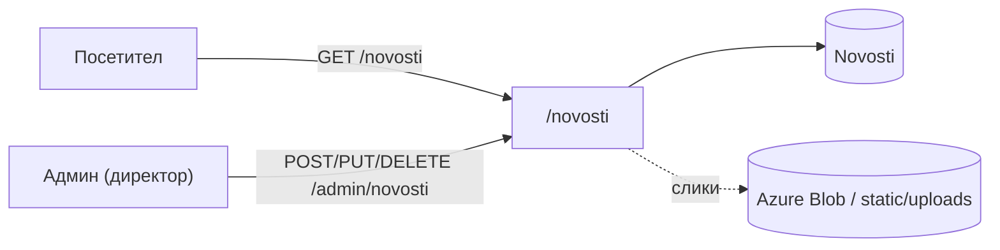
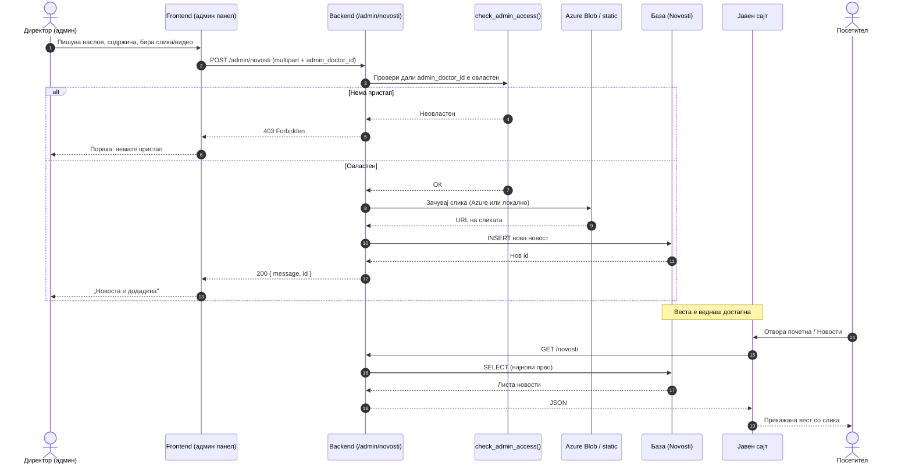

# Новости

Делот за новости на болничкиот портал, дефиниран во `backend/routers/novosti.py` и монтиран под префиксот `/novosti`, го дели пристапот во два јасно одвоени слоја. Јавниот слој е отворен за секој посетител без потреба од најава — токму преку него новостите се прикажуваат на почетната страница и во посебниот дел „Новости". Административниот слој, наспроти тоа, е резервиран исклучиво за директорот на установата, кој преку него ги создава, ажурира и брише објавите.

Оваа поделба не е случајна: читањето на новости не носи никаков ризик и затоа не бара автентикација, додека секоја операција која ја менува содржината би можела да наруши информација веќе прикажана јавно, па затоа е строго ограничена. Системот притоа не препознава посебна „административна улога" — наместо тоа, проверува дали корисничкото име на најавениот лекар се совпаѓа со конкретно одредениот директор, што практично значи дека само една единствена сметка во целиот систем има право да создава, уредува или брише новости.

> **Интерактивно тестирање:** секој endpoint е придружен со вграден **OpenAPI блок** и копче **„Test it"**, погонувано од Scalar. Пополни ги потребните параметри или тело на барањето и испрати го директно кон живиот сервер (`klinicka-bolnica-stip2026.onrender.com`) — без да ја напушташ документацијата.

## Содржина

* [1. Преглед](novosti.md#1-pregled)
  * [Процес на објавување](novosti.md#proces-na-objavuvanje)
* [2. Пристап и авторизација](novosti.md#2-pristap)
* [3. GET `/novosti`](novosti.md#3-list)
* [4. GET `/novosti/{novost_id}`](novosti.md#4-edna)
* [5. POST `/admin/novosti`](novosti.md#5-kreiraj)
* [6. PUT `/admin/novosti/{novost_id}`](novosti.md#6-azuriraj)
* [7. DELETE `/admin/novosti/{novost_id}`](novosti.md#7-brisi)
* [8. Поврзани табели](novosti.md#8-tabele)

> Поврзани: [Конвенции](conventions.md) · [Администрација](admin.md) · [База — Novosti](../the_database.md) · [Преглед на backend](../pregled.md)

***

## 1. Преглед <a href="#id-1-pregled" id="id-1-pregled"></a>



Јавните endpoints не бараат никаква форма на автентикација и враќаат стандарден **JSON** одговор. Административните endpoints, од друга страна, користат **`multipart/form-data`** — формат кој овозможува прикачување на слики заедно со текстуалната содржина — и бараат валиден `admin_doctor_id` за потврда на идентитетот. Сите грешки се враќаат во формат `{"detail": "порака"}` со соодветен HTTP статус.

| Метод | Патека | Намена | Пристап |
|-------|--------|--------|---------|
| `GET` | `/novosti` | Враќа листа на сите објавени новости | Јавен |
| `GET` | `/novosti/{novost_id}` | Враќа детали за конкретна новост по `id` | Јавен |
| `POST` | `/admin/novosti` | Создава нова новост со опционална слика | Админ |
| `PUT` | `/admin/novosti/{novost_id}` | Ажурира содржина или слика на постоечка новост | Админ |
| `DELETE` | `/admin/novosti/{novost_id}` | Трајно ја брише новоста од системот | Админ |

### Процес на објавување — од директорот до видлива вест

Следниот дијаграм го прикажува целиот тек, чекор по чекор, од моментот кога директорот ја пишува веста до моментот кога таа е видлива за посетителите на сајтот:



Истиот тек важи и за **ажурирање** (`PUT`) и **бришење** (`DELETE`) — разликата е само во операцијата врз базата и сликите; проверката на пристап (`check_admin_access`) е секогаш првиот чекор.

***

## 2. Пристап и авторизација
Административните операции во овој модул се заштитени преку истата функција `check_admin_access`(`admin_doctor_id`), дефинирана во `routers/admin.py` и веќе позната од дежурствата и огласите — секое барање кон административен endpoint мора да го носи `admin_doctor_id`, идентификаторот на лекарот со администраторски привилегии. Начинот на проследување овде, меѓутоа, се разликува од останатиот дел на административниот API: кај POST и PUT, наместо обичен JSON body, се користи `multipart/form-data`, бидејќи истото барање често носи и слика за прикачување, а слика не може да патува низ обичен JSON. 
Кај DELETE, каде нема прикачена содржина, `admin_doctor_id` останува како query параметар — конзистентно со конвенцијата веќе воспоставена низ останатиот административен дел на API-то.

Доколку `admin_doctor_id` недостасува или не припаѓа на овластено лице, backend-от одбива со `403 Forbidden`, без дополнително образложение во пораката — истото строго и недвосмислено однесување применето и кај другите административни проверки во системот.

### Складирање на слики

Системот поддржува два режима на складирање слики, избрани автоматски според конфигурацијата на средината во која работи, без апликацијата експлицитно да мора да бира помеѓу нив. 
1. Доколку се поставени `AZURE_STORAGE_CONNECTION_STRING` и `AZURE_CONTAINER_NAME`, сликите се качуваат директно во `Azure Blob Storage`, а во базата се зачувува целосниот URL до облакот.
2. Во отсуство на таа конфигурација — типично во развојна средина — истите слики се зачувуваат локално, во `backend/static/uploads/novosti/`, и се сервираат преку патеката `/static/...`. Овој fallback овозможува развој и тестирање без потреба од вистински Azure акаунт, додека продукциската средина може да се потпира на облак за подобра издржливост и скалабилност.
>Дозволени формати за прикачување: `.jpg`, `.jpeg`, `.png`, `.gif`, `.webp`.

***

## 3. GET `/novosti` <a href="#id-3-list" id="id-3-list"></a>

Овој endpoint е јавната врата кон сите објави во делот за новости — враќа целосна листа, подредена од најновата кон најстарата, без потреба од најава или било каков вид овластување. Токму тој одговор ги храни и почетната страница на порталот, и посебниот дел „Новости", двата места каде посетителите ја гледаат истата содржина.
Одговорот носи неколку детали вредни одделно објаснување. Полето `slike_extra` се чува во базата како JSON низа во една колона, но при враќање кон клиентот веќе пристигнува распакувано како вистинска низа од URL-адреси, не како суров JSON стринг. `author_name` и `author_surname` не доаѓаат од самата табела Novosti, туку преку LEFT JOIN со Doctors, поврзан преку `author_doctor_id — со LEFT`, а не обичен JOIN, токму за да новост без познат автор не исчезне целосно од листата.

**Успешен одговор (200):**
```json
[
  {
    "id": 5,
    "naslov": "Нов кардиолошки апарат во болницата",
    "sodrzina": "Со гордост објавуваме...",
    "slika_path": "https://.../slika.jpg",
    "slika_position": "center",
    "slika_height": "400",
    "video_url": null,
    "slike_extra": ["https://.../1.jpg", "https://.../2.jpg"],
    "created_at": "2026-06-10T12:30:00",
    "updated_at": "2026-06-10T12:30:00",
    "author_name": "Ана",
    "author_surname": "Стојановска"
  }
]
```
* `slike_extra` — листа на дополнителни слики (се чува како JSON во базата, се враќа како низа).
* `author_name` / `author_surname` — доаѓаат преку `LEFT JOIN` со табелата `Doctors`.
* Кодот е отпорен на постари бази: ако недостасуваат колони (`slika_position`, `video_url`, `slike_extra`…), автоматски паѓа назад на минимален `SELECT`.

**Можни грешки:**
- `500` доколку настане грешка на серверска страна. 

**Каде се користи:** На frontend страна, овој endpoint го повикува `script.js` на два места: на почетната страница, каде се прикажуваат најновите објави во кратка форма, и во посебниот дел „Новости", каде целата листа се прикажува со повеќе детали. Бидејќи одговорот веќе доаѓа подреден по датум, frontend-от не мора повторно да сортира — само да одлучи колку записи да прикаже на секое место.
**Имплементација (FastAPI):**

```python
@router.get("/novosti", response_model=List[dict])
def list_novosti():
    db_cursor.execute("""
        SELECT n.*, d.name AS author_name, d.surname AS author_surname
        FROM Novosti n LEFT JOIN Doctors d ON n.author_doctor_id = d.doctor_ID
        ORDER BY n.created_at DESC
    """)
    return [format_row(r) for r in rows]   # slike_extra како JSON низа
```
Функцијата `format_row` , повикана за секој ред, е местото каде се случува и распакувањето на `slike_extra`, и `fallback-от` за постари шеми — целата логика за нормализирање на одговорот е концентрирана на едно место, наместо повторена низ секој endpoint кој враќа запис за новост.


[OpenAPI KlinickaBolnicaAPI](https://klinicka-bolnica-stip2026.onrender.com/openapi.json)


***

## 4. GET `/novosti/{novost_id}` <a href="#id-4-edna" id="id-4-edna"></a>

За разлика од листата во претходната точка, овој endpoint враќа само еден конкретен запис, идентификуван по примарниот клуч `novost_ID`. Бидејќи пребарувањето се случува по индексирано поле, а не со скенирање ред по ред низ цела табела, MySQL го наоѓа соодветниот ред речиси веднаш, без забележителна разлика во брзината на одговор без оглед дали Novosti содржи десет или десет илјади записи.

**Path параметар**: `novost_id` (задолжителен, цел број) — одговара на novost_ID во табелата Novosti.

**Успешен одговор**(200): ист JSON облик како секој поединечен елемент од листата во `/novosti`, со разлика што се враќа директно како објект, не како низа со еден елемент.

**Можни грешки**: 
- `404` (запис со дадениот novost_ID не постои)
- `500` (грешка при извршување на SQL или конекција кон базата). 
Разликата меѓу нив е важна: `404` значи дека идентификаторот е валиден цел број, но просто не одговара на постоечки запис, додека `500` значи дека самото извршување на барањето пропаднало, без врска со конкретната вредност на ID.

**Каде се користи:** Секоја вест на „Новости" страницата носи сопствен, директен URL — линк кој посетителот може да го отвори без претходно да поминал низ листата, на пример преку споделена врска или директен сигнал во прелистувачот. Во таков случај, ѝscript.jsѝ нема од каде да земе веќе преземени податоци во меморија, па мора одделно да го повика овој endpoint и да го пополни приказот само врз основа на novost_ID-то од URL-то.

**Имплементација (FastAPI):**

```python
@router.get("/novosti/{novost_id}", response_model=dict)
def get_novost(novost_id: int):
    conn = get_connection()
    cur = conn.cursor(dictionary=True)
    cur.execute("""
        SELECT n.id, n.naslov, n.sodrzina, n.slika_path, n.slika_position, n.slika_height,
               n.video_url, n.slike_extra, n.created_at, n.updated_at,
               d.name AS author_name, d.surname AS author_surname
        FROM Novosti n
        LEFT JOIN Doctors d ON n.author_doctor_id = d.doctor_ID
        WHERE n.id = %s
    """, (novost_id,))
    row = cur.fetchone()
    if not row:
        raise HTTPException(status_code=404, detail="Новостта не е пронајдена")
    _normalize_novost_row(row)
    return row
```

Истиот `SELECT` како кај листата `/novosti`, со `WHERE n.id = %s`. Кодот има fallback за постари бази без колони `video_url` / `slike_extra` (како кај точка 3).


[OpenAPI KlinickaBolnicaAPI](https://klinicka-bolnica-stip2026.onrender.com/openapi.json)


***

## 5. POST `/admin/novosti` <a href="#id-5-kreiraj" id="id-5-kreiraj"></a>

Креира нов запис во табелата `Novosti`. Endpoint-от е ограничен исклучиво на администратори — секое барање мора да содржи валиден `admin_doctor_id`, кој се верификува преку `check_admin_access()` пред да се изврши која било операција врз базата.
Наместо стандарден `application/json`, endpoint-от прима `multipart/form-data` — формат кој овозможува истовремено праќање на текстуални полиња и бинарна содржина (слика) во едно барање.

**Полиња (form-data):**

| Поле               | Тип    | Задолжително | Опис                                                  |
| ------------------ | ------ | ------------ | ----------------------------------------------------- |
| `naslov`           | text   | да           | Наслов на новоста                                     |
| `sodrzina`         | text   | да           | Текст/содржина на новоста                             |
| `admin_doctor_id`  | int    | да           | ID на администраторот (за проверка на пристап)        |
| `video_url`        | text   | не           | Линк до видео (на пр. YouTube)                         |
| `slika_position`   | text   | не           | Позиција на главната слика (на пр. `center`)           |
| `slika_height`     | text   | не           | Висина на сликата                                     |
| `slika_url`        | text   | не           | URL на слика (наместо прикачување фајл)                |
| `slika`            | file   | не           | Прикачена главна слика                                 |
| `slike_extra_urls` | text   | не           | Дополнителни слики како URL-ови (по една во ред)        |
| `sliki_extra`      | file[] | не           | Повеќе прикачени дополнителни слики                    |

**Успешен одговор (200):**

```json
{ "message": "Новоста е додадена.", "id": 12 }
```

**Можни грешки:** `400` (полето `naslov` е празно или недостасува — задолжително поле) · `403` (проследениот `admin_doctor_id` не постои или не припаѓа на овластен администратор) · `500` (грешка при запис во базата или при качување на слика)

**Каде се користи:** frontend — `script.js` (админ форма за нова вест, `FormData`).

**Имплементација (FastAPI):**

```python
@router.post("/admin/novosti")
def create_novost(
    naslov: str = Form(...),
    sodrzina: str = Form(...),
    admin_doctor_id: int = Form(...),
    video_url: Optional[str] = Form(None),
    slika_position: Optional[str] = Form(None),
    slika_height: Optional[str] = Form(None),
    slika_url: Optional[str] = Form(None),
    slika: Optional[UploadFile] = File(None),
    slike_extra_urls: Optional[str] = Form(None),
    sliki_extra: List[UploadFile] = File(default=[]),
):
    if not check_admin_access(admin_doctor_id):
        raise HTTPException(status_code=403, detail="...")
    if not naslov.strip():
        raise HTTPException(status_code=400, detail="Насловот е задолжителен.")
    # главна слика: валиден slika_url има предност, инаку _save_upload(slika)
    # → Azure Blob (production) или /static/uploads/novosti/ (локален dev)
    slika_path = slika_url if _is_full_url(slika_url) else _save_upload(slika)
    # дополнителни: slike_extra_urls (по еден URL во ред) + прикачени sliki_extra
    slike_extra_json = json.dumps(extra_paths) if extra_paths else None
    cur.execute(
        """INSERT INTO Novosti (naslov, sodrzina, slika_path, slika_position,
           slika_height, video_url, slike_extra, author_doctor_id) VALUES (%s, ...)""",
        (naslov, sodrzina, slika_path, slika_position, slika_height,
         video_url, slike_extra_json, admin_doctor_id),
    )
    conn.commit()
    return {"message": "Новоста е додадена.", "id": cur.lastrowid}
```

- Користи **`multipart/form-data`** (`Form(...)` + `UploadFile`), не JSON.
- Дополнителните слики се чуваат како JSON низа во `slike_extra`; има fallback на минимален `INSERT` ако недостасуваат колони.
- Главната слика може преку **`slika_url`** (готов URL) или **`slika`** (прикачен фајл) — URL има предност.


[OpenAPI KlinickaBolnicaAPI](https://klinicka-bolnica-stip2026.onrender.com/openapi.json)


***

## 6. PUT `/admin/novosti/{novost_id}` <a href="#id-6-azuriraj" id="id-6-azuriraj"></a>

Извршува парцијално **ажурирање на постоечки запис во табелата `Novosti`**. За разлика од создавањето, сите полиња се **опционални** — backend-от ги ажурира само оние полиња кои се проследени во барањето, додека останатите ја задржуваат постојната вредност. Исто така прима `multipart/form-data` и бара валиден `admin_doctor_id`.

Покрај стандардните полиња од создавањето, ажурирањето поддржува и две дополнителни:

| Поле           | Тип  | Опис                                                          |
| -------------- | ---- | ------------------------------------------------------------ |
| `remove_slika` | text | `1`/`true`/`yes` — ја брише постоечката главна слика          |

**Path параметар:** `novost_id` (цел број, задолжителен)

При ажурирање, backend-от следи неколку правила:
- Доколку се прикачи нова слика, старата локална слика автоматски се брише од дискот пред да се зачува новата.
- Полињата `naslov` и `sodrzina` се опционални — ако не се проследат, нивните постојни вредности остануваат непроменети.
- И покрај тоа, `naslov` **не смее да биде празен** по ажурирањето — доколку е проследен, мора да содржи валидна вредност.

**Успешен одговор (200):**

```json
{ "message": "Новоста е ажурирана.", "id": 12 }
```

**Можни грешки:** `400` (полето `naslov` е проследено, но е празно) · `403` (проследениот `admin_doctor_id` не постои или не припаѓа на овластен администратор) · `404` (запис со дадениот `novost_id` не постои во табелата) · `500` (грешка при запис во базата или при манипулација со слики на дискот)

**Каде се користи:** frontend — `script.js` (админ уредување вест).

**Имплементација (FastAPI):**

```python
@router.put("/admin/novosti/{novost_id}")
def update_novost(novost_id: int, naslov: str = Form(None), sodrzina: str = Form(None),
                  admin_doctor_id: int = Form(...), remove_slika: str = Form(None), ...):
    if not check_admin_access(admin_doctor_id): raise HTTPException(403, ...)
    cur.execute("SELECT id, slika_path, ... FROM Novosti WHERE id = %s", (novost_id,))
    if not row: raise HTTPException(404, "Новостта не е пронајдена.")
    # само проследените полиња се менуваат; останатите ја задржуваат старата вредност
    # remove_slika=1/true/yes → брише стара локална слика од диск
    if not new_naslov: raise HTTPException(400, "Насловот е задолжителен.")
    cur.execute("UPDATE Novosti SET naslov=%s, sodrzina=%s, slika_path=%s, ... WHERE id=%s", (...))
    conn.commit()
    return {"message": "Новоста е ажурирана.", "id": novost_id}
```

- Парцијален `UPDATE` — `Form(None)` значи дека неприсутно поле ја задржува постоечката вредност.
- Нова слика (или `remove_slika`) ја брише старата локална датотека од диск пред зачувување.


[OpenAPI KlinickaBolnicaAPI](https://klinicka-bolnica-stip2026.onrender.com/openapi.json)


***

## 7. DELETE `/admin/novosti/{novost_id}` <a href="#id-7-brisi" id="id-7-brisi"></a>

Извршува каскадно бришење — прво ги отстранува сите поврзани локални слики (главна и дополнителни) од дискот, а потоа го брише самиот запис од табелата `Novosti`. Редоследот е намерен: доколку бришењето на записот не успее, сликите нема да бидат отстранети и системот останува во конзистентна состојба.
**Path параметар:** `novost_id` *(задолжителен, цел број)*
**Query параметар:** `admin_doctor_id` *(задолжителен, цел број)* — верифициран преку `check_admin_access()` пред да се изврши која било промена

```
DELETE /admin/novosti/12?admin_doctor_id=2
```

**Успешен одговор (200):**

```json
{ "message": "Новоста е избришана." }
```

**Можни грешки:** `403` (проследениот `admin_doctor_id` недостасува или не припаѓа на овластен администратор — бришењето се одбива пред да се изврши каква било промена) · `404` (запис со дадениот `novost_id` не постои во табелата) · `500` (грешка при бришење на запис од базата или при отстранување на слики од дискот)

**Каде се користи:** frontend — `script.js` (админ бришење вест).

**Имплементација (FastAPI):**

```python
@router.delete("/admin/novosti/{novost_id}")
def delete_novost(novost_id: int, admin_doctor_id: Optional[int] = None):
    if admin_doctor_id is None or not check_admin_access(admin_doctor_id): raise HTTPException(403, ...)
    cur.execute("SELECT slika_path, slike_extra FROM Novosti WHERE id = %s", (novost_id,))
    if not row: raise HTTPException(404, "Новостта не е пронајдена.")
    cur.execute("DELETE FROM Novosti WHERE id = %s", (novost_id,))
    conn.commit()
    # потоа брише локални датотеки: главна слика + сите од slike_extra
    return {"message": "Новоста е избришана."}
```

- Прво `DELETE` од базата, па отстранување на локалните слики (главна + `slike_extra`) од диск.


[OpenAPI KlinickaBolnicaAPI](https://klinicka-bolnica-stip2026.onrender.com/openapi.json)


***

## 8. Поврзани табели <a href="#id-8-tabele" id="id-8-tabele"></a>

| Табела    | Улога во `/novosti`                                             |
| --------- | -------------------------------------------------------------- |
| `Novosti` | Содржина на новостите (наслов, текст, слики, видео, автор)      |
| `Doctors` | Автор на новоста (`author_doctor_id` → `doctor_ID`)            |

Детали за колони и врски: [База на податоци](../the_database.md).

***

Следно: [Кариера](kariera.md) · [Администрација](admin.md)
