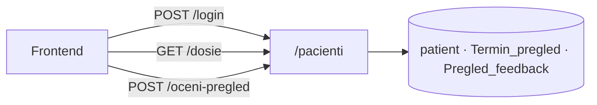
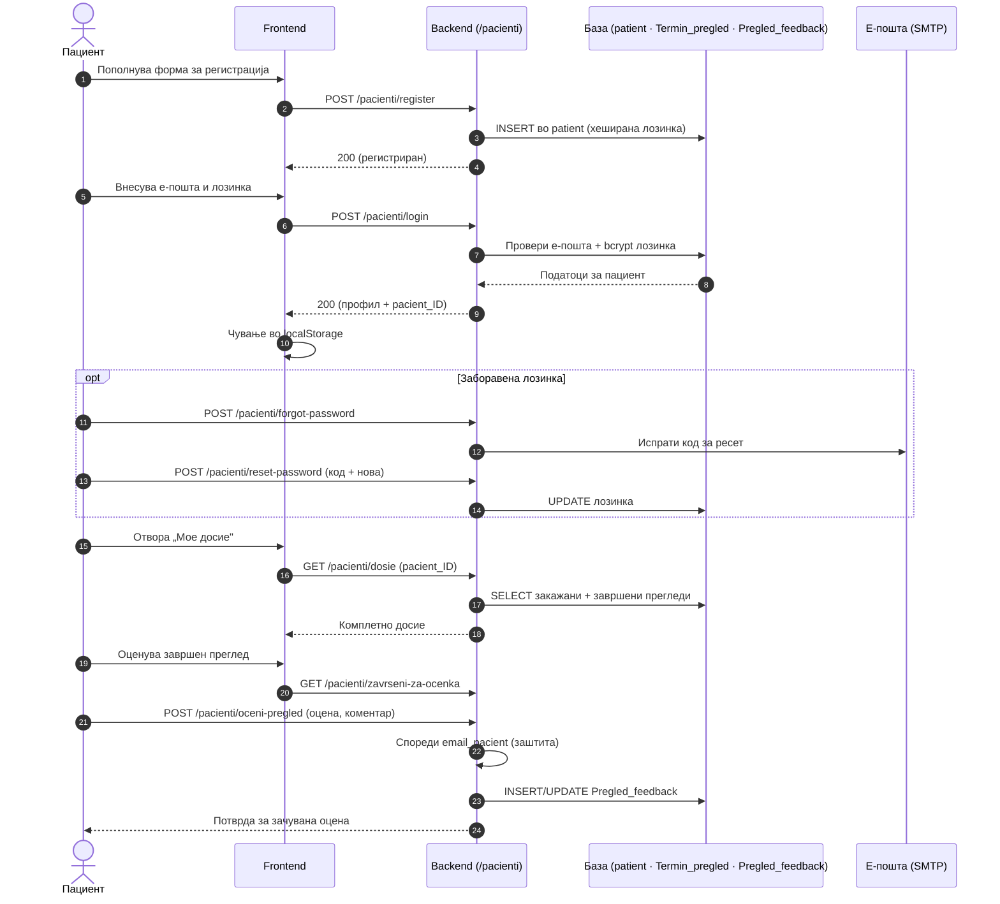

# Пациенти

Сите endpoints поврзани со **пациентите** се дефинирани во `backend/routers/pacienti.py` и достапни под префиксот `/pacienti`. Овој модул ги покрива сите клучни операции во животниот циклус на пациентот во системот — од иницијалната регистрација и автентикација, преку рестартирање на лозинка, па сè до пристап до личното досие и оценување на завршени прегледи.

> **Интерактивно тестирање:** секој endpoint е придружен со вграден **OpenAPI блок** и копче **„Test it"**, погонувано од Scalar. Пополни ги потребните параметри или тело на барањето и испрати го директно кон живиот сервер (`klinicka-bolnica-stip2026.onrender.com`) — без да ја напушташ документацијата.

> Поврзани: [Конвенции](conventions.md) · [Автентикација](authentication.md) · [Термини](termini.md) · [База — patient](../the_database.md#tab-patient) · [Преглед на backend](../pregled.md)

***

## 1. Преглед <a href="#id-1-pregled" id="id-1-pregled"></a>



Сите барања се **JSON** (`Content-Type: application/json`), освен ако не е наведено поинаку. Одговорите се **JSON**. Грешките доаѓаат како `{"detail": "порака"}` со соодветен HTTP статус.

| Метод  | Патека                         | Намена                     |
| ------ | ------------------------------ | -------------------------- |
| `POST` | `/pacienti/register`           | Нова регистрација          |
| `POST` | `/pacienti/login`              | Најава                     |
| `POST` | `/pacienti/forgot-password`    | Барање код за ресет        |
| `POST` | `/pacienti/reset-password`     | Нова лозинка со код        |
| `GET`  | `/pacienti/dosie`              | Комплетно досие            |
| `GET`  | `/pacienti/zavrseni-za-ocenka` | Завршени прегледи за оцена |
| `POST` | `/pacienti/oceni-pregled`      | Остави/ажурирај оцена      |

### Тек на податоци — од регистрација до оцена

Дијаграмот го прикажува целиот пат на пациентот низ системот: регистрација, најава (со чување на податоци во `localStorage`), пристап до досие и оценување на завршен преглед.



***

## 2. Автентикација <a href="#id-2-auth" id="id-2-auth"></a>

Системот **не користи JWT или сесиски cookies** за пациенти. По успешна најава, frontend-от ги чува податоците на пациентот (вклучувајќи го `pacient_ID`) во `localStorage` и ги проследува како query параметар или во JSON телото на барањето каде што е потребно. Ова значи дека endpoints како `/dosie` и `/oceni-pregled` не проверуваат токен — се потпираат на тоа дека frontend-от праќа валиден `pacient_ID`. Како дополнителен слој на заштита, backend-от ја споредува **е-поштата на пациентот** со полето `email_pacient` на терминот при оценување, со цел да се спречи пристап до туѓи записи.

> Овој пристап е функционален во рамките на универзитетскиот проект. За продукциска средина, препорачливо е воведување на серверски сесии или JWT автентикација за поцврста безбедносна гаранција.

***

## 3. POST `/pacienti/register` <a href="#id-3-register" id="id-3-register"></a>

За разлика од регистрацијата кај лекар, каде записот за тој лекар веќе е претходно креиран од администратор и `POST /lekari/register` само го активира со UPDATE, кај пациент нема таков подготвен ред кој чека да биде пополнет. Затоа овој endpoint е единствената вистинска точка на креирање нов кориснички запис во пациентскиот дел на системот — извршува чист `INSERT` во табелата `patient`, без претходна претпоставка дека редот веќе постои. Токму поради отсуството на постоечки ред со кој новиот внес би можел да се совпадне, единствената одбрана против дупликат-регистрација се проверките за уникатност на email и embg, опишани подолу.

**Тело (JSON):**

```json
{
  "ime": "Иван",
  "prezime": "Ивановски",
  "email": "ivan@example.com",
  "password": "Lozinka1.",
  "telefon": "070123456",
  "embg": "0101990450012"
}
```

**Валидација:**

Валидацијата се извршува целосно на серверска страна, без потпирање на тоа дека frontend-от веќе ги провери истите правила.

* **ime, prezime и email** се задолжителни полиња,
* **email-форматот** мора да содржи @ и домен со точка.
* **Лозинката** мора да има најмалку 8 карактери.
* **ЕМБГ**-то поминува низ санитизација пред проверка на должина — секој не-нумерички карактер се отфрла од внесот, а потоа се бара точно 13 преостанати цифри.
* **Телефонскиот број** е опционален и, ако е внесен, се нормализира на исти принцип — се чуваат само цифрите и знакот +, со ограничување до 20 знаци.
* email-от, и ЕМБГ-то мора да бидат уникатни во базата, уникатноста не се потпира на ограничување на ниво на база, туку се проверува експлицитно во апликативниот код преку две одделни SELECT барања пред да се изврши INSERT. **Успешен одговор (200):**

```json
{
  "message": "Направена е успешна регистрација. Можете да се најавите со вашата електронска пошта и лозинка.",
  "pacient_id": 42
}
```

**Можни грешки:**

* `400` (невалидни полиња или дупликат на email/embg)
* `500` (внатрешна грешка на серверот — на пример, ако колоната embg сè уште не постои во инстанцата на базата, потребна е миграцијата 001\_patient\_embg.sql)

> Лозинката никогаш не се зачувува како чист текст — пред `INSERT`, поминува низ `hash_password()` од `password_utils.py`, која ja конвертира во `bcrypt` хеш со вграден `salt`. Дури и со целосен пристап до базата, оригиналната лозинка не може да се прочита назад, само да се верификува при следна најава.

**Каде се користи:** На frontend страна, формата за регистрација на пациент во `script.js` прави клиентска предпроверка на истите правила — должина на лозинка, формат на email, број на цифри во ЕМБГ — единствено за да му даде на корисникот веднашна повратна информација, без чекање на round-trip до серверот. Таа предпроверка нема никаков авторитет сама по себе: финалната одлука секогаш е на серверот, а доколку клиентската и серверската валидација некогаш се разминат, одговорот од овој endpoint е тој што се смета за точен. Кога серверот ja одбие регистрацијата, пораката од HTTPException се прикажува директно во истата форма, без презагрузување на страницата. При успех, корисникот се пренасочува кон екранот за најава.

**Имплементација (FastAPI):**

```python
@router.post("/register", openapi_extra={...})
async def register_pacienti(request: Request):
    data = await request.json()
    embg = "".join(c for c in str(data.get("embg") or "") if c.isdigit())  # само цифри
    # валидација: ime/prezime, email (@ и домен), password ≥ 8, embg == 13
    db_cursor.execute("SELECT patient_ID FROM patient WHERE LOWER(email) = %s", (email.lower(),))
    if db_cursor.fetchone(): raise HTTPException(400, "email веќе користен")
    db_cursor.execute("SELECT patient_ID FROM patient WHERE embg = %s", (embg,))
    if db_cursor.fetchone(): raise HTTPException(400, "ЕМБГ веќе регистриран")
    password_hash = hash_password(password)
    db_cursor.execute("INSERT INTO patient (...) VALUES (%s, ...)", (...))
    conn.commit()
    return {"message": "...", "pacient_id": db_cursor.lastrowid}
```

Редоследот на операции не е случаен: Прво се проверуваат двата уникатни клуча, и само ако ниедна проверка не врати постоечки запис, се пресметува хешот и се извршува INSERT. На тој начин, никогаш не се троши работа на хеширање за барање што веднаш потоа ќе биде одбиено како дупликат. Параметризираниот INSERT (плејсхолдери %s, без директна интерполација на стрингови) ja елиминира можноста за SQL injection преку внесените податоци, а pacient\_id во одговорот доаѓа директно од db\_cursor.lastrowid — автоматски доделениот примарен клуч на новиот ред.


[OpenAPI KlinickaBolnicaAPI](https://klinicka-bolnica-stip2026.onrender.com/openapi.json)


***

## 4. POST `/pacienti/login` <a href="#id-4-login" id="id-4-login"></a>

Endpoint-от автентицира постоечки пациент преку комбинација од е-пошта и лозинка, со намерно поедноставена стратегија на грешки: без разлика дали проблемот е непостоечка е-пошта или погрешна лозинка, клиентот добива идентична 401 порака. Тоа е истата заштита од user enumeration која се применува низ целиот систем — разлика во одговорот сама по себе би можела да открие кои е-пошти воопшто се регистрирани во базата.

**Тело (JSON):**

```json
{
  "email": "ivan@example.com",
  "password": "Lozinka1."
}
```

Е-поштата пред пребарување се нормализира со `strip()` и l`ower()`, така што регистрација со „Ivan@Example.com" и подоцнежна најава со „ivan@example.com" сепак се совпаѓаат. Самата лозинка никогаш не се чита назад од базата за споредба — се споредува преку `verify_password()`, функција која интерно прави `bcrypt`-споредба меѓу внесената лозинка и зачуваниот хеш, без некогаш да ja декодира оригиналната вредност.

**Успешен одговор (200):**

```json
{
  "pacient": {
    "pacient_ID": 42,
    "ime": "Иван",
    "prezime": "Ивановски",
    "email": "ivan@example.com",
    "telefon": "070123456",
    "embg": "0101990450012"
  }
}
```

Frontend-от го чува овој објект во `localStorage` под клучот `currentPacient`, а `pacient_ID` од него потоа служи како lookup клуч за секој следен повик специфичен за тој пациент — на пример при закажување или преглед на термини.

**Можни грешки:**

* `400` (е-поштата или лозинката недостасуваат во барањето)
* `401` (невалидна комбинација — намерно иста порака без разлика дали проблемот е во email или во лозинка)
* `500` (внатрешна грешка на серверот)

**Каде се користи:** На frontend страна, формата за најава во `script.js` прави само основна клиентска проверка — дали полињата воопшто се пополнети — пред да испрати барање, тоа е единствено за веднашна повратна информација, не замена за серверската проверка на идентитетот. Кога серверот одбие со `401`, истата порака се прикажува директно во формата, без презагрузување на страницата. При успех, целиот `pacient` објект се чува во `localStorage` под клучот `currentPacient`, а корисникот се пренасочува кон својот профил — оттаму понатамошните делови на интерфејсот читаат идентитет на најавениот пациент без потреба секоја страница повторно да бара лозинка.

**Имплементација (FastAPI):**

```python
@router.post("/login", openapi_extra={...})
async def login_pacienti(request: Request):
    data = await request.json()
    email = (data.get("email") or "").strip().lower()
    db_cursor.execute("SELECT patient_ID, ..., password FROM patient WHERE LOWER(email) = %s", (email,))
    patient = db_cursor.fetchone()
    if not patient or not verify_password(password, patient["password"]):
        raise HTTPException(401, "невалидна е-пошта или лозинка")  # иста порака и за email и за лозинка
    return {"pacient": {"pacient_ID": patient["patient_ID"], ...}}
```

Редоследот во кодот не е случаен: пребарувањето по е-пошта и проверката на лозинката се испитуваат заедно во истиот if услов, токму за да резултираат во истата 401 грешка без разлика кој од двата услови не поминал — клиентот никогаш не добива сигнал кој конкретно дел од комбинацијата бил погрешен.


[OpenAPI KlinickaBolnicaAPI](https://klinicka-bolnica-stip2026.onrender.com/openapi.json)


***

## 5. POST `/pacienti/forgot-password` <a href="#id-5-forgot" id="id-5-forgot"></a>

Endpoint-от го иницира процесот на ресетирање лозинка за пациент кој ja заборавил својата, преку еднонасочен, краткотраен токен наместо директна промена. По проследена е-пошта во payload-от, backend-от генерира криптографски сигурен верификациски код, го персистира во табелата `password_reset_tokens` со временска ознака за истек `(expires_at, важност 1 час)`, и го асоцира со записот преку дискриминаторска колона `user_type = 'pacient'` — истата шема ja чува, во иста табела, и токените за лекарски кориснички тип, разделени единствено по таа вредност. Бидејќи каналот за испорака преку SMTP сè уште не е конфигуриран во моменталната околина, системот пада на fallback механизам за достава, кодот не се испраќа по мејл, туку се пишува во stdout/логовите на процесот — на локален развој, директно во терминалот каде работи uvicorn, на продукциската инстанца на Render, во таб Logs. Истата имплементациона логика, со идентичен формат на токен, се повторува и кај /`lekari/forgot-password`— единствената варијабла што се менува меѓу двата endpoint-и е вредноста на `user_type`.

**Тело (JSON):**

```json
{
  "email": "ivan@example.com"
}
```

```json
{
  "message": "Ако постои пациент со оваа е-пошта, кодот е испечатен во терминалот каде што работи backend-от. Внесете го кодот и новата лозинка."
}
```

Без разлика дали внесената е-пошта постои во системот или не, одговорот е секогаш истата неутрална порака. Ова е намерна безбедносна одлука позната како заштита од user enumeration — доколку одговорот се разликуваше во зависност од постоењето на е-поштата, некој би можел систематски да испроба голем број адреси и да утврди кои се регистрирани пациенти во системот, само набљудувајќи ja разликата во одговорот.

**Можни грешки:**

* `400` (внесената е-пошта не е во валиден формат)
* `500` (внатрешна грешка на серверот)

**Каде се користи:** На frontend страна, формата „Заборавена лозинка" за пациент во `script.js` го испраќа барањето асинхрono, без да чека потврда дали е-поштата реално постои во базата — токму поради неутралниот одговор, UI логиката нема потреба од условно гранење според резултатот. По примање на одговорот, корисникот автоматски се пренасочува кон следниот чекор од истиот flow: форма во која се внесува примениот код заедно со новата лозинка, која потоа го повикува `/pacienti/reset-password`

**Имплементација (FastAPI):**

```python
@router.post("/forgot-password", openapi_extra={...})
async def forgot_password_pacient(request: Request):
    email = (data.get("email") or "").strip().lower()
    cur.execute("SELECT patient_ID FROM patient WHERE LOWER(email) = %s", (email,))
    if not patient:
        return {"message": "Ако постои пациент..."}   # иста порака — без откривање дали email постои
    cur.execute("DELETE FROM password_reset_tokens WHERE email = %s AND user_type = 'pacient'", ...)
    token = secrets.token_urlsafe(12)
    cur.execute("INSERT INTO password_reset_tokens (email, token, user_type, expires_at) VALUES ...", ...)
    print(f"Код: {token}")   # локално: кодот е во терминалот / Render Logs
    conn.commit()
```

`DELETE` пред `INSERT` обезбедува дека во секој момент важи најмногу еден активен код по е-пошта — ако пациентот побара нов код пред да го искористи претходниот, стариот автоматски се поништува, наместо двата да останат истовремено валидни. Самиот код се генерира со `secrets.token_urlsafe()`, криптографски сигурен генератор на случајни вредности, наспроти модулот random, кој не е соодветен за безбедносни токени бидејќи неговите внатрешни вредности можат во теорија да се предвидат. Важноста од 1 час се чува во колоната expires\_at и подоцна се проверува на серверска страна, не врз основа на клиентски часовник — детал важен за следниот endpoint во низата, `/pacienti/reset-password` .


[OpenAPI KlinickaBolnicaAPI](https://klinicka-bolnica-stip2026.onrender.com/openapi.json)


***

## 6. POST `/pacienti/reset-password` <a href="#id-6-reset" id="id-6-reset"></a>

Ова е вториот и последен чекор во процесот на **ресетирање лозинка**, откако пациентот веќе го добил верификацискиот код преку терминалот или логовите на серверот. За разлика од стандардна најава, овој endpoint не бара активна сесија — токенот сам по себе го докажува идентитетот на пациентот за времетраењето на важноста.

**Тело (JSON):**

```json
{
  "email": "ivan@example.com",
  "token": "код_од_терминал_или_лог",
  "nova_lozinka": "Nova12345"
}
```

**Успешен одговор (200):**

```json
{
  "message": "Лозинката е успешно променета. Можете да се најавите."
}
```

Токенот се проверува на две нивоа:

1. Дали воопшто постои и сè уште не е истечен (expires\_at > UTC\_TIMESTAMP()),
2. Дали се однесува точно на проследената е-пошта — двата услови мора да поминат заедно. Инаку барањето се одбива со генерична грешка, без да открие кој од двата конкретно не поминал. По успешен ресет, новата лозинка минува низ `hash_password()` пред да се запише во `patient`, а токенот веднаш се брише од `password_reset_tokens` , со тоа е валиден само за еднократна употреба и не може повторно да се искористи дури и ако некој успее да го пресретне по веќе извршен ресет.

**Можни грешки:**

* `400` (невалиден или истечен код, или новата лозинка не ги исполнува правилата за должина)
* `404` (пациент со таа е-пошта не постои во базата)
* `500` (внатрешна грешка на серверот)

**Каде се користи:** На frontend страна, формата за нова лозинка со код во `script.js` ги собира токенот, е-поштата и новата лозинка во едно единствено барање — целиот процес на ресетирање завршува со еден HTTP повик, без посредни чекори за потврда. Ако серверот одбие со `400`, грешката се прикажува директно во истата форма, а пациентот може веднаш да внесе нов код или да го затражи повторно преку `/pacienti/forgot-password`. При успех, се пренасочува директно кон екранот за најава, овој пат со веќе важечата нова лозинка.

**Имплементација (FastAPI):**

```python
@router.post("/reset-password", openapi_extra={...})
async def reset_password_pacient(request: Request):
    cur.execute("""
        SELECT id FROM password_reset_tokens
        WHERE token = %s AND user_type = 'pacient' AND expires_at > UTC_TIMESTAMP()
    """, (token,))
    if not row or row["email"].lower() != email:
        raise HTTPException(400, "Неважечки или истечен код")
    cur.execute("UPDATE patient SET password = %s WHERE patient_ID = %s", (hash_password(nova), ...))
    cur.execute("DELETE FROM password_reset_tokens WHERE token = %s", (token,))
    conn.commit()
```

* Проверката на истекувањето се прави на серверска страна со UTC\_TIMESTAMP(), не со клиентски временски печат — така истекувањето на кодот не зависи од тоа како е поставен часовникот на уредот на пациентот. Логиката е речиси идентична со `/lekari/reset-password`. Eдинствените разлики се целната табела (patient наместо Doctors) и отсуството на полето `must_change_password`, кое е специфично само за лекарскиот работен тек.


[OpenAPI KlinickaBolnicaAPI](https://klinicka-bolnica-stip2026.onrender.com/openapi.json)


***

## 7. GET `/pacienti/dosie` <a href="#id-7-dosie" id="id-7-dosie"></a>

Овој endpoint враќа **комплетно досие на пациент** во еден агрегиран payload — профил, идни термини, завршени прегледи, дадени оценки и кратка статистика — наместо да остава на frontend-от да склопува податоци од четири одделни повици преку повеќе round-trip-ови до серверот. Во позадина backend-от извршува четири SQL барања една по друга, а потоа на ниво на апликативен код ги обединува резултатите во една JSON структура. За клиентот целиот процес на агрегација е целосно транспарентен — едно HTTP барање, едно тело на одговор, без потреба од orchestration логика на клиентска страна.

**Query параметар:** `pacient_ID` (задолжителен, цел број)

```
GET /pacienti/dosie?pacient_ID=42
```

Врската меѓу пациентот и неговите термини не се прави преку класичен `foreign key` со референцијален интегритет (`patient_ID` во `Termin_pregled`), туку преку текстуално совпаѓање по природен клуч — `email_pacient` се споредува со е-поштата од профилот, при што и двете страни се нормализираат со strip() и lower() пред case-insensitive споредба. Ова е позната архитектурна конвенција низ системот, детално објаснета во База на податоци. Практична последица од отсуството на FK-ограничување е дека интегритетот на врската не се гарантира на ниво на база — ако пациент некогаш ja смени е-поштата во профилот, постоечките записи во Termin\_pregled нема автоматски да се пресоединат со новата вредност, бидејќи базата нема механизам (ON UPDATE CASCADE) кој би ja пропагирал промената.

**Успешен одговор (200):**

```json
{
  "profil": {
    "pacient_ID": 42,
    "ime": "Иван",
    "prezime": "Ивановски",
    "email": "ivan@example.com",
    "telefon": "070123456",
    "embg": "0101990450012"
  },
  "idni_termini": [
    {
      "termin_ID": 15,
      "datum_pregled": "2026-06-20",
      "vreme_pregled": "10:00:00",
      "ime_lekar": "Ана Стојановска",
      "specijalnost": "Кардиологија",
      "doctor_ID": 2,
      "status": "закажан"
    }
  ],
  "zaverseni": [ "..." ],
  "oceni": [ "..." ],
  "statistika": {
    "vk_idni": 1,
    "vk_zaverseni": 3,
    "vk_oceni": 2
  }
}
```

Трите листи во одговорот се пополнуваат со различни предикати (WHERE услови) над истата табела Termin\_pregled, не со пост-процесирање во Python по веќе извлечени редови.

* **idni\_termini** содржи само записи со status\_pregled = 'закажан' и датум на закажување денес или во иднина
* **zaverseni** ги враќа сите со status\_pregled = 'завршен', спарени преку LEFT JOIN со Pregled\_feedback за да се добие оценка и коментар ако постојат
* **oceni** логички е подмножество токму на тие завршени прегледи — конкретно, оние редови кај кои LEFT JOIN-от реално нашол соодветен запис во Pregled\_feedback, односно за кои пациентот оставил повратна информација, наспроти завршени прегледи без оставена оценка, каде придружните колони од join-от би биле NULL.

**Можни грешки:**

* `404` (непостоечки pacient\_ID)
* `422` (FastAPI автоматски ja валидира типот на query параметарот преку Query(...) уште пред да се изврши функцијата — ако pacient\_ID недостасува или не е цел број, барањето никогаш не стигнува до телото на endpoint-от)
* `500` (внатрешна грешка на серверот)

**Каде се користи:** На frontend страна, страницата „Мое досие" во `script.js` го повикува овој endpoint веднаш по најава, користејќи го `pacient_ID` зачуван во `localStorage` од `/pacienti/login`. Бидејќи е стандарден GET без споредни ефекти (idempotent), страницата може слободно да го повика повторно при секое освежување, без ризик од дуплирање или промена на состојба на серверот. Целата содржина на страницата се рендерира од овој единствен одговор, без дополнителни повици при иницијалното вчитување.

**Имплементација (FastAPI):**

```python
@router.get("/dosie")
async def dosie_pacient(pacient_ID: int = Query(...)):
    cur.execute("SELECT ... FROM patient WHERE patient_ID = %s", (pacient_ID,))
    email_pac = profil["email"].strip().lower()
    # врска со Termin_pregled преку email_pacient (не FK patient_ID)
    cur.execute("SELECT ... FROM Termin_pregled WHERE LOWER(TRIM(email_pacient)) = %s AND status='закажан' AND datum >= CURDATE()", ...)
    cur.execute("SELECT ... FROM Termin_pregled LEFT JOIN Pregled_feedback ... WHERE status='завршен'", ...)
    return {"profil": {...}, "idni_termini": [...], "zaverseni": [...], "oceni": [...], "statistika": {...}}
```

* Имплементацијата извршува четири одделни, параметризирани SQL барања — профил, идни термини, завршени термини со LEFT JOIN кон `Pregled_feedback` , и финална пресметка на `statistika` од веќе добиените резултати во апликативниот слој, без петто барање до базата. Компромисот е свесен: читливост и едноставно одржување на секое барање посебно, наспроти потенцијално помал број round-trip-ови до базата што би донело едно сложено барање со повеќе JOIN-ови и подизбори (subqueries). За волумен на податоци од овој обем — досие на еден пациент, не извештај низ цела база — четирите барања практично немаат мерлива разлика во латенција, па читливоста на кодот ja носи предноста.


[OpenAPI KlinickaBolnicaAPI](https://klinicka-bolnica-stip2026.onrender.com/openapi.json)


***

## 8. GET `/pacienti/zavrseni-za-ocenka` <a href="#id-8-zavrseni" id="id-8-zavrseni"></a>

Endpoint-от е тесно специјализирана варијанта на „завршени прегледи" податочниот сет од досието. Наместо целиот профил и комплетна листа термини, враќа исклучиво завршени прегледи, секој обележан со булеан флаг `veke_ocenat` што означува дали веќе постои оставена оценка за тој преглед. Токму тој флаг е доволен за frontend-от да рендерира две различни UI-состојби од иста листа — преглед што чека оценка наспроти преглед со веќе внесена оценка — без посебно барање до серверот за секоја од двете состојби.

**Query параметар:** `pacient_ID` (задолжителен)

```
GET /pacienti/zavrseni-za-ocenka?pacient_ID=42
```

**Успешен одговор (200):**

```json
{
  "pregledi": [
    {
      "termin_ID": 10,
      "datum_pregled": "2026-05-10",
      "vreme_pregled": "09:30:00",
      "ime_lekar": "Марко Петровски",
      "veke_ocenat": true,
      "dadena_ocena": 5,
      "komentar": "Одличен преглед"
    }
  ]
}
```

Резултатот е ограничен на термини со `status_pregled = 'завршен'`, поврзани со пациентот по нормализирана споредба на `email_pacient` со е-поштата од неговиот профил — истата конвенција со природен клуч наместо foreign key што се користи и кај /pacienti/dosie.

**Можни грешки:**

* `404` (непостоечки pacient\_ID)
* `500` (внатрешна грешка на серверот)

**Каде се користи:** На frontend страна, листата за оцена во `script.js` го рендерира секој преглед со условна логика врз основа на `veke_ocenat` — ако е true, се прикажува веќе дадената оценка и коментар наместо форма за нов внес. Важно е да се напомене дека ова е заштита само на UI ниво: овој endpoint е чисто читачки (GET), не врши никаков упис, па самата спреченост на дупликат-оценка реално зависи од валидацијата во endpoint-от за внесување оценка (на пр. проверка дали веќе постои запис во Pregled\_feedback за тој termin\_ID), не од оваа рута. Без таа серверска проверка, корисник теоретски би можел да испрати ново барање директно, надминувајќи ja UI заштитата. **Имплементација (FastAPI):**

```python
@router.get("/zavrseni-za-ocenka")
async def zavrseni_za_ocenka(pacient_ID: int = Query(...)):
    cur.execute("SELECT email FROM patient WHERE patient_ID = %s", (pacient_ID,))
    cur.execute("""
        SELECT tp.*, (pf.feedback_ID IS NOT NULL) AS veke_ocenat, pf.ocena, pf.komentar
        FROM Termin_pregled tp LEFT JOIN Pregled_feedback pf ON pf.termin_ID = tp.termin_ID
        WHERE LOWER(TRIM(tp.email_pacient)) = %s AND tp.status_pregled = 'завршен'
    """, (email_pac,))
    return {"pregledi": [...]}
```

* Полето `veke_ocenat` не доаѓа од дополнителна проверка по ред — се пресметува инлајн во истото барање преку изразот (pf.feedback\_ID IS NOT NULL). Заедно со LEFT JOIN, тоа значи: ако за даден термин не постои соодветен запис во Pregled\_feedback, pf.feedback\_ID ќе биде NULL, изразот враќа false, а pf.ocena/pf.komentar остануваат празни. Целиот сет на податоци и постоењето на оценка се добиваат во едно барање до базата, без N+1 проблем — без потреба од посебен повик по запис за да се утврди дали тој веќе е оценет.


[OpenAPI KlinickaBolnicaAPI](https://klinicka-bolnica-stip2026.onrender.com/openapi.json)


***

## 9. POST `/pacienti/oceni-pregled` <a href="#id-9-oceni" id="id-9-oceni"></a>

Овој endpoint е местото каде реално се применува заштитата спомената кај претходниот. Дури и ако UI условното рендерирање биде заобиено, гаранцијата против дупликат-оцена доаѓа од уникатно ограничување на колоната termin\_ID во табелата Pregled\_feedback, во комбинација со ON DUPLICATE KEY UPDATE во самото INSERT барање. Затоа истиот повик никогаш не креира втор ред за веќе оценет термин. Наместо тоа, постоечкиот ред се ажурира со новата оцена и коментар, во еден атомски upsert, без претходна SELECT проверка дали записот веќе постои.

**Тело (JSON):**

```json
{
  "termin_id": 10,
  "pacient_ID": 42,
  "ocena": 5,
  "komentar": "Многу сум задоволен од прегледот"
}
```

Пред да се изврши уписот, барањето поминува низ три проверки по редослед.

1. Прво, ocena мора да биде цел број во опсег од 1 до 5 — правило наметнато двојно: и во апликативниот код, и преку CHECK ограничување директно во шемата на базата, така што невалидна вредност не може да помине дури и ако некој на некој начин ja избегне валидацијата на ниво на endpoint.
2. Второ, терминот мора веќе да има статус завршен, оценка за термин кој сè уште не се случил или е откажан се одбива со `400`.
3. Трето, се проверува сопственоста: email\_pacient зачуван на терминот мора да одговара на е-поштата од профилот на пациентот чиј `pacient_ID` е наведен во барањето — во спротивно, одговорот е `403`, бидејќи без таа проверка пациент би можел да остави оцена во име на туѓ термин само ако дознае или погоди негов `termin_ID`.

**Успешен одговор (200):**

```json
{
  "message": "Оцената е зачувана.",
  "ocenka": {
    "feedback_ID": 7,
    "termin_ID": 10,
    "ocena": 5,
    "komentar": "Многу сум задоволен од прегледот",
    "datum_na_ocena": "2026-06-14T12:00:00"
  }
}
```

**Можни грешки**:

* `400` (невалидна оцена надвор од опсег 1–5, или терминот сè уште не е завршен)
* `403` (терминот не припаѓа на овој пациент)
* `404` (непостоечки termin\_id или pacient\_ID)
* `500` (внатрешна грешка на серверот)

**Каде се користи**: На frontend страна, истата форма во `script.js` служи и за внесување нова оцена, и за уредување постоечка — разликата е само во почетната состојба на полињата. Ако `veke_ocenat` е **false**, формата се прикажува празна. Доколку е **true**, се прикажува предпополнета со веќе зачуваните `ocena` и `komentar`. Овој избор на UI не е случаен — тој верно го одразува однесувањето на backend-от, кој преку `ON DUPLICATE KEY UPDATE` секој повик третира како ажурирање на постоечки запис, никогаш како креирање нов. Разликата меѓу „внесување" и „уредување" оцена за корисникот постои само визуелно; технички, и двата случаи завршуваат со истиот повик кон истиот endpoint.

**Имплементација (FastAPI):**

```python
@router.post("/oceni-pregled", openapi_extra={...})
async def oceni_pregled(request: Request):
    # 1) email на пациентот од patient; 2) email_pacient на терминот — мора да совпаѓаат
    if em_termin != email_pac: raise HTTPException(403, "не одговара на вашиот профил")
    if status != "завршен": raise HTTPException(400, "само за завршен преглед")
    cur.execute("""
        INSERT INTO Pregled_feedback (termin_ID, ocena, komentar) VALUES (%s, %s, %s)
        ON DUPLICATE KEY UPDATE ocena=VALUES(ocena), komentar=VALUES(komentar), ...
    """, (termin_id, ocena, komentar))
    conn.commit()
```

* Редоследот на проверки во кодот не е случаен: сопственоста (совпаѓање на е-пошта) и статусот на терминот се проверуваат пред кодот воопшто да допре табелата `Pregled_feedback`, така што `INSERT ... ON DUPLICATE KEY UPDATE` се извршува само откако барањето е потврдено како легитимно. Самиот upsert е возможен единствено затоа што `termin_ID` е дефиниран како уникатен клуч во таа табела — без тоа ограничување на ниво на база, истиот повик би креирал нов ред при секое повторување, наместо да ja ажурира постоечката оцена.


[OpenAPI KlinickaBolnicaAPI](https://klinicka-bolnica-stip2026.onrender.com/openapi.json)


***

## 10. Поврзани табели <a href="#id-10-tabele" id="id-10-tabele"></a>

| Табела                  | Улога во `/pacienti`                                   |
| ----------------------- | ------------------------------------------------------ |
| `patient`               | Профил, лозинка, ЕМБГ                                  |
| `password_reset_tokens` | Кодови за заборавена лозинка (`user_type = 'pacient'`) |
| `Termin_pregled`        | Прегледи (врска преку `email_pacient`)                 |
| `Pregled_feedback`      | Оцени по `termin_ID`                                   |

Детали за колони и врски: [База на податоци](../the_database.md).

***

Следно: [Термини](termini.md) · [Автентикација](authentication.md)
