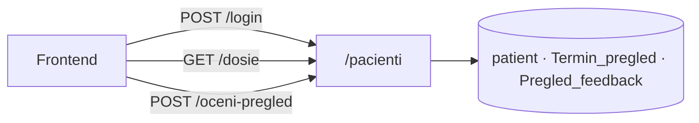
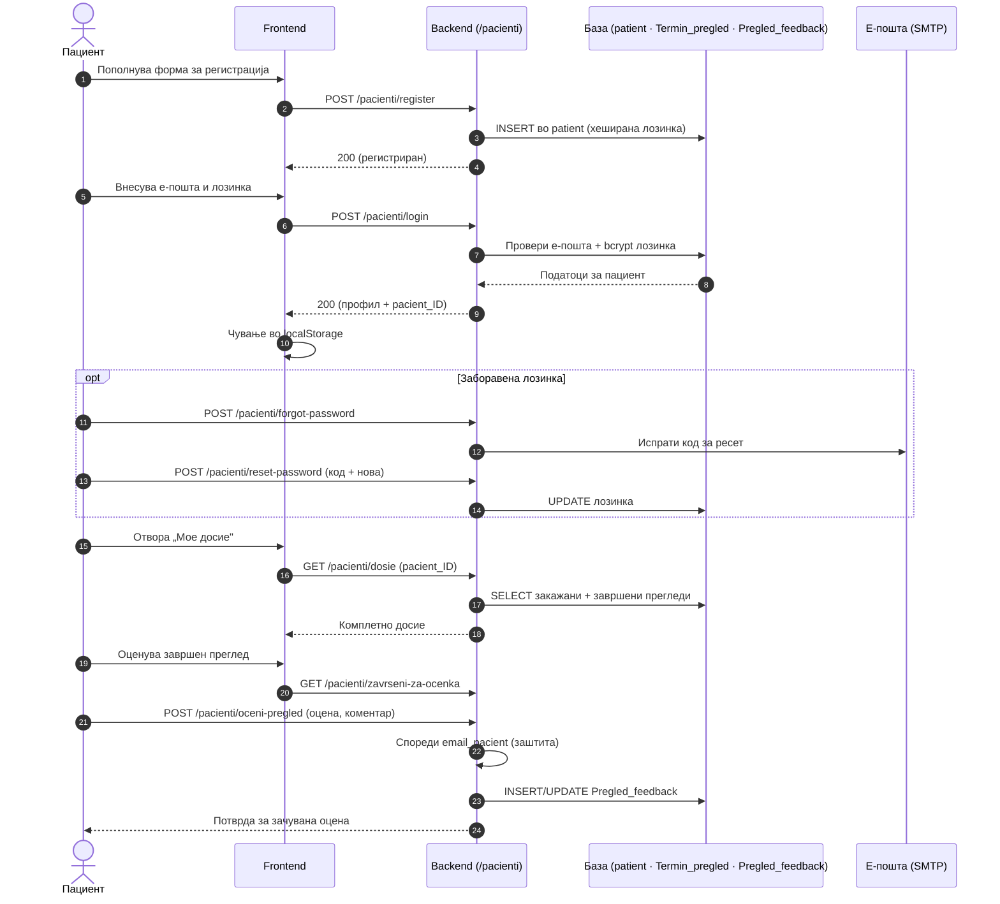

# Пациенти

Сите endpoints поврзани со **пациентите** се дефинирани во `backend/routers/pacienti.py` и достапни под префиксот `/pacienti`. Овој модул ги покрива сите клучни операции во животниот циклус на пациентот во системот — од иницијалната регистрација и автентикација, преку рестартирање на лозинка, па сè до пристап до личното досие и оценување на завршени прегледи.

> **Интерактивно тестирање:** секој endpoint е придружен со вграден **OpenAPI блок** и копче **„Test it"**, погонувано од Scalar. Пополни ги потребните параметри или тело на барањето и испрати го директно кон живиот сервер (`klinicka-bolnica-stip2026.onrender.com`) — без да ја напушташ документацијата.

## Содржина

* [1. Преглед](pacienti.md#1-pregled)
* [2. Автентикација](pacienti.md#2-auth)
* [3. POST `/pacienti/register`](pacienti.md#3-register)
* [4. POST `/pacienti/login`](pacienti.md#4-login)
* [5. POST `/pacienti/forgot-password`](pacienti.md#5-forgot)
* [6. POST `/pacienti/reset-password`](pacienti.md#6-reset)
* [7. GET `/pacienti/dosie`](pacienti.md#7-dosie)
* [8. GET `/pacienti/zavrseni-za-ocenka`](pacienti.md#8-zavrseni)
* [9. POST `/pacienti/oceni-pregled`](pacienti.md#9-oceni)
* [10. Поврзани табели](pacienti.md#10-tabele)

> Поврзани: [Конвенции](conventions.md) · [Автентикација](authentication.md) · [Термини](termini.md) · [База — patient](../the_database.md#tab-patient) · [Преглед на backend](../pregled.md)

***

## 1. Преглед <a href="#id-1-pregled" id="id-1-pregled"></a>



Сите барања се **JSON** (`Content-Type: application/json`), освен ако не е наведено поинаку. Одговорите се **JSON**. Грешките доаѓаат како `{"detail": "порака"}` со соодветен HTTP статус.

| Метод  | Патека                         | Намена                     |
| ------ | ------------------------------ | -------------------------- |
| `POST` | `/pacienti/register`           | Нова регистрација          |
| `POST` | `/pacienti/login`              | Најава                     |
| `POST` | `/pacienti/forgot-password`    | Барање код за ресет        |
| `POST` | `/pacienti/reset-password`     | Нова лозинка со код        |
| `GET`  | `/pacienti/dosie`              | Комплетно досие            |
| `GET`  | `/pacienti/zavrseni-za-ocenka` | Завршени прегледи за оцена |
| `POST` | `/pacienti/oceni-pregled`      | Остави/ажурирај оцена      |

### Тек на податоци — од регистрација до оцена

Дијаграмот го прикажува целиот пат на пациентот низ системот: регистрација, најава (со чување на податоци во `localStorage`), пристап до досие и оценување на завршен преглед.



***

## 2. Автентикација <a href="#id-2-auth" id="id-2-auth"></a>

Системот **не користи JWT или сесиски cookies** за пациенти. По успешна најава, frontend-от ги чува податоците на пациентот (вклучувајќи го `pacient_ID`) во `localStorage` и ги проследува како query параметар или во JSON телото на барањето каде што е потребно.
Ова значи дека endpoints како `/dosie` и `/oceni-pregled` не проверуваат токен — се потпираат на тоа дека frontend-от праќа валиден `pacient_ID`. Како дополнителен слој на заштита, backend-от ја споредува **е-поштата на пациентот** со полето `email_pacient` на терминот при оценување, со цел да се спречи пристап до туѓи записи.

> Овој пристап е функционален во рамките на универзитетскиот проект. За продукциска средина, препорачливо е воведување на серверски сесии или JWT автентикација за поцврста безбедносна гаранција.

***

## 3. POST `/pacienti/register` <a href="#id-3-register" id="id-3-register"></a>

**Регистрација на нов пациент.** Внесува ред во табелата `patient`.

**Тело (JSON):**

```json
{
  "ime": "Иван",
  "prezime": "Ивановски",
  "email": "ivan@example.com",
  "password": "Lozinka1.",
  "telefon": "070123456",
  "embg": "0101990450012"
}
```

**Валидација:**

* `ime`, `prezime`, `email` — задолжителни
* `email` — мора да содржи `@` и домен со `.`
* `password` — минимум **8** карактери
* `embg` — точно **13** цифри (само бројки се земаат од внесот)
* `telefon` — опционален; се нормализира (само цифри и `+`, макс. 20 знаци)
* `email` и `embg` мора да бидат **уникатни** во базата

**Успешен одговор (200):**

```json
{
  "message": "Направена е успешна регистрација. Можете да се најавите со вашата електронска пошта и лозинка.",
  "pacient_id": 42
}
```

**Можни грешки:** `400` (невалидни полиња, дупликат email/embg) · `500` (серверска грешка, на пр. недостасува колона `embg` — треба миграција `001_patient_embg.sql`)

> Лозинката се чува како **bcrypt хеш** (`password_utils.hash_password`), никогаш како чист текст.

**Каде се користи:** frontend — `script.js` (форма за регистрација на пациент).

**Имплементација (FastAPI):**

```python
@router.post("/register", openapi_extra={...})
async def register_pacienti(request: Request):
    data = await request.json()
    embg = "".join(c for c in str(data.get("embg") or "") if c.isdigit())  # само цифри
    # валидација: ime/prezime, email (@ и домен), password ≥ 8, embg == 13
    db_cursor.execute("SELECT patient_ID FROM patient WHERE LOWER(email) = %s", (email.lower(),))
    if db_cursor.fetchone(): raise HTTPException(400, "email веќе користен")
    db_cursor.execute("SELECT patient_ID FROM patient WHERE embg = %s", (embg,))
    if db_cursor.fetchone(): raise HTTPException(400, "ЕМБГ веќе регистриран")
    password_hash = hash_password(password)
    db_cursor.execute("INSERT INTO patient (...) VALUES (%s, ...)", (...))
    conn.commit()
    return {"message": "...", "pacient_id": db_cursor.lastrowid}
```

- Телото се чита со `await request.json()`; `openapi_extra` ја опишува шемата за Swagger/Scalar.
- ЕМБГ се нормализира (само цифри), телефонот се тримува; уникатност на `email` и `embg` се проверува пред `INSERT`.
- Лозинката никогаш не се зачувува како plain text — `hash_password()` од `password_utils.py`.


[OpenAPI KlinickaBolnicaAPI](https://klinicka-bolnica-stip2026.onrender.com/openapi.json)


***

## 4. POST `/pacienti/login` <a href="#id-4-login" id="id-4-login"></a>

**Најава на постоечки пациент** со е-пошта и лозинка.

**Тело (JSON):**

```json
{
  "email": "ivan@example.com",
  "password": "Lozinka1."
}
```

Е-поштата се нормализира (`strip`, `lower`). Лозинката се споредува со bcrypt (`verify_password`).

**Успешен одговор (200):**

```json
{
  "pacient": {
    "pacient_ID": 42,
    "ime": "Иван",
    "prezime": "Ивановски",
    "email": "ivan@example.com",
    "telefon": "070123456",
    "embg": "0101990450012"
  }
}
```

Frontend-от го зачувува овој објект (на пр. во `localStorage` под клуч `currentPacient`) и го користи `pacient_ID` за понатамошни повици.

**Можни грешки:** `400` (празна е-пошта или лозинка) · `401` (погрешна комбинација — намерно иста порака за email и лозинка) · `500`

**Каде се користи:** frontend — `script.js` (форма за најава, зачувува `currentPacient` во `localStorage`).

**Имплементација (FastAPI):**

```python
@router.post("/login", openapi_extra={...})
async def login_pacienti(request: Request):
    data = await request.json()
    email = (data.get("email") or "").strip().lower()
    db_cursor.execute("SELECT patient_ID, ..., password FROM patient WHERE LOWER(email) = %s", (email,))
    patient = db_cursor.fetchone()
    if not patient or not verify_password(password, patient["password"]):
        raise HTTPException(401, "невалидна е-пошта или лозинка")  # иста порака и за email и за лозинка
    return {"pacient": {"pacient_ID": patient["patient_ID"], ...}}
```

- Е-поштата се нормализира (`strip().lower()`); лозинката се споредува со `verify_password()` (bcrypt).
- Намerno иста `401` порака и кога email не постои и кога лозинката е погрешна — безбедносна практика (не открива дали email постои).


[OpenAPI KlinickaBolnicaAPI](https://klinicka-bolnica-stip2026.onrender.com/openapi.json)


***

## 5. POST `/pacienti/forgot-password` <a href="#id-5-forgot" id="id-5-forgot"></a>

**Барање за ресет на лозинка.** Генерира привремен код (валиден **1 час**) и го зачувува во `password_reset_tokens` со `user_type = 'pacient'`.

**Тело (JSON):**

```json
{
  "email": "ivan@example.com"
}
```

**Одговор (200)** — секогаш иста порака (без разлика дали email постои — безбедност):

```json
{
  "message": "Ако постои пациент со оваа е-пошта, кодот е испечатен во терминалот каде што работи backend-от. Внесете го кодот и новата лозинка."
}
```

На **локално** развој, кодот се гледа во терминалот каде работи uvicorn. На **Render**, во табот _Logs_.

**Можни грешки:** `400` (невалидна е-пошта) · `500`

**Каде се користи:** frontend — `script.js` (форма „Заборавена лозинка").

**Имплементација (FastAPI):**

```python
@router.post("/forgot-password", openapi_extra={...})
async def forgot_password_pacient(request: Request):
    email = (data.get("email") or "").strip().lower()
    cur.execute("SELECT patient_ID FROM patient WHERE LOWER(email) = %s", (email,))
    if not patient:
        return {"message": "Ако постои пациент..."}   # иста порака — без откривање дали email постои
    cur.execute("DELETE FROM password_reset_tokens WHERE email = %s AND user_type = 'pacient'", ...)
    token = secrets.token_urlsafe(12)
    cur.execute("INSERT INTO password_reset_tokens (email, token, user_type, expires_at) VALUES ...", ...)
    print(f"Код: {token}")   # локално: кодот е во терминалот / Render Logs
    conn.commit()
```

- Кодот е валиден **1 час** (`expires_at`); старите токени за ист email се бришат пред нов `INSERT`.
- Одговорот е секогаш иста неутрална порака — без разлика дали email постои.


[OpenAPI KlinickaBolnicaAPI](https://klinicka-bolnica-stip2026.onrender.com/openapi.json)


***

## 6. POST `/pacienti/reset-password` <a href="#id-6-reset" id="id-6-reset"></a>

**Поставува нова лозинка** со код од чекорот погоре (без најава).

**Тело (JSON):**

```json
{
  "email": "ivan@example.com",
  "token": "код_од_терминал_или_лог",
  "nova_lozinka": "Nova12345"
}
```

**Успешен одговор (200):**

```json
{
  "message": "Лозинката е успешно променета. Можете да се најавите."
}
```

По успех, кодот се **брише** од `password_reset_tokens`.

**Можни грешки:** `400` (невалиден/истечен код, лозинка < 8 знаци) · `404` (пациент не постои) · `500`

**Каде се користи:** frontend — `script.js` (форма за нова лозинка со код).

**Имплементација (FastAPI):**

```python
@router.post("/reset-password", openapi_extra={...})
async def reset_password_pacient(request: Request):
    cur.execute("""
        SELECT id FROM password_reset_tokens
        WHERE token = %s AND user_type = 'pacient' AND expires_at > UTC_TIMESTAMP()
    """, (token,))
    if not row or row["email"].lower() != email:
        raise HTTPException(400, "Неважечки или истечен код")
    cur.execute("UPDATE patient SET password = %s WHERE patient_ID = %s", (hash_password(nova), ...))
    cur.execute("DELETE FROM password_reset_tokens WHERE token = %s", (token,))
    conn.commit()
```

- Токенот мора да одговара на email **и** да не е истечен; по успех се брише од `password_reset_tokens`.


[OpenAPI KlinickaBolnicaAPI](https://klinicka-bolnica-stip2026.onrender.com/openapi.json)


***

## 7. GET `/pacienti/dosie` <a href="#id-7-dosie" id="id-7-dosie"></a>

**Комплетно досие** на пациентот — профил, идни термини, завршени прегледи, дадени оцени и кратка статистика.

**Query параметар:** `pacient_ID` (задолжителен, цел број)

```
GET /pacienti/dosie?pacient_ID=42
```

Врската со термини се прави преку **`email_pacient`** во `Termin_pregled` (не преку `patient_ID` FK) — види [База на податоци](../the_database.md#9-konvencii).

**Успешен одговор (200):**

```json
{
  "profil": {
    "pacient_ID": 42,
    "ime": "Иван",
    "prezime": "Ивановски",
    "email": "ivan@example.com",
    "telefon": "070123456",
    "embg": "0101990450012"
  },
  "idni_termini": [
    {
      "termin_ID": 15,
      "datum_pregled": "2026-06-20",
      "vreme_pregled": "10:00:00",
      "ime_lekar": "Ана Стојановска",
      "specijalnost": "Кардиологија",
      "doctor_ID": 2,
      "status": "закажан"
    }
  ],
  "zaverseni": [ "..." ],
  "oceni": [ "..." ],
  "statistika": {
    "vk_idni": 1,
    "vk_zaverseni": 3,
    "vk_oceni": 2
  }
}
```

* **`idni_termini`** — само `status_pregled = 'закажан'` и `datum_pregled >= денес`
* **`zaverseni`** — `status_pregled = 'завршен'`, со оцена/коментар ако постои
* **`oceni`** — подмножество од завршените што имаат запис во `Pregled_feedback`

**Можни грешки:** `404` (непостоечки `pacient_ID`) · `500`

**Каде се користи:** frontend — `script.js` (страница „Мое досие" по најава).

**Имплементација (FastAPI):**

```python
@router.get("/dosie")
async def dosie_pacient(pacient_ID: int = Query(...)):
    cur.execute("SELECT ... FROM patient WHERE patient_ID = %s", (pacient_ID,))
    email_pac = profil["email"].strip().lower()
    # врска со Termin_pregled преку email_pacient (не FK patient_ID)
    cur.execute("SELECT ... FROM Termin_pregled WHERE LOWER(TRIM(email_pacient)) = %s AND status='закажан' AND datum >= CURDATE()", ...)
    cur.execute("SELECT ... FROM Termin_pregled LEFT JOIN Pregled_feedback ... WHERE status='завршен'", ...)
    return {"profil": {...}, "idni_termini": [...], "zaverseni": [...], "oceni": [...], "statistika": {...}}
```

- `pacient_ID` е **query параметар**; термините се поврзани преку `email_pacient`, не преку FK — види [База](../the_database.md#9-konvencii).
- Четири одделни SQL барања: профил, идни, завршени (+ оцени), потоа се агрегира `statistika`.


[OpenAPI KlinickaBolnicaAPI](https://klinicka-bolnica-stip2026.onrender.com/openapi.json)


***

## 8. GET `/pacienti/zavrseni-za-ocenka` <a href="#id-8-zavrseni" id="id-8-zavrseni"></a>

**Листа завршени прегледи** што пациентот може да ги оцени (или веќе ги оценил).

**Query параметар:** `pacient_ID` (задолжителен)

```
GET /pacienti/zavrseni-za-ocenka?pacient_ID=42
```

**Успешен одговор (200):**

```json
{
  "pregledi": [
    {
      "termin_ID": 10,
      "datum_pregled": "2026-05-10",
      "vreme_pregled": "09:30:00",
      "ime_lekar": "Марко Петровски",
      "veke_ocenat": true,
      "dadena_ocena": 5,
      "komentar": "Одличен преглед"
    }
  ]
}
```

Се враќаат само термини со `status_pregled = 'завршен'` и `email_pacient` што одговара на е-поштата на пациентот.

**Можни грешки:** `404` · `500`

**Каде се користи:** frontend — `script.js` (листа завршени прегледи за оцена).

**Имплементација (FastAPI):**

```python
@router.get("/zavrseni-za-ocenka")
async def zavrseni_za_ocenka(pacient_ID: int = Query(...)):
    cur.execute("SELECT email FROM patient WHERE patient_ID = %s", (pacient_ID,))
    cur.execute("""
        SELECT tp.*, (pf.feedback_ID IS NOT NULL) AS veke_ocenat, pf.ocena, pf.komentar
        FROM Termin_pregled tp LEFT JOIN Pregled_feedback pf ON pf.termin_ID = tp.termin_ID
        WHERE LOWER(TRIM(tp.email_pacient)) = %s AND tp.status_pregled = 'завршен'
    """, (email_pac,))
    return {"pregledi": [...]}
```

- `LEFT JOIN Pregled_feedback` во еден query дава и дали прегледот е веќе оценет (`veke_ocenat`).


[OpenAPI KlinickaBolnicaAPI](https://klinicka-bolnica-stip2026.onrender.com/openapi.json)


***

## 9. POST `/pacienti/oceni-pregled` <a href="#id-9-oceni" id="id-9-oceni"></a>

**Внесува или ажурира оцена** за завршен преглед. Еден термин = најмногу една оцена (`termin_ID` е уникатен во `Pregled_feedback`).

**Тело (JSON):**

```json
{
  "termin_id": 10,
  "pacient_ID": 42,
  "ocena": 5,
  "komentar": "Многу сум задоволен од прегледот"
}
```

**Правила:**

* `ocena` — цел број **од 1 до 5** (и CHECK во базата)
* Терминот мора да има `status_pregled = 'завршен'`
* `email_pacient` на терминот мора да одговара на е-поштата на пациентот (`403` ако не)
* Ако веќе постои оцена за истиот `termin_ID`, се **ажурира** (`ON DUPLICATE KEY UPDATE`)

**Успешен одговор (200):**

```json
{
  "message": "Оцената е зачувана.",
  "ocenka": {
    "feedback_ID": 7,
    "termin_ID": 10,
    "ocena": 5,
    "komentar": "Многу сум задоволен од прегледот",
    "datum_na_ocena": "2026-06-14T12:00:00"
  }
}
```

**Можни грешки:** `400` (невалидна оцена, термин не е завршен) · `403` (термин не е на овој пациент) · `404` · `500`

**Каде се користи:** frontend — `script.js` (форма за оцена на преглед).

**Имплементација (FastAPI):**

```python
@router.post("/oceni-pregled", openapi_extra={...})
async def oceni_pregled(request: Request):
    # 1) email на пациентот од patient; 2) email_pacient на терминот — мора да совпаѓаат
    if em_termin != email_pac: raise HTTPException(403, "не одговара на вашиот профил")
    if status != "завршен": raise HTTPException(400, "само за завршен преглед")
    cur.execute("""
        INSERT INTO Pregled_feedback (termin_ID, ocena, komentar) VALUES (%s, %s, %s)
        ON DUPLICATE KEY UPDATE ocena=VALUES(ocena), komentar=VALUES(komentar), ...
    """, (termin_id, ocena, komentar))
    conn.commit()
```

- Заштита: `email_pacient` на терминот се споредува со email на пациентот — `403` ако не совпаѓаат.
- `ON DUPLICATE KEY UPDATE` — еден термин = најмногу една оцена; повторен повик ја ажурира постоечката.


[OpenAPI KlinickaBolnicaAPI](https://klinicka-bolnica-stip2026.onrender.com/openapi.json)


***

## 10. Поврзани табели <a href="#id-10-tabele" id="id-10-tabele"></a>

| Табела                  | Улога во `/pacienti`                                   |
| ----------------------- | ------------------------------------------------------ |
| `patient`               | Профил, лозинка, ЕМБГ                                  |
| `password_reset_tokens` | Кодови за заборавена лозинка (`user_type = 'pacient'`) |
| `Termin_pregled`        | Прегледи (врска преку `email_pacient`)                 |
| `Pregled_feedback`      | Оцени по `termin_ID`                                   |

Детали за колони и врски: [База на податоци](../the_database.md).

***

Следно: [Термини](termini.md) · [Автентикација](authentication.md)
