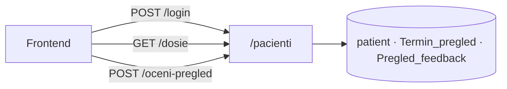

# Пациенти

Сите endpoints за **пациенти** живеат под префиксот `/pacienti` и се дефинирани во `backend/routers/pacienti.py`. Овде се покриени регистрација, најава, ресет на лозинка, досие, и оценување на завршени прегледи.

> **Интерактивно тестирање:** под секој endpoint има вграден **OpenAPI блок** со копче **„Test it"** (powered by Scalar). Пополни ги параметрите/телото и испрати го барањето директно од документацијата кон живиот сервер (`klinicka-bolnica-stip2026.onrender.com`), без да ја напушташ страницата.

## Содржина

* [1. Преглед](pacienti.md#1-pregled)
* [2. Автентикација](pacienti.md#2-auth)
* [3. POST `/pacienti/register`](pacienti.md#3-register)
* [4. POST `/pacienti/login`](pacienti.md#4-login)
* [5. POST `/pacienti/forgot-password`](pacienti.md#5-forgot)
* [6. POST `/pacienti/reset-password`](pacienti.md#6-reset)
* [7. GET `/pacienti/dosie`](pacienti.md#7-dosie)
* [8. GET `/pacienti/zavrseni-za-ocenka`](pacienti.md#8-zavrseni)
* [9. POST `/pacienti/oceni-pregled`](pacienti.md#9-oceni)
* [10. Поврзани табели](pacienti.md#10-tabele)

> Поврзани: [Конвенции](conventions.md) · [Автентикација](authentication.md) · [Термини](termini.md) · [База — patient](../the_database.md#tab-patient) · [Преглед на backend](../pregled.md)

***

## 1. Преглед <a href="#id-1-pregled" id="id-1-pregled"></a>



Сите барања се **JSON** (`Content-Type: application/json`), освен ако не е наведено поинаку. Одговорите се **JSON**. Грешките доаѓаат како `{"detail": "порака"}` со соодветен HTTP статус.

| Метод  | Патека                         | Намена                     |
| ------ | ------------------------------ | -------------------------- |
| `POST` | `/pacienti/register`           | Нова регистрација          |
| `POST` | `/pacienti/login`              | Најава                     |
| `POST` | `/pacienti/forgot-password`    | Барање код за ресет        |
| `POST` | `/pacienti/reset-password`     | Нова лозинка со код        |
| `GET`  | `/pacienti/dosie`              | Комплетно досие            |
| `GET`  | `/pacienti/zavrseni-za-ocenka` | Завршени прегледи за оцена |
| `POST` | `/pacienti/oceni-pregled`      | Остави/ажурирај оцена      |

***

## 2. Автентикација <a href="#id-2-auth" id="id-2-auth"></a>

Системот **не користи JWT или сесиски cookies** за пациенти. По успешна најава, frontend-от го чува `pacient_ID` (и останатите податоци) во `localStorage` и го праќа како query параметар (`pacient_ID`) или во JSON тело каде што е потребно.

Значи, endpoints како `/dosie` и `/oceni-pregled` **не проверуваат токен** — се потпираат на тоа дека frontend-от праќа вистински `pacient_ID`, а backend-от дополнително ја споредува **е-поштата** на пациентот со `email_pacient` на терминот (за оцени).

> За production би било подобро да се додаде серверска сесија или JWT — моментално ова е доволно за универзитетскиот проект.

***

## 3. POST `/pacienti/register` <a href="#id-3-register" id="id-3-register"></a>

**Регистрација на нов пациент.** Внесува ред во табелата `patient`.

**Тело (JSON):**

```json
{
  "ime": "Иван",
  "prezime": "Ивановски",
  "email": "ivan@example.com",
  "password": "Lozinka1.",
  "telefon": "070123456",
  "embg": "0101990450012"
}
```

**Валидација:**

* `ime`, `prezime`, `email` — задолжителни
* `email` — мора да содржи `@` и домен со `.`
* `password` — минимум **8** карактери
* `embg` — точно **13** цифри (само бројки се земаат од внесот)
* `telefon` — опционален; се нормализира (само цифри и `+`, макс. 20 знаци)
* `email` и `embg` мора да бидат **уникатни** во базата

**Успешен одговор (200):**

```json
{
  "message": "Направена е успешна регистрација. Можете да се најавите со вашата електронска пошта и лозинка.",
  "pacient_id": 42
}
```

**Можни грешки:** `400` (невалидни полиња, дупликат email/embg) · `500` (серверска грешка, на пр. недостасува колона `embg` — треба миграција `001_patient_embg.sql`)

> Лозинката се чува како **bcrypt хеш** (`password_utils.hash_password`), никогаш како чист текст.


[OpenAPI KlinickaBolnicaAPI](https://klinicka-bolnica-stip2026.onrender.com/openapi.json)


***

## 4. POST `/pacienti/login` <a href="#id-4-login" id="id-4-login"></a>

**Најава на постоечки пациент** со е-пошта и лозинка.

**Тело (JSON):**

```json
{
  "email": "ivan@example.com",
  "password": "Lozinka1."
}
```

Е-поштата се нормализира (`strip`, `lower`). Лозинката се споредува со bcrypt (`verify_password`).

**Успешен одговор (200):**

```json
{
  "pacient": {
    "pacient_ID": 42,
    "ime": "Иван",
    "prezime": "Ивановски",
    "email": "ivan@example.com",
    "telefon": "070123456",
    "embg": "0101990450012"
  }
}
```

Frontend-от го зачувува овој објект (на пр. во `localStorage` под клуч `currentPacient`) и го користи `pacient_ID` за понатамошни повици.

**Можни грешки:** `400` (празна е-пошта или лозинка) · `401` (погрешна комбинација — намерно иста порака за email и лозинка) · `500`


[OpenAPI KlinickaBolnicaAPI](https://klinicka-bolnica-stip2026.onrender.com/openapi.json)


***

## 5. POST `/pacienti/forgot-password` <a href="#id-5-forgot" id="id-5-forgot"></a>

**Барање за ресет на лозинка.** Генерира привремен код (валиден **1 час**) и го зачувува во `password_reset_tokens` со `user_type = 'pacient'`.

**Тело (JSON):**

```json
{
  "email": "ivan@example.com"
}
```

**Одговор (200)** — секогаш иста порака (без разлика дали email постои — безбедност):

```json
{
  "message": "Ако постои пациент со оваа е-пошта, кодот е испечатен во терминалот каде што работи backend-от. Внесете го кодот и новата лозинка."
}
```

На **локално** развој, кодот се гледа во терминалот каде работи uvicorn. На **Render**, во табот _Logs_.

**Можни грешки:** `400` (невалидна е-пошта) · `500`


[OpenAPI KlinickaBolnicaAPI](https://klinicka-bolnica-stip2026.onrender.com/openapi.json)


***

## 6. POST `/pacienti/reset-password` <a href="#id-6-reset" id="id-6-reset"></a>

**Поставува нова лозинка** со код од чекорот погоре (без најава).

**Тело (JSON):**

```json
{
  "email": "ivan@example.com",
  "token": "код_од_терминал_или_лог",
  "nova_lozinka": "Nova12345"
}
```

**Успешен одговор (200):**

```json
{
  "message": "Лозинката е успешно променета. Можете да се најавите."
}
```

По успех, кодот се **брише** од `password_reset_tokens`.

**Можни грешки:** `400` (невалиден/истечен код, лозинка < 8 знаци) · `404` (пациент не постои) · `500`


[OpenAPI KlinickaBolnicaAPI](https://klinicka-bolnica-stip2026.onrender.com/openapi.json)


***

## 7. GET `/pacienti/dosie` <a href="#id-7-dosie" id="id-7-dosie"></a>

**Комплетно досие** на пациентот — профил, идни термини, завршени прегледи, дадени оцени и кратка статистика.

**Query параметар:** `pacient_ID` (задолжителен, цел број)

```
GET /pacienti/dosie?pacient_ID=42
```

Врската со термини се прави преку **`email_pacient`** во `Termin_pregled` (не преку `patient_ID` FK) — види [База на податоци](../the_database.md#9-konvencii).

**Успешен одговор (200):**

```json
{
  "profil": {
    "pacient_ID": 42,
    "ime": "Иван",
    "prezime": "Ивановски",
    "email": "ivan@example.com",
    "telefon": "070123456",
    "embg": "0101990450012"
  },
  "idni_termini": [
    {
      "termin_ID": 15,
      "datum_pregled": "2026-06-20",
      "vreme_pregled": "10:00:00",
      "ime_lekar": "Ана Стојановска",
      "specijalnost": "Кардиологија",
      "doctor_ID": 2,
      "status": "закажан"
    }
  ],
  "zaverseni": [ "..." ],
  "oceni": [ "..." ],
  "statistika": {
    "vk_idni": 1,
    "vk_zaverseni": 3,
    "vk_oceni": 2
  }
}
```

* **`idni_termini`** — само `status_pregled = 'закажан'` и `datum_pregled >= денес`
* **`zaverseni`** — `status_pregled = 'завршен'`, со оцена/коментар ако постои
* **`oceni`** — подмножество од завршените што имаат запис во `Pregled_feedback`

**Можни грешки:** `404` (непостоечки `pacient_ID`) · `500`


[OpenAPI KlinickaBolnicaAPI](https://klinicka-bolnica-stip2026.onrender.com/openapi.json)


***

## 8. GET `/pacienti/zavrseni-za-ocenka` <a href="#id-8-zavrseni" id="id-8-zavrseni"></a>

**Листа завршени прегледи** што пациентот може да ги оцени (или веќе ги оценил).

**Query параметар:** `pacient_ID` (задолжителен)

```
GET /pacienti/zavrseni-za-ocenka?pacient_ID=42
```

**Успешен одговор (200):**

```json
{
  "pregledi": [
    {
      "termin_ID": 10,
      "datum_pregled": "2026-05-10",
      "vreme_pregled": "09:30:00",
      "ime_lekar": "Марко Петровски",
      "veke_ocenat": true,
      "dadena_ocena": 5,
      "komentar": "Одличен преглед"
    }
  ]
}
```

Се враќаат само термини со `status_pregled = 'завршен'` и `email_pacient` што одговара на е-поштата на пациентот.

**Можни грешки:** `404` · `500`


[OpenAPI KlinickaBolnicaAPI](https://klinicka-bolnica-stip2026.onrender.com/openapi.json)


***

## 9. POST `/pacienti/oceni-pregled` <a href="#id-9-oceni" id="id-9-oceni"></a>

**Внесува или ажурира оцена** за завршен преглед. Еден термин = најмногу една оцена (`termin_ID` е уникатен во `Pregled_feedback`).

**Тело (JSON):**

```json
{
  "termin_id": 10,
  "pacient_ID": 42,
  "ocena": 5,
  "komentar": "Многу сум задоволен од прегледот"
}
```

**Правила:**

* `ocena` — цел број **од 1 до 5** (и CHECK во базата)
* Терминот мора да има `status_pregled = 'завршен'`
* `email_pacient` на терминот мора да одговара на е-поштата на пациентот (`403` ако не)
* Ако веќе постои оцена за истиот `termin_ID`, се **ажурира** (`ON DUPLICATE KEY UPDATE`)

**Успешен одговор (200):**

```json
{
  "message": "Оцената е зачувана.",
  "ocenka": {
    "feedback_ID": 7,
    "termin_ID": 10,
    "ocena": 5,
    "komentar": "Многу сум задоволен од прегледот",
    "datum_na_ocena": "2026-06-14T12:00:00"
  }
}
```

**Можни грешки:** `400` (невалидна оцена, термин не е завршен) · `403` (термин не е на овој пациент) · `404` · `500`


[OpenAPI KlinickaBolnicaAPI](https://klinicka-bolnica-stip2026.onrender.com/openapi.json)


***

## 10. Поврзани табели <a href="#id-10-tabele" id="id-10-tabele"></a>

| Табела                  | Улога во `/pacienti`                                   |
| ----------------------- | ------------------------------------------------------ |
| `patient`               | Профил, лозинка, ЕМБГ                                  |
| `password_reset_tokens` | Кодови за заборавена лозинка (`user_type = 'pacient'`) |
| `Termin_pregled`        | Прегледи (врска преку `email_pacient`)                 |
| `Pregled_feedback`      | Оцени по `termin_ID`                                   |

Детали за колони и врски: [База на податоци](../the_database.md).

***

Следно: [Термини](termini.md) · [Автентикација](authentication.md)
