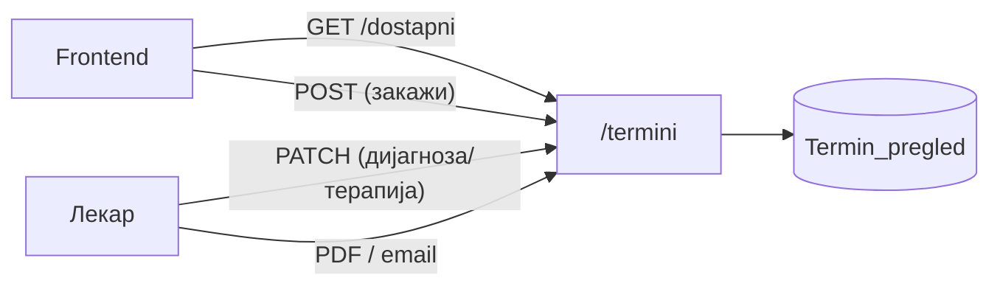

# API — Термини

Endpoints за **термини / прегледи** под префиксот `/termini`, дефинирани во `backend/routers/termini.py`. Покриваат слободни термини, закажување, внес на дијагноза/терапија и PDF извештај.

> **Интерактивно тестирање:** под секој endpoint има вграден **OpenAPI блок** со копче **„Test it"** (powered by Scalar). Пополни ги параметрите/телото и испрати го барањето директно од документацијата кон живиот сервер (`klinicka-bolnica-stip2026.onrender.com`).

## Содржина

* [1. Преглед](#1-pregled)
* [2. Работно време и правила](#2-pravila)
* [3. GET `/termini/dostapni`](#3-dostapni)
* [4. POST `/termini`](#4-zakazi)
* [5. PATCH `/termini/{termin_id}`](#5-dijagnoza)
* [6. GET `/termini/izvestaj-pdf/{termin_id}`](#6-pdf)
* [7. POST `/termini/{termin_id}/poslati-izvestaj`](#7-email)

> Поврзани: [Конвенции](conventions.md) · [Пациенти](pacienti.md) ·
> [Лекари](lekari.md) · [База — Termin_pregled](../the_database.md#tab-termin)

---

## 1. Преглед <a id="1-pregled"></a>



| Метод | Патека | Намена |
|-------|--------|--------|
| `GET` | `/termini/dostapni` | Слободни термини за лекар на датум |
| `POST` | `/termini` | Закажи нов преглед |
| `PATCH` | `/termini/{termin_id}` | Внеси дијагноза и терапија |
| `GET` | `/termini/izvestaj-pdf/{termin_id}` | PDF извештај |
| `POST` | `/termini/{termin_id}/poslati-izvestaj` | Прати PDF на е-пошта |

---

## 2. Работно време и правила <a id="2-pravila"></a>

- **Не се закажува** во **сабота и недела** (backend враќа `400` / празна листа).
- Слотовите се по **полн/половина час** во работното време.
- Времето се нормализира во формат `HH:MM` (на пр. `9:0` → `09:00`).
- Еден лекар **не може** да има два `закажан` термини во исто време (`409`).
- Календарите на **прегледи** и **апарати** се синхронизирани — зафатен слот на апарат го блокира истиот слот кај лекарот.

---

## 3. GET `/termini/dostapni` <a id="3-dostapni"></a>

**Слободни (зафатени) термини** за лекар на даден датум. Враќа листа на **зафатени** времиња (frontend ги одзема од можните слотови).

**Query параметри:**
- `lekar_id` (задолжителен)
- `datum` (задолжителен, `YYYY-MM-DD`; прифаќа и ISO со `T`)

**Успешен одговор (200):**

```json
["09:00", "10:30", "13:00"]
```

За викенд враќа `[]`.

**Можни грешки:** `400` (неважечки датум) · `500`


[OpenAPI KlinickaBolnicaAPI](https://klinicka-bolnica-stip2026.onrender.com/openapi.json)


---

## 4. POST `/termini` <a id="4-zakazi"></a>

**Закажува нов преглед.** Проверува дали лекарот постои и дали слотот е слободен; по успех праќа потврда на е-пошта (ако е конфигуриран SMTP).

**Тело (JSON):**

```json
{
  "lekar_id": 28,
  "ime": "Иван",
  "prezime": "Ивановски",
  "datum": "2026-06-16",
  "vreme": "10:00",
  "email": "ivan@example.com",
  "telefon": "070123456",
  "napomena": ""
}
```

**Успешен одговор (200):**

```json
{
  "message": "Терминот е успешно закажан! Ќе добиете потврда на вашата е-пошта.",
  "appointment_ID": 42
}
```

**Можни грешки:** `400` (викенд / неважечки датум) · `404` (лекар не постои) · `409` (слотот е зафатен) · `500`


[OpenAPI KlinickaBolnicaAPI](https://klinicka-bolnica-stip2026.onrender.com/openapi.json)


---

## 5. PATCH `/termini/{termin_id}` <a id="5-dijagnoza"></a>

**Внесува дијагноза и терапија** (го пополнува лекарот). Ако се внесе барем едно од двете, статусот на терминот се менува во **`завршен`** (по што пациентот може да оцени).

**Path параметри:** `termin_id`

**Тело (JSON):**

```json
{
  "dijagnoza": "Хипертензија",
  "terapija": "Контрола за 3 месеци, терапија по упатство"
}
```

**Успешен одговор (200):**

```json
{ "message": "Дијагноза и терапија се ажурирани." }
```

**Можни грешки:** `404` (термин не постои) · `500`


[OpenAPI KlinickaBolnicaAPI](https://klinicka-bolnica-stip2026.onrender.com/openapi.json)


---

## 6. GET `/termini/izvestaj-pdf/{termin_id}` <a id="6-pdf"></a>

**Генерира PDF извештај** за терминот (податоци за пациент, лекар, дијагноза, терапија). Одговорот е **бинарен** (`application/pdf`) — виџетот дава линк за отворање.

**Path параметри:** `termin_id`

**Можни грешки:** `404` (термин не постои) · `500`


[OpenAPI KlinickaBolnicaAPI](https://klinicka-bolnica-stip2026.onrender.com/openapi.json)


---

## 7. POST `/termini/{termin_id}/poslati-izvestaj` <a id="7-email"></a>

**Праќа PDF извештај** на е-поштата на пациентот (`email_pacient` од терминот). Бара конфигуриран SMTP.

**Path параметри:** `termin_id`

**Успешен одговор (200):**

```json
{
  "message": "Извештајот е успешно испратен на е-поштата на пациентот.",
  "email": "ivan@example.com"
}
```

**Можни грешки:** `400` (пациентот нема е-пошта) · `404` · `503` (SMTP не е конфигуриран) · `502` (грешка при праќање) · `500`


[OpenAPI KlinickaBolnicaAPI](https://klinicka-bolnica-stip2026.onrender.com/openapi.json)


---

Следно: [Услуги](uslugi.md) · [Апарати](aparati.md) · [Лекари](lekari.md)
