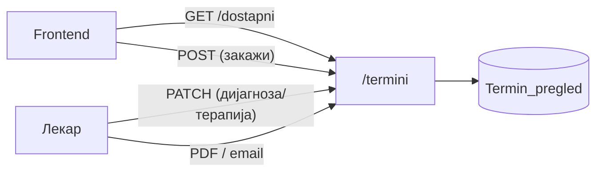
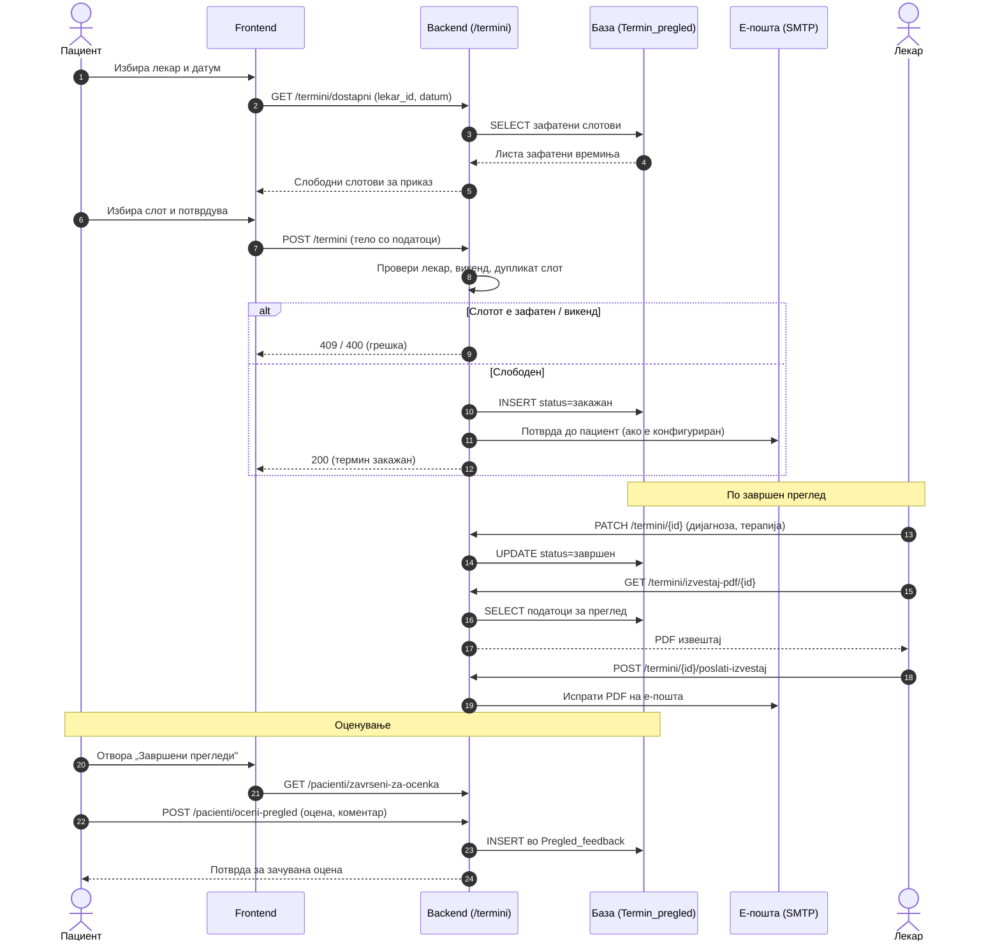

# API — Термини

Сите endpoints поврзани со **термините и прегледите** се дефинирани во `backend/routers/termini.py` и достапни под префиксот `/termini`. Овој модул е еден од централните во системот — тука се одвива целиот процес на закажување: од проверка на слободни термини, преку креирање, откажување и пренос на преглед, до внесување дијагноза и терапија по завршен преглед и генерирање на PDF извештај.

> **Интерактивно тестирање:** секој endpoint е придружен со вграден **OpenAPI блок** и копче **„Test it"**, погонувано од Scalar. Пополни ги потребните параметри или тело на барањето и испрати го директно кон живиот сервер (`klinicka-bolnica-stip2026.onrender.com`) — без да ја напушташ документацијата.


## Содржина

* [1. Преглед](#1-pregled)
* [2. Работно време и правила](#2-pravila)
* [3. GET `/termini/dostapni`](#3-dostapni)
* [4. POST `/termini`](#4-zakazi)
* [5. PATCH `/termini/{termin_id}`](#5-dijagnoza)
* [6. GET `/termini/izvestaj-pdf/{termin_id}`](#6-pdf)
* [7. POST `/termini/{termin_id}/poslati-izvestaj`](#7-email)

> Поврзани: [Конвенции](conventions.md) · [Пациенти](pacienti.md) ·
> [Лекари](lekari.md) · [База — Termin_pregled](../the_database.md#tab-termin)

---

## 1. Преглед <a id="1-pregled"></a>



| Метод | Патека | Намена |
|-------|--------|--------|
| `GET` | `/termini/dostapni` | Враќа листа на слободни термини за избран лекар и датум |
| `POST` | `/termini` | Креира нов термин и го закажува прегледот |
| `PATCH` | `/termini/{termin_id}` | Внесува дијагноза и терапија по завршен преглед |
| `GET` | `/termini/izvestaj-pdf/{termin_id}` | Генерира и враќа PDF извештај за завршен преглед |
| `POST` | `/termini/{termin_id}/poslati-izvestaj` | Го испраќа генерираниот PDF извештај на е-пошта |

### Тек на податоци — од закажување до оцена

Следниот дијаграм го прикажува целиот животен циклус на еден преглед, чекор по чекор: од проверка на слободни слотови и закажување, преку внес на дијагноза и испраќање на PDF, до оценувањето од страна на пациентот.



---

## 2. Работно време и правила <a id="2-pravila"></a>

- Закажување во **сабота и недела не е возможно** — backend автоматски враќа `400` или празна листа за викенд датуми.
- Слободните слотови се нудат по **полн или половина час** во рамките на работното време на болницата.
- Времето автоматски се нормализира во формат `HH:MM` — на пример, внесот `9:0` се конвертира во `09:00` пред зачувување.
- Еден лекар **не може да има два активни термини** во исто време — обидот за дуплирање се одбива со грешка `409`.
- Календарите за **прегледи и медицински апарати се целосно синхронизирани** — доколку лекарот има закажан термин на апарат во одреден слот, тој слот автоматски се блокира и во неговиот распоред за прегледи.

---

## 3. GET `/termini/dostapni` <a id="3-dostapni"></a>

Враќа листа на **зафатени термини** за избран лекар и датум. Наместо да ги пресметува и враќа слободните слотови директно, endpoint-от ги враќа зафатените времиња — frontend-от ги зема сите можни слотови во работното време и ги одзема зафатените, со што добива листа на слободни термини за приказ на корисникот.

**Query параметри:**
- `lekar_id` (задолжителен)
- `datum` (задолжителен, `YYYY-MM-DD`; прифаќа и ISO со `T`)

**Успешен одговор (200):**

```json
["09:00", "10:30", "13:00"]
```
> За викенд датуми endpoint-от враќа празна листа `[]` — закажување во сабота и недела не е возможно.

**Можни грешки:** `400` (неважечки или погрешно форматиран датум) · `500` (внатрешна грешка на серверот)

**Каде се користи:** frontend — `script.js` (форма за закажување термин и лекарскиот панел, за приказ на слободни слотови).

**Имплементација (FastAPI):**

```python
@router.get("/dostapni")
def get_dostapni_termini(lekar_id: int, datum: str):
    conn = None
    try:
        if "T" in datum:                        # ISO формат → земи само датумот
            datum = datum.split("T")[0]
        d = datetime.strptime(datum, "%Y-%m-%d").date()
        if d.weekday() >= 5:                     # сабота/недела → нема термини
            return []

        conn = get_connection()
        db_cursor = conn.cursor(dictionary=True)
        # Зафатени слотови = прегледи + термини на апарати (синхронизирани календари)
        db_cursor.execute("""
            SELECT TIME(vreme_pregled) AS vreme FROM Termin_pregled
            WHERE doctor_ID = %s AND DATE(datum_pregled) = %s AND status_pregled = 'закажан'
            UNION
            SELECT TIME(vreme_pregled) AS vreme FROM Aparati_termini
            WHERE doctor_ID = %s AND DATE(datum_pregled) = %s AND status != 'откажан'
        """, (lekar_id, datum, lekar_id, datum))

        out = []
        for r in db_cursor.fetchall():           # нормализирај го времето во "HH:MM"
            v = r.get("vreme")
            if hasattr(v, "strftime"):
                out.append(v.strftime("%H:%M"))
        return out
    except ValueError:
        raise HTTPException(status_code=400, detail="Неважечки формат на датум")
    except Exception as e:
        raise HTTPException(status_code=500, detail=str(e))
    finally:
        if conn and conn.is_connected():
            conn.close()
```

- `@router.get("/dostapni")` ја регистрира функцијата како **GET** endpoint; `lekar_id: int` и `datum: str` FastAPI автоматски ги чита како **query параметри** со типска валидација.
- Прво се отфрла викенд (`weekday() >= 5`), па со една `UNION` SQL се земаат зафатените времиња и од прегледите и од апаратите — затоа календарите се синхронизирани.
- Времето се нормализира во `"HH:MM"`, а грешките се мапираат во `400` (лош датум) / `500` (друго). `finally` ја затвора конекцијата секогаш.


[OpenAPI KlinickaBolnicaAPI](https://klinicka-bolnica-stip2026.onrender.com/openapi.json)


---

## 4. POST `/termini` <a id="4-zakazi"></a>

Креира **нов термин и го закажува прегледот**. Пред да го зачува, backend-от извршува низа проверки — потврдува дека лекарот постои, дека избраниот датум не е викенд и дека бараниот временски слот не е веќе зафатен. Само ако сите проверки поминат успешно, терминот се зачувува со статус `закажан` и на пациентот автоматски му се испраќа потврда на е-пошта — доколку SMTP е конфигуриран.

**Тело (JSON):**

```json
{
  "lekar_id": 28,
  "ime": "Иван",
  "prezime": "Ивановски",
  "datum": "2026-06-16",
  "vreme": "10:00",
  "email": "ivan@example.com",
  "telefon": "070123456",
  "napomena": ""
}
```

**Успешен одговор (200):**

```json
{
  "message": "Терминот е успешно закажан! Ќе добиете потврда на вашата е-пошта.",
  "appointment_ID": 42
}
```

**Можни грешки:** `400` (избраниот датум е викенд или е во невалиден формат) · `404` (лекар со дадениот `lekar_id` не постои во базата) · `409` (бараниот временски слот е веќе зафатен од друг термин) · `500` (внатрешна грешка на серверот)

**Каде се користи:** frontend — `script.js` (форма за закажување термин на пациентот).

**Имплементација (FastAPI):**

```python
@router.post("", openapi_extra={...})           # openapi_extra ја опишува JSON шемата за Swagger/Scalar
async def create_termini(request: Request):
    conn = None
    try:
        data = await request.json()             # сурово JSON тело од клиентот
        datum_str = data.get("datum", "").split("T")[0]
        appointment_date = datetime.strptime(datum_str, "%Y-%m-%d").date()
        if appointment_date.weekday() >= 5:     # викенд → 400
            raise HTTPException(status_code=400, detail="Не се закажуваат прегледи во сабота и недела.")

        vreme_str = data.get("vreme", "")       # нормализација "9:0" → "09:00"
        parts = vreme_str.split(":")
        vreme_str = f"{parts[0].zfill(2)}:{parts[1].zfill(2)}"

        conn = get_connection()
        db_cursor = conn.cursor(dictionary=True)
        db_cursor.execute("SELECT name, surname, specialty FROM Doctors WHERE doctor_ID = %s", (data['lekar_id'],))
        doctor = db_cursor.fetchone()
        if not doctor:                          # непостоечки лекар → 404
            raise HTTPException(status_code=404, detail="Лекар не е пронајден")

        db_cursor.execute("""
            SELECT termin_ID FROM Termin_pregled
            WHERE doctor_ID=%s AND DATE(datum_pregled)=%s AND TIME(vreme_pregled)=%s AND status_pregled='закажан'
        """, (data['lekar_id'], datum_str, vreme_str))
        if db_cursor.fetchone():                # зафатен слот → 409
            raise HTTPException(status_code=409, detail="Овој термин е веќе закажан.")

        db_cursor.execute("INSERT INTO Termin_pregled (...) VALUES (%s, ...)", (...))
        conn.commit()
        appointment_id = db_cursor.lastrowid    # ID на новиот термин
        _poslati_potvrda_na_email(...)          # потврда по е-пошта (ако SMTP е поставен)
        return {"message": "Терминот е успешно закажан! ...", "appointment_ID": appointment_id}
    except HTTPException:
        raise
    except Exception as e:
        raise HTTPException(status_code=500, detail=str(e))
    finally:
        if conn and conn.is_connected():
            conn.close()
```

- Телото се чита преку `await request.json()`, а `openapi_extra` ѝ дава на FastAPI готова JSON шема за да се прикаже точниот пример во Swagger/Scalar.
- Три заштитни проверки пред запис: **викенд** (`400`), **постоечки лекар** (`404`) и **слободен слот** (`409`). Само ако сите поминат се прави `INSERT` + `conn.commit()`.
- По успешен запис се враќа `appointment_ID` (`cursor.lastrowid`) и се повикува помошната `_poslati_potvrda_na_email(...)` за потврда.


[OpenAPI KlinickaBolnicaAPI](https://klinicka-bolnica-stip2026.onrender.com/openapi.json)


---

## 5. PATCH `/termini/{termin_id}` <a id="5-dijagnoza"></a>
Овој endpoint го користи лекарот по завршен преглед за да ги внесе **дијагнозата и терапијата** во досието на пациентот. Доволно е да се внесе барем едно од двете полиња — во тој момент статусот на терминот автоматски се менува во `завршен`, со што пациентот добива можност да го оцени прегледот.

**Path параметри:** `termin_id`
**Тело (JSON):**

```json
{
  "dijagnoza": "Хипертензија",
  "terapija": "Контрола за 3 месеци, терапија по упатство"
}
```

**Успешен одговор (200):**

```json
{ "message": "Дијагноза и терапија се ажурирани." }
```

**Можни грешки:** `404` (термин со дадениот `termin_id` не постои во базата) · `500` (внатрешна грешка на серверот)

**Каде се користи:** frontend — `script.js` (лекарски панел, по завршен преглед лекарот внесува дијагноза/терапија).

**Имплементација (FastAPI):**

```python
@router.patch("/{termin_id}", openapi_extra={...})
async def update_termin_dijagnoza_terapija(termin_id: int, request: Request):
    conn = None
    try:
        data = await request.json()
        conn = get_connection()
        db_cursor = conn.cursor(dictionary=True)
        db_cursor.execute("SELECT termin_ID FROM Termin_pregled WHERE termin_ID = %s", (termin_id,))
        if not db_cursor.fetchone():            # непостоечки термин → 404
            raise HTTPException(status_code=404, detail="Термин не е пронајден")

        dij_n = (data.get("dijagnoza") or "").strip() or None
        ter_n = (data.get("terapija") or "").strip() or None
        if dij_n or ter_n:                      # има внес → статус = 'завршен'
            db_cursor.execute("""
                UPDATE Termin_pregled SET dijagnoza=%s, terapija=%s, status_pregled='завршен'
                WHERE termin_ID=%s
            """, (dij_n, ter_n, termin_id))
        else:
            db_cursor.execute("UPDATE Termin_pregled SET dijagnoza=%s, terapija=%s WHERE termin_ID=%s",
                              (dij_n, ter_n, termin_id))
        conn.commit()
        return {"message": "Дијагноза и терапија се ажурирани."}
    except HTTPException:
        raise
    except Exception as e:
        raise HTTPException(status_code=500, detail=str(e))
    finally:
        if conn and conn.is_connected():
            conn.close()
```

- `termin_id: int` е **path параметар** (од `/{termin_id}`), а телото се чита со `await request.json()`.
- Ако има внесено барем дијагноза или терапија, истиот `UPDATE` го менува и `status_pregled` во `'завршен'` — со што пациентот добива право да го оцени прегледот.
- Празните вредности се претвораат во `None` (`"" → None`) за да не се запишува празен текст во базата.


[OpenAPI KlinickaBolnicaAPI](https://klinicka-bolnica-stip2026.onrender.com/openapi.json)


---

## 6. GET `/termini/izvestaj-pdf/{termin_id}` <a id="6-pdf"></a>

Генерира и враќа **PDF извештај** за конкретен преглед. За разлика од другите endpoints, овој **не враќа JSON** — враќа бинарна `application/pdf` содржина со заглавие `Content-Disposition: attachment`, така што прелистувачот директно ја презема датотеката (`izvestaj_termin_{id}.pdf`).

Документот се составува со библиотеката **reportlab** (помошните функции `_get_termin_za_izvestaj` и `_build_pdf_izvestaj`): прво се чита терминот од базата (податоци за пациент, лекар, дијагноза, терапија), па се рендерира во PDF во меморија и се враќа како бинарен одговор.

**Path параметри:** `termin_id` (цел број)

**Успешен одговор (200):** бинарна PDF датотека (`Content-Type: application/pdf`), а не JSON.

**Можни грешки:** `404` (термин со дадениот `termin_id` не постои во базата) · `500` (грешка при генерирање на PDF)

**Каде се користи:** frontend — [api-playground.html](../../../frontend/api-playground.html) (страница за интерактивно тестирање) и лекарскиот тек за преземање извештај по завршен преглед.

**Имплементација (FastAPI):**

```python
@router.get("/izvestaj-pdf/{termin_id}")
async def generate_izvestaj_pdf(termin_id: int):
    conn = None
    try:
        conn = get_connection()
        db_cursor = conn.cursor(dictionary=True)
        termin = _get_termin_za_izvestaj(db_cursor, termin_id)   # SELECT со JOIN на Doctors/patient
        if not termin:
            raise HTTPException(status_code=404, detail="Термин не е пронајден")

        pdf_content = _build_pdf_izvestaj(termin, termin_id)     # reportlab → PDF во меморија (bytes)
        return Response(                                         # бинарен одговор, не JSON
            content=pdf_content,
            media_type='application/pdf',
            headers={"Content-Disposition": f'attachment; filename="izvestaj_termin_{termin_id}.pdf"'}
        )
    except HTTPException:
        raise
    except Exception as e:
        raise HTTPException(status_code=500, detail=f"Грешка при генерирање на PDF: {str(e)}")
    finally:
        if conn and conn.is_connected():
            conn.close()
```

- За разлика од другите endpoints, се враќа FastAPI `Response` со `media_type='application/pdf'` и заглавие `Content-Disposition: attachment` — затоа прелистувачот директно ја презема датотеката.
- Целата логика е поделена во две помошни функции: `_get_termin_za_izvestaj` (чита од базата со `JOIN` на `Doctors` и `patient`) и `_build_pdf_izvestaj` (го гради документот со **reportlab** во `BytesIO` бафер и враќа `bytes`).


[OpenAPI KlinickaBolnicaAPI](https://klinicka-bolnica-stip2026.onrender.com/openapi.json)


---

## 7. POST `/termini/{termin_id}/poslati-izvestaj` <a id="7-email"></a>

Го генерира **истиот PDF извештај** како претходниот endpoint и го **испраќа на е-поштата на пациентот** (`email_pacient` од терминот — истата адреса со која пациентот е најавен). PDF-от се прикачува на пораката преку SMTP.

За да работи, на серверот мора да се конфигурирани SMTP променливите во `.env`: `SMTP_HOST`, `SMTP_PORT` (default `587`), `SMTP_USER`, `SMTP_PASSWORD` и опционално `FROM_EMAIL`. Без нив, endpoint-от враќа `503`.

**Path параметри:** `termin_id` (цел број)

**Успешен одговор (200):**

```json
{ "message": "Извештајот е успешно испратен на е-поштата на пациентот.", "email": "ivan@example.com" }
```

**Можни грешки:** `400` (пациентот нема валидна е-пошта) · `404` (термин не постои) · `502` (грешка при SMTP испраќање) · `503` (SMTP не е конфигуриран на серверот) · `500` (друга грешка)

**Каде се користи:** frontend — [api-playground.html](../../../frontend/api-playground.html) (тестирање) и лекарскиот тек за праќање извештај до пациент.

**Имплементација (FastAPI):**

```python
@router.post("/{termin_id}/poslati-izvestaj")
async def poslati_izvestaj_na_pacient(termin_id: int):
    conn = None
    try:
        conn = get_connection()
        db_cursor = conn.cursor(dictionary=True)
        termin = _get_termin_za_izvestaj(db_cursor, termin_id)
        if not termin:
            raise HTTPException(status_code=404, detail="Термин не е пронајден")

        email_pacient = (termin.get("email_pacient") or "").strip()
        if not email_pacient or "@" not in email_pacient:       # нема валидна е-пошта → 400
            raise HTTPException(status_code=400, detail="Пациентот нема валидна е-пошта ...")

        pdf_bytes = _build_pdf_izvestaj(termin, termin_id)      # истиот PDF како GET endpoint-от

        smtp_host = os.environ.get("SMTP_HOST")                 # SMTP конфигурација од .env
        smtp_user = os.environ.get("SMTP_USER")
        smtp_password = os.environ.get("SMTP_PASSWORD")
        if not smtp_host or not smtp_user or not smtp_password: # ненаместен SMTP → 503
            raise HTTPException(status_code=503, detail="Испраќањето е-пошта не е конфигурирано ...")

        msg = MIMEMultipart()                                   # порака со PDF како attachment
        msg["Subject"] = f"Медицински извештај ... (термин #{termin_id})"
        msg.attach(MIMEText("Почитувани, ...", "plain", "utf-8"))
        part = MIMEBase("application", "pdf")
        part.set_payload(pdf_bytes); encoders.encode_base64(part)
        part.add_header("Content-Disposition", "attachment", filename=f"izvestaj_termin_{termin_id}.pdf")
        msg.attach(part)

        with smtplib.SMTP(smtp_host, smtp_port) as server:      # испраќање преко TLS
            server.starttls()
            server.login(smtp_user, smtp_password)
            server.sendmail(from_email, [email_pacient], msg.as_string())

        return {"message": "Извештајот е успешно испратен ...", "email": email_pacient}
    except HTTPException:
        raise
    except smtplib.SMTPException as e:                          # SMTP проблем → 502
        raise HTTPException(status_code=502, detail=f"Грешка при испраќање е-пошта: {str(e)}")
    except Exception as e:
        raise HTTPException(status_code=500, detail=f"Грешка: {str(e)}")
    finally:
        if conn and conn.is_connected():
            conn.close()
```

- Го користи **истиот** `_build_pdf_izvestaj`, но наместо да го врати PDF-от, го прикачува на `MIMEMultipart` порака и го праќа преку `smtplib.SMTP` со `starttls()`.
- Внимавај на хиерархијата на грешки: `400` (нема е-пошта) → `503` (ненаместен SMTP) → `502` (SMTP падна при испраќање) → `500` (друго). Затоа `smtplib.SMTPException` се фаќа **пред** генеричкиот `Exception`.


[OpenAPI KlinickaBolnicaAPI](https://klinicka-bolnica-stip2026.onrender.com/openapi.json)


---

Следно: [Услуги](uslugi.md) · [Апарати](aparati.md) · [Лекари](lekari.md)
