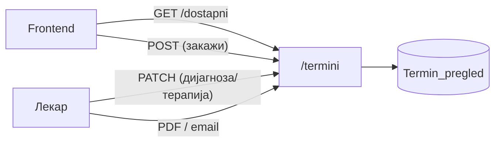

# API — Термини

Сите endpoints поврзани со **термините и прегледите** се дефинирани во `backend/routers/termini.py` и достапни под префиксот `/termini`. Овој модул е еден од централните во системот — тука се одвива целиот процес на закажување: од проверка на слободни термини, преку креирање, откажување и пренос на преглед, до внесување дијагноза и терапија по завршен преглед и генерирање на PDF извештај.

> **Интерактивно тестирање:** секој endpoint е придружен со вграден **OpenAPI блок** и копче **„Test it"**, погонувано од Scalar. Пополни ги потребните параметри или тело на барањето и испрати го директно кон живиот сервер (`klinicka-bolnica-stip2026.onrender.com`) — без да ја напушташ документацијата.


## Содржина

* [1. Преглед](#1-pregled)
* [2. Работно време и правила](#2-pravila)
* [3. GET `/termini/dostapni`](#3-dostapni)
* [4. POST `/termini`](#4-zakazi)
* [5. PATCH `/termini/{termin_id}`](#5-dijagnoza)
* [6. GET `/termini/izvestaj-pdf/{termin_id}`](#6-pdf)
* [7. POST `/termini/{termin_id}/poslati-izvestaj`](#7-email)

> Поврзани: [Конвенции](conventions.md) · [Пациенти](pacienti.md) ·
> [Лекари](lekari.md) · [База — Termin_pregled](../the_database.md#tab-termin)

---

## 1. Преглед <a id="1-pregled"></a>



| Метод | Патека | Намена |
|-------|--------|--------|
| `GET` | `/termini/dostapni` | Враќа листа на слободни термини за избран лекар и датум |
| `POST` | `/termini` | Креира нов термин и го закажува прегледот |
| `PATCH` | `/termini/{termin_id}` | Внесува дијагноза и терапија по завршен преглед |
| `GET` | `/termini/izvestaj-pdf/{termin_id}` | Генерира и враќа PDF извештај за завршен преглед |
| `POST` | `/termini/{termin_id}/poslati-izvestaj` | Го испраќа генерираниот PDF извештај на е-пошта |

---

## 2. Работно време и правила <a id="2-pravila"></a>

- Закажување во **сабота и недела не е возможно** — backend автоматски враќа `400` или празна листа за викенд датуми.
- Слободните слотови се нудат по **полн или половина час** во рамките на работното време на болницата.
- Времето автоматски се нормализира во формат `HH:MM` — на пример, внесот `9:0` се конвертира во `09:00` пред зачувување.
- Еден лекар **не може да има два активни термини** во исто време — обидот за дуплирање се одбива со грешка `409`.
- Календарите за **прегледи и медицински апарати се целосно синхронизирани** — доколку лекарот има закажан термин на апарат во одреден слот, тој слот автоматски се блокира и во неговиот распоред за прегледи.

---

## 3. GET `/termini/dostapni` <a id="3-dostapni"></a>

Враќа листа на **зафатени термини** за избран лекар и датум. Наместо да ги пресметува и враќа слободните слотови директно, endpoint-от ги враќа зафатените времиња — frontend-от ги зема сите можни слотови во работното време и ги одзема зафатените, со што добива листа на слободни термини за приказ на корисникот.

**Query параметри:**
- `lekar_id` (задолжителен)
- `datum` (задолжителен, `YYYY-MM-DD`; прифаќа и ISO со `T`)

**Успешен одговор (200):**

```json
["09:00", "10:30", "13:00"]
```
> За викенд датуми endpoint-от враќа празна листа `[]` — закажување во сабота и недела не е возможно.

**Можни грешки:** `400` (неважечки или погрешно форматиран датум) · `500` (внатрешна грешка на серверот)


[OpenAPI KlinickaBolnicaAPI](https://klinicka-bolnica-stip2026.onrender.com/openapi.json)


---

## 4. POST `/termini` <a id="4-zakazi"></a>

Креира **нов термин и го закажува прегледот**. Пред да го зачува, backend-от извршува низа проверки — потврдува дека лекарот постои, дека избраниот датум не е викенд и дека бараниот временски слот не е веќе зафатен. Само ако сите проверки поминат успешно, терминот се зачувува со статус `закажан` и на пациентот автоматски му се испраќа потврда на е-пошта — доколку SMTP е конфигуриран.

**Тело (JSON):**

```json
{
  "lekar_id": 28,
  "ime": "Иван",
  "prezime": "Ивановски",
  "datum": "2026-06-16",
  "vreme": "10:00",
  "email": "ivan@example.com",
  "telefon": "070123456",
  "napomena": ""
}
```

**Успешен одговор (200):**

```json
{
  "message": "Терминот е успешно закажан! Ќе добиете потврда на вашата е-пошта.",
  "appointment_ID": 42
}
```

**Можни грешки:** `400` (избраниот датум е викенд или е во невалиден формат) · `404` (лекар со дадениот `lekar_id` не постои во базата) · `409` (бараниот временски слот е веќе зафатен од друг термин) · `500` (внатрешна грешка на серверот)


[OpenAPI KlinickaBolnicaAPI](https://klinicka-bolnica-stip2026.onrender.com/openapi.json)


---

## 5. PATCH `/termini/{termin_id}` <a id="5-dijagnoza"></a>
Овој endpoint го користи лекарот по завршен преглед за да ги внесе **дијагнозата и терапијата** во досието на пациентот. Доволно е да се внесе барем едно од двете полиња — во тој момент статусот на терминот автоматски се менува во `завршен`, со што пациентот добива можност да го оцени прегледот.

**Path параметри:** `termin_id`
**Тело (JSON):**

```json
{
  "dijagnoza": "Хипертензија",
  "terapija": "Контрола за 3 месеци, терапија по упатство"
}
```

**Успешен одговор (200):**

```json
{ "message": "Дијагноза и терапија се ажурирани." }
```

**Можни грешки:** `404` (термин со дадениот `termin_id` не постои во базата) · `500` (внатрешна грешка на серверот)


[OpenAPI KlinickaBolnicaAPI](https://klinicka-bolnica-stip2026.onrender.com/openapi.json)


---

Следно: [Услуги](uslugi.md) · [Апарати](aparati.md) · [Лекари](lekari.md)
