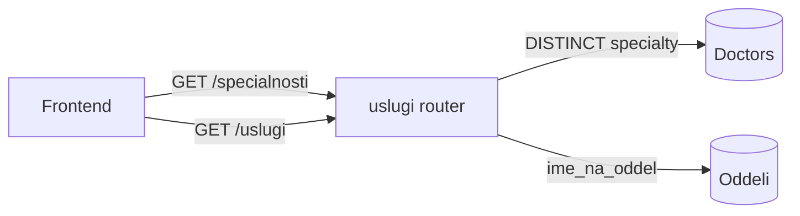
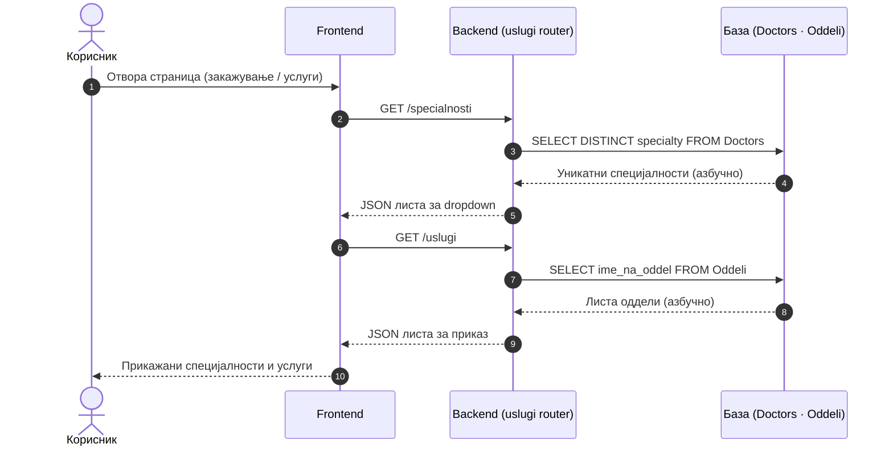

# Услуги и специјалности

Модулот `uslugi.py` е регистриран без router префикс — патеките `/specialnosti` и `/uslugi` се монтирани директно на коренот на FastAPI апликацијата во `main.py`. Двата endpoints се read-only, јавно достапни без автентикација и извршуваат едноставни `SELECT *` барања врз соодветните табели без дополнително филтрирање или пагинација.
Frontend-от ги повикува при иницијализација на страницата за да ги пополни dropdown менијата за специјалности и листата на одделенија. Доколку некој од овие повици не успее, корисникот не може да филтрира лекари по специјалност ниту да пристапи до страницата на конкретен оддел — затоа се повикуваат меѓу првите при вчитување.

> **Интерактивно тестирање:** секој endpoint е придружен со вграден **OpenAPI блок** и копче **„Test it"**, погонувано од Scalar. Пополни ги потребните параметри или тело на барањето и испрати го директно кон живиот сервер (`klinicka-bolnica-stip2026.onrender.com`) — без да ја напушташ документацијата.

## Содржина

* [1. Преглед](uslugi.md#1-pregled)
* [2. GET `/specialnosti`](uslugi.md#2-specialnosti)
* [3. GET `/uslugi`](uslugi.md#3-uslugi)
* [4. Поврзани табели](uslugi.md#4-tabele)

> Поврзани: [Конвенции](conventions.md) · [Лекари](lekari.md) · [Термини](termini.md) · [База на податоци](../the_database.md) · [Преглед на backend](../pregled.md)

***

## 1. Преглед <a href="#id-1-pregled" id="id-1-pregled"></a>

Двата endpoints извршуваат операции само за читање врз базата — без бизнис логика, без валидација, само читање и враќање на JSON. `/specialnosti` извршува `SELECT DISTINCT` врз полето `specijalnost` во табелата `Doctors`, со што дедупликацијата се случува директно на ниво на SQL наместо на frontend-от — доколку десетина лекари споделуваат иста специјалност, во одговорот таа се појавува само еднаш. `/uslugi` извршува стандарден `SELECT` врз посебна табела со одделенија и ги враќа имињата директно, без дополнително филтрирање или трансформација.



| Метод | Патека | Намена | Извор |
|-------|--------|--------|-------|
| `GET` | `/specialnosti` | Уникатни специјалности на лекарите | `Doctors` |
| `GET` | `/uslugi` | Листа на оддели / услуги | `Oddeli` |

### Тек на податоци — пополнување на менија

Дијаграмот покажува како frontend-от ги користи овие endpoints при вчитување на страница (на пр. формата за закажување или делот „Услуги").



Сите одговори се **JSON** формат. Грешките се враќаат како `{"detail": "порака"}` со статус `500` при внатрешна грешка на серверот.

***

## 2. GET `/specialnosti` <a href="#id-2-specialnosti" id="id-2-specialnosti"></a>

Враќа листа на **уникатни специјалности** од табелата `Doctors`. Користи `SELECT DISTINCT` за да се избегнат повторувања (повеќе лекари можат да имаат иста специјалност), ги исфрла празните вредности и подредува по азбучен ред.

Frontend-от го користи за **dropdown менија** при филтрирање лекари по специјалност и при изборот на специјалност за закажување.

**Параметри:** нема.

**Успешен одговор (200):**

```json
[
  { "specijalnost": "Кардиологија" },
  { "specijalnost": "Неврологија" },
  { "specijalnost": "Хирургија" }
]
```

**Можни грешки:** `500` (внатрешна грешка на серверот)


[OpenAPI KlinickaBolnicaAPI](https://klinicka-bolnica-stip2026.onrender.com/openapi.json)


***

## 3. GET `/uslugi` <a href="#id-3-uslugi" id="id-3-uslugi"></a>

Извршува `SELECT` врз табелата `Oddeli`, сортиран по азбучен ред. Имињата на одделенијата се тримуваат (`TRIM`) пред да се вратат — со што се елиминираат евентуални празни места кои би предизвикале несакани резултати при пребарување или споредба на frontend-от.
Frontend-от го повикува овој endpoint при вчитување на делот **„Услуги"** и секаде каде е потребен приказ на одделенијата на болницата, како на пример при навигација до страницата на конкретен оддел.

**Параметри:** нема — враќа ги сите записи без филтрирање.

**Успешен одговор (200):**

```json
[
  { "naziv": "Кардиологија" },
  { "naziv": "Неврологија" },
  { "naziv": "Педијатрија" }
]
```

**Можни грешки:** `500` (внатрешна грешка на серверот)


[OpenAPI KlinickaBolnicaAPI](https://klinicka-bolnica-stip2026.onrender.com/openapi.json)


***

## 4. Поврзани табели <a href="#id-4-tabele" id="id-4-tabele"></a>

| Табела     | Улога                                                        |
| ---------- | ----------------------------------------------------------- |
| `Doctors`  | Извор на специјалности (`specialty`) за `/specialnosti`      |
| `Oddeli`   | Извор на оддели / услуги (`ime_na_oddel`) за `/uslugi`       |

> Забелешка: специјалностите доаѓаат **директно од лекарите** — кога ќе се додаде лекар со нова специјалност, таа автоматски се појавува во `/specialnosti` без друга измена.

Детали за колони и врски: [База на податоци](../the_database.md).

***

Следно: [Апарати](aparati.md) · [Конвенции](conventions.md)
