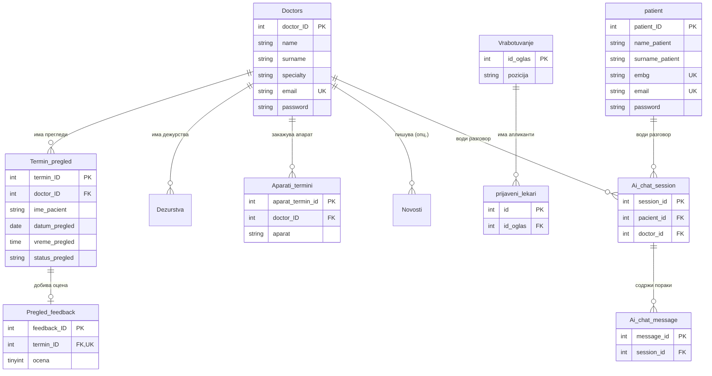

# База на податоци

Базата на податоци е **централното складиште** на системот — местото каде трајно се чуваат сите податоци кои го прават порталот функционален. Шемата е внимателно структурирана да ги одразува реалните процеси на болницата: од регистрација на пациент и закажување термин, до внесување дијагноза, оценување и AI разговори.
Во продолжение се опишани сите табели, нивните полиња, меѓусебните релации и причините зад клучните дизајнерски одлуки. Целосната шема е дефинирана во `backend/schema.sql` и претставува единствен извор на вистина за структурата на податоците во системот.

## Содржина

* [1. Општо за базата](#1-opsto)
* [2. Дијаграм на врски (ERD)](#2-erd)
* [3. Преглед на сите табели](#3-pregled-tabeli)
* [4. Корисници и автентикација](#4-korisnici)
  * [Doctors](#tab-doctors)
  * [patient](#tab-patient)
  * [password_reset_tokens](#tab-prt)
* [5. Термини и прегледи](#5-termini)
  * [Termin_pregled](#tab-termin)
  * [Pregled_feedback](#tab-feedback)
  * [Potsetnici (опц. — миграција)](#tab-potsetnici)
* [6. Апарати](#6-aparati)
  * [Aparati](#tab-aparati)
  * [Aparati_termini](#tab-aparati-termini)
* [7. Содржини и организација](#7-sodrzini)
  * [Novosti](#tab-novosti)
  * [Vrabotuvanje](#tab-vrabotuvanje)
  * [prijaveni_lekari](#tab-prijaveni)
  * [Dezurstva](#tab-dezurstva)
  * [Oddeli](#tab-oddeli)
* [8. AI асистент (историја)](#8-ai)
  * [Ai_chat_session](#tab-ai-session)
  * [Ai_chat_message](#tab-ai-message)
* [9. Конвенции и важни забелешки](#9-konvencii)
* [10. Миграции (`migrations/`)](#10-migracii)

> Поврзани страници: [Архитектура](../overview_na_sisitemot/architecture.md) ·
> [Преглед на backend](pregled.md) · [API → Термини](api/termini.md)

---

## 1. Општо за базата 

| Карактеристика | Вредност |
|----------------|----------|
| **Систем** | MySQL 8+ |
| **Engine** | InnoDB (поддршка за foreign keys и трансакции) |
| **Charset** | `utf8mb4` (целосна поддршка за кирилица и емоџи) |
| **Collation** | `utf8mb4_unicode_ci` |
| **Име на база** | `Klinicka_Bolnica_Stip` |
| **Дефиниција** | `backend/schema.sql` |

Базата се состои од **14 табели**, групирани во неколку логички целини:
корисници, термини, апарати, содржини и AI историја.

> **Зошто InnoDB?** Овозможува **foreign keys** (врски меѓу табели со
> автоматска контрола) и **трансакции** (или сѐ се зачувува, или ништо — нема
> полу-зачувани податоци).

---

## 2. Дијаграм на врски (ERD) 

Следниот дијаграм ги покажува главните табели и врските меѓу нив:

> **Легенда:** `PK` = примарен клуч · `FK` = странски клуч (врска) ·
> `UK` = уникатен клуч · `||--o{` = еден-кон-повеќе · `||--o|` = еден-кон-еден.

---

## 3. Преглед на сите табели 

| # | Табела | Примарен клуч | Намена |
|---|--------|---------------|--------|
| 1 | [`Doctors`](#tab-doctors) | `doctor_ID` | Лекари |
| 2 | [`patient`](#tab-patient) | `patient_ID` | Пациенти |
| 3 | [`password_reset_tokens`](#tab-prt) | `id` | Кодови за заборавена лозинка |
| 4 | [`Termin_pregled`](#tab-termin) | `termin_ID` | Закажани прегледи |
| 5 | [`Pregled_feedback`](#tab-feedback) | `feedback_ID` | Оцени за прегледи |
| 6 | [`Aparati`](#tab-aparati) | `aparat_id` | Медицински апарати |
| 7 | [`Aparati_termini`](#tab-aparati-termini) | `aparat_termin_id` | Термини за апарати |
| 8 | [`Novosti`](#tab-novosti) | `id` | Новости |
| 9 | [`Vrabotuvanje`](#tab-vrabotuvanje) | `id_oglas` | Огласи за работа |
| 10 | [`prijaveni_lekari`](#tab-prijaveni) | `id` | Апликации за огласи |
| 11 | [`Dezurstva`](#tab-dezurstva) | `dezurstvo_ID` | Дежурства на лекари |
| 12 | [`Oddeli`](#tab-oddeli) | `id` | Одделенија |
| 13 | [`Ai_chat_session`](#tab-ai-session) | `session_id` | AI разговори |
| 14 | [`Ai_chat_message`](#tab-ai-message) | `message_id` | Пораки во AI разговор |

---

## 4. Корисници и автентикација 

### Doctors 

**Doctors** ги чува сите лекари, идентификувани преку примарниот клуч `doctor_ID`. Истата табела стои зад листата на лекари на јавниот дел од сајтот, зад најавата на лекар преку лекарскиот портал, и зад проверката на администраторски пристап: секој повик кон admin endpoint (на пример, во модулот за новости) бара admin_doctor_id кој постои токму тука, валидиран преку check_admin_access(). 
- Полињата `name` и `surname` се користат и надвор од овој контекст — записите во Novosti чуваат само author_doctor_id, а конкретното име и презиме на авторот се повлекуваат од Doctors при секое читање.
`specialty` го бележи одделот или специјалноста на лекарот, најверојатно искористен за филтрирање на јавната листа на лекари. 
`email` служи за најава на лекарскиот портал и мора да биде единствен — два лекари не можат да делат иста е-пошта.
`password` секогаш чува bcrypt хеш, никогаш лозинка во чист текст. 
`must_change_password` е флаг наменет за нови, рачно креирани профили: вредност 1 го принудува лекарот да смени привремена лозинка пред да продолжи понатаму, а по успешна промена се враќа на 0.

| Колона | Тип | Ограничувања | Опис |
|--------|-----|--------------|------|
| `doctor_ID` | INT | PK, AUTO_INCREMENT | Единствен идентификатор |
| `name` | VARCHAR(120) | NOT NULL | Име |
| `surname` | VARCHAR(120) | NOT NULL | Презиме |
| `specialty` | VARCHAR(120) | NULL | Специјалност (оддел) |
| `email` | VARCHAR(255) | NOT NULL, UNIQUE | Е-пошта (за најава) |
| `password` | VARCHAR(255) | NOT NULL | Хеширана лозинка (bcrypt) |
| `must_change_password` | TINYINT(1) | DEFAULT 0 | 1 = мора да ја смени привремената лозинка |

> `password` секогаш содржи **bcrypt хеш**, никогаш чист текст. Привремената
> лозинка за примерните лекари е `Test123..` и мора да се смени при прва најава.

### patient 

**patient** ги чува сите регистрирани пациенти — секој со сопствен профил, за разлика од гостинскиот режим на пристап, кој не остава траен идентитет во системот. `name_patient` и `surname_patient` се основните идентификациони полиња, задолжителни за секој регистриран пациент.
Полето `email` служи за најава, додека `embg` (ЕМБГ) е дополнителен, единствен идентификатор, корисен кога е потребна попрецизна проверка на личност, на пример при закажување термин. И email, и embg се уникатни во целата табела — не можат двајца пациенти да имаат иста е-пошта или ист ЕМБГ — иако embg смее да остане празен (NULL), додека email е секогаш задолжителен.

`phone_number` е опционален контакт телефон. Лозинката никогаш не се чува во чист текст — полето `password` содржи **bcrypt хеш**, исто како кај Doctors.

| Колона | Тип | Ограничувања | Опис |
|--------|-----|--------------|------|
| `patient_ID` | INT | PK, AUTO_INCREMENT | Единствен идентификатор |
| `name_patient` | VARCHAR(120) | NOT NULL | Име |
| `surname_patient` | VARCHAR(120) | NOT NULL | Презиме |
| `embg` | VARCHAR(13) | UNIQUE, NULL | 13-цифрен матичен број (ЕМБГ) |
| `email` | VARCHAR(255) | NOT NULL, UNIQUE | Е-пошта (за најава) |
| `phone_number` | VARCHAR(32) | NULL | Телефон |
| `password` | VARCHAR(255) | NOT NULL | Хеширана лозинка (bcrypt) |

> И `email`, и `embg` се уникатни во целата табела — не можат двајца пациенти да имаат иста е-пошта или ист ЕМБГ.

### password_reset_tokens 

Чува привремени кодови за ресетирање лозинка, секој важечки само еден час од моментот на генерирање. Истата табела ги опслужува и пациентите, и лекарите — наместо посебна табела за секој тип корисник, записот сам го носи типот, преку `user_type`, со вредност `pacient` или `lekar`. **Нема** `foreign key` кон `patient` или `Doctors`. Проверката при ресетирање се прави исклучиво преку комбинацијата `email` и `token`, не преку директна врска со ID-то на корисникот. Штом рокот во `expires_at` истече, понатамошен повик со истиот token веднаш се одбива, без оглед дали кодот воопшто бил искористен.

| Колона | Тип | Ограничувања | Опис |
|--------|-----|--------------|------|
| `id` | INT | PK, AUTO_INCREMENT | Идентификатор |
| `email` | VARCHAR(255) | NOT NULL | Е-пошта на корисникот |
| `token` | VARCHAR(255) | NOT NULL, INDEX | Кодот за ресетирање |
| `user_type` | VARCHAR(20) | NOT NULL | `pacient` или `lekar` |
| `expires_at` | DATETIME | NOT NULL | Време на истекување |

---

## 5. Термини и прегледи 

### Termin_pregled 

`Termin_pregled` е централната табела на овој дел од системот.

**Termin_pregled** е централната табела на овој дел од системот. Секој закажан преглед — без оглед дали завршил со посета, отказ или реализација — е претставен со по еден ред тука, преку сопствен `termin_ID`. За разлика од повеќето табели поврзани со пациенти, тука нема `patient_ID foreign key`. Идентитетот на пациентот се чува директно како текст, преку `ime_pacient`, `email_pacient` и `telefon_pacient`. Тоа значи термин може да се закаже и без регистриран пациентски профил, слично на гостинскиот режим во AI-чатот, каде разговор може да започне без претходна најава.
`specijalnost_termin` бележи за која специјалност е закажан прегледот — корисно поле кога еден лекар покрива повеќе специјалности, или кога апликацијата треба да прикаже список термини групирани по специјалност, не само по лекар. Колоната `ime_lekar` дополнително чува снимка на името на лекарот во моментот на закажување, паралелно со вистинскиот `foreign key`, `doctor_ID`, кон Doctors — корисно ако подоцна треба историски приказ кој не се менува, дури и ако лекарот го промени своето име во базата.
`datum_pregled` и `vreme_pregled `го одредуваат конкретниот термин во календарот на лекарот, заедно со комбинираниот индекс наведен подолу. 
Самата колона `status_pregled` е обичен VARCHAR со стандардна вредност 'закажан', не вистински SQL ENUM — валидните вредности, дадени подолу, се наметнати на ниво на апликацијата, не на ниво на базата.
Преостанатите три текстуални полиња припаѓаат на различни моменти од прегледот: `napomena` е опционална забелешка која пациентот ја внесува при закажување, наменета за лекарот, додека `dijagnoza` и `terapija` се внесуваат од лекарот по извршен преглед — двете најверојатно остануваат празни сè додека терминот не премине во статус завршен.

| Колона | Тип | Ограничувања | Опис |
|--------|-----|--------------|------|
| `termin_ID` | INT | PK, AUTO_INCREMENT | Идентификатор на термин |
| `doctor_ID` | INT | FK → Doctors, NOT NULL | Лекар |
| `ime_pacient` | VARCHAR(255) | NOT NULL | Име и презиме на пациент |
| `specijalnost_termin` | VARCHAR(120) | NULL | Специјалност на прегледот |
| `ime_lekar` | VARCHAR(255) | NULL | Име на лекар (снимка за приказ) |
| `datum_pregled` | DATE | NOT NULL | Датум |
| `vreme_pregled` | TIME | NOT NULL | Време |
| `status_pregled` | VARCHAR(40) | DEFAULT 'закажан' | Статус (види подолу) |
| `email_pacient` | VARCHAR(255) | NULL | Е-пошта на пациент |
| `telefon_pacient` | VARCHAR(32) | NULL | Телефон |
| `napomena` | TEXT | NULL | Напомена од пациент за лекар |
| `dijagnoza` | TEXT | NULL | Дијагноза (внесува лекар) |
| `terapija` | TEXT | NULL | Терапија (внесува лекар) |

**Можни вредности за `status_pregled`:**

| Статус | Значење |
|--------|---------|
| `закажан` | Активен термин (го зафаќа времето) |
| `завршен` | Прегледот е извршен (може да се оцени) |
| `откажан` | Поништен (времето е повторно слободно) |

**Врски (foreign keys):**
- динствениот `foreign key` е `doctor_ID` = Doctors(doctor_ID), со ON DELETE CASCADE — ако се избрише лекар, автоматски се бришат и сите негови термини.

**Индекси:** комбинираниот индекс (`doctor_ID`, `datum_pregled`) и посебниот индекс на `status_pregled` овозможуваат брзо наоѓање на слободни термини, без скенирање на цела табела

### Pregled_feedback 

**Pregled_feedback** чува оцена која пациентот ја остава откако преглед е завршен. Foreign key-то `termin_ID` е означено и како UNIQUE, не само FK — тоа на ниво на базата гарантира дека за еден термин не постојат два различни записи за оцена, без апликацијата сама да го проверува тоа при секој запис. Самата шема, сепак, нема механизам кој физички да спречи оцена за термин чиј `status_pregled` сѐ уште не е завршен — таа проверка се прави во апликативниот код, не во базата.

`feedback_ID` е стандарден автоматски идентификатор. `ocena` е задолжителна нумеричка вредност, ограничена помеѓу 1 и 5 преку CHECK ограничување на ниво на базата — невалидна вредност надвор од тој опсег се одбива автоматски, без потреба апликацијата сама да ја проверува. 
`komentar `е опционален слободен текст, корисен кога пациентот сака да го појасни разлогот за оцената, додека `datum_na_ocena` се поставува автоматски во моментот кога оцената е запишана.

| Колона | Тип | Ограничувања | Опис |
|--------|-----|--------------|------|
| `feedback_ID` | INT | PK, AUTO_INCREMENT | Идентификатор |
| `termin_ID` | INT | FK → Termin_pregled, UNIQUE | Кој термин се оценува |
| `ocena` | TINYINT | NOT NULL, CHECK 1–5 | Оцена од 1 до 5 |
| `komentar` | TEXT | NULL | Опционален коментар |
| `datum_na_ocena` | DATETIME | DEFAULT CURRENT_TIMESTAMP | Кога е дадена |

> **CHECK ограничување:** : `ocena` мора да биде помеѓу 1 и 5 — базата сама одбива невалидна вредност.

---

## 6. Апарати 

### Aparati 

`Aparati` ја чува листата на медицинските апарати достапни за закажување — рентген, КТ, МРТ, ултразвук, и секој иден апарат додаден во истиот формат. Колоната `kod` е стабилен, читлив идентификатор (rentgen, kt, mri, usg), различен од нумеричкиот `aparat_id`. Токму `kod`, не `aparat_id`, е тоа што другите делови на системот го користат за упатување кон конкретен апарат, како што се гледа во `Aparati_termini` подолу. Полето `aktiven` дозволува апарат привремено да се исклучи од понудата — на пример, при дефект или одржување — без да се избрише целиот запис и историјата поврзана со него.

| Колона | Тип | Ограничувања | Опис |
|--------|-----|--------------|------|
| `aparat_id` | INT | PK, AUTO_INCREMENT | Идентификатор |
| `ime` | VARCHAR(255) | NOT NULL | Име (на пр. „Рентген") |
| `opis` | TEXT | NULL | Опис |
| `kod` | VARCHAR(64) | NOT NULL, UNIQUE | Код (на пр. `rentgen`, `kt`, `mri`, `usg`) |
| `aktiven` | TINYINT(1) | DEFAULT 1 | 1 = достапен, 0 = неактивен |

### Aparati_termini 

`Aparati_termini` следи истиот образец како `Termin_pregled`.
`doctor_ID` е вистински `foreign key` кон Doctors, додека пациентот постои само како текст, преку `pacient_ime`, без сопствена врска кон табела за пациенти. `lekar_ime`, исто како i`me_lekar` од претходната табела, е снимка за приказ, не извор на вистината — вистинскиот лекар се определува преку doctor_ID.

| Колона | Тип | Ограничувања | Опис |
|--------|-----|--------------|------|
| `aparat_termin_id` | INT | PK, AUTO_INCREMENT | Идентификатор |
| `doctor_ID` | INT | FK → Doctors, NOT NULL | Лекар што закажува |
| `lekar_ime` | VARCHAR(255) | NOT NULL | Име на лекар (приказ) |
| `pacient_ime` | VARCHAR(255) | NOT NULL | Име на пациент |
| `aparat` | VARCHAR(64) | NOT NULL | Код на апаратот |
| `datum_pregled` | DATE | NOT NULL | Датум |
| `vreme_pregled` | TIME | NOT NULL | Време |
| `opis` | TEXT | NOT NULL | Зошто е потребен апаратот |
| `status` | VARCHAR(40) | DEFAULT 'закажан' | Статус на терминот |

> Полето `aparat` чува текстуален код на апаратот, не нумеричка врска кон `Aparati` — кодовите мора да се совпаѓаат со вредностите во колоната `kod`.

---

## 7. Содржини и организација 

### Novosti 

`Novosti` ја чува секоја вест објавена на болницата — табелата веќе детално опишана преку `GET /novosti/{novost_id}`, `POST /admin/novosti`, `PUT /admin/novosti/{novost_id}` и `DELETE /admin/novosti/{novost_id`}. Колоната `slike_extra` не чува листа директно, туку JSON стринг, серијализиран преку json.dumps() — секој endpoint кој ја чита мора прво да ја распакува назад во вистинска листа, а оние кои запишуваат мораат прво да ја серијализираат. 
`slika_path` може да биде или локална/Azure патека вратена од `_save_upload()`, или целосен URL, проверен преку` _is_full_url()`— двете форми коегзистираат во истата колона, без посебно поле да ја означи разликата.

| Колона | Тип | Ограничувања | Опис |
|--------|-----|--------------|------|
| `id` | INT | PK, AUTO_INCREMENT | Идентификатор |
| `naslov` | VARCHAR(500) | NOT NULL | Наслов |
| `sodrzina` | MEDIUMTEXT | NOT NULL | Содржина |
| `slika_path` | VARCHAR(1024) | NULL | Патека до главна слика |
| `slika_position` | VARCHAR(64) | NULL | Позиција на сликата |
| `slika_height` | VARCHAR(32) | NULL | Висина на сликата |
| `video_url` | VARCHAR(1024) | NULL | Линк до видео |
| `slike_extra` | TEXT | NULL | Дополнителни слики |
| `author_doctor_id` | INT | FK → Doctors, NULL | Автор (лекар/директор) |
| `created_at` | DATETIME | DEFAULT CURRENT_TIMESTAMP | Создадено |
| `updated_at` | DATETIME | ON UPDATE CURRENT_TIMESTAMP | Изменето |

> `author_doctor_id` -> `Doctors(doctor_ID)`, со `ON DELETE SET NULL` — ако авторот биде избришан, новоста останува, само полето `author_doctor_id` станува NULL. Разликата од Termin_pregled, каде истиот тип на врска користи ON DELETE CASCADE, е намерна: бришење на лекар не треба автоматски да повлече бришење на содржина веќе објавена за пациентите.

### Vrabotuvanje 

`Vrabotuvanje` ја чува секој оглас за работна позиција, објавен на страницата за кариера. 
`datum_na_objava` бележи кога огласот излегол во јавност, а `datum_na_prijavuvanje` го означува крајниот рок до кога кандидатите можат да аплицираат — двете заедно го дефинираат животниот циклус на огласот. За разлика од status_pregled во Termin_pregled, кој секогаш почнува со стандардна вредност 'закажан', status_oglas нема стандардна вредност и дозволува NULL. При креирање на огласот администраторот сам го поставува крајнтио датум за аплициранје на кандидати. По истекување на претходно дефинираниот датум огласот е недостапен за аплициранје од нови корисници. На страна на администраторот (др Владко Захариев) се даваат сите кандидати кои аплицирале до дефинираниот датум. 

| Колона | Тип | Ограничувања | Опис |
|--------|-----|--------------|------|
| `id_oglas` | INT | PK, AUTO_INCREMENT | Идентификатор |
| `pozicija` | VARCHAR(255) | NOT NULL | Позиција |
| `oddel` | VARCHAR(255) | NOT NULL | Оддел |
| `datum_na_objava` | DATE | NOT NULL | Датум на објава |
| `datum_na_prijavuvanje` | DATE | NOT NULL | Краен рок за пријава |
| `status_oglas` | VARCHAR(64) | NULL | Статус (на пр. `активен`) |

### prijaveni_lekari 

Апликации поднесени на огласите.

| Колона | Тип | Ограничувања | Опис |
|--------|-----|--------------|------|
| `id` | INT | PK, AUTO_INCREMENT | Идентификатор |
| `id_oglas` | INT | FK → Vrabotuvanje, NULL | На кој оглас |
| `pozicija` | VARCHAR(255) | NOT NULL | Позиција |
| `ime_lekar` | VARCHAR(120) | NOT NULL | Име |
| `prezime_lekar` | VARCHAR(120) | NOT NULL | Презиме |
| `broj_med_licenca` | BIGINT | NULL | Број на лиценца |
| `email` | VARCHAR(255) | NOT NULL | Е-пошта |
| `telefon` | BIGINT | NULL | Телефон |
| `datum_prijava` | DATETIME | NOT NULL | Кога е поднесена |

> `id_oglas` → `Vrabotuvanje` со `ON DELETE SET NULL` (ако се избрише огласот,
> апликациите остануваат, но без врска кон огласот).

### Dezurstva 

`Dezurstva` го чува распоредот на дежурства: кој лекар е на повик, во кој оддел, и во кој временски период, од vreme_od до vreme_do, на конкретен datum. napomena дозволува слободен текст за нестандардни случаи, на пример замена на дежурен лекар. 
`doctor_ID` е foreign key кон Doctors, означен како NOT NULL — за разлика од Termin_pregled, каде преглед може да постои и без регистриран пациентски профил, дежурство секогаш мора да биде поврзано со конкретен, постоечки лекар. За разлика од истата врска во Termin_pregled, која користи ON DELETE CASCADE, тука не е наведено посебно ON DELETE правило.

| Колона | Тип | Ограничувања | Опис |
|--------|-----|--------------|------|
| `dezurstvo_ID` | INT | PK, AUTO_INCREMENT | Идентификатор |
| `doctor_ID` | INT | FK → Doctors, NOT NULL | Лекар |
| `datum` | DATE | NOT NULL | Датум |
| `oddel` | VARCHAR(255) | NOT NULL | Оддел |
| `vreme_od` | TIME | NOT NULL | Почеток |
| `vreme_do` | TIME | NOT NULL | Крај |
| `napomena` | TEXT | NULL | Напомена |

### Oddeli 

`Oddeli` е едноставна листа на болничките одделенија, искористена за прикажување на страницата со услуги. Ограничувањето UNIQUE на `ime_na_oddel` гарантира дека секое одделение се појавува само еднаш, без можност за случајно дуплирање под две различни имиња.

| Колона | Тип | Ограничувања | Опис |
|--------|-----|--------------|------|
| `id` | INT | PK, AUTO_INCREMENT | Идентификатор |
| `ime_na_oddel` | VARCHAR(255) | NOT NULL, UNIQUE | Име на оддел |

---

## 8. AI асистент (историја) 

### Ai_chat_session 

`Ai_chat_session` претставува една сесија (разговор) со AI асистентот, заведена за најавен корисник — пациент или лекар. Сесијата припаѓа или на пациент, преку `pacient_id`, или на лекар, преку `doctor_id` — никогаш на двете истовремено, иако самата шема не го наметнува тоа физички. Двете FK колони се NULL-дозволени, а проверката дека точно една од нив е пополнета се прави во апликативниот код, не во базата. За разлика од `Termin_pregled`, каде преглед може да се закаже и без регистриран профил, преку текстуални полиња за идентитет, овде нема таква опција — сесија без идентификуван `pacient_id` или `doctor_id` едноставно не може да постои во оваа табела.
Гостинските разговори со AI агентот се пренесуваат во оваа табела кога пациентот ќе се најави доколку има креирано профил или кога ќе се регистрира како пациенто. Со најавата корисникот ќе има увид во сите пораки со AI агентот.

| Колона | Тип | Ограничувања | Опис |
|--------|-----|--------------|------|
| `session_id` | INT | PK, AUTO_INCREMENT | Идентификатор на сесија |
| `pacient_id` | INT | FK = patient, NULL | Ако разговорот е на пациент |
| `doctor_id` | INT | FK = Doctors, NULL | Ако разговорот е на лекар |
| `naslov` | VARCHAR(255) | NULL | Наслов на разговорот |
| `kontekst_json` | MEDIUMTEXT | NULL | Зачуван контекст (JSON) |
| `created_at` | DATETIME | DEFAULT CURRENT_TIMESTAMP | Создадено |
| `updated_at` | DATETIME | ON UPDATE CURRENT_TIMESTAMP | Последна измена |

> Сесијата припаѓа или на пациент или на лекар — затоа двете FK колони се опционални (`NULL`).

### Ai_chat_message 

Ai_chat_message чува секоја поединечна порака во рамки на одредена сесија. `session_id` е FK кон `Ai_chat_session`, означен како NOT NULL — за разлика од `pacient_id/doctor_id` во сесијата, порака без сесија нема смисла и затоа не е дозволена. Колоната `uloga` користи вистински SQL ENUM('user','assistant'), не обичен VARCHAR со апликативна проверка, каков е случајот со `status_pregled` во `Termin_pregled`. Разликата е оправдана: овде постојат само две, стабилни и непроменливи вредности, додека листата на статуси на преглед е поголема и подложна на промена.

`sodrzina` е самиот текст на пораката — или прашањето на корисникот, или одговорот на асистентот, во зависност од uloga. `navigacija_json` и `akcija` ја бележат можноста асистентот да предизвика нешто повеќе од текстуален одговор: `navigacija_json` чува податоци за пренасочување на интерфејсот кон конкретна страница, додека `akcija` бележи конкретна извршена операција, на пример закажување термин директно преку разговор. 
| Колона | Тип | Ограничувања | Опис |
|--------|-----|--------------|------|
| `message_id` | INT | PK, AUTO_INCREMENT | Идентификатор |
| `session_id` | INT | FK = Ai_chat_session, NOT NULL | На која сесија |
| `uloga` | ENUM('user','assistant') | NOT NULL | Кој ја испратил пораката |
| `sodrzina` | TEXT | NOT NULL | Текст на пораката |
| `navigacija_json` | TEXT | NULL | Навигациски податоци (JSON) |
| `akcija` | VARCHAR(64) | NULL | Извршена акција |
| `created_at` | DATETIME | DEFAULT CURRENT_TIMESTAMP | Време |

---

## 9. Конвенции и важни забелешки 

### Конвенции за именување

> Имињата на табели и колони **не се целосно конзистентни** (мешани се
> англиски и македонски, еднина/множина). Ова е свесно документирано за да не
> се прават грешки при пишување SQL:

| Шема | Примери |
|------|---------|
| Англиски, еднина | `patient`, `Doctors` |
| Македонски (транслит.) | `Termin_pregled`, `Vrabotuvanje`, `Dezurstva` |
| Мешани колони | `name` (Doctors) vs `name_patient` (patient) |

### Како се поврзани пациент и термин

> **Важно:** Табелата `Termin_pregled` **нема** foreign key кон `patient`.
> Врската се прави преку **`email_pacient`** (текст), а не преку `patient_ID`.
> Затоа кодот често бара термини по е-пошта на пациентот, не по ID.

### Стандардни колони и однесувања

| Конвенција | Детал |
|------------|-------|
| Примарни клучеви | `AUTO_INCREMENT` цели броеви |
| Хеширани лозинки | bcrypt во `password` колоните |
| Временски печати | `created_at` / `updated_at` со `CURRENT_TIMESTAMP` |
| Бришење со каскада | Термини, дежурства, апарат-термини, AI се бришат со лекарот |
| Бришење со SET NULL | Новости и апликации остануваат, врската се празни |
| Charset | `utf8mb4` секаде (кирилица) |

---

Следно: [Преглед на backend](pregled.md) · [API → Термини](api/termini.md) ·
[API → Пациенти](api/pacienti.md)
