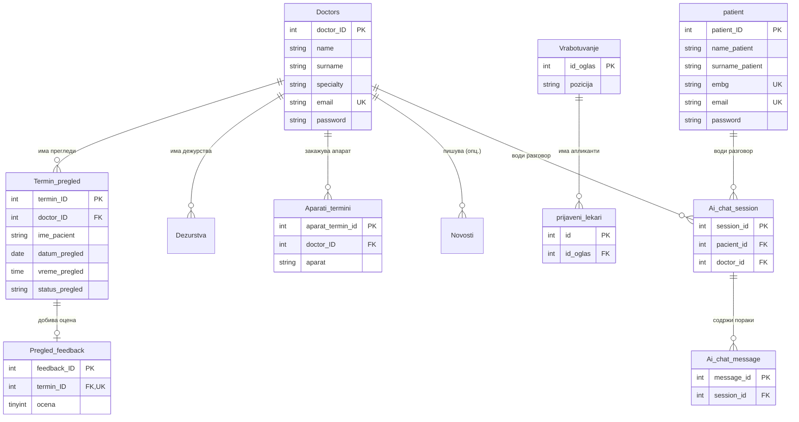

# База на податоци

Овој документ ја опишува **структурата на базата на податоци** на системот за
Клиничка болница – Штип: кои табели постојат, што содржат, како се поврзани и
зошто се дизајнирани така. Целата шема е во `backend/schema.sql`.

## Содржина

* [1. Општо за базата](#1-opsto)
* [2. Дијаграм на врски (ERD)](#2-erd)
* [3. Преглед на сите табели](#3-pregled-tabeli)
* [4. Корисници и автентикација](#4-korisnici)
  * [Doctors](#tab-doctors)
  * [patient](#tab-patient)
  * [password_reset_tokens](#tab-prt)
* [5. Термини и прегледи](#5-termini)
  * [Termin_pregled](#tab-termin)
  * [Pregled_feedback](#tab-feedback)
* [6. Апарати](#6-aparati)
  * [Aparati](#tab-aparati)
  * [Aparati_termini](#tab-aparati-termini)
* [7. Содржини и организација](#7-sodrzini)
  * [Novosti](#tab-novosti)
  * [Vrabotuvanje](#tab-vrabotuvanje)
  * [prijaveni_lekari](#tab-prijaveni)
  * [Dezurstva](#tab-dezurstva)
  * [Oddeli](#tab-oddeli)
* [8. AI асистент (историја)](#8-ai)
  * [Ai_chat_session](#tab-ai-session)
  * [Ai_chat_message](#tab-ai-message)
* [9. Конвенции и важни забелешки](#9-konvencii)

> 📎 Поврзани страници: [Архитектура](../overview_na_sisitemot/architecture.md) ·
> [Преглед на backend](pregled.md) · [API → Термини](api/termini.md)

---

## 1. Општо за базата 

| Карактеристика | Вредност |
|----------------|----------|
| **Систем** | MySQL 8+ |
| **Engine** | InnoDB (поддршка за foreign keys и трансакции) |
| **Charset** | `utf8mb4` (целосна поддршка за кирилица и емоџи) |
| **Collation** | `utf8mb4_unicode_ci` |
| **Име на база** | `Klinicka_Bolnica_Stip` |
| **Дефиниција** | `backend/schema.sql` |

Базата се состои од **14 табели**, групирани во неколку логички целини:
корисници, термини, апарати, содржини и AI историја.

> 💡 **Зошто InnoDB?** Овозможува **foreign keys** (врски меѓу табели со
> автоматска контрола) и **трансакции** (или сѐ се зачувува, или ништо — нема
> полу-зачувани податоци).

---

## 2. Дијаграм на врски (ERD) 

Следниот дијаграм ги покажува главните табели и врските меѓу нив:

> ℹ️ **Легенда:** `PK` = примарен клуч · `FK` = странски клуч (врска) ·
> `UK` = уникатен клуч · `||--o{` = еден-кон-повеќе · `||--o|` = еден-кон-еден.

---

## 3. Преглед на сите табели 

| # | Табела | Примарен клуч | Намена |
|---|--------|---------------|--------|
| 1 | [`Doctors`](#tab-doctors) | `doctor_ID` | Лекари |
| 2 | [`patient`](#tab-patient) | `patient_ID` | Пациенти |
| 3 | [`password_reset_tokens`](#tab-prt) | `id` | Кодови за заборавена лозинка |
| 4 | [`Termin_pregled`](#tab-termin) | `termin_ID` | Закажани прегледи |
| 5 | [`Pregled_feedback`](#tab-feedback) | `feedback_ID` | Оцени за прегледи |
| 6 | [`Aparati`](#tab-aparati) | `aparat_id` | Медицински апарати |
| 7 | [`Aparati_termini`](#tab-aparati-termini) | `aparat_termin_id` | Термини за апарати |
| 8 | [`Novosti`](#tab-novosti) | `id` | Новости |
| 9 | [`Vrabotuvanje`](#tab-vrabotuvanje) | `id_oglas` | Огласи за работа |
| 10 | [`prijaveni_lekari`](#tab-prijaveni) | `id` | Апликации за огласи |
| 11 | [`Dezurstva`](#tab-dezurstva) | `dezurstvo_ID` | Дежурства на лекари |
| 12 | [`Oddeli`](#tab-oddeli) | `id` | Одделенија |
| 13 | [`Ai_chat_session`](#tab-ai-session) | `session_id` | AI разговори |
| 14 | [`Ai_chat_message`](#tab-ai-message) | `message_id` | Пораки во AI разговор |

---

## 4. Корисници и автентикација 

### Doctors 

Ги чува сите лекари. Се користи за листата на лекари, најава на лекар и
администрација.

| Колона | Тип | Ограничувања | Опис |
|--------|-----|--------------|------|
| `doctor_ID` | INT | 🔑 PK, AUTO_INCREMENT | Единствен идентификатор |
| `name` | VARCHAR(120) | NOT NULL | Име |
| `surname` | VARCHAR(120) | NOT NULL | Презиме |
| `specialty` | VARCHAR(120) | NULL | Специјалност (оддел) |
| `email` | VARCHAR(255) | NOT NULL, UNIQUE | Е-пошта (за најава) |
| `password` | VARCHAR(255) | NOT NULL | Хеширана лозинка (bcrypt) |
| `must_change_password` | TINYINT(1) | DEFAULT 0 | 1 = мора да ја смени привремената лозинка |

> 🔒 `password` секогаш содржи **bcrypt хеш**, никогаш чист текст. Привремената
> лозинка за примерните лекари е `Test123..` и мора да се смени при прва најава.

### patient 

Ги чува регистрираните пациенти.

| Колона | Тип | Ограничувања | Опис |
|--------|-----|--------------|------|
| `patient_ID` | INT | 🔑 PK, AUTO_INCREMENT | Единствен идентификатор |
| `name_patient` | VARCHAR(120) | NOT NULL | Име |
| `surname_patient` | VARCHAR(120) | NOT NULL | Презиме |
| `embg` | VARCHAR(13) | UNIQUE, NULL | 13-цифрен матичен број (ЕМБГ) |
| `email` | VARCHAR(255) | NOT NULL, UNIQUE | Е-пошта (за најава) |
| `phone_number` | VARCHAR(32) | NULL | Телефон |
| `password` | VARCHAR(255) | NOT NULL | Хеширана лозинка (bcrypt) |

> ⚠️ И `email` и `embg` се **уникатни** — не може двајца пациенти со иста е-пошта
> или ист ЕМБГ.

### password_reset_tokens 

Привремени кодови за ресетирање лозинка (важат 1 час). Се користи и за лекари и
за пациенти.

| Колона | Тип | Ограничувања | Опис |
|--------|-----|--------------|------|
| `id` | INT | 🔑 PK, AUTO_INCREMENT | Идентификатор |
| `email` | VARCHAR(255) | NOT NULL | Е-пошта на корисникот |
| `token` | VARCHAR(255) | NOT NULL, INDEX | Кодот за ресетирање |
| `user_type` | VARCHAR(20) | NOT NULL | `pacient` или `lekar` |
| `expires_at` | DATETIME | NOT NULL | Време на истекување |

---

## 5. Термини и прегледи 

### Termin_pregled 

Централната табела — ги чува сите закажани прегледи, заедно со дијагнозата и
терапијата што лекарот ги внесува.

| Колона | Тип | Ограничувања | Опис |
|--------|-----|--------------|------|
| `termin_ID` | INT | 🔑 PK, AUTO_INCREMENT | Идентификатор на термин |
| `doctor_ID` | INT | 🔗 FK → Doctors, NOT NULL | Лекар |
| `ime_pacient` | VARCHAR(255) | NOT NULL | Име и презиме на пациент |
| `specijalnost_termin` | VARCHAR(120) | NULL | Специјалност на прегледот |
| `ime_lekar` | VARCHAR(255) | NULL | Име на лекар (снимка за приказ) |
| `datum_pregled` | DATE | NOT NULL | Датум |
| `vreme_pregled` | TIME | NOT NULL | Време |
| `status_pregled` | VARCHAR(40) | DEFAULT 'закажан' | Статус (види подолу) |
| `email_pacient` | VARCHAR(255) | NULL | Е-пошта на пациент |
| `telefon_pacient` | VARCHAR(32) | NULL | Телефон |
| `napomena` | TEXT | NULL | Напомена од пациент за лекар |
| `dijagnoza` | TEXT | NULL | Дијагноза (внесува лекар) |
| `terapija` | TEXT | NULL | Терапија (внесува лекар) |

**Можни вредности за `status_pregled`:**

| Статус | Значење |
|--------|---------|
| `закажан` | Активен термин (го зафаќа времето) |
| `завршен` | Прегледот е извршен (може да се оцени) |
| `откажан` | Поништен (времето е повторно слободно) |

**Врски (foreign keys):**

- `doctor_ID` → `Doctors(doctor_ID)` · `ON DELETE CASCADE` (ако се избрише
  лекар, се бришат неговите термини).

**Индекси:** `(doctor_ID, datum_pregled)` и `(status_pregled)` — за брзо
наоѓање слободни термини.

### Pregled_feedback 

Оцена што пациентот ја остава за **завршен** преглед. **Еден термин = една
оцена** (уникатен `termin_ID`).

| Колона | Тип | Ограничувања | Опис |
|--------|-----|--------------|------|
| `feedback_ID` | INT | 🔑 PK, AUTO_INCREMENT | Идентификатор |
| `termin_ID` | INT | 🔗 FK → Termin_pregled, UNIQUE | Кој термин се оценува |
| `ocena` | TINYINT | NOT NULL, CHECK 1–5 | Оцена од 1 до 5 |
| `komentar` | TEXT | NULL | Опционален коментар |
| `datum_na_ocena` | DATETIME | DEFAULT CURRENT_TIMESTAMP | Кога е дадена |

> ✅ **CHECK ограничување:** `ocena` мора да биде помеѓу 1 и 5 — базата сама
> одбива невалидна вредност.

---

## 6. Апарати 

### Aparati 

Листа на медицинските апарати (рентген, КТ, МРТ, ултразвук).

| Колона | Тип | Ограничувања | Опис |
|--------|-----|--------------|------|
| `aparat_id` | INT | 🔑 PK, AUTO_INCREMENT | Идентификатор |
| `ime` | VARCHAR(255) | NOT NULL | Име (на пр. „Рентген") |
| `opis` | TEXT | NULL | Опис |
| `kod` | VARCHAR(64) | NOT NULL, UNIQUE | Код (на пр. `rentgen`, `kt`, `mri`, `usg`) |
| `aktiven` | TINYINT(1) | DEFAULT 1 | 1 = достапен, 0 = неактивен |

### Aparati_termini 

Закажани термини за користење на апарат.

| Колона | Тип | Ограничувања | Опис |
|--------|-----|--------------|------|
| `aparat_termin_id` | INT | 🔑 PK, AUTO_INCREMENT | Идентификатор |
| `doctor_ID` | INT | 🔗 FK → Doctors, NOT NULL | Лекар што закажува |
| `lekar_ime` | VARCHAR(255) | NOT NULL | Име на лекар (приказ) |
| `pacient_ime` | VARCHAR(255) | NOT NULL | Име на пациент |
| `aparat` | VARCHAR(64) | NOT NULL | Код на апаратот |
| `datum_pregled` | DATE | NOT NULL | Датум |
| `vreme_pregled` | TIME | NOT NULL | Време |
| `opis` | TEXT | NOT NULL | Зошто е потребен апаратот |
| `status` | VARCHAR(40) | DEFAULT 'закажан' | Статус на терминот |

> 🔗 Полето `aparat` го чува **кодот** на апаратот (текст), не нумеричка врска
> кон `Aparati`. Кодовите се усогласени со колоната `kod` од `Aparati`.

---

## 7. Содржини и организација 

### Novosti 

Новости/објави на болницата, со опционални слики и видео.

| Колона | Тип | Ограничувања | Опис |
|--------|-----|--------------|------|
| `id` | INT | 🔑 PK, AUTO_INCREMENT | Идентификатор |
| `naslov` | VARCHAR(500) | NOT NULL | Наслов |
| `sodrzina` | MEDIUMTEXT | NOT NULL | Содржина |
| `slika_path` | VARCHAR(1024) | NULL | Патека до главна слика |
| `slika_position` | VARCHAR(64) | NULL | Позиција на сликата |
| `slika_height` | VARCHAR(32) | NULL | Висина на сликата |
| `video_url` | VARCHAR(1024) | NULL | Линк до видео |
| `slike_extra` | TEXT | NULL | Дополнителни слики |
| `author_doctor_id` | INT | 🔗 FK → Doctors, NULL | Автор (лекар/директор) |
| `created_at` | DATETIME | DEFAULT CURRENT_TIMESTAMP | Создадено |
| `updated_at` | DATETIME | ON UPDATE CURRENT_TIMESTAMP | Изменето |

> 🔗 `author_doctor_id` → `Doctors` со `ON DELETE SET NULL` (ако се избрише
> авторот, новоста останува, само авторот станува празен).

### Vrabotuvanje 

Огласи за работни позиции.

| Колона | Тип | Ограничувања | Опис |
|--------|-----|--------------|------|
| `id_oglas` | INT | 🔑 PK, AUTO_INCREMENT | Идентификатор |
| `pozicija` | VARCHAR(255) | NOT NULL | Позиција |
| `oddel` | VARCHAR(255) | NOT NULL | Оддел |
| `datum_na_objava` | DATE | NOT NULL | Датум на објава |
| `datum_na_prijavuvanje` | DATE | NOT NULL | Краен рок за пријава |
| `status_oglas` | VARCHAR(64) | NULL | Статус (на пр. `активен`) |

### prijaveni_lekari 

Апликации поднесени на огласите.

| Колона | Тип | Ограничувања | Опис |
|--------|-----|--------------|------|
| `id` | INT | 🔑 PK, AUTO_INCREMENT | Идентификатор |
| `id_oglas` | INT | 🔗 FK → Vrabotuvanje, NULL | На кој оглас |
| `pozicija` | VARCHAR(255) | NOT NULL | Позиција |
| `ime_lekar` | VARCHAR(120) | NOT NULL | Име |
| `prezime_lekar` | VARCHAR(120) | NOT NULL | Презиме |
| `broj_med_licenca` | BIGINT | NULL | Број на лиценца |
| `email` | VARCHAR(255) | NOT NULL | Е-пошта |
| `telefon` | BIGINT | NULL | Телефон |
| `datum_prijava` | DATETIME | NOT NULL | Кога е поднесена |

> 🔗 `id_oglas` → `Vrabotuvanje` со `ON DELETE SET NULL` (ако се избрише огласот,
> апликациите остануваат, но без врска кон огласот).

### Dezurstva 

Распоред на дежурства на лекарите.

| Колона | Тип | Ограничувања | Опис |
|--------|-----|--------------|------|
| `dezurstvo_ID` | INT | 🔑 PK, AUTO_INCREMENT | Идентификатор |
| `doctor_ID` | INT | 🔗 FK → Doctors, NOT NULL | Лекар |
| `datum` | DATE | NOT NULL | Датум |
| `oddel` | VARCHAR(255) | NOT NULL | Оддел |
| `vreme_od` | TIME | NOT NULL | Почеток |
| `vreme_do` | TIME | NOT NULL | Крај |
| `napomena` | TEXT | NULL | Напомена |

### Oddeli 

Список на одделенија (за страницата со услуги).

| Колона | Тип | Ограничувања | Опис |
|--------|-----|--------------|------|
| `id` | INT | 🔑 PK, AUTO_INCREMENT | Идентификатор |
| `ime_na_oddel` | VARCHAR(255) | NOT NULL, UNIQUE | Име на оддел |

---

## 8. AI асистент (историја) 

### Ai_chat_session 

Една сесија (разговор) со AI асистентот за најавен корисник.

| Колона | Тип | Ограничувања | Опис |
|--------|-----|--------------|------|
| `session_id` | INT | 🔑 PK, AUTO_INCREMENT | Идентификатор на сесија |
| `pacient_id` | INT | 🔗 FK → patient, NULL | Ако разговорот е на пациент |
| `doctor_id` | INT | 🔗 FK → Doctors, NULL | Ако разговорот е на лекар |
| `naslov` | VARCHAR(255) | NULL | Наслов на разговорот |
| `kontekst_json` | MEDIUMTEXT | NULL | Зачуван контекст (JSON) |
| `created_at` | DATETIME | DEFAULT CURRENT_TIMESTAMP | Создадено |
| `updated_at` | DATETIME | ON UPDATE CURRENT_TIMESTAMP | Последна измена |

> ℹ️ Сесијата припаѓа или на пациент или на лекар — затоа двете FK колони се
> опционални (`NULL`).

### Ai_chat_message 

Поединечна порака во рамки на сесија.

| Колона | Тип | Ограничувања | Опис |
|--------|-----|--------------|------|
| `message_id` | INT | 🔑 PK, AUTO_INCREMENT | Идентификатор |
| `session_id` | INT | 🔗 FK → Ai_chat_session, NOT NULL | На која сесија |
| `uloga` | ENUM('user','assistant') | NOT NULL | Кој ја испратил пораката |
| `sodrzina` | TEXT | NOT NULL | Текст на пораката |
| `navigacija_json` | TEXT | NULL | Навигациски податоци (JSON) |
| `akcija` | VARCHAR(64) | NULL | Извршена акција |
| `created_at` | DATETIME | DEFAULT CURRENT_TIMESTAMP | Време |

---

## 9. Конвенции и важни забелешки 

### Конвенции за именување

> ⚠️ Имињата на табели и колони **не се целосно конзистентни** (мешани се
> англиски и македонски, еднина/множина). Ова е свесно документирано за да не
> се прават грешки при пишување SQL:

| Шема | Примери |
|------|---------|
| Англиски, еднина | `patient`, `Doctors` |
| Македонски (транслит.) | `Termin_pregled`, `Vrabotuvanje`, `Dezurstva` |
| Мешани колони | `name` (Doctors) vs `name_patient` (patient) |

### Како се поврзани пациент и термин

> 🔎 **Важно:** Табелата `Termin_pregled` **нема** foreign key кон `patient`.
> Врската се прави преку **`email_pacient`** (текст), а не преку `patient_ID`.
> Затоа кодот често бара термини по е-пошта на пациентот, не по ID.

### Стандардни колони и однесувања

| Конвенција | Детал |
|------------|-------|
| Примарни клучеви | `AUTO_INCREMENT` цели броеви |
| Хеширани лозинки | bcrypt во `password` колоните |
| Временски печати | `created_at` / `updated_at` со `CURRENT_TIMESTAMP` |
| Бришење со каскада | Термини, дежурства, апарат-термини, AI се бришат со лекарот |
| Бришење со SET NULL | Новости и апликации остануваат, врската се празни |
| Charset | `utf8mb4` секаде (кирилица) |

### Почетни податоци (seed)

`schema.sql` вметнува почетни податоци за тестирање:

- **8 оддели** (Кардиологија, Хирургија, Педиатрија, …)
- **8 лекари** (со лозинка `Test123..`, мора да се смени)
- **1 оглас** за работа
- **4 апарати** (Рентген, КТ, МРТ, Ултразвук)

> 💡 Најава на лекар: корисничкото име е транслитерирано `име.презиме`
> (на пр. `vladko.zahariev`).

📎 Следно: [Преглед на backend](pregled.md) · [API → Термини](api/termini.md) ·
[API → Пациенти](api/pacienti.md)
