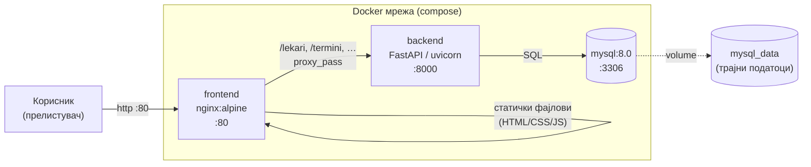
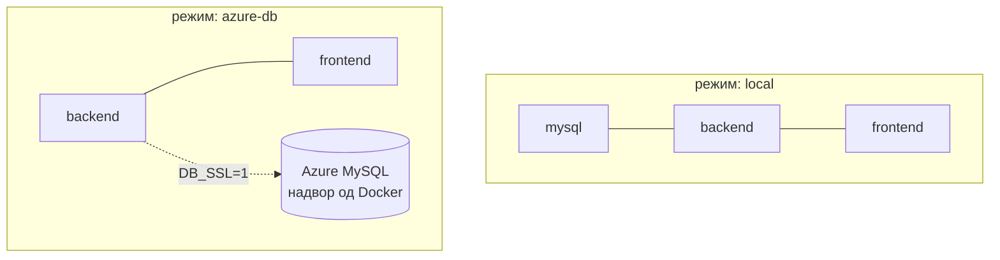

# Docker

Целиот систем од базата на податоци, backend-от и frontend-от се пакува и стартува со **Docker** и **Docker Compose**.
Целта е максимална едноставност: со **една команда** се кренуваат сите три компоненти, автоматски поврзани во иста внатрешна мрежа, без потреба од рачно инсталирање на MySQL, Python или Nginx на локалниот компјутер. Без разлика на оперативниот систем или средината, системот ќе работи идентично — на секој компјутер каде е инсталиран Docker.

## Содржина

* [1. Што е Docker тука и зошто](#1-zosto)
* [2. Архитектура на стекот](#2-arhitektura)
* [3. Сите Docker фајлови](#3-fajlovi)
  * [docker-compose.yml](#dc)
  * [backend/Dockerfile](#backend-dockerfile)
  * [Dockerfile (корен — Render)](#root-dockerfile)
  * [nginx.conf](#nginx)
  * [.dockerignore](#dockerignore)
* [4. Подготовка: `backend/.env`](#4-env)
* [5. Стартување](#5-start)
  * [Со скрипта (препорачано)](#5-skripta)
  * [Рачно со docker compose](#5-racno)
* [6. Два режима: `local` vs `azure-db`](#6-rezimi)
* [7. Увоз на базата (schema.sql)](#7-schema)
* [8. Чести команди](#8-komandi)
* [9. Чести проблеми](#9-problemi)

> Поврзани страници: [Поставување на сервер (Azure VM)](../../SERVER_DEPLOY.md) ·
> [nginx](nginx.md) · [Production](production.md)

---

## 1. Што е Docker тука и зошто <a id="1-zosto"></a>

Системот е составен од **три независни дела** кои мора да работат заедно — база на податоци, backend и frontend. Наместо секој дел да се инсталира и конфигурира рачно на секој сервер или компјутер, секој дел се пакува во свој **Docker контејнер**: изолирана, самодоволна околина која го содржи сè што му е потребно за работа.
Структурата на веб сајтот за Клиничката Болница ги има следните својства за работа со Docker:

| Контејнер (сервис) | Слика | Улога | Порт |
|--------------------|-------|-------|------|
| `mysql` | `mysql:8.0` | База на податоци | 3306 |
| `backend` | се гради од `backend/Dockerfile` | FastAPI (Python) API | 8000 |
| `frontend` | `nginx:alpine` | Сервира HTML/CSS/JS + проксира кон backend | 80 |

Со овој пристап, кодот се клонира од репозиториум на Github на cloud серверот и секој сервис се крева во свој контејнер, без притоа да имаме потреба од рачно инсталирање на MySQL, Python или Nginx. Системот работи идентично без разлика дали се наоѓа на локален лаптоп, VPS или Cloud (во овој случај Azure).

**Docker Compose** го поедноставува управувањето: еден `docker-compose.yml` фајл ги опишува сите три сервиси, мрежата меѓу нив и редоследот на стартување. Со една команда целиот систем е во воздух.
---

## 2. Архитектура на стекот <a id="2-arhitektura"></a>



### Тек на едно барање

Кога корисникот го отвора порталот, сообраќајот поминува низ следниот редослед:

1. Корисникот отвора `http://сервер/` — **Nginx** го прима барањето и го враќа `index.html` со целиот frontend.
2. Страницата во прелистувачот прави повик до `/lekari`, `/termini`, `/admin` или друг API endpoint — **Nginx** го препознава барањето и го проксира кон **backend-от** на `backend:8000`.
3. **Backend-от** го обработува барањето, прави SQL до **MySQL** и враќа JSON одговор назад до прелистувачот.

На овој начин, **Nginx** е единствената точка на влез, корисникот никогаш не комуницира директно со backend-от или базата.
> Внатре во Docker мрежата сервисите се гледаат по **име** (`backend`, `mysql`),
> не по IP. Затоа `nginx.conf` пишува `proxy_pass http://backend:8000` а
> `backend/.env` има `DB_HOST=mysql`.

---

## 3. Сите Docker фајлови <a id="3-fajlovi"></a>

| Фајл | Намена |
|------|--------|
| `docker-compose.yml` | Ги опишува трите сервиси (mysql, backend, frontend) |
| `backend/Dockerfile` | Како се гради backend сликата (за локален Compose) |
| `Dockerfile` (корен) | Една слика backend+frontend (само за **Render**) |
| `nginx.conf` | Конфигурација на nginx (статика + проксирање кон backend) |
| `.dockerignore` | Што да **не** влезе во сликата (venv, `.git`, `.env`, …) |

### docker-compose.yml <a id="dc"></a>

Дефинира три сервиси + еден volume. Главни делови:

```yaml
services:
  mysql:                       # 1) базата
    image: mysql:8.0
    env_file: ./backend/.env   # лозинка и име на база од .env
    ports: ["3306:3306"]
    volumes:
      - mysql_data:/var/lib/mysql   # трајни податоци (не се губат при рестарт)
    command: --character-set-server=utf8mb4 ...   # кирилица
    healthcheck: ...           # mysqladmin ping — дали базата е жива

  backend:                     # 2) FastAPI
    build:
      context: ./backend       # се гради од backend/Dockerfile
    ports: ["8000:8000"]
    env_file: ./backend/.env

  frontend:                    # 3) nginx
    image: nginx:alpine
    ports: ["80:80"]
    volumes:
      - ./frontend:/usr/share/nginx/html:ro    # сајтот
      - ./nginx.conf:/etc/nginx/conf.d/default.conf:ro
    depends_on: [backend]      # се крева по backend

volumes:
  mysql_data:                  # именуван volume за базата
```

| Поим | Значење |
|------|---------|
| `image` | Готова слика од Docker Hub (`mysql:8.0`, `nginx:alpine`) |
| `build` | Сликата се **гради** локално (од `Dockerfile`) |
| `env_file` | Од каде се читаат тајните (`backend/.env`) |
| `ports: "80:80"` | „надвор:внатре“ — порт на компјутерот : порт во контејнерот |
| `volumes` | Трајно зачувување / поврзување на папки |
| `restart: unless-stopped` | Контејнерот сам се крева по пад/рестарт |
| `healthcheck` | Проверка дали MySQL е спремен пред да продолжи |
| `depends_on` | Редослед: frontend чека backend |

> **`mysql_data` volume** е причината зошто податоците во базата **не се губат**
> кога ќе ги стопираш контејнерите. Се бришат само со `docker compose down -v`.

### backend/Dockerfile <a id="backend-dockerfile"></a>

Како се прави backend сликата (чекор по чекор):

```dockerfile
FROM python:3.11-slim          # 1) основа: лесна Python 3.11 слика
WORKDIR /app                   # 2) работна папка во контејнерот
COPY requirements.txt .        # 3) прво само requirements (за кеш)
RUN pip install --no-cache-dir -r requirements.txt   # 4) инсталирај библиотеки
COPY . .                       # 5) копирај го backend кодот
EXPOSE 8000                    # 6) документирано: слуша на 8000
CMD ["sh", "-c", "uvicorn main:app --host 0.0.0.0 --port ${PORT:-8000}"]
```

> **Зошто `requirements.txt` се копира прво, пред `COPY . .`?** Docker кешира
> по чекор. Ако се менува само кодот (не и библиотеките), `pip install` не се
> повторува → многу побрз rebuild.

### Dockerfile (корен — Render) <a id="root-dockerfile"></a>

Овој фајл во **коренот** прави **една** слика што содржи и backend и frontend.
Се користи **само за Render** (платформа што гради од еден Dockerfile и задава
свој `$PORT`). Локално **не** се користи — таму Compose го користи
`backend/Dockerfile`.

```dockerfile
FROM python:3.11-slim
WORKDIR /app
COPY backend/requirements.txt .
RUN pip install --no-cache-dir -r requirements.txt
COPY backend/ /app/            # backend во /app
COPY frontend/ /frontend/      # frontend во /frontend (main.py го бара тука)
CMD ["sh", "-c", "uvicorn main:app --host 0.0.0.0 --port ${PORT:-8000}"]
```

### nginx.conf <a id="nginx"></a>

nginx одлучува: **статичка страница** или **барање кон backend**.

```nginx
location ~ ^/(lekari|pacienti|termini|admin|aparati|specialnosti|uslugi|
              novosti|kariera|aplikacija|static|docs|openapi\.json|...)(/.*)?$ {
    proxy_pass http://backend:8000;     # API → backend
}
location / {
    try_files $uri $uri/ /index.html;   # сѐ друго → статички фајл / index.html
}
```

> Регуларниот израз **мора** да ги фати API-патеките **пред** `location /`,
> инаку nginx би вратил `index.html` наместо JSON. Детали: [nginx.md](nginx.md).

### .dockerignore <a id="dockerignore"></a>

Спречува тешки/тајни фајлови да влезат во сликата (побрз build, побезбедно):

```
.git           venv/  .venv/  **/__pycache__/
*.pyc          .DS_Store      docs/  typings/  scripts/
*.md           backend/.env   backend/.env.*    .vscode/  .cursor/
```

> `backend/.env` е намерно игнориран — **тајните не смеат** да влезат во сликата.
> Во Compose тие се вчитуваат преку `env_file` при стартување (не при build).

---

## 4. Подготовка: `backend/.env` <a id="4-env"></a>

Пред стартување, направи `backend/.env` од примерот и пополни го:

```bash
cp backend/.env.example backend/.env
nano backend/.env          # или отвори во едитор
```

Минимални променливи (за локален Docker со MySQL контејнер):

```bash
DB_HOST=mysql              # име на mysql сервисот во Compose
DB_USER=root
DB_PASSWORD=rootpassword
MYSQL_ROOT_PASSWORD=rootpassword   # иста како DB_PASSWORD
DB_NAME=Klinicka_Bolnica_Stip
DB_PORT=3306

GROQ_API_KEY=gsk_...       # за AI асистентот (опц. — без него работи offline)
```

| Променлива | За што |
|------------|--------|
| `DB_HOST` | `mysql` (Docker), `localhost` (локално), или Azure хост |
| `MYSQL_ROOT_PASSWORD` | **Само** ако користиш `mysql` сервисот во Compose |
| `DB_SSL=1` | Само за **Azure** Database for MySQL |
| `GROQ_API_KEY` | AI чат преку Groq (без него → правила + MySQL) |
| `SMTP_*` | Праќање е-пошта (без него само се печати во терминал) |

> Целосен список со објаснувања: види `backend/.env.example`.

---

## 5. Стартување <a id="5-start"></a>

### Со скрипта (препорачано) <a id="5-skripta"></a>

```bash
chmod +x scripts/docker-up.sh         # еднаш

./scripts/docker-up.sh local          # mysql + backend + frontend
# или
./scripts/docker-up.sh azure-db       # само backend + frontend (база однадвор)
```

Скриптата прави `build`, ги крева сервисите по редослед, чека MySQL, па прави
`curl` проверка и печати корисни линкови.

### Рачно со docker compose <a id="5-racno"></a>

```bash
docker compose build                  # изгради ги сликите
docker compose up -d                  # стартувај ги сите (во позадина)
docker compose ps                     # статус
```

По стартување:

| Адреса | Што |
|--------|-----|
| `http://127.0.0.1/` | Сајтот (преку nginx) |
| `http://127.0.0.1/lekari` | API преку nginx (JSON) |
| `http://127.0.0.1:8000/docs` | Swagger документација на API |

---

## 6. Два режима: `local` vs `azure-db` <a id="6-rezimi"></a>

| Режим | Што се крева | Кога |
|-------|--------------|------|
| **`local`** | `mysql` + `backend` + `frontend` | Развој на лаптоп, или цел стек на VM |
| **`azure-db`** | само `backend` + `frontend` | Базата е **надвор** (Azure Database for MySQL) |



> Во `azure-db`: во `backend/.env` стави `DB_HOST=...mysql.database.azure.com`
> и **`DB_SSL=1`**. MySQL контејнерот не се крева.

---

## 7. Увоз на базата (schema.sql) <a id="7-schema"></a>

При прв пат (режим `local`), базата е празна. Увези ја шемата **еднаш**:

```bash
# од коренот на проектот, со вчитан backend/.env:
set -a && source backend/.env && set +a
docker compose exec -T mysql \
  mysql -uroot -p"$MYSQL_ROOT_PASSWORD" "$DB_NAME" < backend/schema.sql
```

> `schema.sql` ги креира сите табели + почетни податоци (8 оддели, 8 лекари,
> апарати, 1 оглас). Лекари: лозинка `Test123..`. Детали:
> [База на податоци](../backend/the_database.md).

> Податоците остануваат во `mysql_data` volume — увозот **не** се повторува при
> секој рестарт, само првиот пат (или по `docker compose down -v`).

---

## 8. Чести команди <a id="8-komandi"></a>

| Команда | Што прави |
|---------|-----------|
| `docker compose up -d` | Стартувај сите сервиси во позадина |
| `docker compose down` | Стопирај и избриши контејнери (**податоците остануваат**) |
| `docker compose down -v` | Стопирај + **избриши го volume-от** (база се брише!) |
| `docker compose ps` | Статус на сервисите |
| `docker compose logs -f backend` | Логови од backend во живо |
| `docker compose build` | Преизгради ги сликите |
| `docker compose up -d --build` | Преизгради + рестартирај |
| `docker compose restart backend` | Само рестартирај backend |
| `docker compose exec mysql mysql -uroot -p` | MySQL конзола во контејнерот |

> По промена во **backend код**: `docker compose up -d --build backend`.
> По промена во **frontend/nginx**: доволно е `docker compose restart frontend`
> (фронтот е mount-нат како volume, не во сликата).

---

## 9. Чести проблеми <a id="9-problemi"></a>

| Симптом | Причина / решение |
|---------|-------------------|
| Празна страница / **502 Bad Gateway** | backend не е `Up`. Провери `docker compose ps` и `docker compose logs backend`. |
| `/lekari` враќа **HTML** наместо JSON | nginx regex не ја фаќа патеката — види [nginx.md](nginx.md). |
| API **500** | Конекција до база: `DB_HOST`, лозинка, `DB_SSL` за Azure. |
| `Table doesn't exist` | Не е увезена шемата — види [секција 7](#7-schema). |
| `Access denied for user 'root'` | `DB_PASSWORD` ≠ `MYSQL_ROOT_PASSWORD`. Мора да се исти. |
| Портот **80**/**3306** е зафатен | Друг сервис го користи. Смени мапирање (на пр. `8080:80`) или стопирај го. |
| Промена во код не се гледа | Заборавено `--build`: `docker compose up -d --build backend`. |
| MySQL „не е спремен“ при старт | Backend стартувал прерано — `docker compose restart backend` (healthcheck чека). |

> Логовите се прв чекор за дебагирање:
> `docker compose logs -f backend` (или `mysql`, `frontend`).

Следно: [nginx](nginx.md) · [Production](production.md) ·
[Поставување на сервер (Azure VM)](../../SERVER_DEPLOY.md)
