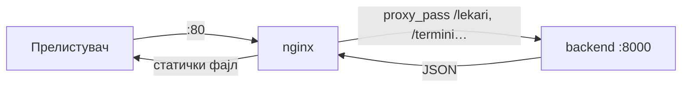
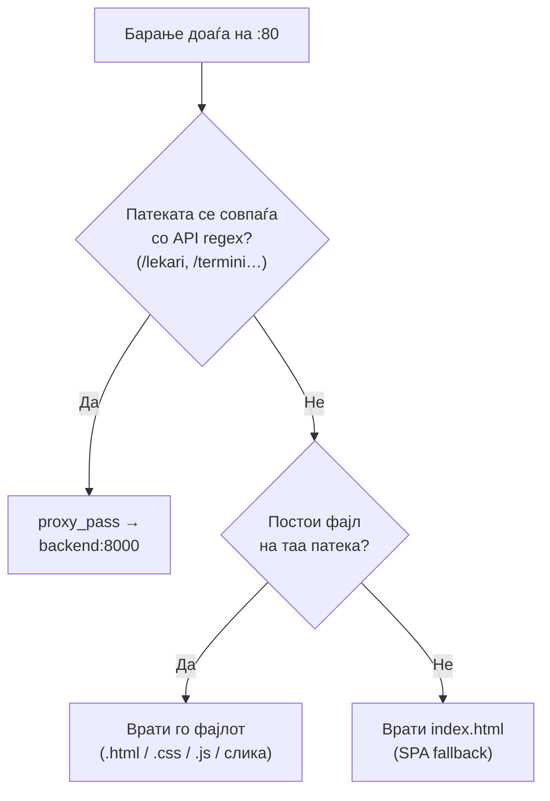
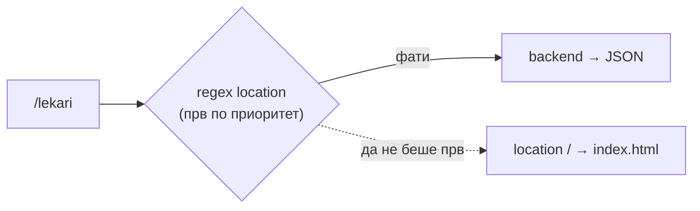

# Nginx

**Nginx** е „вратарот" на системот — единствената точка на влез преку која минува секое барање на порт **80**. Неговата улога е двојна: ги сервира статичките датотеки на frontend-от (`frontend/`) и ги препраќа API барањата кон **FastAPI backend-от** на `backend:8000`.

Во продолжение се опишани конфигурацијата во `nginx.conf`, структурата на правилата и причините зад секоја одлука во контекст на системот.

## Содржина

- [1. Улога на Nginx](#1-uloga)
- [2. Тек на барање (одлучување)](#2-tek)
- [3. `nginx.conf` дел по дел](#3-conf)
  - [server блок](#server)
  - [location за API (regex)](#loc-api)
  - [location / (статика)](#loc-static)
- [4. Зошто редоследот е важен](#4-redosled)
- [5. proxy_set_header заглавја](#5-headers)
- [6. AI чат (`/ai-chat`)](#6-ai)
- [7. Чести проблеми](#7-problemi)

> Поврзани страници: [Docker](docker.md) · [Production](production.md) · [Поставување на сервер (Azure VM)](../../SERVER_DEPLOY.md)

---

## 1. Улога на Nginx

Во Docker стекот, **frontend** сервисот е изграден врз `nginx:alpine` — лесна и брза верзија на Nginx. Во рамките на системот, Nginx не служи само за прикажување на страниците, туку преземa **две клучни одговорности** кои го прават целиот стек функционален:

| Задача | Опис |
|--------|------|
| **Сервирање на статички датотеки** | HTML, CSS, JavaScript и слики од `frontend/` директориумот се испорачуваат директно до прелистувачот на корисникот |
| **Reverse proxy** | Барањата упатени до API endpoints (`/lekari`, `/termini` и сл.) автоматски се препраќаат кон `backend:8000`, каде FastAPI ги обработува |

На овој начин, Nginx е единствениот дел од системот директно изложен кон надвор — backend-от и базата на податоци остануваат скриени зад него, недостапни директно од интернет.



> **Зошто reverse proxy?** Корисникот комуницира само со **еден** порт (80). Nginx „крие" дека backend-от е на порт 8000, така тој не мора да биде отворен кон интернет — побезбедно и поедноставно.

> **Зошто не сервира FastAPI самиот статика?** Технички може, но Nginx е значително побрз и поефикасен за статички датотеки — поддржува кеширање, gzip компресија и голем број конкурентни конекции со минимален ресурс.

---

## 2. Тек на барање (одлучување)

За секое барање кое пристигнува, Nginx донесува едноставна одлука: дали тоа е **API барање** или барање за **статичка датотека**?



Неколку конкретни примери:

| Барање | Резултат |
|--------|----------|
| `GET /` | `index.html` |
| `GET /style.css` | статичкиот фајл `style.css` |
| `GET /lekari` | проксирано кон `backend:8000/lekari` (JSON) |
| `GET /termini/slobodni` | проксирано кон backend |
| `GET /static/uploads/...` | проксирано кон backend (слики од новости) |

---

## 3. `nginx.conf` дел по дел

### server блок

```nginx
server {
    listen 80;                       # nginx слуша на порт 80
    server_name _;                   # одговара на било кој домен / IP
    root /usr/share/nginx/html;      # каде се статичките фајлови (frontend/)
    index index.html;                # стандардна страница
    client_max_body_size 50M;        # макс. големина на upload (слики за новости)
    ...
}
```

| Директива | Значење |
|-----------|---------|
| `listen 80` | Порт на кој Nginx слуша (мапиран од `80:80` во Compose) |
| `server_name _` | `_` = одговара на било кој хост (нема фиксен домен) |
| `root` | Директориум со статички датотеки (frontend е mount-нат тука) |
| `client_max_body_size 50M` | Дозволен upload до 50MB (инаку се добива **413** за поголеми слики) |

> `root /usr/share/nginx/html` одговара на volume-от дефиниран во Compose: `./frontend:/usr/share/nginx/html:ro` (`:ro` = read-only).

### location за API (regex)

Ова е **најважниот** дел од конфигурацијата — тука се дефинира кои патеки одат кон backend:

```nginx
location ~ ^/(lekari|pacienti|termini|admin|aparati|specialnosti|uslugi|
              novosti|kariera|aplikacija|ai-chat|static|docs|openapi\.json|redoc|
              debug-novosti|debug-kariera|debug-db)(/.*)?$ {
    proxy_pass http://backend:8000;
    proxy_http_version 1.1;
    proxy_set_header Host $host;
    proxy_set_header X-Real-IP $remote_addr;
    proxy_set_header X-Forwarded-For $proxy_add_x_forwarded_for;
    proxy_set_header X-Forwarded-Proto $scheme;
    proxy_read_timeout 120s;
}
```

| Дел | Значење |
|-----|---------|
| `location ~` | `~` = совпаѓање по **регуларен израз** (case-sensitive) |
| `^/(lekari\|...)` | патеката почнува со некој од наведените префикси |
| `(/.*)?$` | опционално сè што следи (`/lekari/5`, `/termini/slobodni`) |
| `proxy_pass http://backend:8000` | препрати кон backend сервисот (по внатрешно ime во Docker) |
| `proxy_read_timeout 120s` | чека до 120 секунди за одговор (потребно за AI и потешки барања) |

> Префиксите директно одговараат на router-ите во FastAPI: `lekari`, `pacienti`, `termini`, `admin`, `aparati`, `uslugi`, `novosti`, `kariera`, `aplikacija`, плус `static` (слики), `docs`, `openapi.json` и `redoc` (Swagger документација).

### location / (статика)

Сè што **не** е фатено од regex-от паѓа овде:

```nginx
location / {
    try_files $uri $uri/ /index.html;
}
```

`try_files` проба по следниот редослед:

1. `$uri` — постои ли точно таа датотека? (на пр. `/style.css`)
2. `$uri/` — постои ли како директориум?
3. `/index.html` — ако ништо не е пронајдено, се враќа почетната страница (SPA fallback).

> **SPA fallback** значи дека непознати патеки секогаш враќаат `index.html`, по што JavaScript-от на страницата самостојно одлучува што да прикаже на корисникот.

---

## 4. Зошто редоследот е важен

> **Клучно:** regex `location` блокот за API **мора** да стои **пред** `location /`.

Доколку редоследот е обратен, барањето за `/lekari` ќе падне во `location /`, `try_files` ќе го врати `index.html` — а frontend-от очекува **JSON**. Резултатот се „чудни" грешки каде API враќа HTML наместо податоци.



> Кај Nginx, regex `location` блоковите се проверуваат **по редослед на појавување** во конфигурацијата. Затоа API regex секогаш стои на врвот.

---

## 5. proxy_set_header заглавја

Кога Nginx проксира барање, го „претставува" оригиналниот корисник пред backend-от преку посебни HTTP заглавја:

| Заглавје | Што пренесува |
|----------|---------------|
| `Host $host` | Оригиналното ime на доменот |
| `X-Real-IP $remote_addr` | Вистинската IP адреса на корисникот |
| `X-Forwarded-For` | Список на сите IP адреси низ кои поминало барањето |
| `X-Forwarded-Proto $scheme` | Дали оригиналното барање било `http` или `https` |

> Без овие заглавја, backend-от би мислел дека сите барања доаѓаат од самиот Nginx (внатрешна IP), а не од вистинскиот корисник. Ова е особено важно за логови, безбедност и следење на активноста.

---

## 6. AI чат (`/ai-chat`)

AI чатот е вклучен во nginx regex-от (`ai-chat`), со што барањата поминуваат преку Nginx кон backend-от — исто како `/lekari` и `/termini`.

Frontend-от го одредува `API_BASE` автоматски во зависност од средината:

| Околина | `API_BASE` | Каде оди `/ai-chat/ask` |
|---------|------------|-------------------------|
| Локално (`localhost`) | `http://localhost:8000` | Директно кон uvicorn |
| Production (nginx :80) | `http://сервер` (ист host) | nginx → `backend:8000` |

```javascript
// frontend/ai_chat.js и script.js (иста логика)
const API_BASE = (function() {
  var h = window.location.hostname;
  if (!h || h === 'localhost' || h === '127.0.0.1') return 'http://localhost:8000';
  return window.location.protocol + '//' + window.location.host;
})();
const API_URL = API_BASE + "/ai-chat/ask";
```

> На production средина **не треба** портот 8000 да биде отворен кон интернет — AI чатот функционира целосно преку Nginx на порт 80.

---

## 7. Чести проблеми

| Симптом | Причина и решение |
|---------|-------------------|
| `/lekari` враќа **HTML** наместо JSON | Regex не ја фаќа патеката или стои **по** `location /`. Додај го префиксот или поправи го редоследот. |
| **502 Bad Gateway** | Backend не е `Up`. Провери со `docker compose logs backend`. |
| **504 Gateway Timeout** | Одговорот трае повеќе од 120 секунди. Зголеми `proxy_read_timeout`. |
| **413 Request Entity Too Large** | Upload поголем од 50MB. Зголеми `client_max_body_size`. |
| AI чат не работи преку порт 80 | Провери дали `ai-chat` е во regex и дали `API_BASE` не е hardcoded на `:8000`. |
| Промена во `nginx.conf` не се применува | Изврши `docker compose restart frontend` (фајлот е mount-нат, не е потребен rebuild). |
| Нова API патека враќа HTML | Додај го новиот router префикс во regex-от. |

> По секоја измена на `nginx.conf` доволен е само **рестарт** на frontend сервисот — не е потребен целосен rebuild, бидејќи фајлот е mount-нат директно како volume: `docker compose restart frontend`.

---

Следно: [Docker](docker.md) · [Production](production.md) · [Поставување на сервер (Azure VM)](../../SERVER_DEPLOY.md)