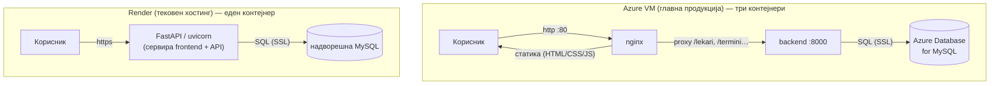
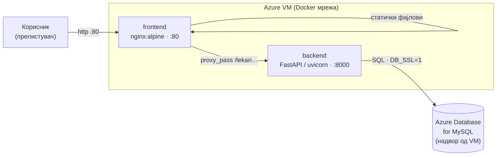

# Продукција и одржување

Оваа страница опишува како системот се поставува и одржува во **продукција** — реален сервер достапен преку интернет, со надворешна база и тајни конфигурирани безбедно.

Системот е граден за продукција на **Azure VM** со Docker: три контејнери (nginx + backend + mysql) поврзани во иста мрежа, со база преку **Azure Database for MySQL**. Тоа е примарната, „вистинската" продукциска архитектура на проектот.

Дополнително, проектот може да се хостира и на **Render** — едноставен cloud што гради од еден `Dockerfile`. Тоа е тековниот жив хостинг ([klinicka-bolnica-stip2026.onrender.com](https://klinicka-bolnica-stip2026.onrender.com)), вклучен откако истекоа студентските Azure кредити.

## Содржина

* [1. Двете архитектури](#1-arhitekturi)
* [2. Azure VM — продукција (главно)](#2-azure)
  * [Архитектура на стекот](#2-arhitektura)
  * [Мрежа и портови](#2-mreza)
  * [Docker стек (docker-compose)](#2-stek)
  * [Стартување и деплој](#2-deploj)
  * [Проверка](#2-proverka)
* [3. Render — тековен хостинг](#3-render)
* [4. База на податоци во продукција](#4-baza)
* [5. Тајни и околински променливи](#5-tajni)
* [6. Ажурирање / редеплој](#6-azuriranje)
* [7. Логови и следење](#7-logovi)
* [8. Безбедност](#8-bezbednost)
* [9. Чести проблеми](#9-problemi)

> Поврзани страници: [Docker](docker.md) · [Nginx](nginx.md) ·
> [Поставување на сервер (Azure VM)](../../SERVER_DEPLOY.md) ·
> [Конфигурација](../overview_na_sisitemot/configuration.md)

---

## 1. Двете архитектури <a id="1-arhitekturi"></a>

Клучната разлика меѓу двете патеки е **кој ги сервира статичките датотеки** и **колку контејнери** работат.



На **Azure VM** работат три контејнери: nginx ги сервира статичките датотеки и проксира кон backend-от, кој комуницира со Azure Database for MySQL. Така корисникот никогаш не пристапува директно до backend-от или базата — nginx е единствената точка на влез. На **Render** работи само еден контејнер: FastAPI самиот ги сервира и статичките датотеки и API-то, без nginx, со автоматски HTTPS.

> Бидејќи на **Render** `nginx.conf` **не се користи** воопшто, конфигурацијата на nginx е релевантна само за Azure патеката.

---

## 2. Azure VM — продукција (главно) <a id="2-azure"></a>

Ова е архитектурата за која е граден системот: виртуелна машина на Azure, на која со Docker Compose се креваат трите сервиси, а базата е управуван Azure MySQL сервис надвор од VM.

### Архитектура на стекот <a id="2-arhitektura"></a>



Кога корисникот го отвора порталот, nginx го враќа `index.html` со целиот frontend. Кога страницата повикува API endpoint (`/lekari`, `/termini`, `/ai-chat/ask`…), nginx го препознава барањето по неговиот regex и го проксира кон backend-от на `backend:8000`, кој прави SQL до Azure MySQL и враќа JSON. Внатре во Docker мрежата сервисите се гледаат по **име** (`backend`, `mysql`), не по IP — затоа `nginx.conf` пишува `proxy_pass http://backend:8000`.

### Мрежа и портови <a id="2-mreza"></a>

Во **NSG (Network Security Group)** на VM се отвораат само **22** (SSH) и **80** (HTTP). Портовите **8000** (backend) и **3306** (MySQL) **не** се изложуваат кон интернет — backend-от е достапен само внатре во Docker мрежата преку nginx, што е и побезбедно и поедноставно.

Кога базата е **Azure Database for MySQL**, во **Firewall** на тој сервис се додава **јавната IP на VM** (или „Allow Azure services"), за backend-от да може да се поврзе. Во `backend/.env` на серверот тогаш стои `DB_HOST=...mysql.database.azure.com` и **`DB_SSL=1`**.

### Docker стек (docker-compose) <a id="2-stek"></a>

`docker-compose.yml` дефинира три сервиси. Backend-от се гради од `backend/Dockerfile`, frontend-от е готова `nginx:alpine` слика на која се mount-нати `frontend/` и `nginx.conf`, а сите имаат `restart: unless-stopped` за да се кренат сами по рестарт на VM:

```yaml
services:
  mysql:                       # се користи само ако базата е во Docker на истата VM
    image: mysql:8.0
    restart: unless-stopped
    env_file: [./backend/.env]
    ports: ["3306:3306"]
    volumes: [mysql_data:/var/lib/mysql]   # трајни податоци

  backend:                     # FastAPI
    build: { context: ./backend, dockerfile: Dockerfile }
    restart: unless-stopped
    ports: ["8000:8000"]
    env_file: [./backend/.env]
    volumes: ["./backend/static:/app/static"]

  frontend:                    # nginx
    image: nginx:alpine
    restart: unless-stopped
    ports: ["80:80"]
    volumes:
      - ./frontend:/usr/share/nginx/html:ro
      - ./nginx.conf:/etc/nginx/conf.d/default.conf:ro
    depends_on: [backend]
```

Системот работи во **два режима**: `local` го крева целиот стек вклучително MySQL контејнерот (база на истата VM), додека `azure-db` крева само `backend` + `frontend`, а базата е надворешен Azure MySQL. Целосен опис на сите фајлови, режими и команди: [Docker](docker.md). Конфигурацијата на проксирањето: [Nginx](nginx.md).

### Стартување и деплој <a id="2-deploj"></a>

Кодот се клонира на VM, се поставува `backend/.env` (рачно копиран, никогаш во Git), и стекот се крева со скрипта од коренот на проектот:

```bash
chmod +x scripts/docker-up.sh scripts/deploy-vm.sh

# само backend + nginx (база = Azure MySQL)
./scripts/deploy-vm.sh azure-db

# или цел стек со MySQL во Docker на VM
./scripts/deploy-vm.sh local
```

`deploy-vm.sh` прво прави `git pull` (ако има `.git`), па го повикува `docker-up.sh` кој гради и ги крева сервисите по редослед, чека MySQL да биде здрав преку healthcheck, и прави `curl` проверка. Полн водич чекор-по-чекор (мрежа, инсталација на Docker, копирање `.env`): [Поставување на сервер (Azure VM)](../../SERVER_DEPLOY.md).

### Проверка <a id="2-proverka"></a>

На самата VM се проверува дека API-то одговара локално преку nginx, и се следат логовите:

```bash
curl -sS http://127.0.0.1/lekari | head -c 300
docker compose logs -f backend
```

Од прелистувач: `http://ТВОЈА_VM_IP/` ја отвора почетната страница, а `http://ТВОЈА_VM_IP/lekari` го враќа API одговорот преку nginx.

---

## 3. Render — тековен хостинг <a id="3-render"></a>

Откако истекоа Azure кредитите, продукцијата е преместена на **Render**, кој гради **една** слика од `Dockerfile` во коренот (за разлика од трите контејнери на Azure). Таму FastAPI самиот го сервира фронтот — `main.py` го „качува" на патеката `/app`:

```25:27:backend/main.py
FRONTEND_DIR = Path(__file__).resolve().parent.parent / "frontend"  # pateka do frontend papkata (eden nivo nagore)
if FRONTEND_DIR.exists():  # ako frontend papkata postoi
    app.mount("/app", StaticFiles(directory=str(FRONTEND_DIR), html=True), name="frontend")  # serviranje na sajtot na /app (html=True = index.html)
```

Затоа на Render **истиот** домен служи сè: коренот ([/](https://klinicka-bolnica-stip2026.onrender.com)) враќа JSON статусна порака, а **самиот сајт е на [/app/](https://klinicka-bolnica-stip2026.onrender.com/app/)**. Поставувањето е: *New → Web Service* на [render.com](https://render.com), поврзи го GitHub репозиториумот, избери **Docker** build, внеси ги тајните во *Environment*, и Render гради автоматски при секој `git push`. Render задава свој `$PORT` кој `Dockerfile`-от веќе го почитува (`--port ${PORT:-8000}`).

> На бесплатниот план на Render има две важни ограничувања: сервисот **„заспива"** по ~15 мин неактивност (првото следно барање е бавно, cold start), а фајлсистемот е **ефемерен** — прикачените слики за новости (`backend/static/uploads/`) **се губат** при секој редеплој (базата е надвор, па нејзините податоци опстануваат). На Azure VM овие проблеми ги нема, бидејќи дискот и контејнерите се трајни.

---

## 4. База на податоци во продукција <a id="4-baza"></a>

И на Azure VM (во `azure-db` режим) и на Render, базата е **надвор** од апликацискиот контејнер — управуван MySQL 8.x сервис (Azure Database for MySQL или сличен). Поврзувањето е преку `DB_HOST`, `DB_PORT`, `DB_USER`, `DB_PASSWORD` и задолжително **`DB_SSL=1`**. Во firewall на базата мора да се дозволи IP-та на серверот (јавната IP на VM, односно излезните IP на Render).

Шемата се увезува **еднаш**, со поврзување на надворешната база и пуштање на `backend/schema.sql`:

```bash
mysql -h <DB_HOST> -P 3306 -u <DB_USER> -p --ssl-mode=REQUIRED \
  Klinicka_Bolnica_Stip < backend/schema.sql
```

> `schema.sql` ги креира сите табели + почетни податоци (оддели, лекари, апарати, оглас). Детали: [База на податоци](../backend/the_database.md).

За бекап се препорачува редовен `mysqldump`:

```bash
mysqldump -h <DB_HOST> -u <DB_USER> -p --ssl-mode=REQUIRED \
  Klinicka_Bolnica_Stip > backup_$(date +%F).sql
```

---

## 5. Тајни и околински променливи <a id="5-tajni"></a>

> **Правило:** тајните **никогаш** не се комитуваат во Git. `backend/.env` е во `.gitignore` и `.dockerignore`.

Каде се внесуваат тајните зависи од средината. На **Azure VM** се става рачно копиран `backend/.env` (`scp` од лаптоп), кој Compose го вчитува преку `env_file`. На **Render** се внесуваат преку *Environment* во контролната табла (не како фајл). **Локално** се користи `backend/.env`, направен од `backend/.env.example`.

Главните променливи се податоците за базата (`DB_HOST`, `DB_PORT`, `DB_USER`, `DB_PASSWORD`, `DB_NAME`), задолжително **`DB_SSL=1`** за надворешна база, и опционално `GROQ_API_KEY` (за AI) и `SMTP_*` (за е-пошта). На Azure во `local` режим се додава и `MYSQL_ROOT_PASSWORD` за MySQL контејнерот; на Render тоа не е потребно бидејќи нема MySQL контејнер.

> Целосен список со објаснувања: [Конфигурација](../overview_na_sisitemot/configuration.md) и `backend/.env.example`.

---

## 6. Ажурирање / редеплој <a id="6-azuriranje"></a>

На **Azure VM** ажурирањето е рачно: `git pull` на серверот, па `./scripts/deploy-vm.sh azure-db` (или `local`). По промена само во frontend/nginx доволен е `docker compose restart frontend`; по промена во backend код треба `docker compose up -d --build backend`.

На **Render** редеплојот е автоматски — доволен е `git push` на поврзаната гранка. По потреба, рачно преку *Manual Deploy → Deploy latest commit* (или *Clear build cache & deploy* ако кешот прави проблем).

---

## 7. Логови и следење <a id="7-logovi"></a>

На **Azure VM** логовите се гледаат со `docker compose logs -f backend` (или `mysql`, `frontend`). На **Render** се гледаат во табот *Logs* во контролната табла (live stream од uvicorn).

За брза дијагностика, во двете средини помагаат три endpoints: `/` (дали API-то воопшто одговара), `/debug-db` (конекција до база и дали табелите постојат) и `/docs` (Swagger за рачно тестирање на повиците).

---

## 8. Безбедност <a id="8-bezbednost"></a>

На **Azure VM** јавно изложени се само портовите 22 (SSH) и 80 (HTTP); backend (8000) и MySQL (3306) остануваат скриени зад nginx. На **Render** е изложен само HTTPS (443), со автоматски сертификат. Базата во двата случаи е заштитена со `DB_SSL=1` и firewall ограничен на IP на серверот. Тајните живеат само во `backend/.env` на серверот или во Render Environment — никогаш во Git или во сликата.

Една точка за подобрување е **CORS**: моментално `main.py` дозволува сите извори (`allow_origins=["*"]`), што е практично за развој, но за вистинска продукција треба да се ограничи на доменот на сајтот:

```16:20:backend/main.py
app.add_middleware(  # dodavanje na CORS sloj (pred sekoj odgovor)
    CORSMiddleware,  # tip na middleware za cross-origin baranja
    allow_origins=["*"],  # dozvoleni izvori (* = site, samo za razvoj)
    allow_credentials=True,  # dozvoluva cookies / credentials vo baranjata
    allow_methods=["*"],  # dozvoleni HTTP metodi (GET, POST, ...)
```

---

## 9. Чести проблеми <a id="9-problemi"></a>

* **Празна страница / 502 Bad Gateway** (Azure) — backend не е `Up`; провери `docker compose ps` и `docker compose logs backend`.
* **`/lekari` враќа HTML наместо JSON** (Azure) — nginx regex не ја фаќа патеката или стои по `location /` (види [nginx.md](nginx.md)).
* **Сајтот не се отвора на `/`** (Render) — коренот враќа JSON; отвори **`/app/`**.
* **Прв повик е многу бавен** (Render) — cold start откако сервисот бил заспан; нормално на бесплатен план.
* **API враќа 500** — проблем со базата: провери `DB_HOST`, лозинка, **`DB_SSL=1`** и firewall на MySQL кон серверот. Тестирај со `/debug-db`.
* **`Table doesn't exist`** — шемата не е увезена во базата (види [секција 4](#4-baza)).
* **Прикачени слики исчезнале** (Render) — ефемерен фајлсистем; на Azure VM ова не се случува.
* **AI чатот не одговара** — провери `GROQ_API_KEY`; без клуч работи offline (правила + MySQL).
* **CORS грешка во прелистувач** — ограничен `allow_origins`; додај го доменот на сајтот во `main.py`.

---

Следно: [Docker](docker.md) · [Nginx](nginx.md) ·
[Поставување на сервер (Azure VM)](../../SERVER_DEPLOY.md)
