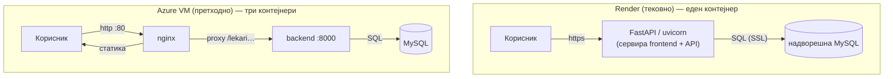
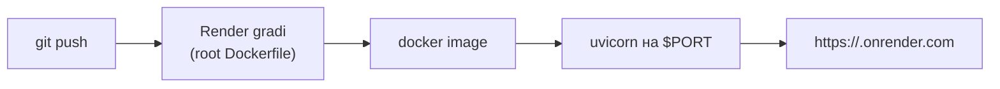

# Продукција и одржување

Оваа страница опишува kako системот се поставува и одржува во **продукција** — реален сервер достапен преку интернет, со HTTPS, надворешна база и безбедно конфигурирани тајни.
Без разлика на изборот на инфраструктура, целта е иста: системот да биде стабилен, безбеден и достапен за корисниците во секој момент. Проектот поддржува **две патеки** за продукција, секоја прилагодена на различен тип на средина:

| Патека | Како работи | Кога се користи |
|--------|-------------|-----------------|
| **Azure VM + Docker** | Три одделни контејнери преку `docker-compose.yml` — Nginx, backend и MySQL, секој со своја улога и изолирана средина | Кога постои сопствен сервер или VM и е потребна целосна контрола врз инфраструктурата |
| **Render** | Единствена слика (`Dockerfile` во коренот) во која FastAPI го сервира и backend-от и frontend-от | Кога нема сопствен сервер и е потребен брз, едноставен деплој директно од Git без рачно управување |

Проектот првично беше поставен на **Azure VM** — пристап кој нуди максимална флексибилност и контрола, но бара повеќе конфигурација и одржување. По истекот на студентските кредити, продукцијата е преместена на **Render**: cloud платформа која автоматски ја гради и деплојува апликацијата при секој push на Git, без потреба од рачно управување со сервер или инфраструктура.

## Содржина

* [1. Двете архитектури](#1-arhitekturi)
* [2. Render — деплојмент (тековно)](#2-render)
  * [Како Render го сервира сајтот](#2-serve)
  * [Чекори за поставување](#2-cekori)
  * [Околински променливи на Render](#2-env)
* [3. Azure VM — деплојмент (претходно)](#3-azure)
* [4. База на податоци во продукција](#4-baza)
* [5. Тајни и околински променливи](#5-tajni)
* [6. Ажурирање / редеплој](#6-azuriranje)
* [7. Логови и следење](#7-logovi)
* [8. Безбедност](#8-bezbednost)
* [9. Ограничувања на бесплатен Render](#9-ogranicuvanja)
* [10. Чести проблеми](#10-problemi)

> Поврзани страници: [Docker](docker.md) · [Nginx](nginx.md) ·
> [Поставување на сервер (Azure VM)](../../SERVER_DEPLOY.md) ·
> [Конфигурација](../overview_na_sisitemot/configuration.md)

---

## 1. Двете архитектури <a id="1-arhitekturi"></a>

Клучната разлика меѓу двете продукциски патеки е **кој ги сервира статичките датотеки** и **колку контејнери** работат.



| Аспект | Render | Azure VM |
|--------|--------|----------|
| Број контејнери | **1** (backend+frontend заедно) | **3** (nginx, backend, mysql) |
| Кој сервира статика | **FastAPI** (`StaticFiles` на `/app`) | **nginx** |
| Reverse proxy (nginx) | **Не се користи** | Да (`nginx.conf`) |
| HTTPS | Автоматски (Render) | Рачно (или преку домен/reverse proxy) |
| База | Надворешна (Azure / Aiven MySQL) | MySQL во Docker **или** надворешна |
| Dockerfile | `Dockerfile` (корен) | `backend/Dockerfile` + `nginx:alpine` |

> На **Render** `nginx.conf` **не се користи** воопшто — затоа промените во nginx (на пр. `ai-chat` во regex) се важни само за Azure/docker патеката, не за Render.

---

## 2. Render — деплојмент (тековно) <a id="2-render"></a>

### Како Render го сервира сајтот <a id="2-serve"></a>

На Render работи **една** слика, изградена од `Dockerfile` во коренот:

```dockerfile
FROM python:3.11-slim
WORKDIR /app
COPY backend/requirements.txt .
RUN pip install --no-cache-dir -r requirements.txt
COPY backend/ /app/            # backend код во /app
COPY frontend/ /frontend/      # frontend во /frontend (main.py го бара тука)
CMD ["sh", "-c", "uvicorn main:app --host 0.0.0.0 --port ${PORT:-8000}"]
```

Внатре, `main.py` го „качува" фронтот како статички датотеки на патеката `/app`:

```25:27:backend/main.py
FRONTEND_DIR = Path(__file__).resolve().parent.parent / "frontend"  # pateka do frontend papkata (eden nivo nagore)
if FRONTEND_DIR.exists():  # ako frontend papkata postoi
    app.mount("/app", StaticFiles(directory=str(FRONTEND_DIR), html=True), name="frontend")  # serviranje na sajtot na /app (html=True = index.html)
```

Значи, на Render **истиот** домен и порт служи сè:

| URL | Што враќа |
|-----|-----------|
| `https://<app>.onrender.com/` | JSON порака на API-то (`{"message": …, "docs": "/docs"}`) |
| `https://<app>.onrender.com/app/` | **Сајтот** (frontend, `index.html`) |
| `https://<app>.onrender.com/lekari` | API (JSON) |
| `https://<app>.onrender.com/ai-chat/ask` | AI чат endpoint |
| `https://<app>.onrender.com/docs` | Swagger документација |

> **Корисниците влегуваат на `/app/`**, не на коренот. Коренот (`/`) е API статусна порака.

> **Зошто AI чатот работи на Render?** Фронтот користи `API_BASE` = ист host како страницата, па `/ai-chat/ask` оди на истиот FastAPI што го сервира и сајтот. Нема потреба од nginx или отворен порт 8000. Детали: [nginx.md, секција 6](nginx.md#6-ai).

### Чекори за поставување <a id="2-cekori"></a>

1. **Поврзи репозиториум** — на [render.com](https://render.com) → *New* → *Web Service* → избери го GitHub репозиториумот.
2. **Тип на build** — избери **Docker** (Render автоматски го наоѓа `Dockerfile` во коренот).
3. **Порт** — Render задава свој `$PORT`; `Dockerfile`-от веќе го почитува (`--port ${PORT:-8000}`), не треба рачна промена.
4. **Околински променливи** — додај ги тајните во *Environment* (види [подолу](#2-env)). **Не** се става `.env` фајл во Git.
5. **Деплој** — Render автоматски гради при секој `git push` на поврзаната гранка.
6. **Провери** — отвори `https://<app>.onrender.com/app/`.



### Околински променливи на Render <a id="2-env"></a>

Истите променливи како во `backend/.env`, но се внесуваат во **Render → Environment** (не како фајл):

| Променлива | Вредност во продукција |
|------------|------------------------|
| `DB_HOST` | Хост на **надворешната** MySQL (Azure / Aiven) |
| `DB_PORT` | `3306` (или порт од провајдерот) |
| `DB_USER` / `DB_PASSWORD` | Кориснички податоци од провајдерот |
| `DB_NAME` | `Klinicka_Bolnica_Stip` |
| `DB_SSL` | `1` (надворешните MySQL бараат SSL) |
| `GROQ_API_KEY` | Клуч за AI асистентот (без него → правила + MySQL) |
| `SMTP_*` | За праќање е-пошта (опционално) |

> На Render **не** се поставува `MYSQL_ROOT_PASSWORD` — тоа е само за MySQL контејнерот во `docker-compose` (кој тука не постои).

---

## 3. Azure VM — деплојмент (претходно) <a id="3-azure"></a>

Претходната продукција беше на **Azure VM** со целиот `docker-compose` стек (nginx + backend + mysql). Тоа е детално опишано во:

* [Поставување на сервер (Azure VM)](../../SERVER_DEPLOY.md) — мрежа, Docker инсталација, `.env`, стартување.
* [Docker](docker.md) — сите Docker фајлови, режими `local`/`azure-db`, команди.
* [Nginx](nginx.md) — конфигурација на reverse proxy.

Накратко, на VM:

```bash
cd ~/Klinicka_Bolnica_Stip_XML
git pull
./scripts/deploy-vm.sh azure-db    # backend + nginx, база = надворешна Azure MySQL
# или
./scripts/deploy-vm.sh local       # цел стек со MySQL во Docker
```

> Главни разлики наспроти Render: nginx е изложен на порт 80, backend е во посебен контејнер на 8000, и `nginx.conf` е активен.

---

## 4. База на податоци во продукција <a id="4-baza"></a>

И на Render и на Azure VM (во `azure-db` режим), базата е **надвор** од апликацискиот контејнер — управуван MySQL сервис.

| Тема | Детал |
|------|-------|
| Тип | MySQL 8.x (Azure Database for MySQL, Aiven, или сличен) |
| Поврзување | Преку `DB_HOST`, `DB_PORT`, `DB_USER`, `DB_PASSWORD`, **`DB_SSL=1`** |
| Firewall | Дозволи ја IP-та на серверот (Render излезни IP / Azure VM IP) во firewall на базата |

**Увоз на шемата (еднаш):** поврзи се на надворешната база и пушти ја `backend/schema.sql`:

```bash
mysql -h <DB_HOST> -P 3306 -u <DB_USER> -p --ssl-mode=REQUIRED \
  Klinicka_Bolnica_Stip < backend/schema.sql
```

> `schema.sql` ги креира сите табели + почетни податоци (оддели, лекари, апарати, оглас). Детали: [База на податоци](../backend/the_database.md).

**Бекап (препорачано):**

```bash
mysqldump -h <DB_HOST> -u <DB_USER> -p --ssl-mode=REQUIRED \
  Klinicka_Bolnica_Stip > backup_$(date +%F).sql
```

---

## 5. Тајни и околински променливи <a id="5-tajni"></a>

> **Правило:** тајните **никогаш** не се комитуваат во Git. `backend/.env` е во `.gitignore` и `.dockerignore`.

| Каде си | Како се внесуваат тајните |
|---------|---------------------------|
| **Render** | Преку *Environment* во контролната табла (не како фајл) |
| **Azure VM** | Рачно копиран `backend/.env` на серверот (`scp`), вчитан преку `env_file` во Compose |
| **Локално** | `backend/.env` (од `backend/.env.example`) |

Целосен список со објаснувања: [Конфигурација](../overview_na_sisitemot/configuration.md) и `backend/.env.example`.

---

## 6. Ажурирање / редеплој <a id="6-azuriranje"></a>

| Платформа | Како се ажурира |
|-----------|------------------|
| **Render** | `git push` на поврзаната гранка → Render автоматски прави нов build и деплој |
| **Azure VM** | `git pull` на серверот, па `./scripts/deploy-vm.sh azure-db` (или `local`) |

> На Render може и рачно: *Manual Deploy* → *Deploy latest commit* / *Clear build cache & deploy* (ако кешот прави проблем).

---

## 7. Логови и следење <a id="7-logovi"></a>

| Платформа | Логови |
|-----------|--------|
| **Render** | Таб *Logs* во контролната табла (live stream од uvicorn) |
| **Azure VM** | `docker compose logs -f backend` (или `mysql`, `frontend`) |

Корисни endpoints за брза дијагностика (достапни во двете средини):

| Endpoint | Што проверува |
|----------|----------------|
| `/` | Дали API-то воопшто одговара |
| `/debug-db` | Конекција до база + дали табелите постојат |
| `/docs` | Swagger — рачно тестирање на endpoints |

---

## 8. Безбедност <a id="8-bezbednost"></a>

| Тема | Состојба / препорака |
|------|----------------------|
| **HTTPS** | На Render автоматски. На Azure VM треба домен + reverse proxy/SSL терминација |
| **Изложени портови** | Render: само HTTPS (443). Azure VM: само 22 (SSH) и 80; 8000 и 3306 **не** кон интернет |
| **CORS** | Моментално `allow_origins=["*"]` во `main.py` — за вистинска продукција ограничи на доменот на сајтот |
| **Тајни** | Само во Render Environment / `.env` на сервер; никогаш во Git или во сликата |
| **База** | `DB_SSL=1` + firewall ограничен на IP на серверот |

> **Препорака за подобрување:** замени `allow_origins=["*"]` со конкретниот домен (на пр. `https://<app>.onrender.com`) за да се намали ризикот од злоупотреба на API-то од туѓи страници.

```16:20:backend/main.py
app.add_middleware(  # dodavanje na CORS sloj (pred sekoj odgovor)
    CORSMiddleware,  # tip na middleware za cross-origin baranja
    allow_origins=["*"],  # dozvoleni izvori (* = site, samo za razvoj)
    allow_credentials=True,  # dozvoluva cookies / credentials vo baranjata
    allow_methods=["*"],  # dozvoleni HTTP metodi (GET, POST, ...)
```

---

## 9. Ограничувања на бесплатен Render <a id="9-ogranicuvanja"></a>

Бесплатниот план на Render има неколку важни ограничувања што влијаат на однесувањето:

| Ограничување | Последица | Решение |
|--------------|-----------|---------|
| **Спиење при неактивност** | По ~15 мин без сообраќај сервисот „заспива"; првото следно барање е бавно (cold start, ~30–60s) | Плати план, или прифати го доцнењето |
| **Ефемерен фајлсистем** | Прикачените слики за новости (`backend/static/uploads/`) **се губат** при секој редеплој | Користи надворешен storage (S3/Azure Blob) или зачувувај во база |
| **Ограничени часови / ресурси** | Сервисот може да се сопре ако ги надмине лимитите | Следи ја потрошувачката |

> **Најважно за презентација:** на бесплатен Render, **прикачените слики не се трајни**. Базата е надвор (па податоците опстануваат), но фајловите качени на серверскиот диск исчезнуваат при нов деплој.

---

## 10. Чести проблеми <a id="10-problemi"></a>

| Симптом | Причина / решение |
|---------|-------------------|
| Сајтот не се отвора на `/` | Коренот враќа JSON — отвори **`/app/`** наместо `/` |
| Прв повик многу бавен | Render cold start (сервисот бил заспан) — нормално на бесплатен план |
| API **500** | Конекција до база: провери `DB_HOST`, лозинка, **`DB_SSL=1`**, firewall на MySQL кон серверот. Тестирај со `/debug-db` |
| `Table doesn't exist` | Шемата не е увезена во надворешната база — види [секција 4](#4-baza) |
| Прикачени слики исчезнале | Ефемерен фајлсистем на Render — види [секција 9](#9-ogranicuvanja) |
| AI чат не одговара | Проверка на `GROQ_API_KEY`; без клуч работи offline (правила + MySQL) |
| Деплојот не ги зема промените | На Render: *Clear build cache & deploy*. На VM: `git pull` пред `deploy-vm.sh` |
| CORS грешка во прелистувач | Ограничен `allow_origins` — додај го доменот на сајтот во `main.py` |

---

Следно: [Docker](docker.md) · [Nginx](nginx.md) ·
[Поставување на сервер (Azure VM)](../../SERVER_DEPLOY.md)
