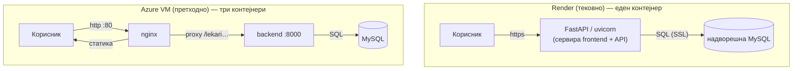
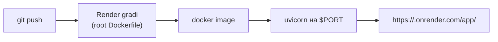

# Продукција и одржување

Оваа страница опишува како системот се поставува и одржува во **продукција** — реален сервер достапен преку интернет, со HTTPS, надворешна база и тајни конфигурирани безбедно.

Системот поддржува **две патеки** за продукција. **Render** е тековната: една слика (`Dockerfile` во коренот), каде FastAPI сервира и backend и frontend. **Azure VM + Docker** е претходната: три контејнери преку `docker-compose.yml` (nginx + backend + mysql).

> Проектот првично работеше на **Azure VM** (`docker-compose` + nginx). По истекот на студентските кредити, продукцијата е преместена на **Render** — бесплатен/евтин cloud што гради директно од Git преку еден `Dockerfile`.

## Содржина

* [1. Двете архитектури](#1-arhitekturi)
* [2. Render — деплојмент (тековно)](#2-render)
* [3. Azure VM — деплојмент (претходно)](#3-azure)
* [4. База на податоци во продукција](#4-baza)
* [5. Тајни и околински променливи](#5-tajni)
* [6. Ажурирање / редеплој](#6-azuriranje)
* [7. Логови и следење](#7-logovi)
* [8. Безбедност](#8-bezbednost)
* [9. Ограничувања на бесплатен Render](#9-ogranicuvanja)
* [10. Чести проблеми](#10-problemi)

> Поврзани страници: [Docker](docker.md) · [Nginx](nginx.md) ·
> [Поставување на сервер (Azure VM)](../../SERVER_DEPLOY.md) ·
> [Конфигурација](../overview_na_sisitemot/configuration.md)

---

## 1. Двете архитектури <a id="1-arhitekturi"></a>

Клучната разлика меѓу двете продукциски патеки е **кој ги сервира статичките датотеки** и **колку контејнери** работат.



На **Render** работи само **еден** контејнер: FastAPI самиот ги сервира и статичките датотеки и API-то, нема посебен nginx, а HTTPS е автоматски. На **Azure VM** работат **три** контејнери, каде nginx ги сервира статичките датотеки и проксира кон backend-от, а базата може да биде во Docker или надворешна.

> Бидејќи на **Render** `nginx.conf` **не се користи** воопшто, промените во nginx (на пр. `ai-chat` во regex) се важни само за Azure/docker патеката, не за Render.

---

## 2. Render — деплојмент (тековно) <a id="2-render"></a>

**Како Render го сервира сајтот.** На Render работи една слика, изградена од `Dockerfile` во коренот:

```dockerfile
FROM python:3.11-slim
WORKDIR /app
COPY backend/requirements.txt .
RUN pip install --no-cache-dir -r requirements.txt
COPY backend/ /app/            # backend код во /app
COPY frontend/ /frontend/      # frontend во /frontend (main.py го бара тука)
CMD ["sh", "-c", "uvicorn main:app --host 0.0.0.0 --port ${PORT:-8000}"]
```

Внатре, `main.py` го „качува" фронтот како статички датотеки на патеката `/app`:

```25:27:backend/main.py
FRONTEND_DIR = Path(__file__).resolve().parent.parent / "frontend"  # pateka do frontend papkata (eden nivo nagore)
if FRONTEND_DIR.exists():  # ako frontend papkata postoi
    app.mount("/app", StaticFiles(directory=str(FRONTEND_DIR), html=True), name="frontend")  # serviranje na sajtot na /app (html=True = index.html)
```

Затоа **истиот** домен и порт служи сè: коренот (`/`) враќа JSON статусна порака на API-то, **самиот сајт е на `/app/`**, а API повиците (`/lekari`, `/ai-chat/ask`, `/docs`) одат на истиот host. Корисниците влегуваат на `/app/`, не на коренот.

> **Зошто AI чатот работи на Render?** Фронтот користи `API_BASE` = ист host како страницата, па `/ai-chat/ask` оди на истиот FastAPI што го сервира и сајтот. Нема потреба од nginx или отворен порт 8000. Детали: [nginx.md, секција 6](nginx.md#6-ai).

**Чекори за поставување.** На [render.com](https://render.com) се прави *New → Web Service* и се поврзува GitHub репозиториумот. За тип на build се избира **Docker** (Render автоматски го наоѓа `Dockerfile`-от во коренот). Render задава свој `$PORT` кој `Dockerfile`-от веќе го почитува (`--port ${PORT:-8000}`), па не треба рачна промена. Тајните се внесуваат во *Environment* (не како фајл). Потоа Render автоматски гради при секој `git push`, а сајтот се проверува на `https://<app>.onrender.com/app/`.



**Околински променливи на Render.** Истите како во `backend/.env`, но се внесуваат во *Environment* во контролната табла на Render: податоците за надворешната база (`DB_HOST`, `DB_PORT`, `DB_USER`, `DB_PASSWORD`, `DB_NAME`), задолжително **`DB_SSL=1`**, и опционално `GROQ_API_KEY` (за AI) и `SMTP_*` (за е-пошта). За разлика од Docker, тука **не** се поставува `MYSQL_ROOT_PASSWORD` — тоа е само за MySQL контејнерот во `docker-compose`, кој на Render не постои.

---

## 3. Azure VM — деплојмент (претходно) <a id="3-azure"></a>

Претходната продукција беше на **Azure VM** со целиот `docker-compose` стек (nginx + backend + mysql). Тоа е детално опишано во [Поставување на сервер (Azure VM)](../../SERVER_DEPLOY.md) (мрежа, Docker инсталација, `.env`, стартување), [Docker](docker.md) (сите Docker фајлови, режими `local`/`azure-db`, команди) и [Nginx](nginx.md) (конфигурација на reverse proxy).

Накратко, ажурирањето на VM изгледа вака:

```bash
cd ~/Klinicka_Bolnica_Stip_XML
git pull
./scripts/deploy-vm.sh azure-db    # backend + nginx, база = надворешна Azure MySQL
# или
./scripts/deploy-vm.sh local       # цел стек со MySQL во Docker
```

> Главни разлики наспроти Render: nginx е изложен на порт 80, backend е во посебен контејнер на 8000, и `nginx.conf` е активен.

---

## 4. База на податоци во продукција <a id="4-baza"></a>

И на Render и на Azure VM (во `azure-db` режим), базата е **надвор** од апликацискиот контејнер — управуван MySQL 8.x сервис (Azure Database for MySQL, Aiven или сличен). Поврзувањето е преку `DB_HOST`, `DB_PORT`, `DB_USER`, `DB_PASSWORD` и задолжително **`DB_SSL=1`**. Во firewall на базата мора да се дозволи IP-та на серверот (излезните IP на Render или IP на Azure VM).

Шемата се увезува **еднаш**, со поврзување на надворешната база и пуштање на `backend/schema.sql`:

```bash
mysql -h <DB_HOST> -P 3306 -u <DB_USER> -p --ssl-mode=REQUIRED \
  Klinicka_Bolnica_Stip < backend/schema.sql
```

> `schema.sql` ги креира сите табели + почетни податоци (оддели, лекари, апарати, оглас). Детали: [База на податоци](../backend/the_database.md).

За бекап се препорачува редовен `mysqldump`:

```bash
mysqldump -h <DB_HOST> -u <DB_USER> -p --ssl-mode=REQUIRED \
  Klinicka_Bolnica_Stip > backup_$(date +%F).sql
```

---

## 5. Тајни и околински променливи <a id="5-tajni"></a>

> **Правило:** тајните **никогаш** не се комитуваат во Git. `backend/.env` е во `.gitignore` и `.dockerignore`.

Каде се внесуваат тајните зависи од средината. На **Render** се внесуваат преку *Environment* во контролната табла. На **Azure VM** се става рачно копиран `backend/.env` (`scp`), кој Compose го вчитува преку `env_file`. **Локално** се користи `backend/.env`, направен од `backend/.env.example`.

> Целосен список со објаснувања: [Конфигурација](../overview_na_sisitemot/configuration.md) и `backend/.env.example`.

---

## 6. Ажурирање / редеплој <a id="6-azuriranje"></a>

На **Render** редеплојот е автоматски — доволен е `git push` на поврзаната гранка и Render прави нов build. По потреба, рачно преку *Manual Deploy → Deploy latest commit* (или *Clear build cache & deploy* ако кешот прави проблем).

На **Azure VM** ажурирањето е рачно: `git pull` на серверот, па `./scripts/deploy-vm.sh azure-db` (или `local`).

---

## 7. Логови и следење <a id="7-logovi"></a>

Логовите на **Render** се гледаат во табот *Logs* во контролната табла (live stream од uvicorn). На **Azure VM** се гледаат со `docker compose logs -f backend` (или `mysql`, `frontend`).

За брза дијагностика, во двете средини помагаат три endpoints: `/` (дали API-то воопшто одговара), `/debug-db` (конекција до база и дали табелите постојат) и `/docs` (Swagger за рачно тестирање на повиците).

---

## 8. Безбедност <a id="8-bezbednost"></a>

**HTTPS** на Render е автоматски; на Azure VM треба домен + reverse proxy/SSL терминација. **Изложените портови** на Render се сведени само на HTTPS (443), а на Azure VM само 22 (SSH) и 80 — портовите 8000 и 3306 **не** смеат да бидат кон интернет. **Базата** е заштитена со `DB_SSL=1` и firewall ограничен на IP на серверот. **Тајните** живеат само во Render Environment или `.env` на сервер, никогаш во Git или во сликата.

Една точка за подобрување е **CORS**: моментално `main.py` дозволува сите извори (`allow_origins=["*"]`), што е практично за развој, но за вистинска продукција треба да се ограничи на доменот на сајтот (на пр. `https://<app>.onrender.com`):

```16:20:backend/main.py
app.add_middleware(  # dodavanje na CORS sloj (pred sekoj odgovor)
    CORSMiddleware,  # tip na middleware za cross-origin baranja
    allow_origins=["*"],  # dozvoleni izvori (* = site, samo za razvoj)
    allow_credentials=True,  # dozvoluva cookies / credentials vo baranjata
    allow_methods=["*"],  # dozvoleni HTTP metodi (GET, POST, ...)
```

---

## 9. Ограничувања на бесплатен Render <a id="9-ogranicuvanja"></a>

Бесплатниот план на Render има неколку важни ограничувања што влијаат на однесувањето:

* **Спиење при неактивност** — по ~15 мин без сообраќај сервисот „заспива", па првото следно барање е бавно (cold start, ~30–60s). Се решава со платен план или едноставно се прифаќа доцнењето.
* **Ефемерен фајлсистем** — прикачените слики за новости (`backend/static/uploads/`) **се губат** при секој редеплој. Трајно решение е надворешен storage (S3 / Azure Blob) или зачувување во базата.
* **Ограничени ресурси/часови** — сервисот може да се сопре ако ги надмине лимитите, па вреди да се следи потрошувачката.

> **Најважно за презентација:** на бесплатен Render, **прикачените слики не се трајни**. Базата е надвор (па податоците опстануваат), но фајловите качени на серверскиот диск исчезнуваат при нов деплој.

---

## 10. Чести проблеми <a id="10-problemi"></a>

* **Сајтот не се отвора на `/`** — коренот враќа JSON; отвори **`/app/`** наместо `/`.
* **Прв повик е многу бавен** — Render cold start (сервисот бил заспан); нормално на бесплатен план.
* **API враќа 500** — проблем со базата: провери `DB_HOST`, лозинка, **`DB_SSL=1`** и firewall на MySQL кон серверот. Тестирај со `/debug-db`.
* **`Table doesn't exist`** — шемата не е увезена во надворешната база (види [секција 4](#4-baza)).
* **Прикачени слики исчезнале** — ефемерен фајлсистем на Render (види [секција 9](#9-ogranicuvanja)).
* **AI чатот не одговара** — провери `GROQ_API_KEY`; без клуч работи offline (правила + MySQL).
* **Деплојот не ги зема промените** — на Render: *Clear build cache & deploy*; на VM: `git pull` пред `deploy-vm.sh`.
* **CORS грешка во прелистувач** — ограничен `allow_origins`; додај го доменот на сајтот во `main.py`.

---

Следно: [Docker](docker.md) · [Nginx](nginx.md) ·
[Поставување на сервер (Azure VM)](../../SERVER_DEPLOY.md)
