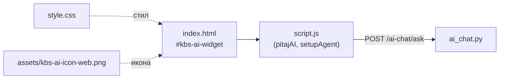
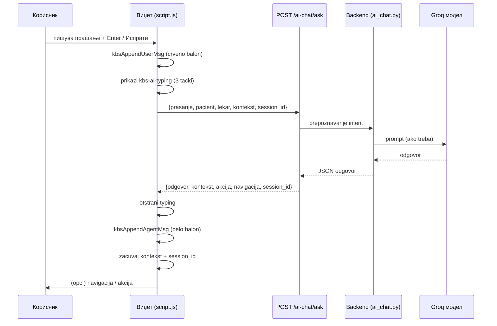
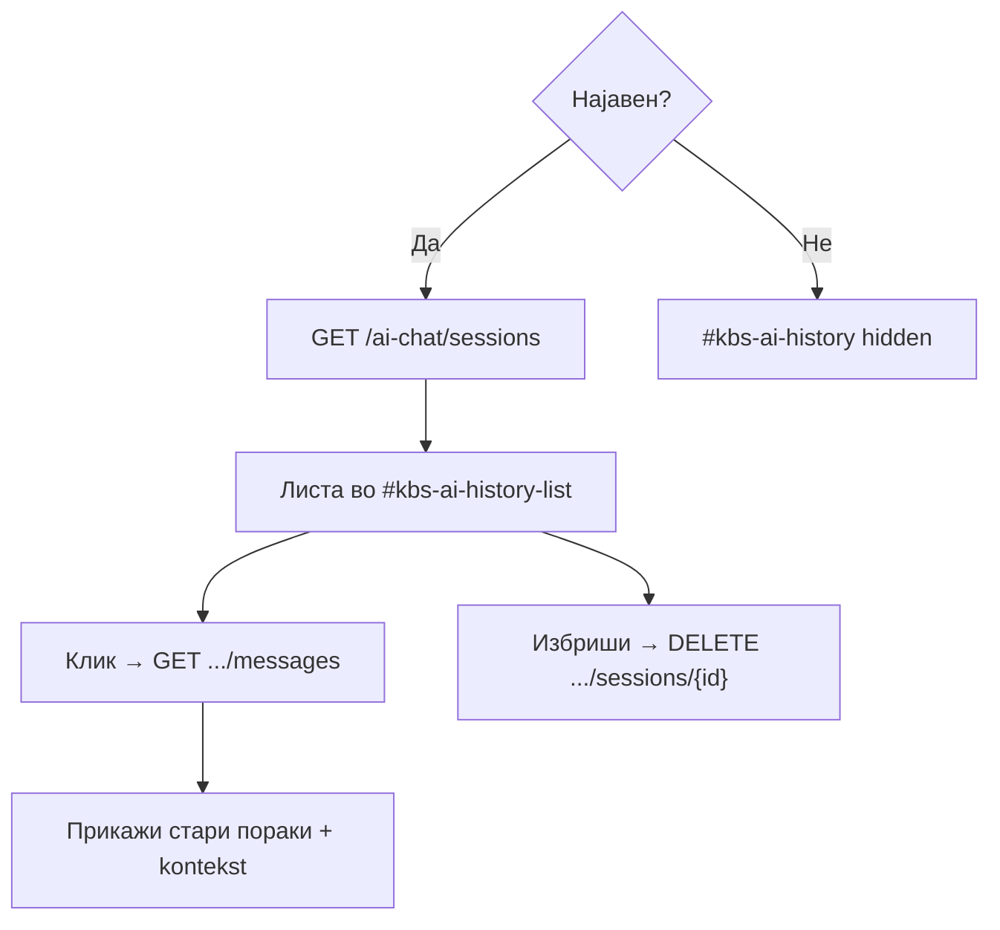
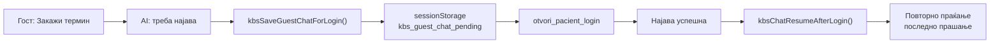

# AI чат виџет

Овој документ го опишува **AI асистентот на frontend** — плутачкиот чат прозорец
во долниот десен агол на главната страница. Овде е објаснето како изгледа,
како комуницира со backend, како памти контекст и историја, и како AI агентот
може да „кликне" нешто на интерфејсот наместо корисникот.


> Овој документ го покрива **frontend** делот. За тоа како backend ги
> обработува прашањата (intent, улоги, Groq), види
> [AI асистент (backend)](../backend/ai-assistant/overview.md).

## Содржина

* [1. Што е AI виџетот](#1-sto)
* [2. Каде се наоѓа кодот](#2-kod)
* [3. HTML структура](#3-html)
* [4. Изглед и CSS](#4-css)
* [5. Отворање, затворање и нов разговор](#5-ui)
* [6. Тек на едно прашање](#6-flow)
* [7. Прикажување пораки и typing](#7-poraki)
* [8. Што се праќа до backend](#8-request)
* [9. Што враќа backend](#9-response)
* [9.1 Реален пример (request + response)](#9-1-primer)
* [10. Контекст (повеќестепен дијалог)](#10-kontekst)
* [11. Акции и навигација](#11-akcii)
* [12. Историја на разговори](#12-istorija)
* [13. Гостински чат и најава](#13-gostin)
* [14. API endpoint-и](#14-api)
* [15. `ai_chat.js` vs `script.js`](#16-poredba)

> Поврзано: [Преглед на frontend](overview.md) · [Страници](pages.md)

---

## 1. Што е AI виџетот <a id="1-sto"></a>

AI виџетот е **интелигентен асистент** што им помага на корисниците да најдат
информации и да извршат дејства преку разговор на природен јазик — на пример:

- „Кои кардиолози работат кај вас?"
- „Сакам да закажам преглед кај д-р Захариев"
- „Како да аплицирам за работа?"
- „Кога имам дежурство утре?" (лекар)
- „Додади дежурство за д-р Петров на 15 јуни" (директор)

Асистентот работи за **сите** корисници, а можностите зависат од тоа кој е
најавен. **Гостите** добиваат општи информации и насочување кон најава.
**Пациентите** можат да закажуваат термини, да го гледаат својот распоред и
досие, и да аплицираат за работа. **Лекарите** добиваат пристап до распоред,
термини и запишување терапија, додека **директорот** може да управува со
дежурства, новости и огласи.

Виџетот е достапен **само на `index.html`** — не се појавува на `novosti.html`
или `oddel-details.html`.

---

## 2. Каде се наоѓа кодот <a id="2-kod"></a>

Виџетот е составен од неколку делови распределени низ проектот:

- **Изглед (HTML)** — `index.html`, блок `#kbs-ai-widget` (коментар „ИЗГЛЕД (HTML)")
- **Стил (CSS)** — `style.css`, блок „ИЗГЛЕД: КБ Штип AI асистент"
- **Логика (главна)** — `script.js`, во IIFE што почнува со
  `const AI_CHAT_BASE = API_BASE + "/ai-chat"`
- **Логика (поедноставена)** — `ai_chat.js`, самостоен пример што **не се
  вчитува** на сајтот
- **Икона** — `frontend/assets/kbs-ai-icon-web.png` (38×38 px на launcher копчето)
- **Backend** — `backend/routers/ai_chat.py`

> **Важно:** на главната страница се користи логиката во **`script.js`**.
> Фајлот `ai_chat.js` е поедноставена верзија (6 функции) — корисен за
> разбирање, но `index.html` **не го вчитува**.



---

## 3. HTML структура <a id="3-html"></a>

Целиот виџет е во еден контејнер `#kbs-ai-widget` на крајот од `index.html`.
Коренот има атрибут `data-open="true/false"` што кажува дали панелот е отворен.

Главните делови се:

- **Панел** (`#kbs-ai-panel`) — самиот прозорец за разговор
- **Заглавие** (`.kbs-ai-panel-header`) — лого, наслов „КБ Штип" и зелена точка „онлајн"
- **Копчиња во заглавието** — историја (`#kbs-ai-history`, ☰) и нов разговор (`#kbs-ai-new-chat`, +)
- **Панел за историја** (`#kbs-ai-history-panel`) — листата `#kbs-ai-history-list`
- **Тело** (`.kbs-ai-panel-body`) — скрол зона со интро (`#kbs-ai-intro`) и пораки (`#kbs-ai-messages`)
- **Форма** (`#kbs-ai-form`) — поле за внес (`#kbs-ai-input`) и копче за испраќање
- **Launcher** (`#kbs-ai-launcher`) — плутачкото кругло копче со иконата
- **Потврда за бришење** (`#kbs-ai-delete-confirm`) — overlay „Избриши разговор?"

Секоја порака е `<p>` елемент чија класа зависи од тоа кој пишува: корисничките
пораки добиваат `kbs-ai-msg kbs-ai-msg-user` (десно, црвено), а одговорите
`kbs-ai-msg kbs-ai-msg-agent` (лево, бело). Додека се чека одговор, се
прикажува `kbs-ai-typing` со три анимирани точки.

---

## 4. Изглед и CSS <a id="4-css"></a>

Стиловите се во `style.css`, во блок што почнува со коментарот
„ИЗГЛЕД: КБ Штип AI асистент".

Виџетот е фиксиран во долниот десен агол и користи CSS променливи за бои и
димензии:

```css
.kbs-ai-widget {
  position: fixed;
  right: 18px;
  bottom: 88px;
  z-index: 99999;
  --kbs-asst-red: #d11820;     /* главна црвена */
  --kbs-asst-online: #1fa350;  /* зелена точка „онлајн" */
  --kbs-asst-body: #ebecef;    /* позадина на панелот */
  --kbs-asst-panel-w: 400px;
  --kbs-asst-panel-h: 580px;
}
```

Панелот е **400×580 px** на десктоп. На екрани под 600px се прилагодува на
ширината на екранот (`min(400px, calc(100vw - 20px))`) и слично за висината, а
launcher копчето се поместува малку поблиску до аголот.

Launcher копчето е кругло (**66×66 px**) со црвен gradient. Внатре стои иконата
`assets/kbs-ai-icon-web.png`; кога панелот е отворен, наместо иконата се
прикажува **✕**.

---

## 5. Отворање, затворање и нов разговор <a id="5-ui"></a>

### Отворање / затворање

Клик на `#kbs-ai-launcher` го менува `data-open` на коренот:

```javascript
const setOpen = function (open) {
  root.dataset.open = open ? "true" : "false";
  panel.classList.toggle("is-open", open);
  panel.setAttribute("aria-hidden", open ? "false" : "true");
  launcher.setAttribute("aria-expanded", open ? "true" : "false");
  if (open) input.focus();
};
```

Панелот е видлив само со класата `.kbs-ai-panel.is-open`. При отворање фокусот
оди на полето за внес, чатот скролува до дното, а за најавени корисници се
освежува листата на историја.

### Нов разговор (+)

Копчето `#kbs-ai-new-chat` повикува `resetChat(false)` — ги брише сите пораки,
го прикажува повторно интрото, го чисти полето за внес, и ги ресетира
`kbsAIKontekst` и `kbsAISessionId`. Панелот **останува отворен** — само се
чисти содржината.

### Автоматски ресет

Разговорот се ресетира и панелот се **затвора** кога ќе истече сесијата
(`session.js` испраќа `kbs:session-end`) или кога корисникот ќе се одјави
(`kbs:session-sync` со `valueExists: false`). Од било кој дел на кодот ова може
да се повика преку `window.kbsChatReset(closePanel)` или само контекстот преку
`window.kbsResetKontekst()`.

---

## 6. Тек на едно прашање <a id="6-flow"></a>



Кога корисникот ќе притисне „Испрати" (или Enter) на `#kbs-ai-form`, се
случува следново: се спречува стандардниот submit (нема refresh), текстот се
исчистува и ако е празен ништо не се прави. Интрото се крие, корисничката
порака се прикажува веднаш, полето се чисти и се појавува typing индикаторот.
Потоа `pitajAI(text)` праќа `POST /ai-chat/ask`. Кога ќе пристигне одговорот,
typing се отстранува, одговорот се прикажува, се извршуваат евентуалните
`navigacija` и `akcija`, и се освежува историјата.

---

## 7. Прикажување пораки и typing <a id="7-poraki"></a>

Корисничките пораки се внесуваат со `textContent` (без HTML) — затоа се
безбедни од инјекција:

```javascript
function kbsAppendUserMsg(text) {
  const userEl = document.createElement("p");
  userEl.className = "kbs-ai-msg kbs-ai-msg-user";
  userEl.textContent = text;
  messagesEl.appendChild(userEl);
  kbsScrollChatToBottom(true, true);
}
```

Одговорите од асистентот минуваат низ `kbsFormatAiAgentHtml()`, што дозволува
две специјални синтакси: `[[надпис|index.html#kariera]]` станува кликабилен
линк (`.kbs-ai-nav-link`), а `[[center]]…[[/center]]` станува центриран потпис
(`.kbs-ai-signature`). Сето друго се escapira, па не може да помине `<script>`.
Клик на таков линк во порака повикува `kbsIzvrsiNavigacija({ target })`.

Додека се чека одговор, се прикажуваат **три анимирани точки** (`kbs-ai-typing`),
со CSS анимација `kbs-ai-typing-dot`. Скролот се прави на `.kbs-ai-panel-body`,
и тоа само ако корисникот е близу до дното (за да не го прекинува читањето на
постари пораки кога ќе пристигне нова).

---

## 8. Што се праќа до backend <a id="8-request"></a>

`pitajAI()` праќа JSON во body:

```javascript
var body = {
  prasanje: prasanje,
  pacient: auth.pacientData,   // null ако не е најавен
  lekar: auth.lekarData,       // null ако не е најавен
  kontekst: kbsAIKontekst,     // од претходна порака или null
};
if (kbsAISessionId) body.session_id = kbsAISessionId;
```

URL-то е `API_BASE + "/ai-chat" + "/ask"`.

Податоците за најавениот корисник ги подготвува `kbsAIAuthPayload()`. За
**пациент** (ако постои `currentPacient.email`) се праќаат `pacient_ID`, име и
презиме, `email` (задолжителен за закажување), телефон и ЕМБГ. За **лекар** (ако
постои `currentLekar.doctor_ID`) се праќаат `doctor_ID`, име, презиме, `email` и
специјалност. Ако никој не е најавен, и `pacient` и `lekar` се `null`, што
backend го третира како **гостински** разговор.

---

## 9. Што враќа backend <a id="9-response"></a>

Одговорот е JSON со следните полиња:

```json
{
  "odgovor": "Текст за приказ во чатот",
  "kontekst": { "doctor_id": 5, "datum": "2026-06-10" },
  "clear_kontekst": false,
  "akcija": "otvori_pacient_login",
  "navigacija": { "target": "index.html#kariera", "label": "Кариера" },
  "session_id": "abc123"
}
```

`odgovor` е текстот за чатот; `kontekst` е состојбата за следно прашање (или
`null`); `clear_kontekst: true` му кажува на frontend да го ресетира контекстот;
`akcija` и `navigacija` управуваат со UI; а `session_id` се користи за
историјата кај најавени корисници.

Frontend го обработува контекстот вака:

```javascript
if (data.kontekst !== null && typeof data.kontekst === "object") {
  kbsAIKontekst = data.kontekst;           // зачувај нов
} else if (data.kontekst === null && data.clear_kontekst === true) {
  kbsAIKontekst = null;                    // ресетирај
}
if (data.session_id) kbsAISessionId = data.session_id;
```

Ако серверот врати HTTP грешка, во чатот се прикажува „Серверот врати грешка
(статус).", а ако нема врска воопшто — „Не можам да се поврзам со серверот…".

---

## 9.1 Реален пример (request + response) <a id="9-1-primer"></a>

За да се види целиот тек во едно место, подолу е еден реален циклус кога
**гостин** (не најавен) прашува за лекари по специјалност.

**Чекор 1 — корисникот пишува:**

```
Кои кардиолози работат кај вас?
```

**Чекор 2 — frontend праќа `POST /ai-chat/ask`** со ова тело:

```json
{
  "prasanje": "Кои кардиолози работат кај вас?",
  "pacient": null,
  "lekar": null,
  "kontekst": null
}
```

> Бидејќи никој не е најавен, `pacient` и `lekar` се `null`, нема ни
> `session_id` (историја има само за најавени).

**Чекор 3 — backend враќа одговор:**

```json
{
  "odgovor": "Кај нас работат повеќе кардиолози. Ќе ве пренасочам кон листата.",
  "kontekst": null,
  "clear_kontekst": true,
  "akcija": null,
  "navigacija": {
    "target": "index.html#lekari",
    "label": "Лекари",
    "specijalnost": "Кардиологија"
  }
}
```

**Чекор 4 — што прави frontend со одговорот:**

1. Го прикажува текстот од `odgovor` во бело balon-че
2. Бидејќи `clear_kontekst: true` → го ресетира `kbsAIKontekst` на `null`
3. Има `navigacija` → `kbsIzvrsiNavigacija()` скролува до `#lekari` и го
   поставува филтерот на „Кардиологија"
4. Нема `akcija`, па не отвора модал

За **најавен пациент** истото прашање би имало `pacient` пополнет и backend би
вратил `session_id`, што frontend го памти за да продолжи во истиот разговор
(и да го зачува во историјата).

---

## 10. Контекст (повеќестепен дијалог) <a id="10-kontekst"></a>

`kbsAIKontekst` овозможува **повеќечекорен разговор** — асистентот „памти" за
што се зборува.

**Пример — закажување термин:**

```
Корисник: Сакам да закажам кај д-р Захариев
AI:       Во кој датум?
Корисник: 10 јуни
AI:       Во кое време?
Корисник: 12:00
AI:       Терминот е закажан. Потврда е испратена на вашата е-пошта.
```

Без контекст, секоја порака би била изолирана. Затоа backend го враќа објектот
`kontekst`, а frontend го праќа назад во следната порака. Кога разговорот ќе
заврши, backend враќа `kontekst: null` со `clear_kontekst: true`. Контекстот се
чисти и при нов чат, одјава или истек на сесија.

```mermaid
flowchart LR
    Q1["Порака 1"] -->|kontekst=null| BE1["Backend"]
    BE1 -->|kontekst={doctor_id}| Q2["Порака 2"]
    Q2 -->|kontekst={doctor_id}| BE2["Backend"]
    BE2 -->|kontekst={doctor_id,datum,vreme}| Q3["Порака 3"]
    BE2 -.->|clear_kontekst=true| RESET["Ресет"]
```

---

## 11. Акции и навигација <a id="11-akcii"></a>

Backend може да **управува со интерфејсот** преку полињата `akcija` и
`navigacija` во одговорот.

### Акции (`kbsIzvrsiAkcija`)

Поддржани акции се: `otvori_pacient_login` (отвора login модал за пациент),
`otvori_pacient_register` (форма за регистрација), `otvori_lekar_login` (login
за лекар), `otvori_lekar_panel` (лекарски dashboard, преку навигација) и
`osvezi_admin_dezurstva` (повторно вчитување дежурства за директор).

За `otvori_pacient_login` има **500 ms одложување** за корисникот прво да го
прочита одговорот. Отворањето на login оди по fallback ланец:
`window.openPacientLoginModal()`, потоа `window.showPacientLogin()`, потоа
директно `#auth-modal`, а ако нема модал — пренасочување на `index.html`.

### Навигација (`kbsIzvrsiNavigacija`)

`navigacija.target` може да биде секција на истата страница (на пр.
`index.html#lekari`, `#kariera`, `#uslugi`) — тогаш се прави smooth scroll —
или друга страница (`novosti.html`). Постојат и специјални цели за лекарскиот
панел: `lekar:pacienti`, `lekar:dezurstva`, `lekar:aparati` и `lekar:admin`
(само директор).

Покрај `target`, навигацијата може да носи и: `specijalnost` (автоматски филтер
на лекарите), `tab` и `subtab` (кој таб/под-таб во панелот), `datum`
(претпополнување на распоредот), `termini_mode` (`"date"` или `"all"`), како и
`doctor_id` / `dezurstvo_id` за highlight во админ панелот.

**Пример — AI насочува кон кардиолози:**

```json
{
  "odgovor": "Еве ги кардиолозите. Ќе ве пренасочам кон листата.",
  "navigacija": {
    "target": "index.html#lekari",
    "label": "Лекари",
    "specijalnost": "Кардиологија"
  }
}
```

Frontend скролува до `#lekari` и го поставува филтерот за специјалност. Покрај
ова, постои и мала хеуристика: ако одговорот содржи „е додадено" или „е
променето" и постои `loadAdminDezurstva()`, листата на дежурства се освежува и
без експлицитна акција.

---

## 12. Историја на разговори <a id="12-istorija"></a>

За **најавени** корисници (пациент или лекар) разговорите се зачувуваат во
**MySQL** преку backend. За гости историјата е оневозможена, па копчето
`#kbs-ai-history` е скриено и се појавува дури по најава:

```javascript
function kbsAIHistoryEnabled() {
  return !!(pacient_ID || doctor_ID);
}
```

Клик на ☰ го отвора панелот `#kbs-ai-history-panel` со листа разговори (наслов +
датум). Клик на разговор ги вчитува неговите пораки (`kbsLoadChatSession`), а ✕
до секој разговор отвора потврда за бришење пред да го избрише. Датумите се
форматираат на македонски (`toLocaleString("mk-MK", …)`).



---

## 13. Гостински чат и најава <a id="13-gostin"></a>

Кога **гостин** сака дејство што бара најава (на пр. закажување), чатот не се
губи — се зачувува и продолжува по најава.



Пред да се отвори login, `kbsSaveGuestChatForLogin()` го зачувува чатот во
`sessionStorage` (клуч `kbs_guest_chat_pending`):

```json
{
  "messages": [
    { "uloga": "user", "sodrzina": "..." },
    { "uloga": "assistant", "sodrzina": "..." }
  ],
  "kontekst": { "doctor_id": 5 },
  "retryLastUser": "Сакам да закажам на 10 јуни во 12:00",
  "savedAt": 1710000000000
}
```

По успешна најава, `kbsGuestChatResumeImpl()` ги враќа пораките, го отвора
панелот, и за најавени го пренесува чатот во база преку
`POST /ai-chat/sessions/import-guest`. Потоа автоматски го **повторно праќа**
последното прашање (`retryLastUser`), па backend продолжува од зачуваниот
контекст. Login handler-от го повикува ова преку
`window.kbsChatResumeAfterLogin()`.

---

## 14. API endpoint-и <a id="14-api"></a>

Сите endpoint-и се под префикс `/ai-chat` (проксирани преку Nginx):

- `POST /ai-chat/ask` — главно прашање → одговор
- `GET /ai-chat/sessions?pacient_id=...` (или `doctor_id=...`) — листа разговори
- `GET /ai-chat/sessions/{id}/messages?...` — пораки од еден разговор
- `DELETE /ai-chat/sessions/{id}?...` — бришење разговор
- `POST /ai-chat/sessions/import-guest` — пренос на гостински чат по најава

**Пример — прашање:**

```bash
curl -X POST http://localhost:8000/ai-chat/ask \
  -H "Content-Type: application/json" \
  -d '{"prasanje": "Кои лекари работат?", "pacient": null, "lekar": null, "kontekst": null}'
```

> Подетално: [AI чат API](../backend/api/ai-chat.md)

---

## 15. `ai_chat.js` vs `script.js` <a id="16-poredba"></a>

Во проектот постојат **две верзии** на AI логиката. Онаа во **`script.js`** е
вистинската — таа се вчитува на `index.html` и ги има сите можности: динамичен
`API_BASE`, историја на разговори, typing анимација, форматирање со линкови и
потпис, напредна навигација (лекарски панел, филтер на лекари) и продолжување
на гостински чат по најава.

Фајлот **`ai_chat.js`** е поедноставен **учебен пример** што не се вчитува на
сајтот. Тој ги покажува шесте основни функции на текот: `zemi_najaven_korisnik()`
(податоци за најава), `prati_prasanje()` (POST на backend), `prikaz_i_porak_a()`
(прикажување balon), `izvrsi_akcija()` (UI акции), `izvrsi_navigacija()`
(скрол / redirect) и `isprati_porak_a()` (submit handler). Користи фиксен URL
`http://localhost:8000` и нема историја, typing, ниту гостински resume.

---

## Тестирај го асистентот во живо

Подолу е вградена живата верзија на сајтот. Кликнете на црвеното кругло копче во долниот десен агол за да го отворите AI асистентот и поставете прашање — на
пример „Кои кардиолози работат кај вас?". Одговорот доаѓа од вистинскиот backend (Groq + базата на податоци).



<div class="interactive-container">
    <iframe 
        src="https://klinicka-bolnica-stip2026.onrender.com/" 
        width="100%" 
        height="600px" 
        frameborder="0" 
        style="border: 2px solid #e1e1e1; border-radius: 12px; box-shadow: 0 4px 6px rgba(0,0,0,0.1);">
    </iframe>
</div>

> **Како да тестираш:** > 1. Кликни на црвеното кругло копче во долниот десен агол на прозорецот погоре.
> 2. Внеси го следново прашање: *"Кој е дежурен лекар денес?"*
> 3. Набљудувај како AI чат-виџетот одговара динамично.

> Серверот е на бесплатен план, па првиот одговор може да потрае до една минута
> додека се „разбуди". Следните прашања се брзи.

---

> Следно: [AI асистент (backend)](../backend/ai-assistant/overview.md) —
> intent препознавање, улоги, Groq интеграција, Python handlers.
