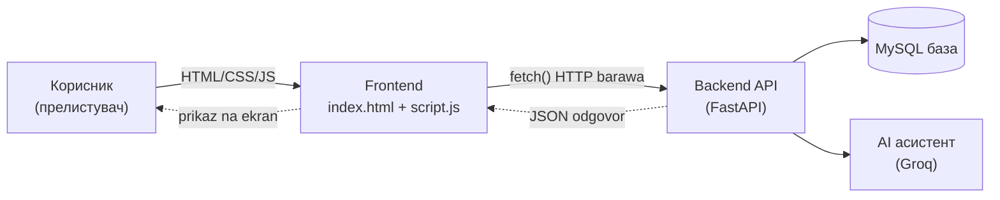
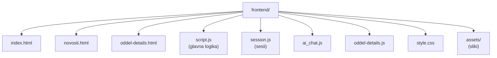
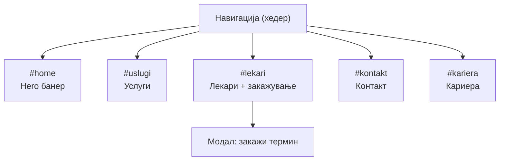
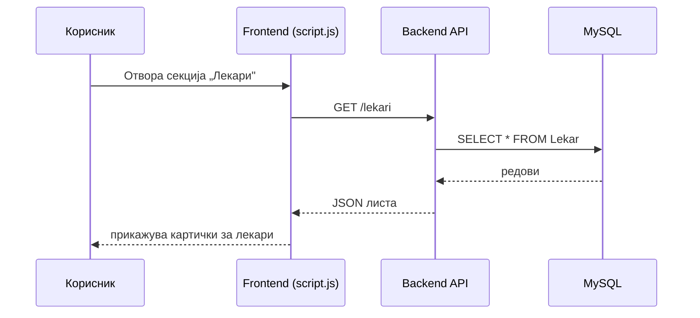
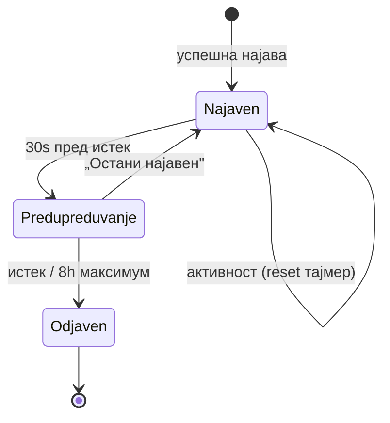
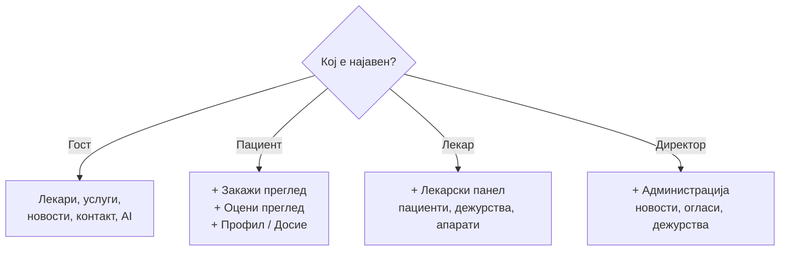
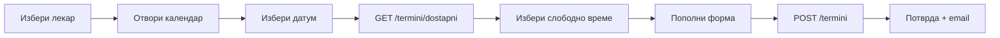
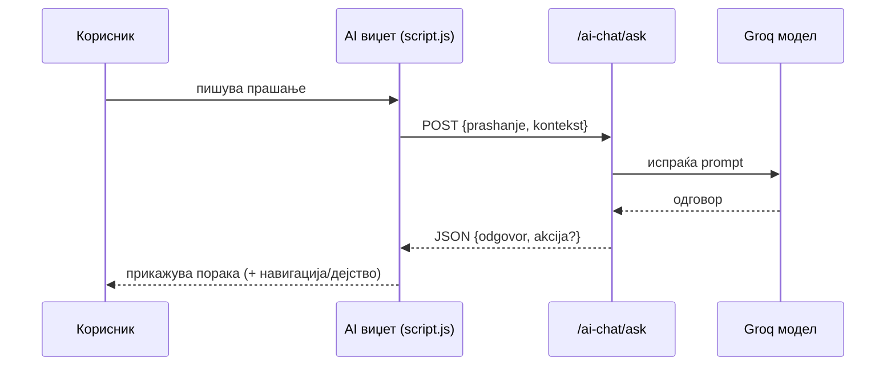

# Преглед на frontend

Овој документ го опишува **корисничкиот дел** (frontend) на системот — она што корисникот го гледа во прелистувачот и со кое директно комуницира при секојдневната употреба и посета на порталот. Frontend-от е напишан со чист **HTML, CSS и JavaScript**, без употреба на современи framework-и како React или Angular. Овој пристап го прави кодот лесен за разбирање и одржување, без потреба од дополнителни алатки за компајлирање или градење. Важно е да се истакне дека frontend-от **никогаш не комуницира директно со базата на податоци**. Секое дејство на корисникот — без разлика дали станува збор за најава, закажување термин, прегледување листа на лекари или поставување прашање до AI асистентот — се испраќа како HTTP барање до **backend API-то**, кое ги обработува податоците и враќа соодветен одговор што потоа се прикажува на екранот.



## Содржина

* [1. Локација и структура на фајловите](overview.md#1-lokacija)
* [2. Технологии](overview.md#2-tehnologii)
* [3. Страници на сајтот](overview.md#3-stranici)
* [4. Главна страница (`index.html`)](overview.md#4-index)
* [5. Поврзување со backend](overview.md#5-backend)
* [6. Најава и сесии](overview.md#6-najava)
* [7. Интерфејс по улога](overview.md#7-uloga)
* [8. Закажување на термин (UI)](overview.md#8-zakazuvanje)
* [9. AI чат виџет](overview.md#9-ai-chat)
* [10. Стилови и responsive дизајн](overview.md#10-stilovi)

> Поврзани страници: [Архитектура](../overview_na_sisitemot/architecture.md) · [Преглед на системот](../overview_na_sisitemot/overview.md) · [Страници](pages.md) · [AI чат виџет](ai-chat-widget.md)

***

## 1. Локација и структура на фајловите <a href="#id-1-lokacija" id="id-1-lokacija"></a>

Целиот frontend се наоѓа во папката **`frontend/`**, а истиот фолдер е составен од неколку посебни фајлови. Во продолжение се дадение сите фајлови и која е нивната намена.

| Фајл / папка         | Намена                                                                                                |
| -------------------- | ----------------------------------------------------------------------------------------------------- |
| [`index.html`](stranici/index-html.md) | Главна страница — лекари, закажување, најава, услуги, кариера, контакт, лекарски панел                |
| `novosti.html`       | Посебна страница за новости, каде сите корисници може да прават преглед на што е најново во болницата |
| `oddel-details.html` | Детали за медицински оддел / услуга                                                                   |
| `script.js`          | Главна логика — API повици, форми, календар, лекарски панел, AI чат                                   |
| `session.js`         | Управување со сесии (најава, истек, авто-одјава)                                                      |
| `style.css`          | Визуелни стилови за целиот сајт, за попријатно искуство на корисниците                                |
| `oddel-details.js`   | Логика за страницата со детали за оддел                                                               |
| `ai_chat.js`         | Поедноставна верзија на AI чат (главната AI логика е во `script.js`)                                  |
| `assets/`            | Слики — AI икона, икона за прикажи лозинка и сл.                                                      |



### Редослед на вчитување (на `index.html`)

```html
<script src="session.js?v=20260512-2"></script>
<script src="script.js?v=20260513-apl3"></script>
```

> `session.js` мора да се вчита **пред** `script.js`, бидејќи најавата и истекот на сесијата се користат низ целиот код.

***

## 2. Технологии <a href="#id-2-tehnologii" id="id-2-tehnologii"></a>

| Слој            | Технологија                              |
| --------------- | ---------------------------------------- |
| Структура       | HTML5                                    |
| Стил            | CSS3 (еден централен `style.css`)        |
| Логика          | Vanilla JavaScript (ES6+), без framework |
| Комуникација    | `fetch()` API, JSON                      |
| Икони / графика | Inline SVG + PNG слики во `assets/`      |
| Дијаграми во UI | HTML/CSS (календар, табели)              |

> Свесна одлука е да се користи чист JavaScript без framework — проектот е доволно мал за тоа, а нема build-чекор (нема `npm`, нема bundler). Фајловите се служат директно преку Nginx.

***

## 3. Страници на сајтот <a href="#id-3-stranici" id="id-3-stranici"></a>

Системот има **три HTML страници**:

| Страница            | Фајл                 | Опис                                                                                                                                                 |
| ------------------- | -------------------- | ---------------------------------------------------------------------------------------------------------------------------------------------------- |
| **Главна**          | [`index.html`](stranici/index-html.md) | Целосен портал на сајтот, ова е one page сајт каде корисникот може да ги пронајде сите информации со скролање по единствената страна на сајтот.      |
| **Новости**         | [`novosti.html`](stranici/novosti-html.md)       | Листа и детали за новости од болницата                                                                                                               |
| **Детали за оддел** | [`oddel-details.html`](stranici/oddel-details-html.md) | Подетален приказ на медицински оддел и услуги, со клик на секој оддел се дава соодветно објаснување и лекари кој имаат специјализација во таа област |

Главната страница е **single-page** стил: повеќе секции (`#home`, `#lekari`, `#uslugi`, …) се на иста HTML датотека, а навигацијата скролува до соодветната секција.

***

## 4. Главна страница (`index.html`) <a href="#id-4-index" id="id-4-index"></a>

> **Целосно објаснување + приказ во живо:** [`index.html` — главна страница](stranici/index-html.md)

### Хедер и навигација

Горниот дел содржи лого, мени и најава:

* **Почетна**, **Услуги**, **Лекари**, **Матични лекари** (линк кон `mojtermin.mk`), **Новости**, **Контакт**
* Копче **„Најави се!"** за гости
* **Корисничко мени** (по најава) — профил, досие, лекарски панел, одјава

Менито се прилагодува според улогата: на пример, „Закажи преглед" и „Оцени преглед" се прикажуваат само кога е најавен **пациент**.

### Главни секции на страницата

| Секција       | ID                        | Што прикажува                                                                                                                                             |
| ------------- | ------------------------- | --------------------------------------------------------------------------------------------------------------------------------------------------------- |
| Hero          | `#home`                   | Почетен банер и копче „Закажи преглед"                                                                                                                    |
| Услуги        | `#uslugi`                 | Листа на медицински услуги/оддели (се зимаат од базата на податоци преку API)                                                                             |
| Лекари        | `#lekari`                 | Листа на лекари со филтри по име и специјалност.                                                                                                          |
| Оцени преглед | `#pacient-ocenki-section` | За најавен пациент — кога лекар ќе направи промена во полето за дијагноза и терапија кај пациентот тој може да го оцени истиот преглед со оцена од 1 до 5 |
| Контакт       | `#kontakt`                | Контакт форма                                                                                                                                             |
| Кариера       | `#kariera`                | Огласи за тековно отворени работни позции и форма за аплицирање доколку даден корисник е заинтересиран за моментално отворената позиција.                 |



### Модали (popup прозорци)

Покрај секциите, страницата има и **модали** — слоеви што се отвораат над содржината:

| Модал                    | Намена                                                |
| ------------------------ | ----------------------------------------------------- |
| Најава (пациент / лекар) | Табови Пациент / Лекар                                |
| Регистрација             | Форма за нов пациент                                  |
| Заборавена лозинка       | Ресетирање со код                                     |
| Закажување термин        | Календар, избор на датум и време                      |
| Мој профил / Моето досие | За пациент                                            |
| Лекарски панел           | Распоред, пациенти, апарати, поставки, администрација |

***

## 5. Поврзување со backend <a href="#id-5-backend" id="id-5-backend"></a>

Сите API повици одат преку променливата `API_BASE` во `script.js`:

```javascript
var API_BASE = (function() {
  var h = window.location.hostname;
  if (!h || h === 'localhost' || h === '127.0.0.1') return 'http://localhost:8000';
  return window.location.protocol + '//' + window.location.host;
})();
```

| Средина   | `API_BASE`                                                             |
| --------- | ---------------------------------------------------------------------- |
| Локално   | `http://localhost:8000`                                                |
| На сервер | Ист домен како страницата (Nginx ги проксира `/lekari`, `/termini`, …) |

**Пример** — вчитување лекари:

```javascript
const res = await fetch(API_BASE + '/lekari');
const lekari = await res.json();
```



> Истиот JavaScript код работи и локално и на продукција — не треба рачно да се менува URL при деплојмент.

Покрај тоа, постои и линк кон надворешна платформа за матични лекари:

```javascript
var MATICNI_LEKARI_URL = 'https://mojtermin.mk/health_workers';
```

***

## 6. Најава и сесии <a href="#id-6-najava" id="id-6-najava"></a>

### Најава

* **Пациент** — најава со **е-пошта и лозинка** (или регистрација)
* **Лекар** — најава со **корисничко име** (`име.презиме`) и лозинка, секој лекар има првична лозинка која мора да се промени со првата најава на системот.

По успешна најава, податоците за корисникот се чуваат во `currentPacient` или `currentLekar`.

> **Интерактивно тестирање:** подолу можеш директно да ги пробаш endpoints за најава — пополни ги полињата и кликни **„Test it"** за вистински одговор од серверот.

**Најава на пациент** — `POST /pacienti/login`


[OpenAPI KlinickaBolnicaAPI](https://klinicka-bolnica-stip2026.onrender.com/openapi.json)


**Најава на лекар** — `POST /lekari/login`


[OpenAPI KlinickaBolnicaAPI](https://klinicka-bolnica-stip2026.onrender.com/openapi.json)


### `session.js` — траење на сесијата

Фајлот `session.js` управува со тоа колку долго корисникот останува најавен:

| Правило            | Вредност                                       |
| ------------------ | ---------------------------------------------- |
| Неактивност        | 5 минути → автоматска одјава                   |
| Максимум од најава | 8 часа → задолжителна одјава                   |
| Предупредување     | 30 секунди пред истек (toast „Остани најавен") |



Сесијата се чува во формат:

```json
{
  "data": { "pacient_ID": 1, "ime": "...", "email": "..." },
  "loggedInAt": 1710000000000,
  "lastActivityAt": 1710000300000
}
```

***

## 7. Интерфејс по улога <a href="#id-7-uloga" id="id-7-uloga"></a>

После најава, интерфејсот се менува според соодветнала улогата.



### Пациент

* Во менито: **Закажи преглед**, **Оцени преглед**
* Корисничко мени: **Мој профил**, **Моето досие**
* Може да закажува/откажува термини, да гледа досие и да оценува прегледи

### Лекар

* Корисничко мени: **Мојот панел** (лекарски dashboard)
* Табови во панелот:

| Таб                     | Намена                                         |
| ----------------------- | ---------------------------------------------- |
| Преглед на пациенти     | Листа на закажани прегледи, дијагноза/терапија |
| Распоред на дежурства   | Дежурства на лекарот                           |
| Закажи термин на апарат | Резервација на медицински апарат               |
| Поставки                | Промена на лозинка                             |
| Администрација          | Само за директор — новости, огласи, дежурства  |

### Гост (не најавен)

> * Гледа јавни делови: лекари, услуги, новости, контакт, кариера

Посетителот кој сè уште не е најавен има пристап до основните, јавно достапни делови од порталот. Може да ги разгледа лекарите, услугите, новостите, контактот и огласите за работа, без потреба од регистрација. Дополнително, на располагање му е и AI асистентот за општи прашања и информации поврзани со болницата. За да закаже термин, гостинот мора прво да се **најави** како пациент — оваа функционалност е достапна исклучиво за регистрирани корисници.

***

## 8. Закажување на термин (UI) <a href="#id-8-zakazuvanje" id="id-8-zakazuvanje"></a>

Закажувањето се одвива преку **модал** на главната страница:



1. Корисникот избира лекар од листата (`#lekari-list`)
2. Се отвора модал со **календар**
3. За избран датум се вчитуваат **слободни/зафатени** термини
4. Слободните се прикажани во **бела боја** или како поле кое е кликабилно, зафатените во **сива** боја и со кликање не се случува никаква акција.
5. Корисникот пополнува форма (име, презиме, е-пошта, телефон, напомена), доколку не е регистриран, доколку е регистриран се најавува со е-пошта и соодветна лозинка.
6. Backend го зачувува терминот и испраќа потврда за направен термин на маил адресата со која е најавен корисникот.

> За викенд денови календарот не нуди термини — усогласено со backend правилото.

> **Пробај го закажувањето овде:** прво провери слободни термини за лекар и датум, потоа закажи.

**Слободни термини** — `GET /termini/dostapni`


[OpenAPI KlinickaBolnicaAPI](https://klinicka-bolnica-stip2026.onrender.com/openapi.json)


**Закажување термин** — `POST /termini`


[OpenAPI KlinickaBolnicaAPI](https://klinicka-bolnica-stip2026.onrender.com/openapi.json)


***

## 9. AI чат виџет <a href="#id-9-ai-chat" id="id-9-ai-chat"></a>

На `index.html` има вграден **плутачки AI асистент** (`#kbs-ai-widget`) — копче во долниот агол што отвора панел за разговор.


* HTML структурата е во `index.html` (панел `#kbs-ai-panel`, пораки `#kbs-ai-messages`, input `#kbs-ai-input`)
* Логиката (испраќање прашања, приказ на одговори, контекст) е во **`script.js`**
* Комуникација со backend: `POST /ai-chat/ask`



Асистентот работи и за **гости** и за **најавени** корисници; за најавени се испраќаат `pacient` или `lekar` податоци за да може да изврши дејства (закажи термин, прикажи распоред и сл.).

> **Пробај го асистентот овде:** внеси прашање во полето `prasanje` (на пр. „Кои лекари се на кардиологија?") и кликни **„Test it"**.

**Прашање до асистентот** — `POST /ai-chat/ask`


[OpenAPI KlinickaBolnicaAPI](https://klinicka-bolnica-stip2026.onrender.com/openapi.json)


> Подетално: [AI чат виџет](ai-chat-widget.md) · [AI асистент (backend)](../backend/ai-assistant/overview.md)

***

## 10. Стилови и responsive дизајн <a href="#id-10-stilovi" id="id-10-stilovi"></a>

Сите страници го користат **`style.css`** — еден централен CSS фајл.

> * **Бојна палета:** бела како основна боја, црвена акцент боја за крстот и копчињата
> * **Responsive:** хамбургер мени на мали екрани (`#nav-toggle`)
> * **Модали, табели, форми** — конзистентен изглед низ целиот сајт
> * **Верзија во URL** (`style.css?v=...`) — за да прелистувачот не кешира стар CSS

Сите страници на порталот го користат заеднички, централен фајл — **`style.css`**, со што визуелниот изглед останува конзистентен низ целата апликација. Во основата на дизајнот стои бојна палета составена од бела основна боја и црвена акцентна боја, искористена за крстот и клучните копчиња на интерфејсот. Сите елементи — модали, табели и форми — следат еднакви стилски правила, со цел корисникот да има препознатлив и непрекинат визуелен доживувај на секоја страница. Дизајнот е целосно **responsive** — на помали екрани автоматски се активира хамбургер мени (преку елементот `#nav-toggle`), кое овозможува удобно користење и на мобилни уреди. За да се избегне проблемот со стари, кеширани верзии на CSS-от во прелистувачот, фајлот се вчитува со верзиски параметар во URL-то:

```html
<link rel="stylesheet" href="style.css?v=20260513-novosti-html" />
```

Секоја нова верзија на стиловите бара промена на овој параметар, со што прелистувачот е принуден веднаш да ја преземе освежената датотека наместо да ја користи старата од кешот.

> Поврзано: [Страници](pages.md) · [Архитектура → Frontend слој](../overview_na_sisitemot/architecture.md)

***

## Тестирај го сајтот во живо



> Серверот е на бесплатен план и „заспива" по подолга неактивност, па првото вчитување може да потрае до една минута. Освежете ако страницата е празна.
