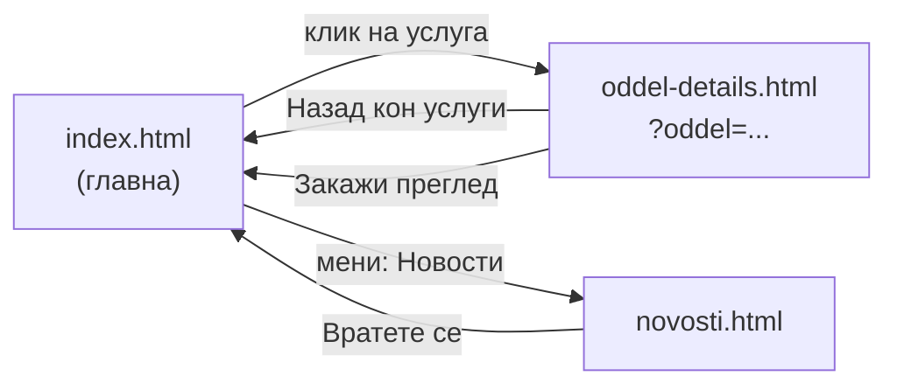
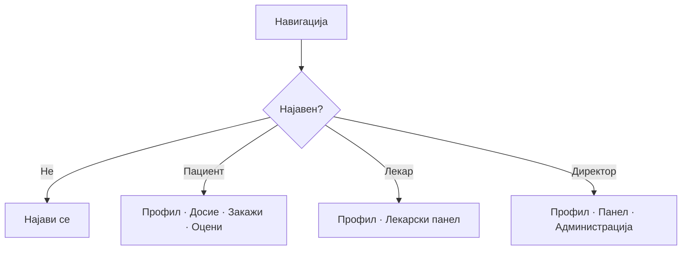
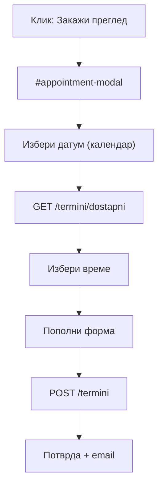
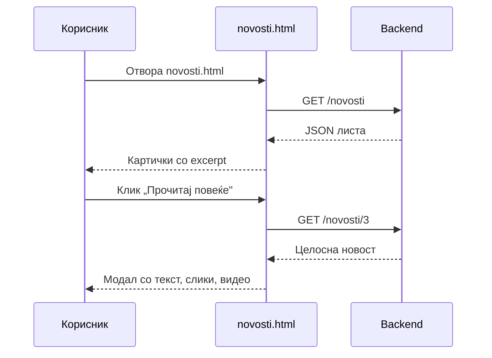
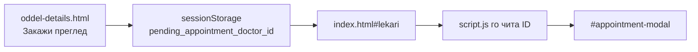

# Страници

Овој документ дава детален преглед на секоја HTML страница од порталот — што прикажува, кои делови ги содржи, со кој API комуницира и како корисникот се движи помеѓу нив. Целта е секој член на тимот, без разлика дали работи на дизајнот или на логиката, да има јасна слика за тоа како е организирана презентациската страна на системот. Порталот е намерно изграден едноставно, со мал број страници — пристап кој ја намалува сложеноста и го олеснува идното проширување.

Системот има **три страници**:

| Страница        | Фајл                                                   | Тип                                               | Опис                                                                         |
| --------------- | ------------------------------------------------------ | ------------------------------------------------- | ---------------------------------------------------------------------------- |
| Главна          | [`index.html`](stranici/index-html.md)                 | Single-page (повеќе секции на една датотека)      | Содржи повеќе секции (лекари, закажување, најава) групирани во една датотека |
| Новости         | [`novosti.html`](stranici/novosti-html.md)             | Самостојна страница                               | Прикажува листа на новости и детали за секоја објава                         |
| Детали за оддел | [`oddel-details.html`](stranici/oddel-details-html.md) | Посебна страница (динамичка, преку URL параметар) | Содржината се генерира во зависност од URL параметар                         |



Поврзано: [Преглед на frontend](overview.md) · [Архитектура](../overview_na_sisitemot/architecture.md) · [AI чат виџет](ai-chat-widget.md)

***

## 1. Главна страница (`index.html`) <a href="#id-1-index" id="id-1-index"></a>

> Посебна страница со целосно објаснување и приказ во живо: [`index.html` — главна страница](stranici/index-html.md).

Главната страница е **централниот дел** на порталот — местото каде се одвива најголемиот дел од интеракцијата на корисникот со системот. Таа ги обединува сите клучни функционалности: од јавните информации достапни за секого, преку најавата и регистрацијата, па сè до закажувањето термини и лекарскиот панел. Иако делува како повеќе одделни страници, во основа сè е сместено во **една единствена HTML датотека**. Навигацијата меѓу нив не претставува вистинско преминување на нова страница, туку едноставно „лизгање" (scroll) до соодветната секција — означена со котви како `#home`, `#uslugi`, `#lekari` и слично. Ова обезбедува брзо и непречено искуство, без чекање на нови страници да се вчитаат.

**Фајлови што ја поддржуваат:**

| Фајл         | Улога                                           |
| ------------ | ----------------------------------------------- |
| `index.html` | HTML структура — секции, форми, модали          |
| `style.css`  | Визуелен изглед                                 |
| `session.js` | Сесии (најава, истек, одјава)                   |
| `script.js`  | Целата логика — API, форми, календар, панел, AI |

**Редослед на вчитување:**

```html
<script src="session.js?v=20260512-2"></script>
<script src="script.js?v=20260513-apl3"></script>
```

### 1.1 Навигација (хедер) <a href="#id-1-1-nav" id="id-1-1-nav"></a>

Хедерот е фиксен на врвот и содржи лого, мени и најава.

| Елемент         | ID / класa            | Опис                                           |
| --------------- | --------------------- | ---------------------------------------------- |
| Хамбургер мени  | `#nav-toggle`         | На мали екрани — отвора/затвора мени           |
| Почетна         | `href="#home"`        | Скрол до hero банерот                          |
| Услуги          | `href="#uslugi"`      | Скрол до листата на услуги                     |
| Лекари          | `href="#lekari"`      | Скрол до листата на лекари                     |
| Матични лекари  | `#nav-maticni-lekari` | Линк кон `mojtermin.mk` (надворешна платформа) |
| Новости         | `href="novosti.html"` | Отвора **нов прозорец**                        |
| Контакт         | `href="#kontakt"`     | Скрол до контакт формата                       |
| Закажи преглед  | `#nav-zakazi-pregled` | Само за **најавен пациент**                    |
| Оцени преглед   | `#nav-oceni-pregled`  | Само за **најавен пациент**                    |
| Најави се       | `#nav-auth-guest`     | Копче за гости                                 |
| Корисничко мени | `#nav-user-menu`      | По најава — профил, досие, панел, одјава       |



### 1.2 Јавни секции <a href="#id-1-2-sekcii" id="id-1-2-sekcii"></a>

#### Hero — `#home`

Почетен банер со позадинска слика (амбуланта), наслов и копче „Закажи преглед".

```html
<section id="home" class="hero">
  
  <h1>БРЗА И СИГУРНА МЕДИЦИНСКА ПОМОШ</h1>
  <a href="#lekari" class="btn-primary">ЗАКАЖИ ПРЕГЛЕД</a>
</section>
```

#### Карактеристики — `.features-section`

Под hero-секцијата се прикажани три картички кои ги истакнуваат клучните предности на болницата: **24/7 Итна Помош**, **Искусни Тимови** и **Модерна Медицинска Опрема**. Овие картички содржат статична содржина, директно вградена во HTML-от — не се вчитуваат преку API, бидејќи претставуваат фиксни информации кои не се менуваат динамички.

#### Услуги — `#uslugi`

| Елемент         | ID             | API           |
| --------------- | -------------- | ------------- |
| Листа на услуги | `#uslugi-list` | `GET /uslugi` |

Услугите се прикажани како **хоризонтална лента** (marquee) со стрелки за скролување. Клик на картичка отвора:

```
oddel-details.html?oddel=ИмеНаОддел
```

> **Пробај го endpoint-от за услуги:**

> **Тестирај го овде →** [GET `/uslugi`](../backend/api/uslugi.md#3-uslugi)

#### Лекари — `#lekari`

| Елемент                  | ID                                 | API            |
| ------------------------ | ---------------------------------- | -------------- |
| Филтер по име            | `#filter-name`                     | Локален филтер |
| Филтер по специјалност   | `#filter-specialty`                | Локален филтер |
| Листа на лекари          | `#lekari-list`                     | `GET /lekari`  |
| Прикажи повеќе / помалку | `#show-more-btn`, `#show-less-btn` | —              |

Секоја картичка има копче **„Закажи преглед"** кое го отвора модалот за закажување на преглед `#appointment-modal`.

За **најавен пациент** се прикажува и `#lekari-pacient-callout` — кратка порака дека може директно да закаже термин.

> **Пробај го endpoint-от за лекари** (со опционален филтер по специјалност):

> **Тестирај го овде →** [GET `/lekari`](../backend/api/lekari.md#3-lista)

#### Оцени преглед — `#pacient-ocenki-section`

| Елемент            | ID                     | Видливост                |
| ------------------ | ---------------------- | ------------------------ |
| Листа за оценување | `#pacient-ocenki-list` | Само најавен **пациент** |

API: `GET /termini` (завршени прегледи) + `POST` за оценка.

#### Контакт — `#kontakt`

| Елемент       | ID               | API                     |
| ------------- | ---------------- | ----------------------- |
| Контакт форма | `#kontakt-forma` | `POST` (испраќа порака) |

Полиња: име, е-пошта, тема, порака.

#### Кариера — `#kariera`

| Елемент             | ID               | API                |
| ------------------- | ---------------- | ------------------ |
| Листа на огласи     | `#kariera-list`  | `GET /kariera`     |
| Форма за аплицирање | `#kariera-forma` | `POST /aplikacija` |

Корисникот прво избира позиција од листата, потоа пополнува форма (име, е-пошта, CV како фајл).

> **Пробај ги endpoints за кариера** — листа на огласи и аплицирање:

> **Тестирај го овде →** [GET `/kariera`](../backend/api/kariera.md#2-oglasi)

> **Тестирај го овде →** [POST `/aplikacija`](../backend/api/kariera.md#3-aplikacija)

#### Footer

Авторски права со динамичка година (`#year`). И поставена мапа со локација на болницата во градот.

### 1.3 Модали <a href="#id-1-3-modali" id="id-1-3-modali"></a>

Модалите се popup слоеви над страницата. Се отвораат со JavaScript, не со навигација.

| Модал                | ID                       | Кога се отвора                    | API                                          |
| -------------------- | ------------------------ | --------------------------------- | -------------------------------------------- |
| Најава (пациент)     | `#pacient-login-modal`   | „Најави се" се отвара таб Пациент | `POST /pacienti/login`                       |
| Најава (универзален) | `#auth-modal`            | Најава пациент/лекар              | `POST /pacienti/login`, `POST /lekari/login` |
| Регистрација         | (во `#auth-modal`)       | „Регистрирајте се"                | `POST /pacienti/register`                    |
| Заборавена лозинка   | (во `#auth-modal`)       | Линк под формата                  | `POST /pacienti/reset-password`              |
| Закажување термин    | `#appointment-modal`     | „Закажи преглед" на лекар         | `GET /termini/dostapni`, `POST /termini`     |
| Мој профил           | `#moj-profil-modal`      | Корисничко мени                   | `GET /pacienti/me`                           |
| Моето досие          | `#moje-dosie-modal`      | Корисничко мени (пациент)         | `GET /pacienti/dosie`                        |
| Лекарски панел       | `#lekar-dashboard-modal` | Корисничко мени (лекар)           | Повеќе endpoint-и                            |
| Форма за дежурство   | `#dezurstvo-form-modal`  | Администрација                    | `POST /admin/dezurstva`                      |
| Форма за оглас       | `#oglas-form-modal`      | Администрација                    | `POST /kariera`                              |
| Форма за новост      | `#novost-form-modal`     | Администрација                    | `POST /novosti`                              |
| Преглед на новост    | `#novost-view-modal`     | Клик на новост (админ)            | `GET /novosti/{id}`                          |



**Закажување термин — визуелни правила:**

* Слободни термини -> **бела** боја, клик остварува акција.
* Зафатени термини -> **сива** боја, клик не прави никаква акција
* Викенд -> нема достапни термини, не се остваруваат термини преку сајтот, но постојано има лекари во болницата кој се дежурни

#### Тестирај ги модалите во живо

Секој модал повикува по еден endpoint. Пробај ги директно тука — пополни ги полињата и кликни **„Test it"** за вистински одговор од серверот.

**Најава (пациент)** — `POST /pacienti/login`

> **Тестирај го овде →** [POST `/pacienti/login`](../backend/api/pacienti.md#4-login)

**Регистрација** — `POST /pacienti/register`

> **Тестирај го овде →** [POST `/pacienti/register`](../backend/api/pacienti.md#3-register)

**Достапни термини** — `GET /termini/dostapni`

> **Тестирај го овде →** [GET `/termini/dostapni`](../backend/api/termini.md#3-dostapni)

**Закажување термин** — `POST /termini`

> **Тестирај го овде →** [POST `/termini`](../backend/api/termini.md#4-zakazi)

> Ако сакаш да го видиш **целиот сајт во живо**, тоа е достапно на дното на [Преглед на frontend](overview.md).

### 1.4 Лекарски панел <a href="#id-1-4-lekar-panel" id="id-1-4-lekar-panel"></a>

Модал `#lekar-dashboard-modal` — целосен интерфејс за лекари. Се отвора по најава како лекар (или директор).

**Табови:**

| Таб                     | `data-lekar-tab` | Што прави                         | API                                                 |
| ----------------------- | ---------------- | --------------------------------- | --------------------------------------------------- |
| Преглед на пациенти     | `pacienti`       | Листа термини, дијагноза/терапија | `GET /termini`, `PUT /termini/{id}`                 |
| Распоред на дежурства   | `dezurstva`      | Преглед на дежурства              | `GET /admin/dezurstva`                              |
| Закажи термин на апарат | `aparati`        | Резервација на апарат             | `GET /aparati`, `POST /aparati`                     |
| Поставки                | `postavki`       | Промена на лозинка                | `PUT /lekari/password`                              |
| Администрација          | `admin`          | Само **директор**                 | `GET/POST /novosti`, `/kariera`, `/admin/dezurstva` |

**При прва најава** (привремена лозинка): се појавува overlay `#lekar-first-login-overlay` со задолжителна промена на лозинка пред да се продолжи.

**Администрација** (директор) содржи под-табови:

* Управување со **новости** (`#novosti-admin`)
* Управување со **огласи за работа** (`#kariera-admin`)
* Управување со **дежурства** (`#dezurstva-admin`)

### 1.5 AI виџет <a href="#id-1-5-ai" id="id-1-5-ai"></a>

Плутачки асистент во долниот десен агол — `#kbs-ai-widget`.

| Елемент           | ID                 |
| ----------------- | ------------------ |
| Копче за отворање | `#kbs-ai-launcher` |
| Панел за разговор | `#kbs-ai-panel`    |
| Листа на пораки   | `#kbs-ai-messages` |
| Поле за внес      | `#kbs-ai-input`    |

Логиката е во `script.js`. API: `POST /ai-chat/ask`.

> **Пробај го асистентот** — внеси прашање во полето `prasanje` и кликни **„Test it"**:

> **Тестирај го овде →** [POST `/ai-chat/ask`](../backend/api/ai-chat.md#3-ask)

> Подетално: [AI чат виџет](ai-chat-widget.md)

***

## 2. Страница за новости (`novosti.html`) <a href="#id-2-novosti" id="id-2-novosti"></a>

Посебна страница наменета за **јавен преглед на сите новости** објавени од болницата. Содржи листа на актуелни објави, секоја со свои детали, и им овозможува на посетителите да бидат во тек со случувањата во установата. Страницата се отвора во **нов прозорец**, преку линк достапен во менито на главната страница — со што корисникот може истовремено да ги следи новостите и да продолжи со другите активности на порталот, без да ја губи тековната сесија.

**Фајлови:**

| Фајл           | Улога                                 |
| -------------- | ------------------------------------- |
| `novosti.html` | HTML + вграден JavaScript (самостоен) |
| `style.css`    | Заеднички стилови                     |
| `session.js`   | Сесии (ако корисникот е најавен)      |

> За разлика од `index.html`, `novosti.html` **не користи `script.js`** — целата логика е вградена во `<script>` блок на самата страница.

### Структура

```
novosti.html
├── Хедер (лого + линк назад кон index.html)
├── #novosti-list (картички со новости)
└── #novost-view-modal (целосен преглед на една новост)
```

### Како работи

1. При вчитување: `GET /novosti` → листа на картички
2. Секоја картичка прикажува: слика, наслов, датум, автор, краток excerpt (150 знаци)
3. Копче **„Прочитај повеќе"** → `GET /novosti/{id}` → модал со целосна содржина
4. Ако URL има `?id=5` → автоматски се отвора таа новост

**Пример URL:**

```
novosti.html?id=3
```

> **Пробај ги endpoints за новости** — листа и една новост по `id`:

> **Тестирај го овде →** [GET `/novosti`](../backend/api/novosti.md#3-list)

> **Тестирај го овде →** [GET `/novosti/{novost_id}`](../backend/api/novosti.md#4-edna)

### Безбедност на HTML содржина

Новостите можат да содржат HTML (од AI или директор). Пред прикажување, се чисти со `sanitizeHtml()`:

* Се бришат: `script`, `style`, `iframe`, `object`, `embed`, `form`
* Се бришат `on*` атрибути (onclick, onload, …)
* Се блокира `javascript:` во `href`/`src`

### Мултимедија во новости

| Тип                | Поддршка                                        |
| ------------------ | ----------------------------------------------- |
| Главна слика       | `slika_path` → `/static/...` или Azure Blob URL |
| Дополнителни слики | `slike_extra[]` → lightbox галерија             |
| YouTube / Vimeo    | `video_url` → embed iframe                      |
| Локално видео      | `.mp4`, `.webm`, `.ogg` → `<video>` таг         |



***

## 3. Страница за оддел (`oddel-details.html`) <a href="#id-3-oddel" id="id-3-oddel"></a>

Динамичка страница која прикажува детални информации за **конкретен медицински оддел**, вклучувајќи опис на одделот и листа на лекарите кои работат во него. Страницата се отвора кога корисникот ќе кликне на одредена услуга во секцијата `index.html#uslugi` на главната страница. Содржината не е статична — се генерира динамички во зависност од тоа кој оддел е избран, преку параметар проследен низ URL-адресата.

**Фајлови:**

| Фајл                 | Улога                                        |
| -------------------- | -------------------------------------------- |
| `oddel-details.html` | HTML структура + вградени стилови            |
| `oddel-details.js`   | Логика — вчитување оддел, лекари, закажување |
| `session.js`         | Сесии                                        |
| `style.css`          | Заеднички стилови                            |

### URL формат

```
oddel-details.html?oddel=Кардиологија
```

Параметарот `oddel` се чита со `URLSearchParams`:

```javascript
function getURLParameter(name) {
  const urlParams = new URLSearchParams(window.location.search);
  return decodeURIComponent(urlParams.get(name) || '');
}
```

### Структура на страницата

| Дел        | ID                        | Содржина                                               |
| ---------- | ------------------------- | ------------------------------------------------------ |
| Навигација | `.navbar`                 | Линкови кон `index.html#uslugi`, `#lekari`, `#kontakt` |
| Назад      | `.back-button`            | `index.html#uslugi`                                    |
| Наслов     | `#oddel-title`            | Име на одделот (од URL)                                |
| Опис       | `#oddel-description-text` | Текст од `oddelDescriptions` во JS                     |
| Лекари     | `#lekari-list-details`    | Картички од API                                        |

### Опис на одделите

Описите се **хардкодирани** во `oddel-details.js` (објект `oddelDescriptions`). Ако одделот не постои во објектот, се користи `default` опис. Поддржани оддели вклучуваат: Кардиологија, Педијатрија, Ортопедија, Гинекологија, Офталмологија, Радиологија, Хирургија, Урологија, Неврологија, Дерамтовенерологија, Пулмологија, Гастроентерологија, Анестезиологија, Психијатрија.

### Вчитување на лекари

1. Прво: `GET /lekari?specijalnost=ИмеНаОддел`
2. Ако нема резултати → вчитува сите лекари и филтрира локално преку `oddelToSpecialtyMap` (мапирање оддел ↔ специјалност)
3. Лекарите се прикажуваат по **8 одеднаш** со копчиња „Прикажи повеќе" / „Прикажи помалку"
4. Grid се прилагодува според бројот: 1 лекар (центриран), 2, 3 или 4+ во ред

### Закажување од страницата за оддел

Копчето **„Закажи преглед"** на картичка за лекар:

```javascript
function openAppointmentModal(doctorId) {
  sessionStorage.setItem('pending_appointment_doctor_id', doctorId);
  window.location.href = 'index.html#lekari';
}
```

Корисникот се пренасочува на главната страница, а `script.js` го чита `pending_appointment_doctor_id` и автоматски го отвора модалот за закажување.



***

## 4. Поврзаност помеѓу страниците <a href="#id-4-navigacija" id="id-4-navigacija"></a>

| Од                   | До                   | Како                                    |
| -------------------- | -------------------- | --------------------------------------- |
| `index.html`         | `novosti.html`       | Мени „Новости" (нов прозорец)           |
| `index.html`         | `oddel-details.html` | Клик на услуга во `#uslugi`             |
| `oddel-details.html` | `index.html#uslugi`  | „Назад кон услуги"                      |
| `oddel-details.html` | `index.html#lekari`  | „Закажи преглед" (преку sessionStorage) |
| `novosti.html`       | `index.html`         | „Вратете се на главната страница"       |
| `novosti.html`       | `novosti.html?id=N`  | Директен линк кон една новост           |

Сите три страници користат **ист `API_BASE`** логика — локално `http://localhost:8000`, на сервер ист домен преку Nginx.

***

## 5. API повици по страница <a href="#id-5-api" id="id-5-api"></a>

### `index.html` (преку `script.js`)

| Дејство          | Метод    | Endpoint             |
| ---------------- | -------- | -------------------- |
| Листа лекари     | GET      | `/lekari`            |
| Листа услуги     | GET      | `/uslugi`            |
| Достапни термини | GET      | `/termini/dostapni`  |
| Закажи термин    | POST     | `/termini`           |
| Најава пациент   | POST     | `/pacienti/login`    |
| Регистрација     | POST     | `/pacienti/register` |
| Најава лекар     | POST     | `/lekari/login`      |
| Мој профил       | GET      | `/pacienti/me`       |
| Досие            | GET      | `/pacienti/dosie`    |
| Огласи за работа | GET      | `/kariera`           |
| Аплицирај        | POST     | `/aplikacija`        |
| AI прашање       | POST     | `/ai-chat/ask`       |
| Лекарски термини | GET      | `/termini`           |
| Апарати          | GET/POST | `/aparati`           |
| Админ новости    | GET/POST | `/novosti`           |
| Админ дежурства  | GET/POST | `/admin/dezurstva`   |

### `novosti.html`

| Дејство       | Метод | Endpoint        |
| ------------- | ----- | --------------- |
| Листа новости | GET   | `/novosti`      |
| Една новост   | GET   | `/novosti/{id}` |

### `oddel-details.html` (преку `oddel-details.js`)

| Дејство                | Метод | Endpoint                   |
| ---------------------- | ----- | -------------------------- |
| Лекари по специјалност | GET   | `/lekari?specijalnost=...` |
| Сите лекари (fallback) | GET   | `/lekari`                  |

> Подетално за секој endpoint: [API конвенции](../backend/api/conventions.md)
