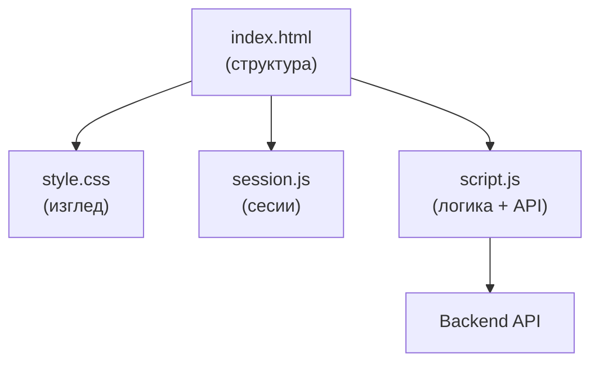
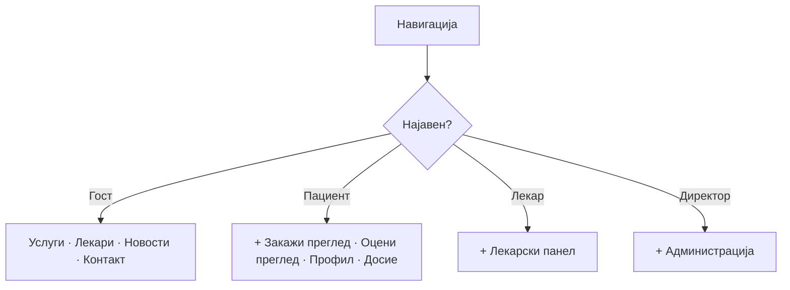
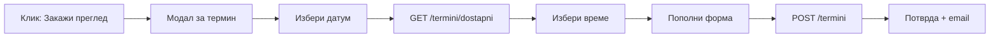

# `index.html` — главна страница

`index.html` е **срцето на порталот** — единствената датотека низ која поминува најголемиот дел од интеракцијата на корисникот. Иако на прв поглед изгледа како повеќе одделни страници (почетна, услуги, лекари, контакт…), во основа сè е сместено во **една HTML датотека**. Тоа е таканаречен **single-page** пристап.

> **Идејата:** наместо корисникот да чека нова страница да се вчита при секој клик, сите секции се веќе тука. Навигацијата само „лизга" (scroll) до соодветниот дел — означен со котва (`#home`, `#uslugi`, `#lekari`…). Резултат: брзо, непрекинато искуство, како во модерна апликација.

## Содржина

* [1. Што е и зошто single-page](#1-sto)
* [2. Како е составена](#2-struktura)
* [3. Хедер и навигација](#3-header)
* [4. Јавни секции](#4-sekcii)
* [5. Модали (popup прозорци)](#5-modali)
* [6. AI асистент](#6-ai)
* [7. Како изгледа во живо](#7-zivo)
* [8. Пробај ги функциите](#8-probaj)

> Поврзано: [Преглед на frontend](../overview.md) · [Страници](../pages.md) · [AI чат виџет](../ai-chat-widget.md)

***

## 1. Што е и зошто single-page <a id="1-sto"></a>

`index.html` ги обединува **сите клучни функционалности** на едно место:

* јавни информации достапни за секого (услуги, лекари, новости, контакт),
* најава и регистрација,
* закажување на термини,
* лекарски и административен панел (по најава).

Navigacijata меѓу деловите не е вистинско преминување на нова страница, туку scroll до секцијата означена со котва. Така корисникот има чувство дека работи со една жива апликација, без прекини.

***

## 2. Како е составена <a id="2-struktura"></a>

Страницата е поддржана од четири фајла:

| Фајл | Улога |
|------|-------|
| `index.html` | HTML структура — секции, форми, модали |
| `style.css` | Визуелен изглед (бои, распоред, форми, модали) |
| `session.js` | Сесии — најава, истек, авто-одјава |
| `script.js` | Целата логика — API повици, форми, календар, панел, AI |

**Редослед на вчитување** (на крајот од страницата):

```html
<script src="session.js?v=20260512-2"></script>
<script src="script.js?v=20260513-apl3"></script>
```

> `session.js` мора да се вчита **пред** `script.js`, бидејќи најавата и истекот на сесијата се користат низ целиот код. Параметарот `?v=...` спречува прелистувачот да кешира стара верзија.



***

## 3. Хедер и навигација <a id="3-header"></a>

Горниот дел е **фиксен** и содржи лого, мени и најава:

* **Лого** — црвен крст `+` и натпис „ЈЗУ Клиничка Болница - Штип".
* **Мени:** Почетна · Услуги · Лекари · Матични лекари (надворешен линк кон `mojtermin.mk`) · Новости (нов прозорец) · Контакт.
* **Копче „Најави се!"** за гости.
* **Корисничко мени** (по најава) — профил, досие, лекарски панел, одјава.

Менито е **паметно** — се менува според улогата на корисникот:



На мали екрани, менито се крие зад **хамбургер копче** (`#nav-toggle`).

***

## 4. Јавни секции <a id="4-sekcii"></a>

Сите секции се на иста датотека, една под друга:

| Секција | ID | Што прикажува | API |
|---------|-----|----------------|-----|
| Hero | `#home` | Почетен банер + копче „Закажи преглед" | — |
| Карактеристики | `.features-section` | Три картички (24/7, тимови, опрема) — статични | — |
| Услуги | `#uslugi` | Хоризонтална лента со оддели | `GET /uslugi` |
| Лекари | `#lekari` | Листа лекари со филтри | `GET /lekari` |
| Оцени преглед | `#pacient-ocenki-section` | Завршени прегледи за оцена (само пациент) | `GET /termini` |
| Контакт | `#kontakt` | Контакт форма | — |
| Кариера | `#kariera` | Огласи + форма за аплицирање | `GET /kariera`, `POST /aplikacija` |

Клик на услуга отвора посебна страница `oddel-details.html?oddel=ИмеНаОддел`, а клик на „Закажи преглед" кај лекар го отвора модалот за закажување.

***

## 5. Модали (popup прозорци) <a id="5-modali"></a>

Модалите се слоеви што се отвораат **над** страницата (не се нова страница). Се отвораат со JavaScript:

| Модал | Кога | API |
|-------|------|-----|
| Најава (пациент/лекар) | Копче „Најави се" | `POST /pacienti/login`, `POST /lekari/login` |
| Регистрација | „Регистрирајте се" | `POST /pacienti/register` |
| Заборавена лозинка | Линк под формата | `POST /pacienti/reset-password` |
| Закажување термин | „Закажи преглед" | `GET /termini/dostapni`, `POST /termini` |
| Мој профил / Досие | Корисничко мени | `GET /pacienti/dosie` |
| Лекарски панел | Корисничко мени (лекар) | повеќе endpoints |



***

## 6. AI асистент <a id="6-ai"></a>

Во долниот десен агол има **плутачки AI виџет** (`#kbs-ai-widget`) — копче што отвора панел за разговор. Работи и за гости и за најавени корисници, а комуницира со `POST /ai-chat/ask`.

> Подетално: [AI чат виџет](../ai-chat-widget.md).

***

## 7. Како изгледа во живо <a id="7-zivo"></a>

Подолу е вградена **вистинската главна страница** од серверот. Можеш да скролуваш, да отвораш модали и да кликаш — тоа е истиот `index.html`:



> Серверот е на бесплатен план, па првото вчитување може да потрае до една минута додека се „разбуди". Освежи ако страницата е празна.

***

## 8. Пробај ги функциите <a id="8-probaj"></a>

Главните дејства на страницата ги повикуваат следните endpoints. Пополни ги полињата и кликни **„Test it"** за вистински одговор од серверот.

**Најава на пациент** — `POST /pacienti/login`


[OpenAPI KlinickaBolnicaAPI](https://klinicka-bolnica-stip2026.onrender.com/openapi.json)


**Листа на лекари** — `GET /lekari`


[OpenAPI KlinickaBolnicaAPI](https://klinicka-bolnica-stip2026.onrender.com/openapi.json)


**Листа на услуги** — `GET /uslugi`


[OpenAPI KlinickaBolnicaAPI](https://klinicka-bolnica-stip2026.onrender.com/openapi.json)


***

Следно: [`novosti.html`](../pages.md#2-novosti) · [`oddel-details.html`](../pages.md#3-oddel) · [Преглед на frontend](../overview.md)
