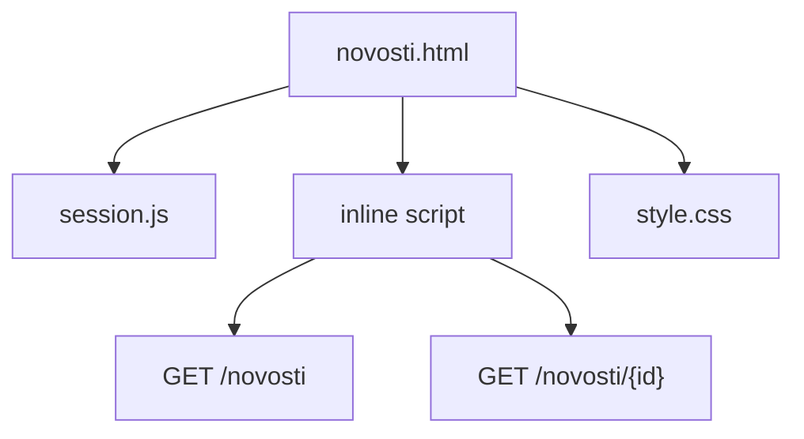
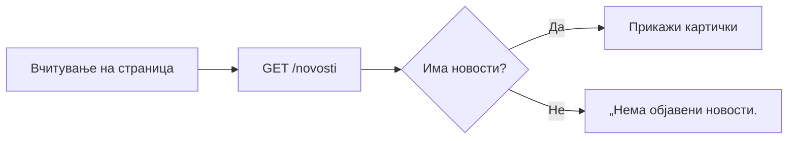
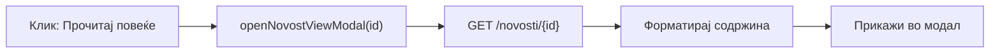

# novosti.html

`novosti.html` е самостојна HTML страница одвоена од `index.html`, наменета исклучиво за прикажување на написите и објавите на болницата. За разлика од главната страница — која ги вчитува сите секции одеднаш — новостите живеат во свој фајл за да не го успоруваат почетното вчитување на порталот. Корисникот гледа листа на картички со наслов, краток извадок и датум на објава. Клик на „Прочитај повеќе" отвора модал со целосната содржина на написот — форматиран текст, слики, галерија и евентуално вграден видео. Нема пренасочување на нова страница; сè се случува во ист прозорец.

Иако е посебен фајл, страницата го дели истиот визуелен слој `(style.css)` и истиот механизам за сесии `(session.js)`со остатокот од порталот. Тоа значи дека корисникот останува најавен кога преминува на оваа страница, а изгледот е идентичен со главниот портал. Содржината се вчитува динамички при секоја посета преку `GET /novosti` — директорот може да објавува нови написи преку административниот панел, без да се допира кодот на страницата.

> Поврзано: [Преглед на frontend](../overview.md) · [Страници](../pages.md) · [`index.html`](index-html.md) · [API: новости](../../backend/api/novosti.md)

***

## 1. Што прави страницата <a href="#id-1-sto" id="id-1-sto"></a>

Страницата има две главни задачи: да ги прикаже сите новости во форма на листа од картички (наслов, слика, датум, автор и краток извадок) и да ја отвори целата содржина на избраната објава во модал кога корисникот ќе кликне `„Прочитај повеќе"`. Нема пренасочување — модалот се отвора во ист прозорец, над листата. Страницата е јавно достапна и не бара најава. До неа се доаѓа преку линкот „Новости" во главното мени, или директно преку URL.

Може да се отвори и **директен линк до една објава** преку URL параметар `?id=`:

```
novosti.html?id=12
```

Доколку id е присутен при вчитувањето, script.js автоматски го повикува `GET /novosti/12` и го отвора соодветниот модал уште пред корисникот да стигне да скрола — корисно за споделување на конкретни написи преку е-пошта или социјални мрежи.

***

## 2. Како е составена <a href="#id-2-struktura" id="id-2-struktura"></a>

| Дел                  | Улога                                                                                                                                                         |
| -------------------- | ------------------------------------------------------------------------------------------------------------------------------------------------------------- |
| `<header>`           | Лого на болницата и линк „← Вратете се на главната страница" — навигација назад без копчето Back на прелистувачо                                              |
| `#novosti-list`      | Контејнер во кој се динамички рендерираат картичките со новости по вчитување на GET /novosti                                                                  |
| `#novost-view-modal` | Mодал за приказ на целосната содржина на избрана objava — текст, слики, галерија, видео                                                                       |
| `style.css`          | Заеднички визуелен слој со остатокот од порталот; гарантира конзистентен изглед без дупликат CSS                                                              |
| `session.js`         | Управување со сесии — корисникот останува најавен и на оваа страница                                                                                          |
| inline `<script>`    | Целата апликациска логика на страницата: fetch на новости, рендерирање на картички, отворање модал, иницијализација на галерија и автоматско отворање по ?id= |

> За разлика од другите страници, целата JavaScript логика тука е напишана **во самата датотека** (inline `<script>`), а не во `script.js`. Така страницата е независна и полесна за разбирање. Дел од стиловите се исто така inline во `<head>` (хедерот и насловите).

**API адресата** се одредува автоматски при вчитување на страницата: ако window.location.hostname е localhost или празна низа (отворање преку file://), скриптата го користи http://localhost:8000; во сите останати случаи — production, staging, или кој било облак домен — ја користи адресата на серверот на кој е хостирана страницата. Тоа значи дека истиот код работи и локално за време на развојот и во живо без никаква промена на конфигурацијата.



***

## 3. Листа на новости (картички) <a href="#id-3-lista" id="id-3-lista"></a>

Веднаш по вчитувањето страницата праќа `GET /novosti` и го рендерира одговорот како листа на картички. За секоја објава се генерира картичка која содржи: насловна слика (доколку е прикачена), наслов, датум и автор, краток извадок — првите 150 знаци од содржината со отстранети HTML тагови — и копче „Прочитај повеќе". Отстранувањето на HTML таговите се прави на клиентска страна преку innerText, за да не се прикаже сурова разметка во прегледот.



Ако `GET /novosti` врати празна листа, во `#novosti-list` се прикажува неутрална порака „Нема објавени новости." наместо празен контејнер. Доколку барањето не успее — мрежна грешка или неочекуван статус код од серверот — на истото место се прикажува порака за грешка во црвена боја, за да биде јасно дека проблемот не е во содржината, туку во комуникацијата со backend-от.

***

## 4. Преглед на објава (модал) <a href="#id-4-modal" id="id-4-modal"></a>

Клик на `„Прочитај повеќе"` ја повикува `openNovostViewModal(id)`. Модалот се отвора веднаш и прикажува „Вчитувам..." додека во позадина се праќа `GET /novosti/{id}`. Кога одговорот ќе пристигне, модалот се пополнува со насловна слика, текст на објавата, галерија и видео — доколку се прикачени. Сликите од галеријата не се вчитуваат при отворање на страницата, туку дури кога корисникот го отвора конкретниот модал.



Модалот се затвора со копчето „×" (`closeNovostViewModal()`).

***

## 5. Слики, галерија и видео <a href="#id-5-mediumi" id="id-5-mediumi"></a>

Секоја објава може да содржи три типа компоненти:

| Компоненти         | Поле            | Како се прикажува                                              |
| ------------------ | --------------- | -------------------------------------------------------------- |
| Главна слика       | `slika_path`    | Голема слика на врвот од објавата                              |
| Дополнителни слики | `slike_extra[]` | Галерија со thumbnails; клик отвора lightbox со ‹ › навигација |
| Видео              | `video_url`     | YouTube / Vimeo преку , или .mp4 фајл преку \<video>           |

Релативните патеки до слики се претвораат во полн URL преку `/static/...` на серверот.

> **Видео детали:** YouTube линковите се претвораат во `youtube-nocookie.com/embed/...` со `referrerpolicy="origin"`. Тоа спречува „YouTube Error 153" кога страницата е отворена локално преку `file://`.

***

## 6. Безбедност (sanitize на HTML) <a href="#id-6-bezbednost" id="id-6-bezbednost"></a>

Содржината на новостите може да содржи HTML — пишуван рачно или генериран од AI. Пред прикажување во модалот, текстот поминува низ `sanitizeHtml()`, која го отстранува сè што може да биде опасно:

* тагови: `script`, `iframe`, `style`, `object`, `embed`, `form`, `input`, `button`, `link`, `meta`,
* сите `on*` атрибути (на пр. `onclick`),
* `href` и `src` вредности што почнуваат со `javascript`:

Дозволени се само безбедни тагови за форматирање: `p`, `br`, `strong`, `em`, `h1`–`h6`, `ul`/`ol`/`li`, `a`, `blockquote`.

> Останати се само тагови за форматирање: p, br, strong, em, h1–h6, ul, ol, li, a, blockquote. Ова е клиентска одбрана од XSS — дури и ако директорот внесе малициозен код, тој нема да се изврши во прелистувачот на корисникот.

***

## 7. Како изгледа во живо <a href="#id-7-zivo" id="id-7-zivo"></a>

Подолу е приказ во **CodePen стил** — лево го гледаш изворниот код во табови (HTML / JS), а во „Резултат" е вистинската страница вградена во живо од серверот.



```html
<header class="novosti-page-header">
  <div class="container">
    <div class="logo">
      <span class="red-cross">+</span>
      <h1>Новости поврзани со ЈЗУ Клиничка Болница Штип</h1>
    </div>
    <a href="index.html">← Вратете се на главната страница</a>
  </div>
</header>

<main class="section novosti-section">
  <div class="container">
    <p class="novosti-subtitle">Најнови информации за нашата болница, и пациенти</p>
    <div id="novosti-list" class="novosti-grid">
      <div class="loading">Се вчитуваат новости... </div>
    </div>
  </div>
</main>

<!-- Модал за приказ на цела објава -->
<div id="novost-view-modal" class="modal">
  <div class="modal-content modal-content-wide">
    <span class="close" onclick="closeNovostViewModal()">&times;</span>
    <div id="novost-view-content"></div>
  </div>
</div>

<script src="session.js"></script>
```



```javascript
// Адресата на API-то се одредува автоматски (локално vs продакшн)
var API_BASE = (function() {
  var proto = window.location.protocol;
  var host = window.location.hostname;
  if (proto === 'file:' || host === 'localhost' || host === '127.0.0.1' || host === '') {
    return 'http://localhost:8000';
  }
  return proto + '//' + window.location.host;
})();

// 1) Вчитај ги сите новости и прикажи картички
fetch(API_BASE + '/novosti')
  .then(function(r) { return r.json(); })
  .then(function(items) {
    renderNovosti(items);
    // Ако URL има ?id=, отвори ја таа новост веднаш
    var openId = new URLSearchParams(window.location.search).get('id');
    if (openId) openNovostViewModal(parseInt(openId, 10));
  });

// 2) Прикажи картичка за секоја новост (наслов, слика, извадок)
function renderNovosti(items) {
  var listEl = document.getElementById('novosti-list');
  listEl.innerHTML = '';
  items.forEach(function(n) {
    var excerpt = stripHtmlForExcerpt(n.sodrzina || '').substring(0, 150);
    var card = document.createElement('div');
    card.className = 'novosti-card';
    card.innerHTML =
      '<h3>' + n.naslov + '</h3>' +
      '<p>' + excerpt + '...</p>' +
      '<button onclick="openNovostViewModal(' + n.id + ')">Прочитај повеќе</button>';
    listEl.appendChild(card);
  });
}

// 3) Отвори цела објава во модал
function openNovostViewModal(id) {
  fetch(API_BASE + '/novosti/' + id)
    .then(function(r) { return r.json(); })
    .then(function(n) {
      // ... форматирање на текст, слики, галерија, видео ...
      document.getElementById('novost-view-modal').style.display = 'block';
    });
}
```







> Серверот е на бесплатен план, па првото вчитување може да потрае до една минута додека се „разбуди". Освежи ако страницата е празна. Кодот горе е скратен за прегледност — целосниот извор е во `frontend/novosti.html`.

***

## 8. Пробај ги функциите <a href="#id-8-probaj" id="id-8-probaj"></a>

Страницата ги повикува следните endpoints. Кликни **„Test it"** за вистински одговор од серверот.

**Сите новости** — `GET /novosti`

> **Тестирај го овде →** [GET `/novosti`](../../backend/api/novosti.md#3-list)

**Една новост по ID** — `GET /novosti/{id}`

> **Тестирај го овде →** [GET `/novosti/{novost_id}`](../../backend/api/novosti.md#4-edna)

***

## 9. Код во CodePen <a href="#id-9-codepen" id="id-9-codepen"></a>

Подолу е страницата за новости како **интерактивен CodePen** — можеш да го разгледаш кодот (HTML / CSS / JS) и веднаш да го видиш резултатот:



***

Следно: [`index.html`](index-html.md) · [`oddel-details.html`](../pages.md#3-oddel) · [API: новости](../../backend/api/novosti.md)
