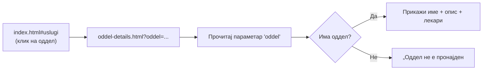
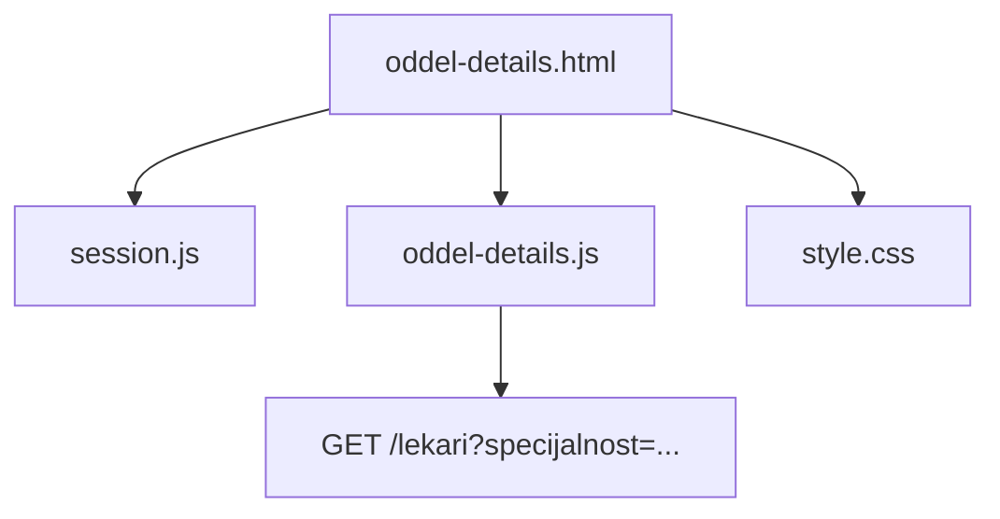
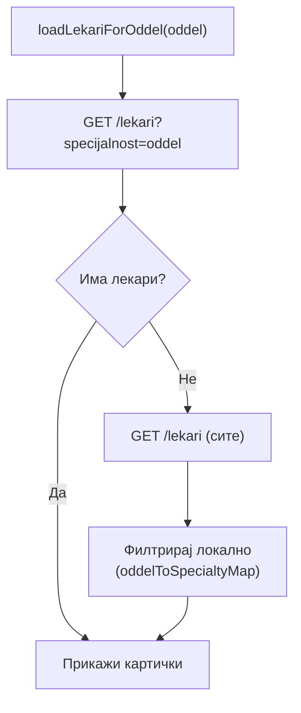
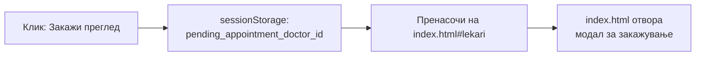

# oddel-details.html

oddel-details.html прикажува детали за еден медицински оддел — naziv, опис и листа на лекари кои работат во таа специјалност. Страницата е динамичка: нема фиксна содржина во HTML-от, туку сè се гради при секое вчитување врз основа на URL параметарот ?oddel=. Кога корисникот кликне на услуга на главната страница, прелистувачот го отвора: `oddel-details.html?oddel=Кардиологија`

> Страницата го чита вредноста на oddel од URL-то, ги праќа две API барања — GET /uslugi?oddel=Кардиологија за описот и GET /lekari?specialty=Кардиологија за листата на лекари — и ја составува страницата со добиените податоци.

Придобивката е практична: сите одделни го користат ист шаблон. Нов оддел се додава само во базата, без нова HTML датотека и без промена на кодот.

> Поврзано: [Преглед на frontend](../overview.md) · [Страници](../pages.md) · [`index.html`](index-html.md) · [API: лекари](../../backend/api/lekari.md)

***

## 1. Што прави страницата? <a href="#id-1-sto" id="id-1-sto"></a>

Кога корисникот ќе кликне на некоја услуга на главната страница, прелистувачот го отвора oddel-details.html со параметарот ?oddel= во URL-то. Страницата го чита тој параметар и ги вчитува следните три дела:

* **Име на одделот** на одделот — прикажано на врвот на страницата, читано директно од URL-параметарот.
* **Опис** — текст за тоа со што се занимава одделот, вчитан преку `GET /uslugi?oddel=....`. Ако одделот нема внесен опис во базата, овој дел се прескокнува.
* **Листа на лекари** — сите лекари чија специјалност одговара на одделот, вчитани преку GET /lekari?specialty=.... За секој лекар се прикажува картичка со слика, ime, специјалност и копче за закажување преглед.

Страницата е јавно достапна, корисникот не мора да е најавен за да ја прегледа содржината. Копчето за закажување преглед, меѓутоа, го пренасочува кон главната страница и го отвора модалот за најава ако корисникот сè уште не е автентициран.

***

## 2. Како се отвора (URL параметар) <a href="#id-2-url" id="id-2-url"></a>

Одделот се пренесува преку URL параметарот ?oddel=. Кога корисникот кликнува на услуга од главната страница, script.js конструира URL во форматот:

```
oddel-details.html?oddel=Кардиологија
```

При вчитување, страницата го чита параметарот со new `URLSearchParams(window.location.search).get('oddel')`. Ако параметарот недостасува или е празен, страницата прикажува порака за грешка наместо да праша API. Вредноста на `oddel` се користи директно во двете API барања — за опис на одделот и за листата на лекари — па URL-то во исто време служи и како идентификатор на содржината и како аргумент за пребарување.



***

## 3. Како е составена <a href="#id-3-struktura" id="id-3-struktura"></a>

За разлика од `novosti.html`каде логиката е вградена во inline `<script>`, оваа страница ја издвојува во посебен фајл:

| Фајл                 | Улога                                                                     |
| -------------------- | ------------------------------------------------------------------------- |
| `oddel-details.html` | HTML структура и локални стилови за приказ на лекарски картички           |
| `oddel-details.js`   | Целата логика — читање на `?oddel=`, вчитување опис и лекари, рендерирање |
| `style.css`          | Заеднички визуелен слој со остатокот од порталот                          |
| `session.js`         | Управување со сесии, доколку корисникот е најавен, тоа останува важечка   |

Главни елементи на страницата:

* `#oddel-title` — насловот на страницата, пополнет со вредноста од `?oddel=`,
* `#oddel-description-text` — опис на одделот, вчитан од `GET /uslugi`,
* `#lekari-list-details` — kонтејнер во кој се рендерираат картичките на лекарите,
* копче **„← Назад кон услуги"** — статичен линк кон index.html#uslugi.



***

## 4. Опис на одделот <a href="#id-4-opis" id="id-4-opis"></a>

Описите на одделите не доаѓаат од backend — се зачувани директно во oddel-details.js, во JavaScript објект oddelDescriptions. Клучот е името на одделот, вредноста е текстот:

```
const oddelDescriptions = {
  "Кардиологија": "Дијагностика и лекување на болести на срцето и крвните садови...",
  "Педијатрија": "Здравствена заштита на деца и новороденчиња...",
  // ...
  "default": "Медицинска нега и третман во специјализиран оддел."
};
```

Ако одделот не постои во објектот, се прикажува default описот. Ова е свесна одлука — описите се статичен текст кој ретко се менува, па нема потреба за дополнително API барање само за нивно вчитување.

> Описите се на клиентската страна (не доаѓаат од backend) — тоа е свесна одлука бидејќи се статичен текст што ретко се менува.

***

## 5. Листа на лекари <a href="#id-5-lekari" id="id-5-lekari"></a>

Лекарите се вчитуваат во два чекори, поради можна неусогласеност меѓу името на одделот во URL-то и вредноста на specialty полето во базата.

1. Прво се праќа `GET /lekari?specijalnost=ИмеНаОддел` со точното име од параметарот.
2. Ако одговорот е празна листа, страницата не застанува — ги вчитува сите лекари преку `GET /lekari` и ги филтрира локално преку објектот `oddelToSpecialtyMap`, кој ги поврзува имињата на одделите со нивните варијации во базата:

```
const oddelToSpecialtyMap = {
  "Хирургија": "Општа хирургија",
  "Детска хирургија": "Педијатриска хирургија",
  // ...
};
```

Ова решение го покрива случајот кога истиот оддел е именуван различно на различни места — во URL-то „Хирургија", а во базата „Општа хирургија". Без ова mapping, листата на лекари би биле празна иако постојат соодветни лекари.



Лекарите се прикажуваат по **8 одеднаш**. Копчето **„Прикажи повеќе"** ги вчитува следните 8, а **„Прикажи помалку"** се враќа на почетниот приказ — без ново API барање, бидејќи сите лекари се веќе вчитани во меморија при отворањето на страницата. Мрежата на картички автоматски го прилагодува распоредот според бројот на прикажани лекари: 1, 2, 3 или 4 и повеќе во ред, со центрирање кога бројот е помал од максималниот.

***

## 6. Закажување преглед <a href="#id-6-zakazuvanje" id="id-6-zakazuvanje"></a>

Секоја лекарска картичка содржи копче `„Закажи преглед"`. Бидејќи модалот за закажување се наоѓа на `index.html`, а не на оваа страница, кликот не го отвора директно — наместо тоа, го зачувува `doctor_id` во `sessionStorage` под клучот `pending_appointment_doctor_id` и го пренасочува корисникот на `index.html#lekari`. При вчитување, script.js на главната страница го чита тој клуч и автоматски го отвора модалот за закажување за соодветниот лекар, без корисникот да мора повторно да го бара.

На кратко:

1. ID-то на лекарот се зачувува во `sessionStorage` (`pending_appointment_doctor_id`),
2. корисникот се пренасочува на `index.html#lekari`,
3. таму главната страница го отвора модалот за закажување за тој лекар.



> Самото закажување не се случува тука — оваа страница само го „предава" избраниот лекар на главната страница, која ја има целата логика за термини.

***

## 7. Како изгледа во живо <a href="#id-7-zivo" id="id-7-zivo"></a>

Подолу е вградена страницата за **Кардиологија** од серверот:



> Серверот е на бесплатен план, па првото вчитување може да потрае до една минута додека се „разбуди". Освежи ако страницата е празна.

***

## 8. Пробај ги функциите <a href="#id-8-probaj" id="id-8-probaj"></a>

Страницата ги вчитува лекарите преку endpoint-от за лекари. Кликни **„Test it"** за вистински одговор од серверот (пробај со параметар `specijalnost=Кардиологија`).

**Лекари по специјалност** — `GET /lekari`

> **Тестирај го овде →** [GET `/lekari`](../../backend/api/lekari.md#3-lista)

***

Следно: [`index.html`](index-html.md) · [`novosti.html`](novosti-html.md) · [API: лекари](../../backend/api/lekari.md)
