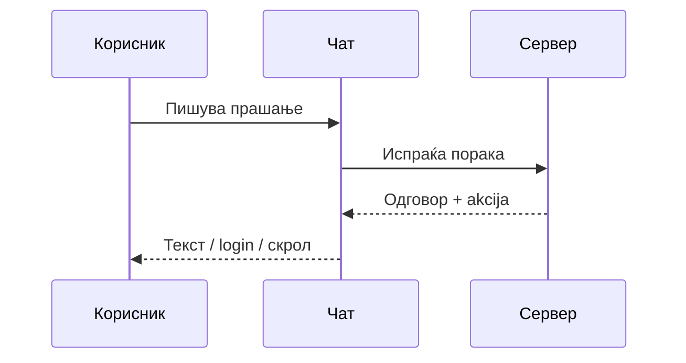
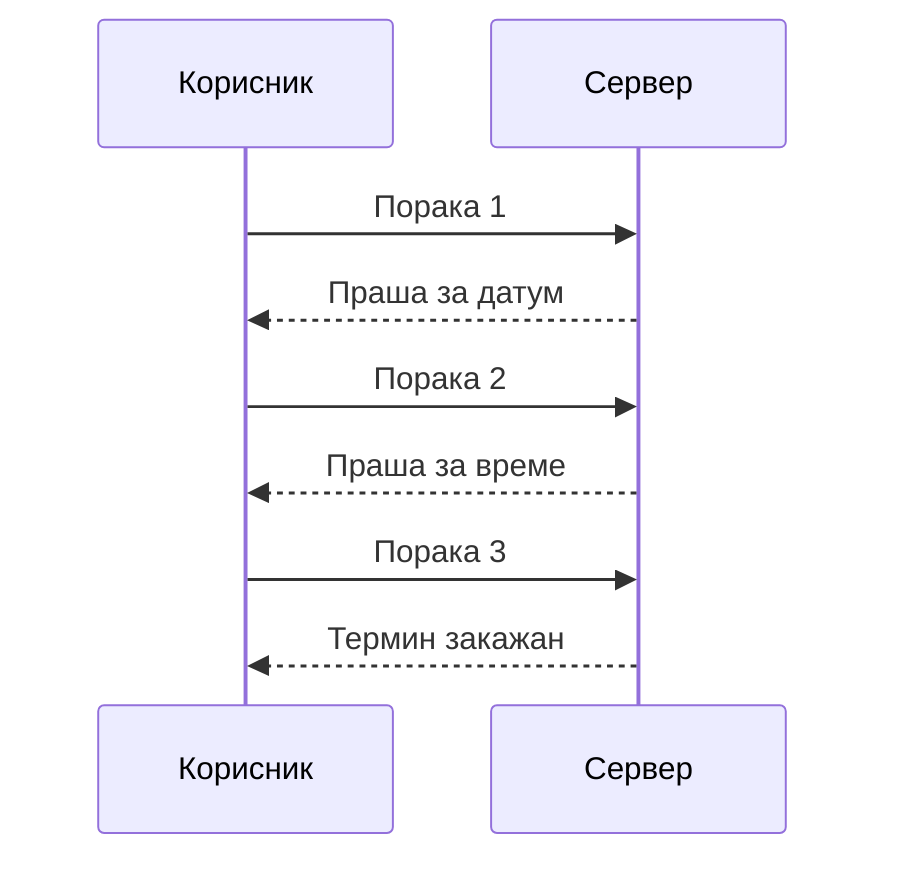

# AI асистент

Овој водич објаснува што може AI-асистентот — чат-виџетот достапен на сајтот — да направи за пациенти и посетители. Наместо да пребарувате низ менија или да пополнувате посебна форма за секое дејство, едноставно пишувате што ви е потребно со обични зборови, исто како во секојдневен разговор, а асистентот сам ја препознава намерата и или директно ја изврши соодветната акција, или ви дава точен одговор. На пример, наместо да отворате посебна форма за [закажување преглед](pacient/zakazuvanje-termin.md), доволно е да напишете нешто од типот „Сакам преглед кај кардиолог следната недела" — асистентот сам ве проведува низ останатите детали (датум, време), исто како што е објаснето подолу во делот за повеќестепен разговор.

Достапен е и за [посетители](posetitel.md) без отворена сметка, и за најавени пациенти — со таа разлика што дејствата специфични за пациент ([закажување](pacient/zakazuvanje-termin.md), [откажување преглед](pacient/moe-dosie-i-termini.md), [оставање оцена](pacient/ocenuvanje-pregled.md)) бараат претходна [најава](pacient/registracija-i-najava.md), додека општите информации (работно време, лекари, услуги) се достапни за секого, без исклучок.

> AI е достапен **само на `index.html`**, не на страницата за новости или оддел.

## Како да го отворите

Копчето на AI-асистентот е „пловечко" — секогаш останува на истото место, долу десно, без разлика колку скролувате надолу низ главната страница. Не треба да барате низ мени или подмени за да го најдете. Eдноставно е секогаш на екранот, видливо од момента кога ја отворите страницата.

Чекорите за отворање и користење се секогаш исти, без разлика дали сте гостин или најавени:

1. Кликнете на копчето — се отвора прозорец за разговор. (иста структура, дизајн како останатите апликации кој ги користите за разговор)
2. Напишете прашање или барање со обични зборови, на кирилица или латиница — нема посебна команда која треба да се запамети. На пример, едноставно напишете „Кое е работното време на болницата?" исто како би прашале вработен на шалтер, без посебна форма за тоа.
3. Притиснете Испрати, или едноставно Enter на тастатурата.
4. Прозорецот го затворате со X во неговиот агол, или со повторен клик на истото копче — затворањето не го губи разговорот, само го крие прозорецот од екран; разговорот останува таму каде застанал.

Асистентот моментално е достапен само на главната страница на сајтот, не и на посебните страници за новости или за преглед на оддел — тие се самостојни страници, надвор од истата структура во која е вграден виџетот.

> Поврзано: [Сајт и навигација — главна страница](sajt-i-navigacija.md) · [novosti.html](../tekhnichka-dokumentacija/frontend/pages/novosti-html.md) (нема AI таму)

## Што може да правите (зависи од улога)

Можностите зависат од тоа дали сте посетител, пациент, лекар или директор — системот сам ја препознава улогата при секое прашање, без да треба сами да наведете кој сте. Препознавањето е автоматско: ако сте најавени, вашиот идентитет патува заедно со секое прашање кон асистентот, а тој според тоа одлучува кои дејства воопшто да ви понуди.

1. Како [посетител](posetitel.md), без отворена сметка, можете да прашате за работно време, лекари по оддел или специјалност, и услуги на болницата — општи информации, достапни за секого, без исклучок. На пример: „Кои кардиолози работат во болницата?" или „Дали работите во сабота?"
2. Како најавен пациент, дополнително можете да [закажете преглед](pacient/zakazuvanje-termin.md), да [откажете](pacient/moe-dosie-i-termini.md), да [оставите оцена](pacient/ocenuvanje-pregled.md) за завршен преглед, и да прашате за свои претстојни или минати прегледи — на пример: „Кога ми е следниот преглед?" или „Откажи го прегледот за утре."
3. Како [лекар](lekar/najava-i-panel.md), асистентот ви дава пристап до сопствениот [распоред и картон](lekar/raspored-i-karton.md) за избран датум или период, до целосниот картон на конкретен пациент (дијагнози, терапии, забелешки од сите прегледи), и можност директно низ разговор да означите преглед како завршен — на пример: „Покажи ми го картонот на Иван Ивановски." Ако постојат повеќе пациенти со исто име, асистентот бара дополнително прецизирање пред да одговори.
4. Како [директор](administracija.md), преку разговор можете да објавите вест, да распоредите или измените дежурство (на пример: „Стави го д-р Петров на дежурство во сабота од 8 до 20 часот"), и да ги прегледате апликантите пријавени за конкретен оглас за работа — сè без да треба да отворате административен панел со форми.

За секое дејство специфично за пациент — закажување, откажување преглед, оставање оцена — задолжително треба да сте најавени; асистентот не може да изврши такво дејство во име на гостин без профил, исто како и преку обичните форми на сајтот. Подетално: [Регистрација и најава](pacient/registracija-i-najava.md).

## Што не може да направи

1. Асистентот не измислува одговори. Секој податок за лекари, термини или дежурства доаѓа директно од базата на болницата во моментот на прашањето — не од претпоставка или генерички текст. Кога треба да избере оддел или специјалност, бира исклучиво од постоечкиот список во базата, никогаш не „измислува" нов. Исто така, не е општ chatbot — одговара само на прашања поврзани со порталот и услугите на болницата.
2. Повеќестепен разговор - Асистентот памти контекст во рамки на тековниот разговор, па закажување оди низ неколку чекори наместо едно единствено барање. На пример:

* Вие: „Сакам да закажам преглед кај д-р Захариев."
* Асистент: „На кој датум?"
* Вие: „10 јуни."
* Асистент: „Во кое време?"
* Вие: „10 часот." — асистентот го завршува закажувањето, со истата потврда на е-пошта како и преку [обичната форма](pacient/zakazuvanje-termin.md).

3. Ако разговарате како гостин, без претходна најава, и побарате нешто за коешто е потребна најава — на пример закажување — асистентот ве известува за тоа директно во разговорот и обично сам ве пренасочува кон [екранот за најава](pacient/registracija-i-najava.md). По успешна најава, целиот претходен разговор автоматски продолжува во вашата трајна историја, без да треба да повторувате ништо од тоа што веќе сте го кажале како гостин.

## Историја на разговори

Ако сте најавени — пациент или лекар — секој разговор со асистентот останува трајно зачуван, и можете да му се вратите дури и по затворање на прелистувачот или на самиот сајт. Во заглавието на чат-прозорецот постои преглед на сите претходни разговори, подредени според последна активност, секој со кратко наслов (на пример „Кардиологија — лекари"). Од таму можете да отворите било кој поранешен разговор и да продолжите токму од местото каде застанал, да започнете нов празен разговор, или трајно да избришете поранешен разговор — без можност за враќање по бришење.

Гости немаат таква историја: штом ја затворите страницата без да се најавите, тековниот разговор како гостин се губи, освен ако во меѓувреме не се најавите и со тоа го пренесете во трајна историја

> За програмери: [AI чат виџет (frontend)](../tekhnichka-dokumentacija/frontend/ai-chat-widget.md) · [API — AI Agent](../tekhnichka-dokumentacija/backend/conventions/ai-chat.md) · [AI асистент — преглед](../tekhnichka-dokumentacija/backend/overview/)

***

Следно: [Често поставувани прашања](https://github.com/eftimovdaniel/Klinicka_Bolnica/blob/main/docs/users/cesto-prasanja.md) · [Почетна на водичот](users.md)
