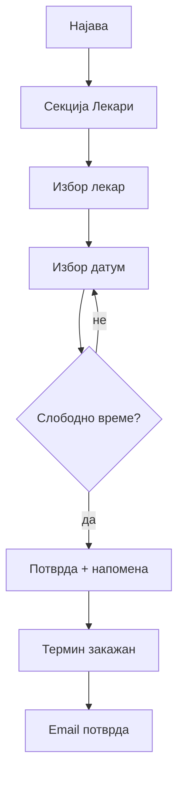

# Закажување преглед (пациент)

Ова упатство е наменето за пациенти и посетители на сајтот на Клиничка Болница — Штип, не за програмери. Тука нема технички термини, код или податочни структури — само објаснување како да закажете преглед, како да го [следите](moe-dosie-i-termini.md) и како да [оставите оцена](ocenuvanje-pregled.md).

## Прво сметка, потоа регистрација

За да закажете преглед, потребна е сметка — нема закажување како гостин, без претходна регистрација, исто како што нема ниту пристап до „Мое досие", оставање оцена, или било која друга функција наменета за пациенти. Редоследот е секогаш истиот: регистрирате се еднаш, потоа се најавувате, и веднаш потоа имате пристап до закажување преглед и до сите останати функции поврзани со вашиот профил. Самата постапка за регистрација и најава — формата, полињата, што се случува при заборавена лозинка — е подетално објаснета во Регистрација и најава.

На пример, ако сте нов пациент и сакате да закажете преглед кај кардиолог, првиот чекор не е делот „Лекари", туку „Најави се!" — без отворена сметка, формата за закажување едноставно не е достапна, без разлика колку едноставно изгледа самото закажување. 
Регистрацијата трае само неколку минути и се прави еднаш, потоа сметката важи трајно, и при секоја следна посета — без оглед дали закажувате уште еден преглед или само сакате да проверите минат — потребна е само најава со веќе постоечката е-пошта и лозинка, без повторна регистрација.

## Закажување преглед
Откако сте најавени, преглед закажувате во неколку чекори:
1. Одете во делот „Лекари" на сајтот.
2. Пронајдете го лекарот кој ви е потребен — листата може да се пребарува по име, презиме или специјалност, или едноставно да се прелиста целосно.
3. Кај избраниот лекар, изберете опција за закажување преглед.
4. Изберете датум — системот веднаш ви прикажува кои термини на тој ден се веќе зафатени, а кои слободни.
5. Изберете слободен термин од понудените.
6. По желба, додадете кратка напомена за лекарот — на пример причината за прегледот или симптом што сакате однапред да го спомнете. Полето е опционално, а лекарот го гледа заедно со останатите податоци за прегледот.
7. Потврдете. Вашите име, презиме, телефон и е-пошта веќе се познати од профилот — не треба повторно рачно да ги внесувате.

## Важни правила

| Правило | Објаснување |
|---------|-------------|
| **Без викенди** | Во **сабота и недела** не се закажуваат прегледи — изберете работен ден |
| **Зафатен термин** | Ако времето е веќе зафатено, изберете друго |
| **Потврда на е-пошта** | По закажување добивате email со лекар, датум и време |

> По успешно закажување, на е-поштата од вашиот профил пристигнува порака за потврда, со лекар, датум и време на прегледот.

## Преку AI асистент

Истото закажување може да се направи и низ разговор со AI асистентот (копчето за чат), без воопшто да ја отворате формата на сајтот. На пример: „Сакам да закажам преглед кај д-р Стојановска на 25-ти јуни во 10 часот." Асистентот, доколку нешто недостасува, сам ве прашува за тоа што му треба — лекар, датум, време — додека не собере сѐ потребно за да го заврши истото закажување како преку формата. И тука важи истото правило: мора да сте најавени како пациент за асистентот реално да го изврши закажувањето во ваше име.  Види [AI асистент](../ai-asistent.md).

## Алтернатива: „Мој Термин"

Покрај директно закажување на сајтот на болницата, преглед може да ви закаже и матичниот лекар преку националната платформа „Мој термин" (`mojtermin.mk`)`, на пример при упат за специјалист. Таков преглед исто се појавува во вашето „Мое досие" откако ќе се најавите — на истиот начин како и секој преглед закажан директно на сајтот.

Доколку сакате практично да го тестирате горенапишаното, може да пробате веднаш:


Следно: [Мое досие и термини](moe-dosie-i-termini.md) · [Оценување](ocenuvanje-pregled.md)
