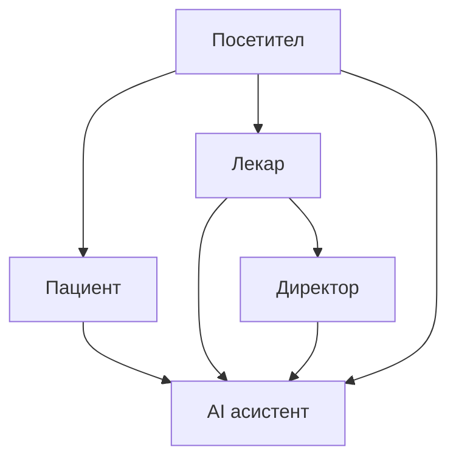

# Почетна

Овој дел од документацијата е наменет за сите корисници на порталот — пациенти, лекари, директор и посетители кои сакаат детално да научат како функционира сајтот. Без програмски код и API детали, чекор по чекор е објаснето сè што ви треба за секојдневна работа со системот.

Ќе научите како да се движите низ сајтот и неговата навигација, што може да се прави без најава како посетител, како да се регистрирате и да го креирате своето пациентско досие, како да закажете и да управувате со прегледи кај саканиот лекар, и како да ги прегледате наодите, извештаите и историјата на третмани. Доколку сте лекар или дел од администрацијата, ќе најдете објаснување за вашите панели и алатки за работа, а посебно поглавје е посветено на AI асистентот — како да поставувате прашања и да добивате брзи насоки во секој момент. На крајот, во делот со често поставувани прашања се одговорени најчестите нејаснотии при користење на порталот.

[← Назад на избор](https://github.com/eftimovdaniel/Klinicka_Bolnica/blob/main/docs/users/izbor-dokumentacija.md) · [Техничка документација](../tekhnichka-dokumentacija/tehnicka.md)

> За програмери и технички опис: [Преглед на системот](../tekhnichka-dokumentacija/opshto-za-sistemot/overview.md) · [Backend API](../tekhnichka-dokumentacija/backend/conventions/) · [Frontend](../tekhnichka-dokumentacija/frontend/overview.md)

## Кој водич е за вас?

| Улога         | Опис                                   | Започни тука                                              |
| ------------- | -------------------------------------- | --------------------------------------------------------- |
| **Посетител** | Гледате информации без најава          | [Посетител](posetitel.md)                                 |
| **Пациент**   | Регистрација, закажување, досие, оцени | [Регистрација и најава](pacient/registracija-i-najava.md) |
| **Лекар**     | Распоред, картон, терапија, апарати    | [Најава и панел](lekar/najava-i-panel.md)                 |
| **Директор**  | Новости, огласи, дежурства             | [Администрација](administracija.md)                       |
| **Сите**      | AI асистент во долниот десен агол      | [AI асистент](ai-asistent.md)                             |

***

Следно: [Сајт и навигација](sajt-i-navigacija.md)
