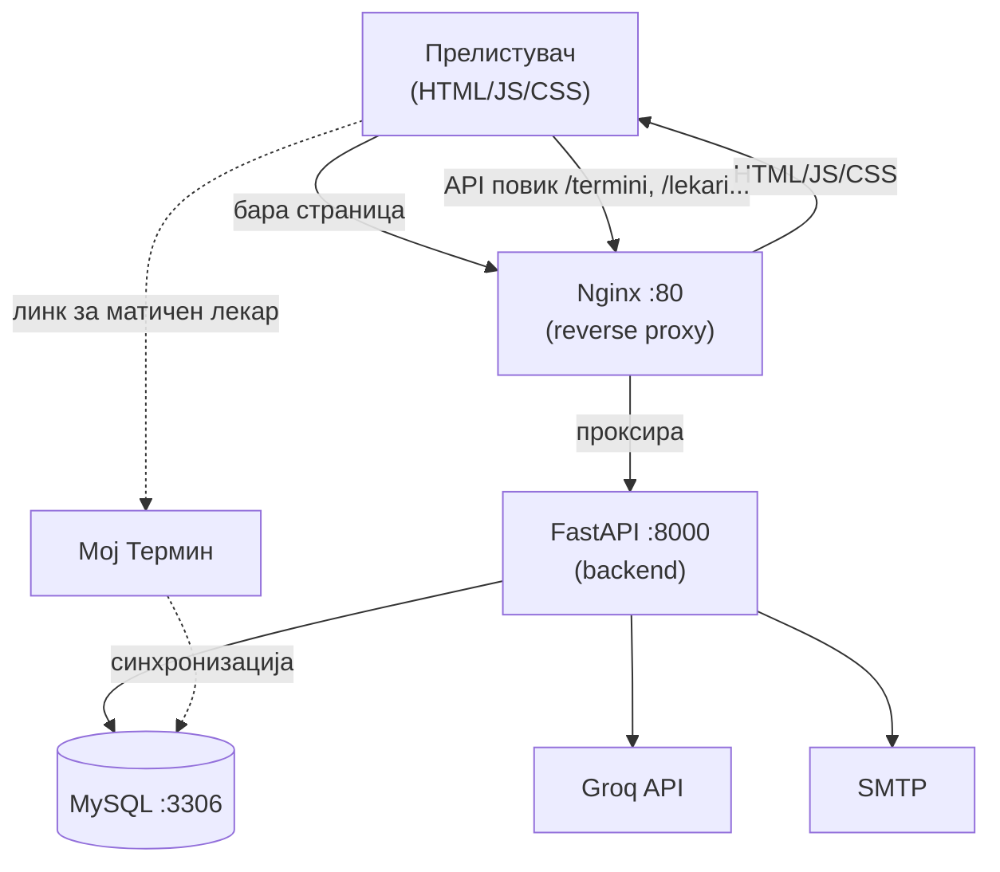
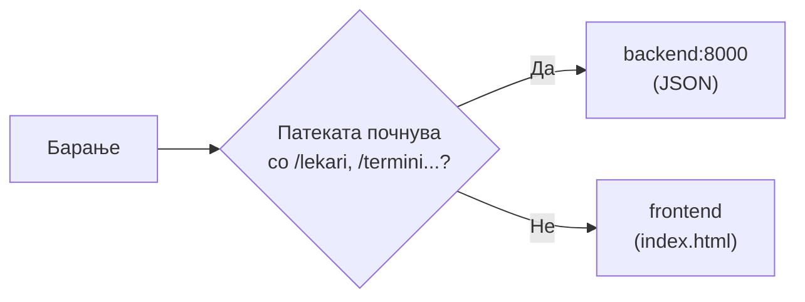
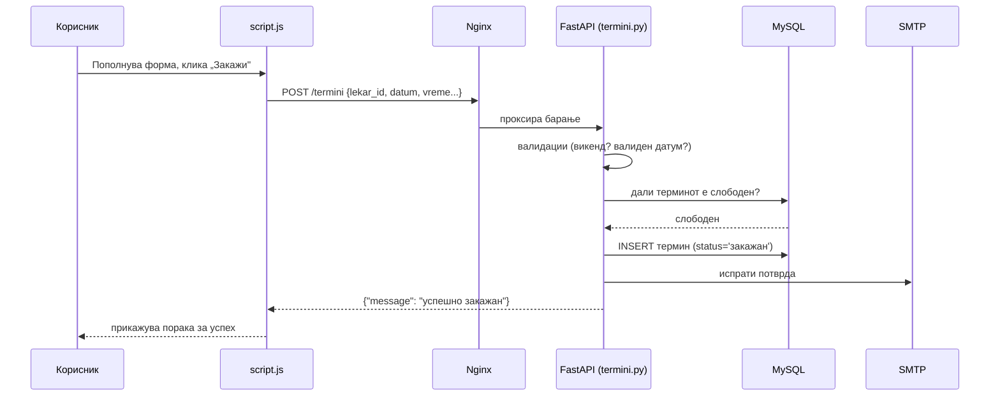
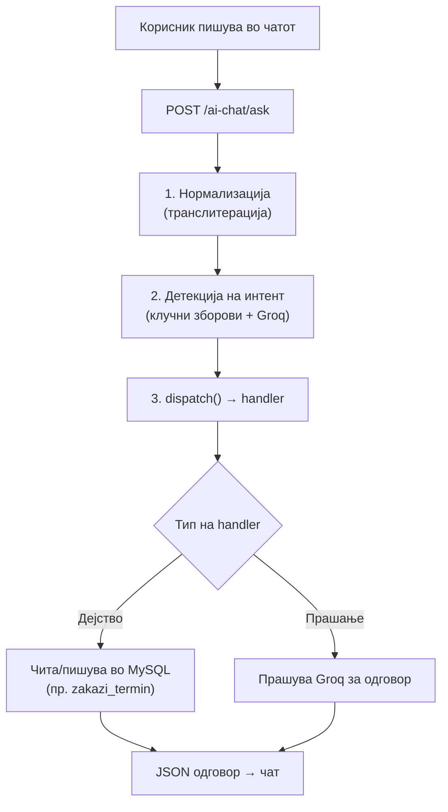
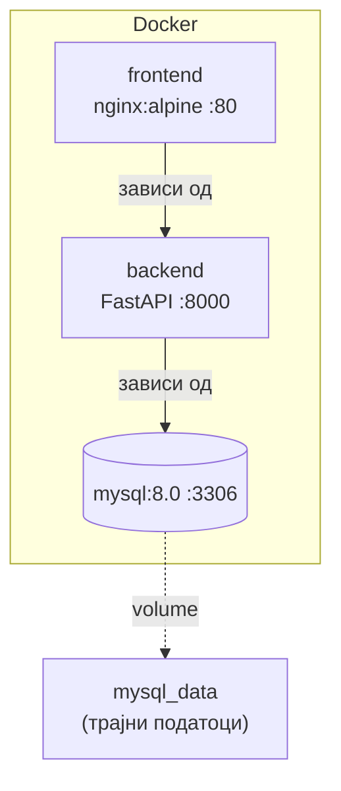

# Архитектура на системот

Овој документ дава детален преглед на **начинот на кој е изграден** информацискиот систем за Клиничка болница – Штип. Наместо да се задржи само на она што корисникот го гледа на екранот, документот навлегува подлабоко — во слоевите од кои е составен системот, во начинот на кој тие меѓусебно комуницираат и во процесите кои се  одвиваат зад завесата во моментот кога корисникот ќе кликне на некое копче.

Архитектурата е поделена на три јасно одделени слоја: **презентациски** (она што корисникот го гледа), **логички** (она што системот го пресметува и обработува) и **податочен** (местото каде сè се чува). Секој слој има своја улога и своја одговорност, а нивната синхронизирана работа е она што го прави системот брз, сигурен и лесен за одржување.
Документот содржи конкретни примери и парчиња код директно преземени од проектот, со цел да се даде јасна и веродостојна слика за тоа како функционира системот во пракса.

## Содржина
* [1. Висок преглед](#1-visok-pregled)
* [2. Зошто ваква архитектура](#2-zoshto-vakva-arhitektura)
* [3. Frontend слој](#3-frontend-sloj)
* [4. Backend слој](#4-backend-sloj)
* [5. База на податоци](#5-baza-na-podatoci)
* [6. Nginx (reverse proxy)](#6-nginx-reverse-proxy)
* [7. Тек на барање — чекор по чекор](#7-tek-na-baranje)
* [8. AI асистент](#8-ai-asistent)
* [9. Сесии и безбедност](#9-sesii-i-bezbednost)
* [10. Docker деплојмент](#10-docker-deploj)

> Поврзани страници: [Преглед на системот](overview.md) ·
> [Инсталација](installation.md) · [Конфигурација](configuration.md) ·
> [База на податоци](../backend/the_database.md) ·
> [AI асистент](../backend/ai-assistant/overview.md)

```markdown

## 1. Висок преглед
Системот е изграден врз основа на **троставна (three-tier) архитектура**, дополнета со неколку надворешни сервиси кои го прошируваат неговото функционирање. Овој пристап е широко прифатен стандард во современиот веб-развој бидејќи овозможува јасно разделување на одговорностите — секој слој знае точно што е негова задача и не се меша во работата на другите.

| Слој | Технологија | Улога |
|------|-------------|-------|
| **Frontend** | HTML, CSS, JavaScript | Визуелниот интерфејс со кој корисникот директно комуницира во прелистувачот |
| **Backend** | FastAPI (Python) | Срцето на системот — ја обработува бизнис логиката, врши валидации и обработува барања преку FastAPI |
| **База на податоци** | MySQL | Трајно и сигурно чување на сите системски податоци |

### Надворешни сервиси

Покрај внатрешните слоеви, системот се потпира и на три надворешни сервиси кои обезбедуваат напредни функционалности:

| Сервис | Намена |
|--------|--------|
| **Groq** | Погонува AI чат асистентот за комуникација на природен јазик |
| **SMTP** | Испраќање на е-пошта — потврди за термини, известувања и PDF извештаи |
| **Мој Термин** | Интеграција за закажување преку матичен лекар |

### Дијаграм на архитектурата



### Клучен принцип на изолација

Една од најважните архитектурни одлуки во системот е дека **frontend слојот никогаш не комуницира директно со базата на податоци**. Секое дејство на корисникот — без разлика дали тоа е најавување, закажување термин или пребарување на лекари — се остварува преку HTTP барање упатено до backend-от, кој е единствениот дел од системот со директен пристап до MySQL.

Ова разделување носи две клучни предности: базата на податоци останува целосно заштитена од надворешни влијанија, а целата бизнис логика е концентрирана на едно место — во backend-от — каде може лесно да се контролира, тестира и одржува.

---
```

## 2. Зошто ваква архитектура <a id="2-zoshto-vakva-arhitektura"></a>

| Одлука | Зошто |
|--------|-------|
| **Одвоен frontend и backend** | Може да се менува дизајнот без да се дира логиката, и обратно |
| **REST API** | Стандарден начин; истиот backend може да го користи и веб и (во иднина) мобилна апликација |
| **FastAPI** | Брз, автоматски генерира `/docs`, лесна валидација |
| **MySQL** | Релациона база — податоците (лекари, пациенти, термини) се природно поврзани |
| **Nginx reverse proxy** | Една јавна точка; backend не е директно изложен на интернет |
| **Docker** | Истото окружување локално и на сервер — „работи кај мене" = „работи на сервер" |

---

## 3. Frontend слој <a id="3-frontend-sloj"></a>

**Локација:** `frontend/`

Напишан со чист **HTML, CSS и JavaScript** (без React/Angular framework).

| Датотека | Намена |
|----------|--------|
| `index.html` | Главна страница (лекари, закажување, најава) |
| `novosti.html` | Новости |
| `oddel-details.html` | Детали за оддел |
| `script.js` | Главна логика — API повици, календари, форми |
| `session.js` | Сесии (најава, истек, авто-одјава) |
| `ai_chat.js` | AI чат виџет |
| `style.css` | Стилови |

### Како frontend знае каде е backend

Адресата се пресметува автоматски — локално оди на `:8000`, на сервер на истиот
домен (бидејќи Nginx проксира):

```javascript
// frontend/script.js
var API_BASE = (function() {
  var h = window.location.hostname;
  if (!h || h === 'localhost' || h === '127.0.0.1') return 'http://localhost:8000';
  return window.location.protocol + '//' + window.location.host;
})();
```

> Затоа истиот код работи и локално и на сервер — не мора рачно да менуваш URL.

📎 Повеќе за frontend: [Frontend → Преглед](../frontend/overview.md)

---

## 4. Backend слој <a id="4-backend-sloj"></a>

**Локација:** `backend/`

Срцето на системот — FastAPI апликација. Сè почнува од `main.py`.

### Влезна точка: `main.py`

Тука се создава апликацијата и се „вклучуваат" сите routers:

```python
# backend/main.py
from fastapi import FastAPI
from routers import lekari, pacienti, termini, admin, aparati, uslugi, novosti, kariera, ai_chat

app = FastAPI(
    title="Клиничка Болница Штип – API",
    description="API за системот за управување со прегледи, термини и администрација",
    version="1.0",
)

app.include_router(lekari.router)     # /lekari
app.include_router(pacienti.router)   # /pacienti
app.include_router(termini.router)    # /termini
app.include_router(admin.router)      # /admin
app.include_router(aparati.router)    # /aparati
app.include_router(uslugi.router)     # /uslugi
app.include_router(novosti.router)    # /novosti
app.include_router(kariera.router)    # /kariera
app.include_router(ai_chat.router)    # /ai-chat
```

### Routers (по домен)

Секој router е одделна датотека во `backend/routers/` и покрива еден домен:

| Router | Prefix | Домен | API докум. |
|--------|--------|-------|------------|
| `lekari` | `/lekari` | Лекари | [Лекари](../backend/api/lekari.md) |
| `pacienti` | `/pacienti` | Пациенти | [Пациенти](../backend/api/pacienti.md) |
| `termini` | `/termini` | Термини | [Термини](../backend/api/termini.md) |
| `aparati` | `/aparati` | Апарати | [Апарати](../backend/api/aparati.md) |
| `novosti` | `/novosti` | Новости | [Новости](../backend/api/novosti.md) |
| `kariera` | `/kariera` | Огласи | [Кариера](../backend/api/kariera.md) |
| `uslugi` | `/uslugi` | Услуги | [Услуги](../backend/api/uslugi.md) |
| `admin` | `/admin` | Администрација | [Админ](../backend/api/admin.md) |
| `ai_chat` | `/ai-chat` | AI асистент | [AI чат](../backend/api/ai-chat.md) |

### Структура на еден router (шаблон)

Сите routers ја следат истата шема. Пример од `lekari.py`:

```python
# backend/routers/lekari.py
from fastapi import APIRouter, HTTPException
from database import get_connection

router = APIRouter(prefix="/lekari", tags=["lekari"])

@router.get("")                          # GET /lekari
def get_lekari(specijalnost=None):
    conn = None
    try:
        conn = get_connection()          # 1. отвори конекција
        cur = conn.cursor(dictionary=True)
        cur.execute("SELECT ... FROM Doctors")  # 2. SQL
        return cur.fetchall()            # 3. врати JSON
    except Exception as e:
        raise HTTPException(status_code=500, detail=str(e))
    finally:
        if conn and conn.is_connected(): # 4. секогаш затвори конекција
            conn.close()
```

> **Образец што се повторува секаде:** `try` (отвори конекција → SQL →
> врати резултат) / `except` (грешка → HTTPException) / `finally` (затвори
> конекција). Ова гарантира дека конекцијата секогаш се затвора.

### Автоматска API документација

FastAPI **сам** генерира интерактивна документација од кодот:

| URL | Што е |
|-----|-------|
| `/docs` | Swagger UI — пробај ги endpoints во прелистувач |
| `/redoc` | ReDoc — почиста документација за читање |
| `/openapi.json` | Машински-читлива спецификација |

> Не мора рачно да ги пишуваш точните параметри за секој endpoint — отвори
> `/docs` и сè е таму, секогаш ажурно со кодот.

---

## 5. База на податоци <a id="5-baza-na-podatoci"></a>

**Технологија:** MySQL 8.0. Поврзувањето е централизирано во `database.py`.

### Една функција за конекција

Секој router ја вика истата `get_connection()`:

```python
# backend/database.py
def get_connection():
    host = os.getenv("DB_HOST", "localhost")
    user = os.getenv("DB_USER", "root")
    password = os.getenv("DB_PASSWORD", "")
    database = os.getenv("DB_NAME", "Klinicka_Bolnica_Stip")
    port = int(os.getenv("DB_PORT", "3306"))

    kwargs = {
        "host": host, "user": user, "password": password,
        "database": database, "port": port,
        "charset": "utf8mb4",                 # поддршка за кирилица
        "collation": "utf8mb4_unicode_ci",
        "autocommit": False,                  # рачно commit (контрола над трансакции)
    }
    conn = mysql.connector.connect(**kwargs)
    return conn
```

**Зошто е важно:**

- **`utf8mb4`** — за да се чува македонски текст (имиња, дијагнози) без грешки.
- **`autocommit=False`** — промените се зачувуваат само со `conn.commit()`; ако
  нешто падне, не остануваат полу-зачувани податоци.
- **Параметри од `.env`** — никакви лозинки во кодот. Види
  [Конфигурација](configuration.md).
- **SSL поддршка** — за облак бази (на пр. Azure) се вклучува преку `.env`.

### Главни табели

| Табела | Содржина |
|--------|----------|
| `Doctors` | Лекари |
| `patient` | Пациенти (со хеширана лозинка, ЕМБГ) |
| `Termin_pregled` | Прегледи (датум, време, статус) |
| `Aparati`, `Aparati_termini` | Апарати и нивни термини |
| `Novosti` | Новости |
| `Vrabotuvanje` | Огласи за работа |
| `Pregled_feedback` | Оцени |
| `Ai_chat_session`, `Ai_chat_message` | Историја на AI разговори |

📎 Целосен опис: [База на податоци](../backend/the_database.md)

---

## 6. Nginx (reverse proxy) <a id="6-nginx-reverse-proxy"></a>

Во продукција, **Nginx** е „вратарот" — првиот што го прима секое барање на
порт 80 и одлучува: статичка страница или API?

```nginx
# nginx.conf

# API патеки → проксирај кон backend (FastAPI на :8000)
location ~ ^/(lekari|pacienti|termini|admin|aparati|uslugi|novosti|kariera|aplikacija|static|docs|openapi\.json|redoc)(/.*)?$ {
    proxy_pass http://backend:8000;
    proxy_set_header Host $host;
    proxy_read_timeout 120s;        # backend има 120s да одговори
}

# Сè друго → статички фајлови (index.html и сл.)
location / {
    try_files $uri $uri/ /index.html;
}

client_max_body_size 50M;           # upload на слики до 50MB (новости)
```

> ⚠️ **Зошто regex-от мора да биде прв:** ако `/lekari` случајно отиде на
> `location /`, наместо JSON ќе се врати `index.html` и апликацијата ќе „пукне".
> Затоа API патеките се фаќаат **пред** општото правило.



---

## 7. Тек на барање — чекор по чекор <a id="7-tek-na-baranje"></a>

### Пример A: Закажување на термин



**Истото во код:**

```javascript
// 1. Frontend (script.js) праќа барање
const res = await fetch(API_BASE + '/termini', {
  method: 'POST',
  headers: { 'Content-Type': 'application/json' },
  body: JSON.stringify({ lekar_id, ime, prezime, datum, vreme, email })
});
```

```python
# 2. Backend (routers/termini.py) го обработува
@router.post("")
async def create_termini(request: Request):
    data = await request.json()
    # ... валидација на датум (без викенди) ...
    if appointment_date.weekday() >= 5:
        raise HTTPException(status_code=400,
            detail="Не се закажуваат прегледи во сабота и недела.")
    # ... провери дали е слободно, потоа зачувај ...
    db_cursor.execute("INSERT INTO Termin_pregled (...) VALUES (...)")
    conn.commit()
    return {"message": "Терминот е успешно закажан!"}
```

### Пример B: Отворање на главната страница

```
1. Корисник отвора https://domen.mk/
2. Nginx сервира index.html (од frontend/)
3. Прелистувач вчитува script.js, style.css, session.js
4. script.js → GET /lekari
5. Nginx проксира → backend чита Doctors → враќа JSON
6. Frontend ги исцртува лекарите
```

---

## 8. AI асистент <a id="8-ai-asistent"></a>

AI делот е одделен модул во `backend/ai/`, организиран по **улоги** и **интенти**
(намери). Секоја намера = посебна датотека со логика.

```
backend/ai/
├── _kernel/      # заедничко јадро (детекција, Groq, транслитерација)
├── pacient/      # zakazi_termin, otkazi_termin, prenesi_termin...
├── lekar/        # moj_raspored, karton_pacient, zapishi_terapija...
├── direktor/     # objavi_vest, kreiraj_oglas, promeni_dezurstvo...
└── opsto/        # bolnica_info, faq_pregled, navigacija...
```

### Тек на едно AI прашање



**Код од frontend страна (`ai_chat.js`):**

```javascript
// ai_chat.js — праќа прашање + контекст
const res = await fetch(API_URL, {
  method: "POST",
  headers: { "Content-Type": "application/json" },
  body: JSON.stringify({ prasanje, pacient, lekar, kontekst })
});
// Backend враќа: { odgovor, kontekst, akcija, navigacija }
```

> **`kontekst`** се памти меѓу пораки за повеќестепен дијалог:
> „Закажи кај Захариев" → AI: „во кое време?" → „во 12:00". Без контекст,
> асистентот не би „паметел" за кој лекар станува збор.

📎 Детали: [AI асистент → Преглед](../backend/ai-assistant/overview.md) ·
[Kernel](../backend/ai-assistant/kernel.md)

---

## 9. Сесии и безбедност <a id="9-sesii-i-bezbednost"></a>

### Хеширање на лозинки

Лозинките **никогаш** не се чуваат како чист текст — се хешираат со **bcrypt**:

```python
# backend/password_utils.py
def hash_password(plain: str) -> str:
    return bcrypt.hashpw(plain.encode("utf-8"), bcrypt.gensalt()).decode("utf-8")

def verify_password(plain: str, stored) -> bool:
    # bcrypt хеш започнува со $2b$ / $2a$
    if stored.startswith("$2") and len(stored) > 50:
        return bcrypt.checkpw(plain.encode("utf-8"), stored.encode("utf-8"))
    ...
```

> bcrypt е намерно **бавен** — го отежнува погодувањето на лозинки со сила
> (brute-force).

### Сесии (frontend)

`frontend/session.js` управува со траењето на најавата:

| Правило | Вредност |
|---------|----------|
| Неактивност | 5 минути → авто-одјава |
| Апсолутен максимум | 8 часа од најава |
| Предупредување | 30 сек пред истек (toast „Остани најавен") |

### Преглед на безбедносни механизми

| Механизам | Каде |
|-----------|------|
| Хеширани лозинки | `password_utils.py` |
| Временски ограничени сесии | `session.js` |
| Валидација на влез | секој router (ЕМБГ, е-пошта, датум) |
| Контрола по улога | frontend прикажува различни функции |
| Backend сокриен | само Nginx е јавно изложен |

---

## 10. Docker деплојмент <a id="10-docker-deploj"></a>

Во продукција, системот = **3 контејнери** што се креваат заедно
(`docker-compose.yml`):



| Контејнер | Слика | Порт | Улога |
|-----------|-------|------|-------|
| `mysql` | mysql:8.0 | 3306 | База |
| `backend` | custom (Dockerfile) | 8000 | API |
| `frontend` | nginx:alpine | 80 | Веб + reverse proxy |

**Клучно:**

- `frontend` чека `backend`, `backend` чека `mysql` (healthcheck).
- `mysql_data` volume — податоците **преживуваат** рестарт.
- Сите тајни се во `backend/.env` (не во git).

📎 Детали: [Docker](../deployment/docker.md) · [Nginx](../deployment/nginx.md) ·
[Продукција](../deployment/production.md)

---

## Локално vs Продукција (споредба)

| Аспект | Локално | Продукција |
|--------|---------|------------|
| Backend | `uvicorn` на :8000 | Docker контејнер |
| База | Локален MySQL / Docker | Docker `mysql` |
| API URL | `http://localhost:8000` | Ист домен (Nginx проксира) |
| Е-пошта | Се печати во конзола | Вистински SMTP |
| Frontend | Директно или `/app` | Nginx :80 |

📎 Следно: [Инсталација](installation.md) → [Конфигурација](configuration.md)
