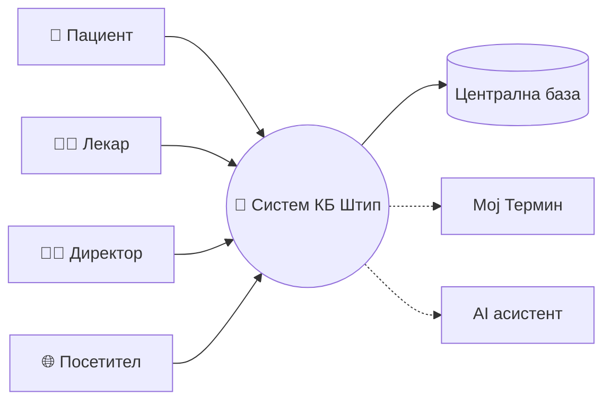
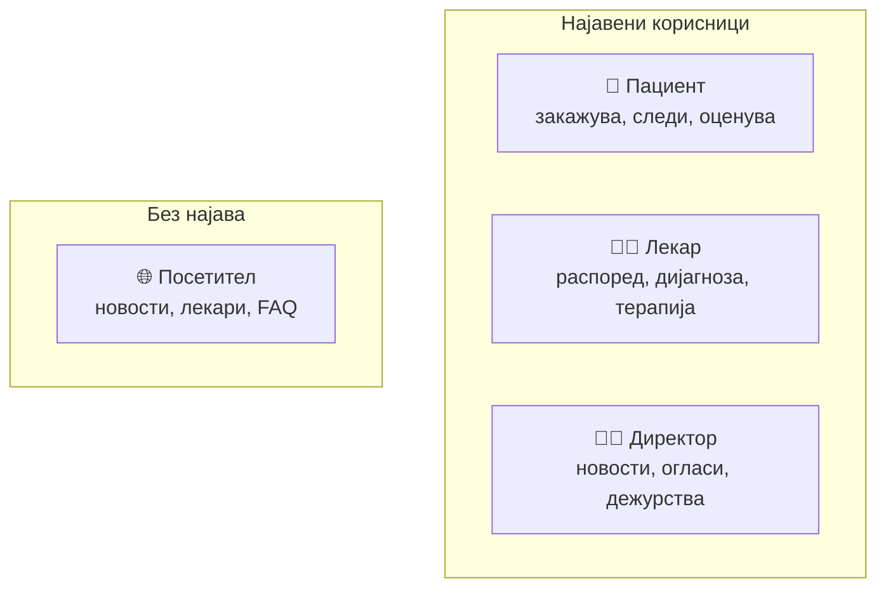
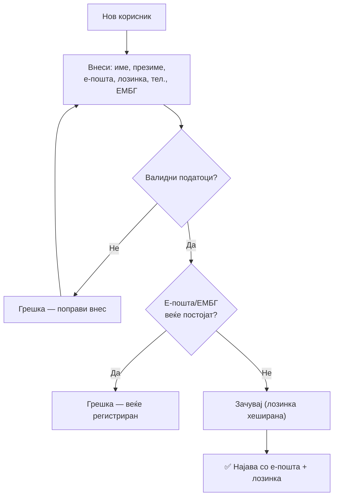
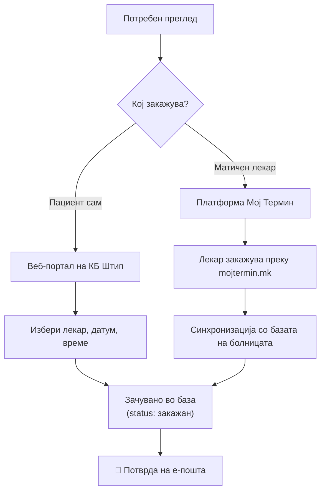
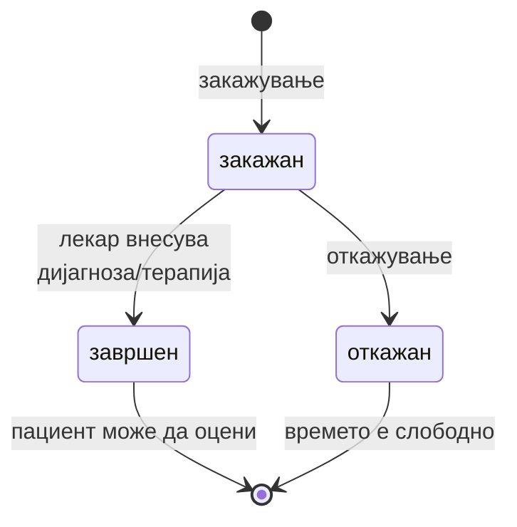
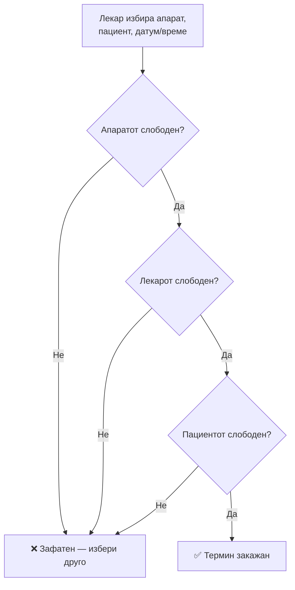

# Преглед на системот

Овој документ дава **целосна слика** за тоа што е системот за Клиничка болница –
Штип, кому му служи, и што всушност се случува при секое дејство (регистрација,
закажување, преглед, оценување). За техничкиот дел (слоеви, код, бази) види
[Архитектура](architecture.md).

## Содржина

* [1. Што претставува системот](#1-shto-pretstavuva)
* [2. Зошто е потребен](#2-zoshto-e-potreben)
* [3. Кориснички улоги](#3-korisnicki-ulogi)
* [4. Регистрација и најава](#4-registracija-najava)
* [5. Два начини за закажување](#5-dva-nacini)
* [6. Животен циклус на терминот](#6-zivoten-ciklus)
* [7. Слободни термини](#7-slobodni-termini)
* [8. Медицински апарати](#8-aparati)
* [9. Медицинско досие](#9-dosie)
* [10. Оценување на преглед](#10-ocenuvanje)
* [11. Известувања на е-пошта](#11-izvestuvanja)
* [12. Други функционалности](#12-drugi-funkcii)
* [13. Технологии](#13-tehnologii)
* [14. Безбедност](#14-bezbednost)

> 📎 Поврзани страници: [Архитектура](architecture.md) ·
> [Инсталација](installation.md) · [Конфигурација](configuration.md) ·
> [База на податоци](../backend/the_database.md) ·
> [AI асистент](../backend/ai-assistant/overview.md)

---

## 1. Што претставува системот 

Информацискиот систем за **Клиничка болница – Штип** е веб апликација наменета за
дигитализација на болничките процеси и подобрување на услугата и искуството на
пациентите кои секојдневно ја посетуваат оваа установа.

Системот ја заменува хартиената документација со централизирана база на податоци
во која се чуваат сите информации за лекари, пациенти, термини, медицински
досиеја, новости, услуги, медицински апарати и огласи за работа. Истиот може
целосно да го замени и досегашниот процес на препишување терапија и дијагноза.
Секој пациент со најава на веб порталот на болницата си креира свое медицинско
досие во кое лекарите можат да поставуваат дијагноза и терапија за соодветно
внесената состојба.

**Која е главната цел со која е развиен овој систем?**

Главната цел е пациентот да може **самостојно**, преку веб-порталот на болницата,
да:

- се информира за лекарите и нивните специјалности;
- провери кои термини се **слободни**, а кои **зафатени** во даден период;
- провери дали одреден **медицински апарат** е достапен и слободен во конкретен
  интервал;
- сам да **закаже, откаже или пренесе** преглед;
- ги следи своите идни и завршени прегледи;
- добие **потврда и известувања** на е-пошта;
- **оцени** завршен преглед;
- се информира за новости, услуги и работни позиции.

> 💡 Системот е централна дигитална платформа што ги поврзува **пациентите,
> лекарите и раководството (директор/администрација)**, со цел побрза,
> поорганизирана и попрецизна работа на болницата.

---

## 2. Зошто е потребен 

Традиционалните (делумно хартиени) процеси во здравствените установи
предизвикуваат подолго чекање при прием, потешко следење на медицинска
документација, отежната комуникација лекар–пациент и ризик од губење или
дуплирање на податоци.

Системот ги решава тие проблеми вака:

| Проблем (порано) | Решение (со системот) |
|------------------|------------------------|
| Телефонски јавувања за термин | **Електронско закажување** 24/7 преку веб |
| Долго чекање, нејасни термини | **Реално-временски увид** во слободни/зафатени термини |
| Изгубена хартиена документација | **Електронско медицинско досие** на едно место (cloud) |
| Заборавени термини | **Автоматски известувања** на е-пошта |
| Секој гледа сè | **Контрола на пристап по улога** |
| Двојно закажување | **Синхронизација** на прегледи и апарати |

---

## 3. Кориснички улоги 

Системот разликува повеќе типови корисници. Секоја улога има свои дозволи и свој
интерфејс прилагоден на нејзините потреби. Интерфејсите се едноставни за
користење од сите корисници, без разлика на нивното IT искуство.

### 👤 Пациент

> **Пациентот може да:**
> - се регистрира и најави со е-пошта и лозинка;
> - ја врати лозинката преку верификациски код;
> - пребарува лекари и прегледува слободни термини;
> - закажува, откажува и пренесува термини;
> - ги следи своите идни и завршени прегледи;
> - оценува завршен преглед (оцена 1–5 и коментар);
> - аплицира за работни позиции;
> - користи AI асистент за помош.

Пациентот е централниот и најчестиот корисник на системот. Целата платформа е
градена со примарна цел да му ја олесни комуникацијата со болницата — од моментот
на регистрација па сè до следење на завршените прегледи.

При првата посета, пациентот се регистрира со основни лични податоци (име,
презиме, е-пошта, лозинка, телефон и ЕМБГ), по што добива пристап до целата
функционалност на порталот. Доколку ја заборави лозинката, може да ја врати преку
верификациски код.

Откако е најавен, пациентот пребарува лекари по име, презиме или специјалност и
ги прегледува нивните слободни и зафатени термини. Врз основа на тоа, сам
закажува, откажува или пренесува термин — без потреба од телефонски јавувања.
Сите минати и претстојни прегледи се достапни во неговото лично досие. Ова може
да се реализира и со користење на AI агентот на порталот. Пациентот внесува
порака од обликот: *„Дали може да закажам преглед кај Др Марија Хубрева на
29.06.2026 во 12:00?"* — и доколку терминот е слободен, се закажува.

По завршување на преглед, пациентот може да го оцени лекарот со оцена од 1 до 5 и
да остави коментар. Дополнително, може да аплицира за работни позиции објавени на
порталот и да користи вграден AI асистент за помош.

### 👨‍⚕️ Лекар

> **Лекарот може да:**
> - се најави и ја промени привремената лозинка при прва најава;
> - го следи својот распоред на прегледи;
> - пристапува до картон и историја на пациент;
> - внесува дијагноза и терапија по преглед;
> - завршува преглед (терминот добива статус „завршен");
> - закажува термини за медицински апарати;
> - ја следи сопствената статистика;
> - користи AI асистент.

Лекарот го користи системот за управување со својот распоред на прегледи и за
водење на медицинската документација. За разлика од пациентот, лекарот **не се
регистрира самостојно** — неговата сметка ја креира администрацијата, а при
првата најава е задолжен да ја промени привремената лозинка.

Преку својот интерфејс, лекарот го следи дневниот и неделниот распоред,
пристапува до картонот и целосната медицинска историја на секој пациент, и по
завршување на преглед внесува дијагноза и терапија. Со тоа терминот автоматски
добива статус „завршен" и станува дел од досието на пациентот. Лекарот може и да
закажува термини за апарати и да ја следи сопствената статистика.

### 🧑‍💼 Директор / Администрација

> **Директорот може да:**
> - објавува и брише новости на порталот;
> - креира, затвора и управува со огласи за работа;
> - прегледува апликанти за огласите;
> - управува со дежурства на вработените;
> - пристапува до администраторски функции и извештаи.

Директорот ја претставува административната улога и има пристап до функции кои не
се достапни за останатите корисници. Се препознава по своето корисничко име и
само за оваа улога се прикажува табот „Администрација" во навигацијата.

Преку административниот панел, директорот објавува и брише новости, креира и
затвора огласи за работа, ги прегледува апликациите и управува со дежурствата.
Оваа улога овозможува целосна контрола врз содржините и процесите.

### 🌐 Посетител (не најавен корисник)

Секој кој ја отвора страницата без најава може да чита новости и информации за
болницата, да гледа листа на лекари и оддели, да се информира за услуги и
апарати, и да користи општ AI асистент за прашања (работно време, локации, FAQ).

---

## 4. Регистрација и најава 

### Регистрација

При регистрација пациентот ги внесува следните податоци, кои поминуваат низ
**строга валидација**:

| Поле | Правило / валидација |
|------|----------------------|
| Име | Задолжително |
| Презиме | Задолжително |
| Е-пошта | Задолжителна, мора да содржи `@` и валиден домен; мора да е **единствена** |
| Лозинка | Задолжителна, **минимум 8 карактери**; се чува **хеширана** |
| Телефон | Опционален; се чисти на само цифри и `+`, максимум 20 знаци |
| ЕМБГ | Задолжителен, **точно 13 цифри**; мора да е **единствен** |

> ⚠️ Доколку е-поштата или ЕМБГ веќе постојат, системот враќа грешка и не
> дозволува дупликат регистрација. По успешна регистрација, пациентот може да се
> најави.

### Најава

Најавата е со **е-пошта и лозинка**. Системот ја проверува лозинката против
хешираната вредност во базата. При погрешни податоци враќа порака:
„Внесена е невалидна електронска пошта или лозинка".

### Заборавена лозинка

Пациентот бара ресетирање со внес на е-пошта. Системот генерира **код (токен)**
кој важи **1 час**. Кодот се внесува во наменето поле на порталот, се запишува
новата лозинка и со тоа е успешно променета.

> ℹ️ Во локална околина кодот се печати во конзолата на серверот.

---

## 5. Два начини за закажување 

Системот поддржува **два начини** на закажување, во зависност од тоа кој го
иницира прегледот.

### 1. Директно преку веб-страницата (самостојно)

Главниот начин — пациентот сам го прави целиот процес:

1. Се најавува како пациент.
2. Пребарува и избира лекар (по специјалност, име или презиме).
3. Избира датум — системот ги прикажува **слободните** и **зафатените** термини.
4. Избира слободно време.
5. По потреба внесува **напомена** за лекарот.
6. Системот го зачувува терминот и го означува како **закажан**.
7. Пациентот добива **потврда на е-пошта** со лекар, датум и време (и напомена
   доколку ја има).

> 💡 Ова е првичната идеја кога се работеше на развој на системот.

**Полиња што се испраќаат при закажување:**
`lekar_id`, `ime`, `prezime`, `datum`, `vreme`, `email`, `telefon`, `napomena`.

**Правила и проверки при закажување (од кодот):**

- **Без викенди** — сабота/недела враќа: „Не се закажуваат прегледи во сабота и
  недела. Изберете друг датум."
- **Валиден датум** — неправилен формат враќа „Неважечки формат на датум".
- **Нормализација на време** — секогаш `HH:MM` (на пр. `9:5` → `09:05`).
- **Лекарот мора да постои** — инаку „Лекар не е пронајден" (404).
- **Терминот не смее да е зафатен** — инаку „Овој термин е веќе закажан.
  Изберете друго време." (409).
- По успех: „Терминот е успешно закажан! Ќе добиете потврда на вашата е-пошта."

### 2. Преку матичен лекар — „Мој Термин"

Доколку прегледот го закажува **матичниот лекар**, процесот оди преку националната
платформа **„Мој Термин"** (`mojtermin.mk`):

1. Матичниот лекар го закажува терминот преку „Мој Термин".
2. Платформата е **поврзана со веб-страницата на болницата**, па терминот се
   синхронизира со интерниот систем на КБ – Штип.
3. Терминот се појавува во базата и се означува како зафатен кај лекарот.
4. Пациентот може да го види терминот и на веб-страницата (по најава).
5. На страницата постои **линк кон „Мој Термин"** наменет за матични лекари.

> ⚠️ **Забелешка:** Синхронизацијата на податоците во моментот **не работи** —
> немаме пристап до платформата „Мој Термин".

**Разлика помеѓу двата начина:**

| Карактеристика | Директно (сајт на болница) | Преку матичен лекар (Мој Термин) |
|----------------|----------------------------|----------------------------------|
| Кој закажува | Самиот пациент | Матичен лекар |
| Платформа | Веб-платформата на КБ – Штип | mojtermin.mk (поврзано со сајтот) |
| Потребна најава | Профил на пациент | Профил на матичен лекар |
| Синхронизација | Директно во базата | Преку „Мој Термин" → база на болница |

---

## 6. Животен циклус на терминот 

Секој термин поминува низ јасно дефинирани статуси кои го одразуваат тековниот
момент на прегледот. Системот користи **три статуси**:

| Статус | Значење | Кога се поставува |
|--------|---------|-------------------|
| **закажан** | Активен и резервиран | При закажување (директно или преку Мој Термин) |
| **завршен** | Прегледот е извршен | Кога лекарот ќе внесе дијагноза/терапија |
| **откажан** | Поништен | Кога пациентот/лекар/админ го откаже |

**Клучни правила:**

- Само термин со статус **закажан** влијае на достапноста (го зафаќа времето).
- Само термин со статус **завршен** може да биде **оценет**.
- **Откажаните** термини повторно го ослободуваат времето.

---

## 7. Слободни термини 

### Како работи приказот

За избран лекар и датум, системот ги враќа сите **зафатени** времиња од базата
(термини со статус „закажан"). Времињата кои не се зафатени се сметаат за
**слободни**.

На интерфејсот слободните термини се прикажани **во бела боја**, а зафатените во
**сива боја** (иако се кликаат, не даваат никаков одговор). Проверката е во
**реално време** — секој нов закажан термин веднаш станува недостапен за други.
За викенд денови системот враќа празна листа.

### Синхронизација со апаратите

Календарот на лекарот е **синхронизиран** со термините за медицински апарати.
Ако лекарот има закажан термин на апарат (рендген, CT, MRI, ултразвук) во
одредено време, тоа време се смета за **зафатено** и во календарот за лекарски
прегледи — со што се спречува двојно закажување.

---

## 8. Медицински апарати 

Покрај прегледите, системот управува и со **медицински апарати** (рендген, CT,
MRI, ултразвук и сл.).

### Потребни информации при закажување

При закажување на апарат се внесуваат следните **задолжителни** полиња:
`lekar_id`, `lekar_ime`, `pacient_ime`, `pacient_prezime`, `aparat` (код),
`aparat_ime`, `datum_vreme` и `opis` (причина зошто е потребен апаратот).

Закажувањето обично го иницира **лекарот**, откако по преглед ќе процени дека е
потребна дополнителна дијагностика.

---

## 9. Медицинско досие 

По завршен преглед, лекарот ги внесува **дијагнозата** и **терапијата** во
електронското досие на пациентот. Со тоа статусот на терминот автоматски станува
„завршен", а сите внесени податоци се трајно зачувани и достапни при следни
прегледи.

### Досие на пациентот

Пациентот во својот профил го гледа целото досие, организирано во:

- **Профил** — лични податоци: име, презиме, е-пошта, телефон, ЕМБГ;
- **Идни термини** — сите закажани прегледи во иднина;
- **Завршени прегледи** — историја на сите минати прегледи;
- **Оцени** — дадени оцени за завршени прегледи;
- **Статистика** — вкупен број на идни, завршени и оценети прегледи.

---

## 10. Оценување на преглед 

По завршен преглед, пациентот може да остави **оцена** за искуството со лекарот.
Правила:

- Оцената е **цел број од 1 до 5**, со опционален текстуален **коментар**.
- Може да се оцени **само** преглед со статус „завршен".
- Пациентот може да оценува **само свои** прегледи — системот ја проверува
  е-поштата на терминот наспроти профилот; во спротивно враќа грешка 403.
- Еден термин = една оцена; повторното оценување ја **ажурира** постоечката.
- Оцената може и да се **повлече** (отстрани) во секој момент.

---

## 11. Известувања на е-пошта 

Системот автоматски испраќа е-пошта преку SMTP во следните ситуации:

- **Потврда** при закажување на термин;
- **Откажување** на термин;
- **Промена/пренос** на термин;
- **Извештај** од преглед во PDF формат.

> ℹ️ **Забелешка:** Ако SMTP не е конфигуриран (на пример во локален развој),
> пораката се печати во конзолата на серверот наместо да се испрати.

---

## 12. Други функционалности 

### Новости
Болницата објавува новости (со можност за прикачување слики), видливи на јавната
страница. Информациите се од јавен карактер и сите може да ги прегледуваат; се
објавуваат од овластени лица во установата.

### Услуги
Преглед на медицинските услуги што ги нуди болницата.

### Кариера (огласи за работа)
Болницата објавува огласи за слободни позиции. Корисниците аплицираат директно
преку системот, а раководството ги прегледува апликациите и управува со статусот
на огласот (отворен/затворен).

### AI асистент
Вграден чат асистент кој разбира **природен јазик (македонски)** и извршува
дејства прилагодени на улогата:

| Улога | Примери |
|-------|---------|
| **Пациент** | Закажување, откажување и пренос на термин; досие; оценување; потсетници |
| **Лекар** | Распоред; картон на пациент; внесување терапија; завршување преглед; статистика |
| **Директор** | Објавување новости; управување со огласи; дежурства |
| **Посетител** | Информации за болница, лекари и услуги; навигација; FAQ |

📎 Повеќе: [AI асистент → Преглед](../backend/ai-assistant/overview.md)

---

## 13. Технологии 

| Слој | Технологија | Опис |
|------|-------------|------|
| **Backend** | FastAPI (Python) | REST API, бизнис логика, валидации |
| **База на податоци** | MySQL | Сите податоци (лекари, пациенти, термини, апарати…) |
| **Frontend** | HTML, CSS, JavaScript | Кориснички интерфејс (без framework) |
| **AI** | Groq | Природен јазик за чат асистентот |
| **Е-пошта** | SMTP | Потврди и известувања |
| **Деплојмент** | Docker, Nginx | Контејнеризација и веб сервер во продукција |

📎 Детали: [Архитектура](architecture.md)

---

## 14. Безбедност 

Системот е изграден со повеќе слоеви на заштита:

- **Хеширање на лозинки** — лозинките никогаш не се чуваат во чист текст.
- **Правила за лозинка на лекари** — минимум 8 знаци, барем една голема буква,
  еден број и еден интерпункциски знак; привремената лозинка мора да се промени
  при прва најава.
- **Сесии со истек** — автоматска одјава по неактивност.
- **Контрола на пристап по улога** — пациент нема пристап до лекарски функции и
  обратно; администраторскиот таб е видлив само за директорот.
- **Валидација на влез** — строги проверки на сите внесени податоци (ЕМБГ,
  е-пошта, датум, час) пред зачувување во базата.
- **Сопственост на податоци** — пациент може да оценува и менува само свои
  термини, проверено по е-пошта.

📎 Следно: [Архитектура](architecture.md) → [Инсталација](installation.md)
