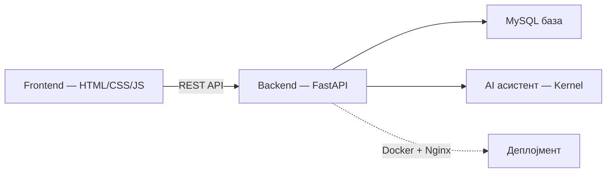

# Техничка документација

Овој дел е технички поглед „под капак" на системот, наменет за **програмери, одржувачи и прегледувачи на код**. Опишува како системот е изграден — архитектура, код, база, инфраструктура — а не како изгледа или се користи на екран.

[← Назад на избор](../izbor-dokumentacija.md) · [Кориснички водич](../users/README.md)

> Стекот накратко: **FastAPI** backend, **MySQL 8.0** база, **HTML/CSS/JavaScript** frontend без поголем framework, целото пакувано во **Docker**. Подетално во [Преглед на системот](../overview_na_sisitemot/overview.md).

## Од каде да започнете?

| Тема | Опис | Започни тука |
|------|------|--------------|
| **Систем** | Архитектура, технологии, улоги | [Преглед на системот](../overview_na_sisitemot/overview.md) |
| **Backend** | FastAPI, endpoints, SQL | [Преглед на backend](../backend/pregled.md) |
| **API** | Сите REST endpoints + Scalar тест | [API конвенции](../backend/api/conventions.md) |
| **База** | Табели, релации | [База на податоци](../backend/the_database.md) |
| **Frontend** | HTML, CSS, JavaScript | [Преглед на frontend](../frontend/overview.md) |
| **AI (tech)** | Kernel, улоги, промптови | [AI асистент — backend](../backend/ai-assistant/overview.md) |
| **Деплојмент** | Docker, Nginx, Render | [Docker](../deployment/docker.md) |

## Live

- **Портал:** [klinicka-bolnica-stip2026.onrender.com/app/](https://klinicka-bolnica-stip2026.onrender.com/app/)
- **API docs (Scalar):** `/docs` на backend URL

## Содржина

* **Општо за системот**
  * [Преглед на системот](../overview_na_sisitemot/overview.md)
  * [Архитектура](../overview_na_sisitemot/architecture.md)
  * [Инсталација](../overview_na_sisitemot/installation.md)
  * [Конфигурација](../overview_na_sisitemot/configuration.md)
* **Backend**
  * [Преглед на backend](../backend/pregled.md)
  * [База на податоци](../backend/the_database.md)
  * [API — конвенции](../backend/api/conventions.md)
  * [AI асистент — преглед](../backend/ai-assistant/overview.md)
* **Frontend**
  * [Преглед на frontend](../frontend/overview.md)
  * [Страници](../frontend/pages.md)
  * [AI чат виџет](../frontend/ai-chat-widget.md)
* **Деплојмент**
  * [Docker](../deployment/docker.md)
  * [Nginx](../deployment/nginx.md)
  * [Продукција и одржување](../deployment/production.md)
* [Подобрување на документацијата](../podobruvanje-dokumentacija.md)

## Структура во менито

Левото мени е поделено на два дела:

1. **Кориснички водич** — за крајни корисници
2. **Техничка документација** — сè под оваа секција (Backend, Frontend, Деплојмент)

***

Следно: [Преглед на системот](../overview_na_sisitemot/overview.md)
