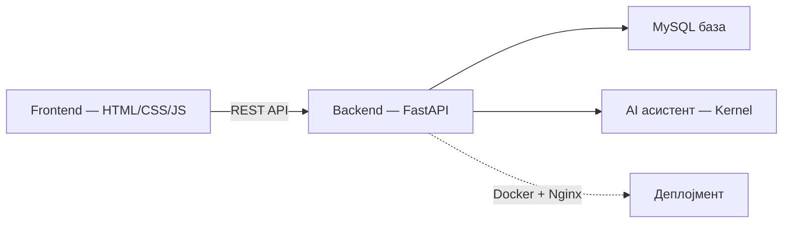

# Техничка документација

Овој дел е технички поглед „под капак" на системот, наменет за програмери, одржувачи и прегледувачи на код кои сакаат подлабоко да разберат како е изграден системот и зошто функционира токму на овој начин. За разлика од корисничкиот водич, кој се фокусира на изгледот и секојдневната употреба на екран, овој дел навлегува во самата конструкција на системот однатре.

Опфатени се архитектурата и технологиите на кои се темели целиот проект — FastAPI backend со јасно дефинирани FAST API endpoints, структурата и релациите во MySQL базата на податоци, начинот на кој е организиран и напишан кодот на Frontend во HTML, CSS и JavaScript, имплементацијата на AI асистентот, како и инфраструктурата преку Docker и Nginx на која системот е поставен, deploy-иран и одржуван во продукциска средина.

[← Назад на избор](../izbor-dokumentacija.md) · [Кориснички водич](../users/)

> Стекот накратко: **FastAPI** backend, **MySQL 8.0** база, **HTML/CSS/JavaScript** frontend без поголем framework, целото пакувано во **Docker**. Подетално во [Преглед на системот](../overview_na_sisitemot/overview.md).

## Од каде да започнете?

| Тема           | Опис                           | Започни тука                                                 |
| -------------- | ------------------------------ | ------------------------------------------------------------ |
| **Систем**     | Архитектура, технологии, улоги | [Преглед на системот](../overview_na_sisitemot/overview.md)  |
| **Backend**    | FastAPI, endpoints, SQL        | [Преглед на backend](../backend/pregled.md)                  |
| **API**        | Сите endpoints + Scalar тест   | [API конвенции](../backend/api/conventions.md)               |
| **База**       | Табели, релации                | [База на податоци](../backend/the_database.md)               |
| **Frontend**   | HTML, CSS, JavaScript          | [Преглед на frontend](../frontend/overview.md)               |
| **AI (tech)**  | Kernel, улоги, промптови       | [AI асистент — backend](../backend/ai-assistant/overview.md) |
| **Деплојмент** | Docker, Nginx, Render          | [Docker](../deployment/docker.md)                            |

***

Следно: [Преглед на системот](../overview_na_sisitemot/overview.md)
